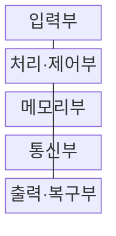
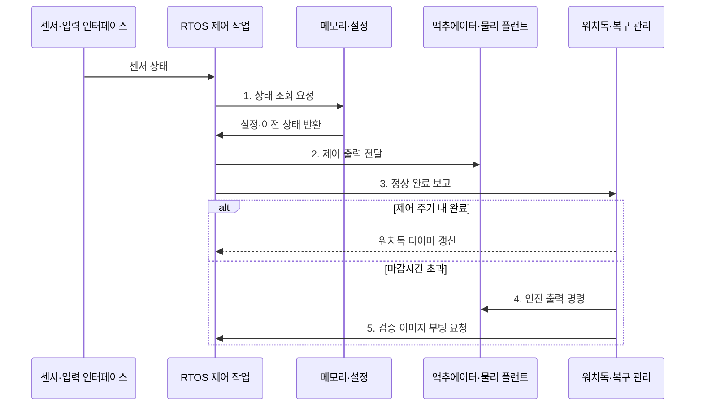

---
sidebar:
  order: 60
  label: "060. 임베디드 시스템 구조 (Embedded System Architecture)"
  badge:
    text: "기출 · 50%"
    variant: note
title: "임베디드 시스템 구조 (Embedded System Architecture)"
date: "2026-08-02T11:20:00+09:00"
tags:
  - "notes-hardware"
weight: 60
extra:
  question_no: "060"
  source_status: "기출"
  source_history: "137회"
  priority: 50
  priority_note: "시간·전력·운영 기능의 구조 선택"
---

## Ⅰ. 개요

핵심 용어

- **임베디드 시스템(Embedded System)**: 특정 장치 기능을 수행하도록 하드웨어와 펌웨어를 결합한 전용 컴퓨터이다.
- **펌웨어(Firmware)**: 장치에 내장되어 센서와 프로세서 및 주변 하드웨어를 직접 제어하는 소프트웨어이다.
- **하드웨어·소프트웨어 분할(Hardware-software Partitioning)**: 시간과 전력 및 변경 요구에 따라 기능을 전용 회로와 펌웨어 중 어디에서 실행할지 나누는 설계이다.

- 정의/개념: 정해진 장치 기능을 제한된 시간•전력•자원 안에서 수행하도록 하드웨어와 펌웨어를 결합한 **임베디드 시스템** 기반 **전용 컴퓨터 체계**
- 배경/필요성: 범용 컴퓨터의 유휴 자원은 **비용·전력 증가와 응답 변동** 유발

#### 한줄 요약

- 작은 컴퓨터가 센서를 읽고 정해진 시간 안에 모터를 움직인다

## Ⅱ. 특징

핵심 용어

- **마감시간(Deadline)**: 제어 작업의 결과가 반드시 완료되어 출력에 반영되어야 하는 시점이다.
- **실시간 입출력(Real-time I/O)**: 센서 입력부터 액추에이터 출력까지 정해진 시간 한도 안에 처리하는 동작이다.
- **제한 자원(Resource Constraint)**: 메모리와 연산 성능 및 배터리 용량이 제품 비용과 크기에 따라 제한되는 조건이다.

- **마감시간 고정 기능**은 하드웨어, **변경 기능**은 소프트웨어 배치
- **실시간 입출력 제어**로 정해진 응답시간 준수
- **제한 자원·기능 고정**이 확장·변경 범위 제한

#### 한줄 요약

- 해야 할 일과 시간·배터리 한도에 맞춰 전용 부품과 프로그램을 나눈다

## Ⅲ. 구조 및 구성요소

핵심 용어

- **입력부(Input Unit)**: 센서 신호를 디지털 값으로 변환하고 이벤트를 인터럽트로 처리부에 전달하는 구성이다.
- **실시간 운영체제(Real-time Operating System, RTOS)**: 작업이 정한 마감시간 안에 완료되도록 우선순위와 실행 순서를 관리하는 운영체제이다.
- **통신부(Communication Unit)**: 외부 시스템과 운용 데이터 및 펌웨어 업데이트 이미지를 송수신하는 구성이다.
- **출력·복구부(Output·Recovery Unit)**: 액추에이터를 제어하고 오류 시 안전 출력과 재부팅을 수행하는 구성이다.

| 구성요소 | 책임 |
|:---|:---|
| 입력부 | 센서 신호 변환·**인터럽트 전달** |
| 처리·제어부 | **실시간 작업 실행** |
| 메모리부 | **코드·상태 보관** |
| 통신부 | **데이터·업데이트 수신** |
| 출력·복구부 | **제어·안전 출력** |

#### 한줄 요약

- 센서 입력을 계산해 장치를 움직이고 고장 때 안전 상태로 바꾼다.

## Ⅳ. 흐름도

핵심 용어

- **제어 주기(Control Cycle)**: 센서 읽기와 계산 및 출력 갱신을 반복하는 고정 시간 간격이다.
- **워치독(Watchdog)**: 정해진 시간 동안 정상 완료 보고가 없는 펌웨어를 감지하여 안전 출력이나 재시작을 실행하는 장치이다.
- **안전 상태(Safe State)**: 오류나 마감시간 초과 때 액추에이터를 정지하거나 제한하여 위험을 줄이는 출력 상태이다.
- **검증 이미지(Validated Image)**: 무결성과 정상 동작을 확인하여 장애 복구 시 부팅할 수 있는 펌웨어 이미지이다.
- **실시간 운영체제(Real-time Operating System, RTOS)**: 제어 작업의 우선순위와 실행 순서를 관리해 마감시간 준수를 지원하는 운영체제이다.

**동작 원리**

1. **상태 조회 요청**: 검증된 목표값과 이전 상태를 메모리에서 확보
2. **제어 출력 전달**: 센서값과 설정으로 계산한 명령을 마감시간 안에 적용
3. **정상 완료 보고**: 제어 주기 완료 후 워치독 타이머 갱신
4. **안전 출력 명령**: 마감시간 초과 시 액추에이터를 안전 상태로 전환
5. **검증 이미지 부팅 요청**: 응답 없는 펌웨어를 이전 이미지로 재시작

#### 한줄 요약

- RTOS가 제시간에 출력을 내면 워치독을 갱신하고, 늦거나 멈추면 안전 출력을 강제한 뒤 재부팅한다

## Ⅴ. 종류 및 비교

핵심 용어

- **마이크로컨트롤러(Microcontroller Unit, MCU)**: 프로세서 코어와 메모리 및 제어용 주변장치를 하나의 칩에 통합한 장치이다.
- **마이크로프로세서(Microprocessor Unit, MPU)**: 외부 메모리와 주변장치를 연결하여 고기능 운영체제를 실행하는 범용 처리장치이다.
- **시스템온칩(System on Chip, SoC)**: 연산과 가속 및 메모리 제어·주변 기능을 하나의 다이에 통합한 칩이다.

| 임베디드 시스템 | MCU 기반 | MPU·SoC 기반 |
|:---|:---|:---|
| 적용 기준 | 센서·모터·**단순 통신 제어** | 화면·네트워크·**대용량 처리** |
| 핵심 특징 | 온칩 자원의 **저전력 실시간 제어** | 외부 메모리·운영체제의 **고기능 처리** |
| 한계 | **메모리·연산 확장** 제한 | **지연 변동·전력** 증가 |

#### 한줄 요약

- 작은 제어기는 한 일을 제시간에, 큰 제어기는 화면과 통신을 함께 처리한다

## Ⅵ. 실무 고려사항 및 대책

핵심 용어

- **최악 실행 시간(Worst-case Execution Time, WCET)**: 지정한 하드웨어와 입력 및 간섭 조건에서 작업 완료에 걸릴 수 있는 최대 시간이다.
- **차단 시간(Blocking Time)**: 높은 우선순위 작업이 공유 자원을 점유한 낮은 우선순위 작업 때문에 기다리는 시간이다.
- **A/B 파티션(A/B Partition)**: 새 펌웨어와 이전 정상 펌웨어를 별도 영역에 보관하여 실패 시 복귀할 수 있게 한 구성이다.
- **하드웨어 연동 검증(Hardware-in-the-loop, HIL)**: 실제 제어기와 실시간 모의 플랜트를 연결하여 센서·액추에이터 입출력을 검증하는 방식이다.
- **무선 펌웨어 업데이트(Over-the-air Update, OTA)**: 통신망으로 새 펌웨어 이미지를 장치에 전송하고 설치하는 방식이다.

| 문제 | 대책 | 효과 |
|:---|:---|:---|
| 실행 시간이 마감시간 초과 | **차단 시간 포함 WCET 분석**과 부하 시험 | **결정적 응답 확보** |
| 워치독 주기 부적절 | **최악 실행 시간** 기반 주기 설정 | **고장 탐지 지연** 감소 |
| OTA 중 전원 상실 | **A/B 파티션•롤백** 적용 | **부팅 복원력 확보** |
| 오류 시 위험 출력 유지 | **HIL 장애 주입 시험** | **안전 상태 검증** |

#### 한줄 요약

- 모터 제어기는 HIL로 마감시간 초과와 센서·액추에이터 고장 때 안전 출력이 작동하는지 검증한다

## Ⅶ. 결론

핵심 용어

- **저전력 실시간 제어(Low-power Real-time Control)**: 작은 에너지 예산 안에서 센서 입력과 제어 출력을 마감시간 내 처리하는 작업이다.
- **고기능 처리(Feature-rich Processing)**: 화면과 네트워크 및 대용량 데이터처럼 운영체제와 외부 메모리가 필요한 작업이다.
- **결정적 응답(Deterministic Response)**: 지정 조건에서 응답 시간이 예측 가능한 상한 안에 머무는 성질이다.

- 실시간•저전력 제어에는 **마이크로컨트롤러(Microcontroller Unit, MCU)**, 화면•통신에는 **마이크로프로세서(Microprocessor Unit, MPU)•시스템온칩(System on Chip, SoC)** 선택

#### 한줄 요약

- 마감시간·저전력이 중요하면 작은 칩, 화면·통신이 많으면 큰 칩을 선택한다
