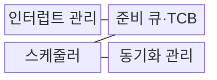
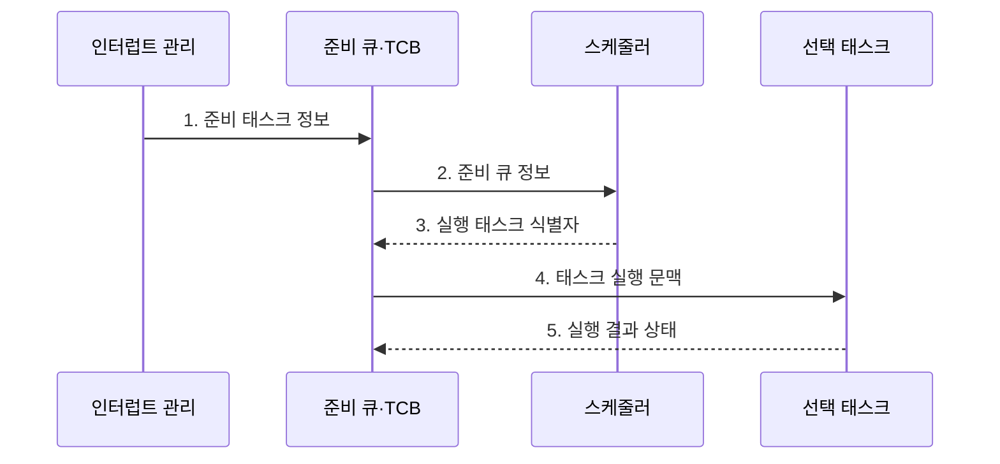

---
sidebar:
  order: 61
  label: "061. 실시간 운영체제 (RTOS)"
  badge:
    text: "기출 · 50%"
    variant: note
title: "실시간 운영체제 (RTOS)"
date: "2026-07-31T10:37:00+09:00"
tags:
  - "notes-hardware"
weight: 61
extra:
  question_no: "061"
  source_status: "기출"
  source_history: "137회"
  priority: 50
  priority_note: "RTOS 결정성·응답시간의 단일 기출 핵심"
---

## 미리 알고가기

- **실시간 운영체제(Real-Time Operating System, RTOS)**: 작업이 정해진 시간 안에 완료되도록 결정적 스케줄링을 제공하는 운영체제
- **태스크(Task)**: 스케줄러가 독립 실행 단위로 관리하는 작업
- **데드라인(Deadline, \(D_i\))**: 태스크 \(i\)의 실행을 끝내야 하는 시각
- **결정성(Determinism)**: 최악 처리 지연 상한을 예측하는 성질
- **최악 실행시간(Worst-Case Execution Time, WCET, \(C_i\))**: 대기·선점 시간을 제외하고 태스크 \(i\)가 프로세서에서 실제 실행되는 최대 시간
- **최악 응답시간(Worst-Case Response Time, WCRT, \(R_i\))**: 태스크 \(i\)의 요청 발생부터 처리 완료까지 걸리는 최대 시간
- **인터럽트 서비스 루틴(Interrupt Service Routine, ISR)**: 장치 인터럽트의 원인을 확인하고 긴급한 처리를 수행하는 짧은 코드
- **문맥 전환(Context Switch)**: 현재 태스크 상태 저장 후 다음 태스크 상태 복원
- **커널(Kernel)**: 태스크 실행·메모리·인터럽트·장치 자원을 통제하는 운영체제 핵심부
- **태스크 제어 블록(Task Control Block, TCB)**: 태스크의 실행 상태·우선순위·레지스터 문맥·스택 정보를 저장하는 운영체제 자료구조
- **준비 큐(Ready Queue)**: 실행할 수 있는 태스크를 우선순위나 정책 순서로 보관하는 대기열
- **스케줄러·선점(Scheduler·Preemption)**: 스케줄러는 다음 실행 태스크를 선택하고 선점은 더 높은 우선순위 태스크가 현재 실행권을 가져오는 동작
- **차단(Block, \(B_i\))**: 태스크 \(i\)가 잠금·입출력·이벤트를 기다리며 실행 후보에서 빠지는 상태이며, \(B_i\)는 최대 차단시간이다.
- **동기화(Synchronization)**: 여러 태스크의 실행 순서와 공유 자원 접근을 맞추는 제어
- **우선순위 역전(Priority Inversion)**: 낮은 태스크의 잠금 보유가 높은 태스크를 대기시킴
- **베어메탈(Bare Metal)**: 운영체제 없이 하드웨어를 직접 제어
- **슈퍼루프(Super Loop)**: 여러 작업을 한 반복문에서 순차 실행
- **지터(Jitter)**: 응답·주기 시간의 변동 폭
- **태스크 주기(Task Period, \(T_i\))**: 주기 태스크 \(i\)의 연속된 작업 요청 사이 시간
- **상위 우선순위 집합(\(hp(i)\))**: 고정 우선순위 스케줄에서 태스크 \(i\)보다 우선 실행되는 태스크들의 집합
- **반복 인덱스(\(k\))**: 최악 응답시간 추정값을 수렴할 때까지 갱신한 횟수
- **우선순위 상속·천장 프로토콜(Priority Inheritance·Priority Ceiling Protocol)**: 잠금 보유 태스크의 우선순위를 높이거나 자원별 상한을 정해 우선순위 역전의 차단시간을 제한하는 기법
- **지연 처리(Deferred Processing)**: ISR은 긴급 작업만 처리하고 나머지를 태스크 문맥으로 넘기는 방식
- **스택 워터마크(Stack Watermark)**: 스택을 알려진 값으로 채운 뒤 남은 패턴으로 최대 사용량을 측정하는 기법

## Ⅰ. 개요

- 정의/개념: 태스크의 **응답시간**을 **데드라인** 안으로 통제하는 운영체제
- 배경/필요성: 슈퍼루프로는 다중 태스크 **최악 지연 입증 불가**

### 쉽게 이해하기 (학습용)

- 급한 일을 먼저 처리하면서 가장 늦어도 약속 시간 안에 끝나는지 계산하는 비서다.

## Ⅱ. 특징

- 평균 처리량보다 **최악 지연 상한** 예측 우선
- **우선순위 선점**으로 긴급 태스크 응답시간 단축
- **ISR·차단**이 최악 응답시간 증가

$$
R_i^{(k+1)} =
C_i + B_i +
\sum_{j \in hp(i)}
\left\lceil \frac{R_i^{(k)}}{T_j} \right\rceil C_j
$$

> 단일 코어·고정 우선순위·선점형 주기 태스크와 유한한 차단을 가정한 응답시간 반복식이다. \(C_i\)는 WCET, \(B_i\)는 최대 차단시간, \(T_j\)는 상위 우선순위 태스크 \(j\)의 주기, \(D_i\)는 태스크 \(i\)의 데드라인이다. \(\lceil x \rceil\)는 \(x\) 이상인 최소 정수로 올림하며, 식이 수렴한 \(R_i \le D_i\)이면 데드라인을 만족한다.

### 쉽게 이해하기 (학습용)

- 평소 평균보다 가장 늦을 때도 약속 시간을 지키는지가 기준이다.

## Ⅲ. 구조 및 구성요소

| 구성요소 | 책임 |
|:---|:---|
| 인터럽트 관리 | **이벤트·시간 처리** |
| 준비 큐·TCB | **태스크 상태 보관** |
| 스케줄러 | **실행·선점 결정** |
| 동기화 관리 | **공유 자원 보호** |

### 쉽게 이해하기 (학습용)

- 이벤트가 오면 준비된 작업 중 가장 긴급한 태스크를 선택한다.

## Ⅳ. 흐름도

**동작 원리**

1. **준비 태스크 정보**: 이벤트 태스크를 준비 상태로 전환
2. **준비 큐 정보**: 우선순위·데드라인별 실행 후보 전달
3. **실행 태스크 식별자**: 정책에 따라 다음 태스크 결정
4. **태스크 실행 문맥**: 저장한 레지스터·스택 복원
5. **실행 결과 상태**: 완료·대기 상태를 큐에 반영

### 쉽게 이해하기 (학습용)

- RTOS는 준비 태스크 중 우선순위가 가장 높은 작업을 실행하고 차단되면 다음 작업을 선택한다.

## Ⅴ. 종류 및 비교

| 실행 환경 | RTOS | 베어메탈 | 범용 운영체제 |
|:---|:---|:---|:---|
| 적용 기준 | 다중 태스크 **데드라인 입증** | 단일 제어·**최소 자원** | 파일·가상 메모리·**시분할** |
| 핵심 특징 | 태스크 우선순위·**지연 상한 분석** | 슈퍼루프·**인터럽트 직접 제어** | 프로세스 시분할·**풍부한 서비스** |
| 한계 | 우선순위 역전·**차단·지터** | 확장 시 **코드 결합 증가** | 비결정적 지연·**큰 메모리** |

### 쉽게 이해하기 (학습용)

- 작업 하나는 직접 돌리고 여러 마감 업무는 RTOS에 맡기며 파일 기능이 많으면 범용 운영체제를 선택한다.

## Ⅵ. 실무 고려사항 및 대책

| 고려사항 | 대책 | 효과 |
|:---|:---|:---|
| 낮은 태스크의 잠금으로 높은 태스크 대기 | **우선순위 상속·천장 프로토콜** 적용 | **차단 시간** 상한 제한 |
| 긴 ISR 실행으로 고우선순위 태스크 지연 | **ISR 최소화·지연 처리** | **응답 지연** 감소 |
| 깊은 중첩·재귀로 스택 고갈 | **스택 중첩 분석·워터마크 감시** | **메모리 손상** 방지 |
| 최악 실행·차단 조건 누락으로 데드라인 위반 | **WCET·WCRT 분석** | **데드라인** 충족 입증 |

### 쉽게 이해하기 (학습용)

- 모터 제어는 WCET뿐 아니라 상위 우선순위 간섭과 잠금 차단을 포함한 WCRT가 주기 안인지 검증한다

## Ⅶ. 결론

- **WCRT≤데드라인** 입증이 필요한 다중 태스크는 **RTOS 선택**

### 쉽게 이해하기 (학습용)

- 빠른 날의 평균보다 가장 늦는 날에도 약속을 지키는지가 RTOS 선택 기준이다.
