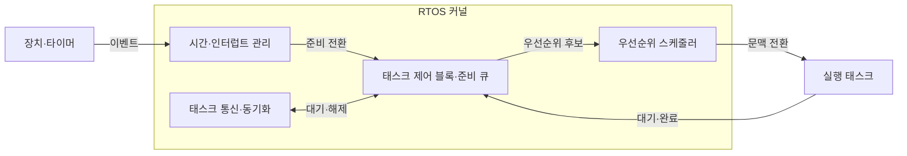
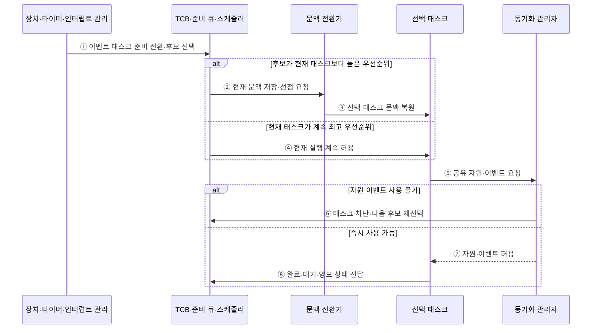

---
sidebar:
  order: 61
  label: "061. 실시간 운영체제 (RTOS)"
  badge:
    text: "기출 · 50%"
    variant: note
title: "실시간 운영체제 (RTOS)"
date: "2026-07-28T13:06:01+09:00"
tags:
  - "notes-hardware"
weight: 61
extra:
  question_no: "061"
  source_status: "기출"
  source_history: "137회"
  priority: 50
  priority_note: "RTOS 결정성·응답시간의 단일 기출 핵심"
---

## 미리 알고가기

- **실시간 운영체제(Real-Time Operating System, RTOS)**: 작업이 정해진 시간 안에 완료되도록 결정적 스케줄링을 제공하는 운영체제
- **태스크(Task)**: 스케줄러가 독립 실행 단위로 관리하는 작업
- **데드라인(Deadline)**: 태스크 실행을 끝내야 하는 시각
- **결정성(Determinism)**: 최악 처리 지연 상한을 예측하는 성질
- **최악 실행시간(Worst-Case Execution Time, WCET)**: 대기·선점 시간을 제외하고 태스크가 프로세서에서 실제 실행되는 최대 시간
- **최악 응답시간(Worst-Case Response Time, WCRT)**: 태스크 요청이 발생한 시점부터 처리가 완료될 때까지의 최대 시간
- **인터럽트 서비스 루틴(Interrupt Service Routine, ISR)**: 장치 인터럽트의 원인을 확인하고 긴급한 처리를 수행하는 짧은 코드
- **문맥 전환(Context Switch)**: 현재 태스크 상태 저장 후 다음 태스크 상태 복원
- **커널(Kernel)**: 태스크 실행·메모리·인터럽트·장치 자원을 통제하는 운영체제 핵심부
- **태스크 제어 블록(Task Control Block, TCB)**: 태스크의 실행 상태·우선순위·레지스터 문맥·스택 정보를 저장하는 운영체제 자료구조
- **준비 큐(Ready Queue)**: 실행할 수 있는 태스크를 우선순위나 정책 순서로 보관하는 대기열
- **스케줄러·선점(Scheduler·Preemption)**: 스케줄러는 다음 실행 태스크를 선택하고 선점은 더 높은 우선순위 태스크가 현재 실행권을 가져오는 동작
- **차단(Block)**: 태스크가 잠금·입출력·이벤트를 기다리며 실행 후보에서 빠지는 상태
- **동기화(Synchronization)**: 여러 태스크의 실행 순서와 공유 자원 접근을 맞추는 제어
- **우선순위 역전(Priority Inversion)**: 낮은 태스크의 잠금 보유가 높은 태스크를 대기시킴
- **베어메탈(Bare Metal)**: 운영체제 없이 하드웨어를 직접 제어
- **슈퍼루프(Super Loop)**: 여러 작업을 한 반복문에서 순차 실행
- **지터(Jitter)**: 응답·주기 시간의 변동 폭
- **태스크 주기(Task Period, \(T_i\))**: 주기 태스크 \(i\)의 연속된 작업 요청 사이 시간
- **상위 우선순위 집합(\(hp(i)\))**: 고정 우선순위 스케줄에서 태스크 \(i\)보다 우선 실행되는 태스크들의 집합

## Ⅰ. 개요

- 정의/개념: 태스크의 **최악 응답시간·데드라인**을 관리하는 운영체제
- 기존 한계: 평균 처리량 중심 OS는 **최악 지연 상한** 보장 곤란

### 쉽게 이해하기 (학습용)

- 급한 일을 먼저 처리하면서 가장 늦어도 약속 시간 안에 끝나는지 계산하는 비서다.

## Ⅱ. 특징

- 평균 처리량보다 **최악 지연 상한** 예측 우선
- **우선순위 선점**으로 긴급 태스크 응답시간 단축
- **차단·ISR·문맥 전환**이 최악 응답시간 증가

$$
R_i^{(k+1)} =
C_i + B_i +
\sum_{j \in hp(i)}
\left\lceil \frac{R_i^{(k)}}{T_j} \right\rceil C_j
$$

> 단일 코어·고정 우선순위·선점형 주기 태스크와 유한한 차단을 가정한 응답시간 반복식이다. \(C_i\)는 WCET, \(B_i\)는 최대 차단시간, \(T_j\)는 상위 우선순위 태스크 \(j\)의 주기, \(D_i\)는 태스크 \(i\)의 데드라인이다. \(\lceil x \rceil\)는 \(x\) 이상인 최소 정수로 올림하며, 식이 수렴한 \(R_i \le D_i\)이면 데드라인을 만족한다.

### 쉽게 이해하기 (학습용)

- 평소 평균보다 가장 늦을 때도 약속 시간을 지키는지가 기준이다.

## Ⅲ. 아키텍처

**도표안 A — 구조도**

**도표안 B — sequenceDiagram**

| 설계 요소 | 입력·상태 | 역할 |
|:---|:---|:---|
| 시간·인터럽트 관리 | 타이머·장치 이벤트·ISR 상태 | 태스크 준비 전환 |
| 태스크 제어 블록·준비 큐 | 상태·우선순위·문맥·스택 | 실행 후보·대기 순서 관리 |
| 우선순위 스케줄러 | 준비 큐·현재 태스크 | 다음 실행·선점 결정 |
| 태스크 통신·동기화 | 메시지·잠금·대기자 상태 | 데이터 전달·공유 자원 보호 |

> 요약: 준비 큐 우선순위가 실행 태스크 선택을 결정

**동작 원리**

- **① 이벤트 태스크 준비 전환·후보 선택**: ISR 후 최고 우선순위 태스크 결정
- **② 현재 문맥 저장·선점 요청**: 더 높은 후보가 있으면 상태 보존
- **③ 선택 태스크 문맥 복원**: 데드라인 작업 실행·재개
- **④ 현재 실행 계속 허용**: 더 높은 후보가 없으면 전환 생략
- **⑤ 공유 자원·이벤트 요청**: 잠금·메시지·입출력 요구
- **⑥ 태스크 차단·다음 후보 재선택**: 불가 자원 대기와 CPU 재배정
- **⑦ 자원·이벤트 허용**: 소유권 부여 후 실행 지속
- **⑧ 완료·대기·양보 상태 전달**: TCB 갱신 후 재스케줄

### 쉽게 이해하기 (학습용)

- RTOS는 이벤트로 준비된 태스크 중 우선순위가 가장 높은 작업을 실행하고 차단되면 즉시 다음 작업을 고른다

## Ⅳ. 종류 및 비교

| 실행 환경 | RTOS | 베어메탈 | 범용 운영체제 |
|:---|:---|:---|:---|
| 적용 기준 | 다중 태스크 **데드라인 입증** | 단일 제어·**최소 자원** | 파일·가상 메모리·**시분할** |
| 핵심 특징 | 태스크 우선순위·**지연 상한 분석** | 슈퍼루프·**인터럽트 직접 제어** | 프로세스 시분할·**풍부한 서비스** |
| 한계 | 우선순위 역전·**차단·지터** | 확장 시 **코드 결합 증가** | 비결정적 지연·**큰 메모리** |

> 요약: RTOS는 시간 상한 분석과 태스크 서비스를 결합한다.

### 쉽게 이해하기 (학습용)

- 작업 하나는 직접 돌리고 여러 마감 업무는 RTOS에 맡기며 파일 기능이 많으면 범용 운영체제를 선택한다.

## Ⅴ. 실무 고려사항 및 대책

| 운영 위험 | 대응 | 기대 효과 |
|:---|:---|:---|
| 낮은 우선순위 잠금으로 높은 태스크 차단 | 우선순위 상속·천장 프로토콜과 잠금 시간 제한 | 우선순위 역전 완화 |
| 긴 ISR·인터럽트 마스킹으로 응답 지연 | ISR 최소화·지연 처리 이관과 최대 마스킹 시간 측정 | 인터럽트 지연 상한 확보 |
| 태스크·인터럽트 중첩으로 스택 고갈 | 최악 호출 깊이·중첩 분석과 스택 워터마크 감시 | 메모리 손상 방지 |
| 평균 시간만 측정해 WCET·WCRT·지터 누락 | 차단·선점·캐시 최악 조건을 포함한 응답시간 분석 | 데드라인 충족 입증 |

> 모터 제어는 WCET뿐 아니라 높은 우선순위 간섭과 잠금 차단시간을 포함한 WCRT가 제어 주기보다 작은지 검증한다.

### 쉽게 이해하기 (학습용)

- 모터 제어는 WCET뿐 아니라 상위 우선순위 간섭과 잠금 차단을 포함한 WCRT가 주기 안인지 검증한다

## Ⅵ. 결론

- WCET·WCRT·인터럽트 지연·우선순위 역전을 분석해 **RTOS 데드라인** 충족 입증

### 쉽게 이해하기 (학습용)

- 빠른 날의 평균보다 가장 늦는 날에도 약속을 지키는지가 RTOS 선택 기준이다.
