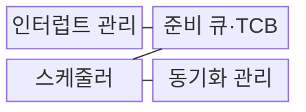
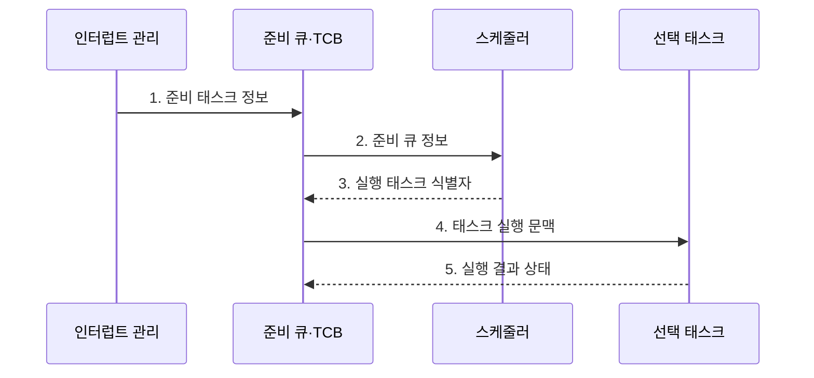

---
sidebar:
  order: 61
  label: "061. 실시간 운영체제 (RTOS)"
  badge:
    text: "기출 · 50%"
    variant: note
title: "실시간 운영체제 (RTOS)"
date: "2026-08-02T11:21:00+09:00"
tags:
  - "notes-hardware"
weight: 61
extra:
  question_no: "061"
  source_status: "기출"
  source_history: "137회"
  priority: 50
  priority_note: "RTOS 결정성·응답시간의 단일 기출 핵심"
---

## Ⅰ. 개요

핵심 용어

- **실시간 운영체제(Real-time Operating System, RTOS)**: 태스크의 응답시간이 정해진 데드라인 안에 들도록 결정적 스케줄링을 제공하는 운영체제이다.
- **태스크(Task)**: RTOS 스케줄러가 상태와 우선순위를 가진 독립 실행 단위로 관리하는 작업이다.
- **데드라인(Deadline)**: 태스크의 요청이 발생한 뒤 실행 결과를 반드시 완료해야 하는 시각이다.

- 정의/개념: 태스크의 **응답시간**을 **데드라인** 안으로 통제하는 운영체제
- 배경/필요성: 슈퍼루프는 다중 태스크의 **최악 지연 분석과 우선순위 제어가 복잡함**

### 쉽게 이해하기 (학습용)

- 급한 일을 먼저 처리하면서 가장 늦어도 약속 시간 안에 끝나는지 계산하는 비서다.

## Ⅱ. 특징

핵심 용어

- **결정성(Determinism)**: 지정 조건에서 처리 지연의 최악 상한을 예측하고 재현할 수 있는 성질이다.
- **최악 실행시간(Worst-case Execution Time, WCET)**: 대기와 선점을 제외하고 태스크가 프로세서에서 실제 실행되는 최대 시간이다.
- **최악 응답시간(Worst-case Response Time, WCRT)**: 태스크 요청부터 차단과 간섭을 거쳐 처리 완료까지 걸리는 최대 시간이다.
- **우선순위 선점(Priority Preemption)**: 더 높은 우선순위 태스크가 준비되면 현재 태스크의 실행권을 가져오는 동작이다.

- 평균 처리량보다 **최악 지연 상한** 예측 우선
- **우선순위 선점**으로 긴급 태스크 응답시간 단축
- **ISR·차단**이 최악 응답시간 증가

$$
R_i^{(k+1)} =
C_i + B_i +
\sum_{j \in hp(i)}
\left\lceil \frac{R_i^{(k)}}{T_j} \right\rceil C_j
$$

> 단일 코어·고정 우선순위·선점형 주기 태스크와 유한한 차단을 가정한 응답시간 반복식이다. \(C_i\)는 WCET, \(B_i\)는 최대 차단시간, \(T_j\)는 상위 우선순위 태스크 \(j\)의 주기, \(D_i\)는 태스크 \(i\)의 데드라인이다. \(\lceil x \rceil\)는 \(x\) 이상인 최소 정수로 올림하며, 식이 수렴한 \(R_i \le D_i\)이면 데드라인을 만족한다.

### 쉽게 이해하기 (학습용)

- 평소 평균보다 가장 늦을 때도 약속 시간을 지키는지가 기준이다.

## Ⅲ. 구조 및 구성요소

핵심 용어

- **인터럽트 관리(Interrupt Management)**: 장치 이벤트를 받아 ISR을 실행하고 관련 태스크를 준비 상태로 전환하는 기능이다.
- **태스크 제어 블록(Task Control Block, TCB)**: 태스크의 실행 상태와 우선순위, 레지스터 문맥 및 스택 정보를 저장하는 자료구조이다.
- **준비 큐(Ready Queue)**: 실행할 수 있는 태스크를 우선순위나 스케줄링 정책 순서로 보관하는 대기열이다.
- **동기화 관리(Synchronization Management)**: 여러 태스크의 실행 순서와 공유 자원 접근을 락이나 이벤트로 제어하는 기능이다.

| 구성요소 | 책임 |
|:---|:---|
| 인터럽트 관리 | **이벤트·시간 처리** |
| 준비 큐·TCB | **태스크 상태 보관** |
| 스케줄러 | **실행·선점 결정** |
| 동기화 관리 | **공유 자원 보호** |

### 쉽게 이해하기 (학습용)

- 이벤트가 오면 준비된 작업 중 가장 긴급한 태스크를 선택한다.

## Ⅳ. 흐름도

핵심 용어

- **준비 상태(Ready State)**: 필요한 이벤트를 받아 실행 가능하지만 아직 프로세서를 할당받지 못한 태스크 상태이다.
- **문맥 전환(Context Switch)**: 현재 태스크의 레지스터와 스택 상태를 저장하고 다음 태스크 상태를 복원하는 동작이다.
- **차단 상태(Blocked State)**: 태스크가 잠금이나 입출력 또는 이벤트를 기다리며 실행 후보에서 빠진 상태이다.

**동작 원리**

1. **준비 태스크 정보**: 이벤트 태스크를 준비 상태로 전환
2. **준비 큐 정보**: 우선순위·데드라인별 실행 후보 전달
3. **실행 태스크 식별자**: 정책에 따라 다음 태스크 결정
4. **태스크 실행 문맥**: 저장한 레지스터·스택 복원
5. **실행 결과 상태**: 완료·대기 상태를 큐에 반영

### 쉽게 이해하기 (학습용)

- RTOS는 준비 태스크 중 우선순위가 가장 높은 작업을 실행하고 차단되면 다음 작업을 선택한다.

## Ⅴ. 종류 및 비교

핵심 용어

- **베어메탈(Bare Metal)**: 운영체제 없이 슈퍼루프와 인터럽트 코드가 하드웨어를 직접 제어하는 실행 환경이다.
- **슈퍼루프(Super Loop)**: 여러 작업을 하나의 반복문 안에서 정해진 순서로 계속 실행하는 구조이다.
- **범용 운영체제(General-purpose Operating System)**: 평균 처리량과 다양한 서비스를 중시하여 최악 지연 상한을 보장하지 않는 운영체제이다.

| 실행 환경 | RTOS | 베어메탈 | 범용 운영체제 |
|:---|:---|:---|:---|
| 적용 기준 | 다중 태스크 **데드라인 입증** | 단일 제어·**최소 자원** | 파일·가상 메모리·**시분할** |
| 핵심 특징 | 태스크 우선순위·**지연 상한 분석** | 슈퍼루프·**인터럽트 직접 제어** | 프로세스 시분할·**풍부한 서비스** |
| 한계 | 우선순위 역전·**차단·지터** | 확장 시 **코드 결합 증가** | 비결정적 지연·**큰 메모리** |

### 쉽게 이해하기 (학습용)

- 작업 하나는 직접 돌리고 여러 마감 업무는 RTOS에 맡기며 파일 기능이 많으면 범용 운영체제를 선택한다.

## Ⅵ. 실무 고려사항 및 대책

핵심 용어

- **우선순위 역전(Priority Inversion)**: 낮은 우선순위 태스크가 가진 잠금 때문에 높은 우선순위 태스크가 기다리는 현상이다.
- **우선순위 상속(Priority Inheritance)**: 잠금 보유 태스크의 우선순위를 대기 중인 높은 태스크 수준으로 올려 차단을 줄이는 기법이다.
- **지연 처리(Deferred Processing)**: ISR에서는 긴급한 처리만 하고 나머지 작업을 태스크 문맥으로 넘기는 방식이다.
- **스택 워터마크(Stack Watermark)**: 스택의 알려진 초기 패턴이 얼마나 덮였는지 확인하여 최대 사용량을 측정하는 기법이다.

| 문제 | 대책 | 효과 |
|:---|:---|:---|
| 낮은 태스크의 잠금으로 높은 태스크 대기 | **우선순위 상속·천장 프로토콜** 적용 | **차단 시간** 상한 제한 |
| 긴 ISR 실행으로 고우선순위 태스크 지연 | **ISR 최소화·지연 처리** | **응답 지연** 감소 |
| 깊은 중첩·재귀로 스택 고갈 | **스택 중첩 분석·워터마크 감시** | **메모리 손상** 방지 |
| 최악 실행·차단 조건 누락으로 데드라인 위반 | **WCET·WCRT 분석** | **데드라인** 충족 입증 |

### 쉽게 이해하기 (학습용)

- 모터 제어는 WCET뿐 아니라 상위 우선순위 간섭과 잠금 차단을 포함한 WCRT가 주기 안인지 검증한다

## Ⅶ. 결론

핵심 용어

- **스케줄 가능성(Schedulability)**: 모든 실시간 태스크가 최악 조건에서도 각자의 데드라인을 만족하는 성질이다.
- **지터(Jitter)**: 반복되는 태스크의 시작·완료 또는 응답 시간이 기준 시점에서 변하는 폭이다.
- **데드라인 충족(Deadline Satisfaction)**: 분석한 WCRT가 태스크의 허용 데드라인 이하인 상태이다.

- **WCRT≤데드라인** 입증이 필요한 다중 태스크는 **RTOS 선택**

### 쉽게 이해하기 (학습용)

- 빠른 날의 평균보다 가장 늦는 날에도 약속을 지키는지가 RTOS 선택 기준이다.
