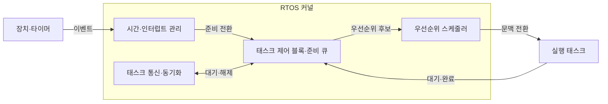
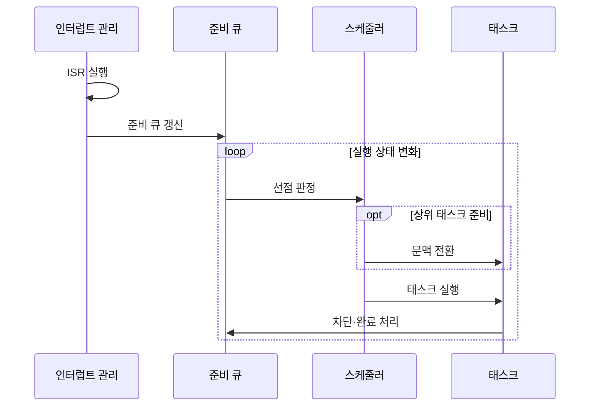

---
sidebar:
  order: 61
  label: "061. 실시간 운영체제 (RTOS)"
  badge:
    text: "기출 · 50%"
    variant: note
title: "실시간 운영체제 (RTOS)"
date: "2026-07-27T23:59:59+09:00"
tags:
  - "notes-hardware"
weight: 61
extra:
  question_no: "061"
  source_status: "기출"
  source_history: "137회"
  priority: 50
  priority_note: "RTOS 결정성·응답시간의 단일 기출 핵심"
---

## 미리 알고가기

- **실시간 운영체제(Real-Time Operating System, RTOS)**: ‘알티오에스’로 읽고 영문 머리글자를 딴 약어이며, 정해진 시간 안의 실행 완료를 지원
- **태스크(Task)**: 스케줄러가 독립 실행 단위로 관리하는 작업
- **데드라인(Deadline)**: 태스크 실행을 끝내야 하는 시각
- **결정성(Determinism)**: 최악 처리 지연 상한을 예측하는 성질
- **최악 실행시간(Worst-Case Execution Time, WCET)**: ‘더블유시이티’로 읽고 영문 머리글자를 딴 약어이며, 태스크 실행시간의 최댓값
- **최악 응답시간(Worst-Case Response Time, WCRT)**: ‘더블유시아르티’로 읽고 영문 머리글자를 딴 약어이며, 요청부터 완료까지의 최대 시간
- **인터럽트 서비스 루틴(Interrupt Service Routine, ISR)**: ‘아이에스알’로 읽고 영문 머리글자를 딴 약어이며, 장치 인터럽트에 응답하는 짧은 코드
- **문맥 전환(Context Switch)**: 현재 태스크 상태 저장 후 다음 태스크 상태 복원
- **커널(Kernel)**: 태스크 실행·메모리·인터럽트·장치 자원을 통제하는 운영체제 핵심부
- **태스크 제어 블록(Task Control Block, TCB)**: ‘티시비’로 읽고 영문 머리글자를 딴 약어이며, 태스크의 상태·우선순위·문맥을 보관
- **준비 큐(Ready Queue)**: 실행할 수 있는 태스크를 우선순위나 정책 순서로 보관하는 대기열
- **스케줄러·선점(Scheduler·Preemption)**: 스케줄러는 다음 실행 태스크를 선택하고 선점은 더 높은 우선순위 태스크가 현재 실행권을 가져오는 동작
- **차단(Block)**: 태스크가 잠금·입출력·이벤트를 기다리며 실행 후보에서 빠지는 상태
- **동기화(Synchronization)**: 여러 태스크의 실행 순서와 공유 자원 접근을 맞추는 제어
- **우선순위 역전(Priority Inversion)**: 낮은 태스크의 잠금 보유가 높은 태스크를 대기시킴
- **베어메탈(Bare Metal)**: 운영체제 없이 하드웨어를 직접 제어
- **슈퍼루프(Super Loop)**: 여러 작업을 한 반복문에서 순차 실행
- **지터(Jitter)**: 응답·주기 시간의 변동 폭

## Ⅰ. 개요

- **정의/개념**: 태스크의 **최악 응답시간·데드라인**을 관리하는 운영체제
- **기존 한계**: 평균 처리량 중심 OS는 **최악 지연 상한** 보장 곤란

### 쉽게 이해하기 (학습용)

- 급한 일을 먼저 처리하면서 가장 늦어도 약속 시간 안에 끝나는지 계산하는 비서다.

## Ⅱ. 특징

- 평균 처리량보다 **최악 지연 상한** 예측 우선
- **우선순위 선점**으로 긴급 태스크 응답시간 단축
- **차단·ISR·문맥 전환**이 최악 응답시간 증가

### 쉽게 이해하기 (학습용)

- 평소 평균보다 가장 늦을 때도 약속 시간을 지키는지가 기준이다.

## Ⅲ. 아키텍처 및 구성요소

| 설계 요소 | 설명 |
|:---|:---|
| 시간·인터럽트 관리 | 이벤트·주기 만료로 태스크를 준비 상태로 전환 |
| 태스크 제어 블록·준비 큐 | 태스크 상태·우선순위·문맥·대기 순서 관리 |
| 우선순위 스케줄러 | 우선순위 정책으로 다음 실행 태스크 선택 |
| 태스크 통신·동기화 | 데이터 전달·대기·공유 자원 보호 |

> 요약: 준비 큐 우선순위가 실행 태스크 선택을 결정한다.

### 쉽게 이해하기 (학습용)

- 비서는 호출표·시계·잠금 정보를 보고 작업 자리를 정한다.

## Ⅳ. 원리 및 절차 흐름도

| 절차 | 설명 |
|:---|:---|
| ISR 실행 | 인터럽트 원인 확인·태스크 준비 전환 |
| 준비 큐 갱신 | 새 준비 태스크 상태·우선순위 반영 |
| 선점 판정 | 현재 태스크와 최상위 준비 태스크 비교 |
| 문맥 전환 | 현재 문맥 저장·선택 태스크 문맥 복원 |
| 태스크 실행 | 현재 실행 태스크의 작업 수행 |
| 차단·완료 처리 | 태스크 상태 변경 후 준비 큐 재평가 |

> 요약: 상태 변화마다 선점을 판정해 태스크를 재배치한다.

### 쉽게 이해하기 (학습용)

- 새 일이 더 급하면 자리를 바꾸고 일이 끝나거나 기다리면 호출표를 다시 본다.

## Ⅴ. 종류 및 비교

| 실행 환경 | RTOS | 베어메탈 | 범용 운영체제 |
|:---|:---|:---|:---|
| 적용 기준 | 다중 태스크 **데드라인 입증** | 단일 제어·**최소 자원** | 파일·가상 메모리·**시분할** |
| 핵심 특징 | 태스크 우선순위·**지연 상한 분석** | 슈퍼루프·**인터럽트 직접 제어** | 프로세스 시분할·**풍부한 서비스** |
| 한계 | 우선순위 역전·**차단·지터** | 확장 시 **코드 결합 증가** | 비결정적 지연·**큰 메모리** |

> 요약: RTOS는 시간 상한 분석과 태스크 서비스를 결합한다.

### 쉽게 이해하기 (학습용)

- 작업 하나는 직접 돌리고 여러 마감 업무는 RTOS에 맡기며 파일 기능이 많으면 범용 운영체제를 선택한다.

## Ⅵ. 실무 사례

1. 모터 제어는 **WCET·차단시간**으로 제어 주기 검증
2. 의료 경보는 **ISR 단축·경보 우선 실행** 적용

### 쉽게 이해하기 (학습용)

- 모터 제어는 가장 늦은 계산과 잠금 대기까지 주기 안에 드는지 확인한다.
- 의료 경보는 호출만 짧게 받고 실제 처리를 높은 우선순위 업무에 넘긴다.

## Ⅶ. 결론

- 다중 태스크의 **데드라인 입증**이 필요하면 RTOS 선택

### 쉽게 이해하기 (학습용)

- 빠른 날의 평균보다 가장 늦는 날에도 약속을 지키는지가 RTOS 선택 기준이다.
