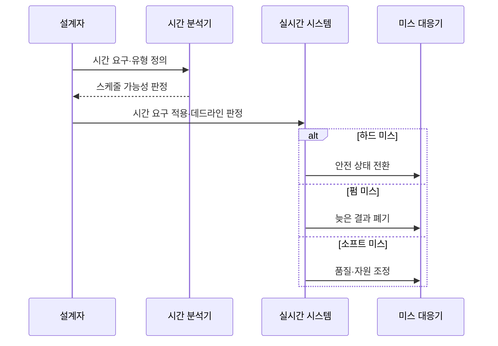

---
sidebar:
  order: 62
  label: "062. 하드·펌·소프트 실시간"
  badge:
    text: "기출 · 50%"
    variant: note
title: "하드·펌·소프트 실시간"
date: "2026-07-27T23:59:59+09:00"
tags:
  - "notes-hardware"
weight: 62
extra:
  question_no: "062"
  source_status: "기출"
  source_history: "137회"
  priority: 50
  priority_note: "데드라인 미스 영향의 단일 기출 핵심"
---

## 미리 알고가기

- **실시간 시스템(Real-Time System)**: 논리 결과와 완료 시각이 모두 정확해야 하는 시스템
- **데드라인(Deadline)**: 태스크 실행을 끝내야 하는 시각
- **데드라인 미스(Deadline Miss)**: 태스크가 정해진 완료 시각을 넘겨 결과를 내는 사건
- **주기(Period)**: 반복 태스크가 새 작업을 시작하거나 요청받는 시간 간격
- **하드 실시간(Hard Real-Time)**: 미스를 시스템 실패로 보는 유형
- **펌 실시간(Firm Real-Time)**: 늦은 결과 가치가 0이 되는 유형
- **소프트 실시간(Soft Real-Time)**: 지연에 따라 결과 가치가 낮아지는 유형
- **최악 실행시간(Worst-Case Execution Time, WCET)**: ‘더블유시이티’로 읽고 영문 머리글자를 딴 약어이며, 태스크 실행시간의 최댓값
- **지터(Jitter)**: 실행·응답 시각의 변동 폭
- **스케줄 가능성 분석(Schedulability Analysis)**: 최악 조건의 데드라인 충족 여부 판정
- **차단·간섭(Block·Interference)**: 차단은 자원 대기로 멈추는 시간이고 간섭은 다른 태스크 실행 때문에 밀리는 시간
- **버퍼(Buffer)**: 처리 속도 차이로 생긴 데이터를 잠시 보관해 지연 변동을 흡수하는 메모리 영역
- **안전 상태(Fail-Safe State)**: 실패 시 피해를 제한하는 상태

## Ⅰ. 개요

- **정의/개념**: 데드라인 미스의 **피해·결과 가치**에 따른 분류
- **기존 한계**: 동일 시간 기준은 **미스 피해별 검증 수준** 구분 곤란

### 쉽게 이해하기 (학습용)

- 브레이크·공정 판정·동영상은 늦었을 때의 피해와 결과 가치가 서로 다르다.

## Ⅱ. 특징

- 실시간 정확성은 **논리 결과·완료 시각**을 함께 요구
- **하드 미스**는 시스템 실패로 판정
- **펌 미스**는 늦은 결과의 가치를 무효화
- **소프트 미스**는 결과 품질을 점진적으로 저하

### 쉽게 이해하기 (학습용)

- 답이 맞아도 약속 시간을 넘기면 실시간 시스템에서는 틀린 결과가 될 수 있다.

## Ⅲ. 아키텍처 및 구성요소

| 설계 요소 | 설명 |
|:---|:---|
| 시간 요구 | 데드라인·주기·지터 허용 한계 |
| 응답시간 상한 | WCET·차단·간섭을 합산한 최악 지연 |
| 미스 영향·결과 가치 | 실패·무효·품질 저하 분류 기준 |
| 검증·대응 정책 | 스케줄 가능성 분석·유형별 미스 조치 |

> 요약: 시간 상한·미스 영향으로 검증·대응 수준을 정한다.

### 쉽게 이해하기 (학습용)

- 약속 시간·최악 대기·늦은 결과 가치를 함께 적어 둔 설계표다.

## Ⅳ. 원리 및 절차 흐름도

| 절차 | 설명 |
|:---|:---|
| 시간 요구·유형 정의 | 데드라인·지터와 미스 피해 분류 |
| 스케줄 가능성 판정 | WCET·차단·간섭으로 데드라인 충족 분석 |
| 시간 요구 적용·데드라인 판정 | 유형·데드라인을 적용해 완료 시각 비교 |
| 안전 상태 전환 | 하드 미스 시 피해 제한 상태 진입 |
| 늦은 결과 폐기 | 펌 미스의 무가치 결과 폐기 |
| 품질·자원 조정 | 소프트 미스의 품질·버퍼·자원 조절 |

> 요약: 미스 영향에 따라 안전 전환·폐기·품질 조정을 수행한다.

### 쉽게 이해하기 (학습용)

- 늦으면 위험한 일은 안전 상태로 바꾸고, 무가치한 결과는 버리며, 영상은 화질이나 대기 공간을 조절한다.

## Ⅴ. 종류 및 비교

| 실시간 유형 | 하드 실시간 | 펌 실시간 | 소프트 실시간 |
|:---|:---|:---|:---|
| 적용 기준 | 안전 제어·**실패 불허** | 최신 결과만 **유효한 판정** | 영상·음성의 **품질 저하 허용** |
| 핵심 특징 | 미스를 **시스템 실패**로 판정 | 늦은 결과의 **가치 0** | 지연에 따라 **품질 점진 저하** |
| 한계 | 한 번의 미스가 **안전 실패** | 늦은 결과의 **처리 자원 낭비** | 지연·지터의 **품질 누적 저하** |

> 요약: 미스 피해·늦은 결과 가치로 세 유형을 구분한다.

### 쉽게 이해하기 (학습용)

- 하드는 한 번의 지각도 실패, 펌은 늦은 결과만 무효, 소프트는 늦을수록 품질이 낮아진다.

## Ⅵ. 실무 사례

1. 하드 실시간은 **차량 제동 데드라인** 검증
2. 펌 실시간은 **늦은 공정 판정 결과** 폐기
3. 소프트 실시간은 **영상 지터·화질** 조정

### 쉽게 이해하기 (학습용)

- 차량 제동은 가장 늦은 상황에도 제시간에 동작하는지 입증한다.
- 공정 검사는 다음 제품이 지나간 뒤 도착한 판정 결과를 버린다.
- 영상 재생은 늦어지면 화질이나 버퍼를 조절해 재생을 이어 간다.

## Ⅶ. 결론

- **미스 피해·결과 가치**에 따라 검증·대응 수준 선택

### 쉽게 이해하기 (학습용)

- 늦었을 때 피해를 보고 실패로 다룰지, 결과를 버릴지, 품질 저하를 허용할지 선택한다.
