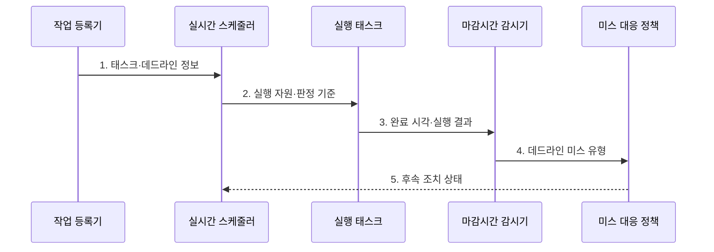

---
sidebar:
  order: 62
  label: "062. 하드·펌·소프트 실시간"
  badge:
    text: "기출 · 50%"
    variant: note
title: "하드·펌·소프트 실시간"
date: "2026-07-31T10:38:00+09:00"
tags:
  - "notes-hardware"
weight: 62
extra:
  question_no: "062"
  source_status: "기출"
  source_history: "137회"
  priority: 50
  priority_note: "데드라인 미스 영향의 단일 기출 핵심"
---

## 미리 알고가기

- **실시간 시스템(Real-Time System)**: 논리 결과와 완료 시각이 모두 정확해야 하는 시스템
- **데드라인(Deadline)**: 태스크 실행을 끝내야 하는 시각
- **데드라인 미스(Deadline Miss)**: 태스크가 정해진 완료 시각을 넘겨 결과를 내는 사건
- **주기(Period)**: 반복 태스크가 새 작업을 시작하거나 요청받는 시간 간격
- **하드 실시간(Hard Real-Time)**: 미스를 시스템 실패로 보는 유형
- **펌 실시간(Firm Real-Time)**: 늦은 결과 가치가 0이 되는 유형
- **소프트 실시간(Soft Real-Time)**: 지연에 따라 결과 가치가 낮아지는 유형
- **최악 실행시간(Worst-Case Execution Time, WCET)**: 대기·선점 시간을 제외하고 태스크가 프로세서에서 실제 실행되는 최대 시간
- **최악 응답시간(Worst-Case Response Time, WCRT)**: 작업 요청부터 완료까지 차단·간섭을 포함해 걸리는 최대 시간
- **지터(Jitter)**: 실행·응답 시각의 변동 폭
- **스케줄 가능성 분석(Schedulability Analysis)**: 최악 조건의 데드라인 충족 여부 판정
- **차단·간섭(Block·Interference)**: 차단은 자원 대기로 멈추는 시간이고 간섭은 다른 태스크 실행 때문에 밀리는 시간
- **마감시간 감시기(Deadline Monitor)**: 태스크의 시작·완료 시각을 추적해 데드라인 미스를 검출하는 구성요소
- **결과 폐기(Result Discard)**: 이미 늦어 가치가 없어진 결과를 제어·판정에 반영하지 않는 처리
- **품질 단계 저하(Quality Degradation)**: 지연을 줄이기 위해 해상도·프레임률·처리 정밀도 등을 단계적으로 낮추는 처리
- **버퍼(Buffer)**: 처리 속도 차이로 생긴 데이터를 잠시 보관해 지연 변동을 흡수하는 메모리 영역
- **안전 상태(Fail-Safe State)**: 실패 시 피해를 제한하는 상태

## Ⅰ. 개요

- 정의/개념: 데드라인 미스의 **피해·결과 가치**로 시스템을 나누는 분류
- 배경/필요성: 같은 지연도 제어 실패·결과 무효·품질 저하로 영향 상이

### 쉽게 이해하기 (학습용)

- 브레이크·공정 판정·동영상은 늦었을 때의 피해와 결과 가치가 서로 다르다.

## Ⅱ. 특징

- 실시간 정확성은 **논리 결과·완료 시각**을 함께 요구
- **하드 미스**는 시스템 실패로 판정
- 마감 미스에 따른 **펌 결과 무효·소프트 품질 저하**

### 쉽게 이해하기 (학습용)

- 답이 맞아도 약속 시간을 넘기면 실시간 시스템에서는 틀린 결과가 될 수 있다.

## Ⅲ. 구조 및 구성요소

| 구성요소 | 책임 |
|:---|:---|
| 작업 등록기 | **태스크·데드라인 등록** |
| 실시간 스케줄러 | **우선순위·자원 배정** |
| 마감시간 감시기 | **완료 시각 판정** |
| 미스 대응 정책 | **유형별 후속 조치** |

### 쉽게 이해하기 (학습용)

- 작업 완료 시각을 감시하고 늦었을 때 유형별로 다르게 처리한다.

## Ⅳ. 흐름도

**동작 원리**

1. **태스크·데드라인 정보**: 작업과 완료 판정 기준 등록
2. **실행 자원·판정 기준**: 태스크 자원과 종료 기준 전달
3. **완료 시각·실행 결과**: 실제 종료 시각과 결과 보고
4. **데드라인 미스 유형**: 하드·펌·소프트 유형 판정
5. **후속 조치 상태**: 안전 전환·결과 폐기·품질 저하 반영

### 쉽게 이해하기 (학습용)

- 같은 지각도 제동은 안전 전환, 최신 판정은 결과 폐기, 영상은 품질 조정으로 대응한다

## Ⅴ. 종류 및 비교

| 실시간 유형 | 하드 실시간 | 펌 실시간 | 소프트 실시간 |
|:---|:---|:---|:---|
| 적용 기준 | 안전 제어·**실패 불허** | 최신 결과만 **유효한 판정** | 영상·음성의 **품질 저하 허용** |
| 핵심 특징 | 미스를 **시스템 실패**로 판정 | 늦은 결과의 **가치 0** | 지연에 따라 **품질 점진 저하** |
| 한계 | 한 번의 미스가 **안전 실패** | 늦은 결과의 **처리 자원 낭비** | 지연·지터의 **품질 누적 저하** |

### 쉽게 이해하기 (학습용)

- 하드는 한 번의 지각도 실패, 펌은 늦은 결과만 무효, 소프트는 늦을수록 품질이 낮아진다.

## Ⅵ. 실무 고려사항 및 대책

| 고려사항 | 대책 | 효과 |
|:---|:---|:---|
| 미스 피해 분석 없이 실시간 유형 오분류 | **안전 영향·결과 가치 분석** | 유형별 **검증 비용** 과소·과대 방지 |
| 차단·간섭 누락으로 최악 지연 과소평가 | **WCET**·차단·간섭 분석 | **최악 응답시간** 상한 산정 |
| 하드 미스 후 안전 출력 전환 실패 | **장애 주입·안전 출력 시험** | **피해 제한 동작** 검증 |
| 소프트 미스 누적으로 지터 증가 | 지터 기반 **품질 단계 저하** | **서비스 품질** 저하 완화 |

### 쉽게 이해하기 (학습용)

- 제동은 최악 조건의 시간 준수를 입증하고, 영상은 지연이 누적되기 전에 품질 단계를 낮춘다

## Ⅶ. 결론

- 안전 실패 시 **하드**, 늦은 결과 무효면 **펌**, 품질 저하 허용 시 소프트 선택

### 쉽게 이해하기 (학습용)

- 늦었을 때 피해를 보고 실패로 다룰지, 결과를 버릴지, 품질 저하를 허용할지 선택한다.
