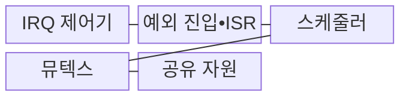
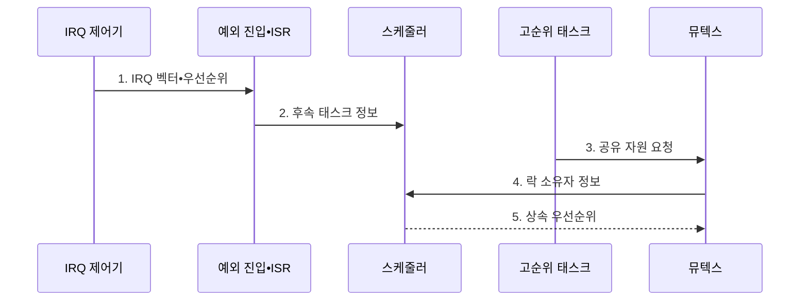

---
sidebar:
  order: 63
  label: "063. 인터럽트 레이턴시•우선순위 역전"
  badge:
    text: "기출 • 50%"
    variant: note
title: "인터럽트 레이턴시•우선순위 역전"
date: "2026-08-03T08:48:47+09:00"
tags:
  - "notes-hardware"
weight: 63
extra:
  question_no: "063"
  source_status: "기출"
  source_history: "137회"
  priority: 50
  priority_note: "IRQ 시작 지연•락 차단의 분리 통제"
---

## Ⅰ. 개요

핵심 용어

- **인터럽트 레이턴시(Interrupt Latency)**: 장치가 인터럽트 요청(Interrupt Request, IRQ)을 인가한 시점부터 해당 인터럽트 서비스 루틴(Interrupt Service Routine, ISR)의 첫 명령이 시작될 때까지의 지연이다.
- **우선순위 역전(Priority Inversion)**: 높은 우선순위 태스크가 낮은 우선순위 태스크가 보유한 잠금을 기다리는 현상이다.
- **실시간 지연 분석(Real-time Latency Analysis)**: 이벤트 처리 경로의 각 대기 원인과 최악 상한을 분리하여 계산하는 과정이다.

- 정의/개념: 인터럽트 레이턴시는 **인터럽트 요청(Interrupt Request, IRQ)부터 인터럽트 서비스 루틴(Interrupt Service Routine, ISR) 시작까지의 지연**, 우선순위 역전은 고순위 태스크가 저순위 태스크의 **잠금 해제를 기다리는 현상**
- 배경/필요성: 단일 지연 측정으로는 **IRQ•락 차단 원인 분리 불가**, 두 경로의 상한을 구분하는 **실시간 지연 분석 필요**

#### 한줄 요약

- 호출 응답 지연과 급한 작업의 열쇠 대기는 원인이 다르다.

## Ⅱ. 특징

핵심 용어

- **인터럽트 마스킹(Interrupt Masking)**: 프로세서가 특정 인터럽트 요청(Interrupt Request, IRQ)의 처리를 일정 시간 동안 억제하는 동작이다.
- **상위 인터럽트 서비스 루틴 중첩(Higher-priority Interrupt Service Routine Nesting, Higher-priority ISR Nesting)**: 더 높은 우선순위의 인터럽트가 현재 인터럽트 서비스 루틴(Interrupt Service Routine, ISR)을 선점하여 실행되는 현상이다.
- **중순위 선점(Medium-priority Preemption)**: 잠금을 가진 저순위 태스크가 중순위 태스크에 선점되어 고순위 태스크의 대기가 길어지는 현상이다.

- 인터럽트 시작 지연의 핵심 원인은 **인터럽트 마스킹•상위 인터럽트 서비스 루틴(Interrupt Service Routine, ISR) 중첩에 따른 대기**
- 고순위 태스크 실행 차단의 원인은 **저순위 락 보유**
- 우선순위 역전 시간을 확대하는 요인은 **중순위 선점**

#### 한줄 요약

- ISR 시작 전 지연과 ISR 이후 락 대기를 따로 측정한다.

## Ⅲ. 구조 및 구성요소

핵심 용어

- **인터럽트 컨트롤러(Interrupt Controller)**: 여러 장치의 인터럽트 요청(Interrupt Request, IRQ)을 보류하고 우선순위를 정해 프로세서에 전달하는 하드웨어이다.
- **예외 진입(Exception Entry)**: 현재 상태를 저장하고 인터럽트 벡터를 조회한 뒤 인터럽트 서비스 루틴(Interrupt Service Routine, ISR) 문맥으로 전환하는 절차이다.
- **뮤텍스(Mutex)**: 한 시점에 하나의 태스크만 공유 자원에 접근하도록 보장하는 잠금이다.
- **임계 구역(Critical Section)**: 공유 자원을 배타적으로 읽거나 변경하기 위해 잠금을 보유하는 코드 구간이다.

인터럽트 요청(Interrupt Request, IRQ)의 전달 경로: **인터럽트 컨트롤러•예외 진입**, 인터럽트 서비스 루틴(Interrupt Service Routine, ISR) 이후 태스크의 배타 접근 수단: **뮤텍스•임계 구역**

| 구성요소 | 책임 |
|:---|:---|
| IRQ 제어기 | **요청•우선순위 관리** |
| 예외 진입•ISR | **긴급 원인 처리** |
| 스케줄러 | **태스크 실행 결정** |
| 뮤텍스 | **배타 접근 관리** |
| 공유 자원 | **공통 상태 제공** |

#### 한줄 요약

- IRQ 경로와 태스크의 공유 자원 경로가 서로 다른 지연을 만든다.

## Ⅳ. 흐름도

핵심 용어

- **인터럽트 벡터(Interrupt Vector)**: 인터럽트 요청(Interrupt Request, IRQ) 종류에 해당하는 인터럽트 서비스 루틴(Interrupt Service Routine, ISR) 시작 주소를 찾기 위한 식별자나 주소표 항목이다.
- **후속 태스크(Deferred Task)**: ISR에서 긴 처리를 넘겨받아 일반 태스크 문맥에서 실행하는 작업이다.
- **락 소유자(Lock Owner)**: 현재 뮤텍스를 획득하여 공유 자원의 임계 구역을 실행 중인 태스크이다.
- **우선순위 상속(Priority Inheritance)**: 락 소유자가 대기 중인 고순위 태스크의 우선순위를 임시로 받아 임계 구역을 빨리 끝내는 기법이다.

인터럽트 요청(Interrupt Request, IRQ)은 벡터와 우선순위에 따라 인터럽트 서비스 루틴(Interrupt Service Routine, ISR)으로 진입하고, 긴 작업은 후속 태스크로 넘긴다.

**동작 원리**

1. **IRQ 벡터•우선순위**: 처리할 ISR 주소와 선점 순서 결정
2. **후속 태스크 정보**: 긴 처리를 준비 큐로 이관
3. **공유 자원 요청**: 고순위 태스크의 뮤텍스 획득 시도
4. **락 소유자 정보**: 저순위 태스크의 자원 보유 상태 보고
5. **상속 우선순위**: 락 소유자의 임계 구역 완료 촉진

#### 한줄 요약

- ISR은 짧게 끝내고 락 소유자가 자원을 빨리 반환하게 한다.

## Ⅴ. 종류 및 비교

핵심 용어

- **인터럽트 레이턴시(Interrupt Latency)**: 인터럽트 요청(Interrupt Request, IRQ)부터 인터럽트 서비스 루틴(Interrupt Service Routine, ISR) 실행 시작까지 발생하는 마스킹•예외 진입•상위 ISR 대기 시간이다.
- **우선순위 역전(Priority Inversion)**: 고순위 태스크가 필요한 잠금을 저순위 태스크가 보유해 실행하지 못하고 중순위 태스크의 선점으로 대기가 늘어나는 현상이다.
- **최악 응답시간(Worst-case Response Time)**: 이벤트나 작업 요청부터 모든 대기와 실행을 거쳐 완료까지 걸리는 최대 시간이다.

인터럽트 요청(Interrupt Request, IRQ)부터 인터럽트 서비스 루틴(Interrupt Service Routine, ISR) 시작까지의 경로와 잠금 대기 경로를 분리해 비교한다.
두 경로를 포함한 전체 대기•실행 상한: 이벤트 요청부터 처리 완료까지의 **최악 응답시간**

| 지연 경로 | 관측 구간 | 지연을 만드는 직접 원인 |
|:---|:---|:---|
| **인터럽트 레이턴시** | IRQ 발생부터 **ISR 시작** 까지 | 마스킹•예외 진입•상위 ISR 실행 |
| **우선순위 역전** | 고순위 태스크의 **잠금 대기** 구간 | 저순위 소유자의 잠금과 중순위 선점 |

#### 한줄 요약

- 시작 지연은 IRQ 경로, 락 차단은 스케줄링 경로를 살핀다.

## Ⅵ. 실무 고려사항 및 대책

핵심 용어

- **후속 처리 이관(Deferred-processing Offload)**: ISR의 긴 작업을 준비 큐의 태스크로 넘겨 인터럽트 실행 시간을 줄이는 방식이다.
- **인터럽트 요청 기아(Interrupt Request Starvation, IRQ 기아)**: 높은 우선순위 요청이 계속 발생하여 낮은 우선순위 IRQ가 장시간 처리되지 못하는 현상이다.
- **잠금 순서(Lock Ordering)**: 여러 잠금을 획득할 때 모든 태스크가 지키도록 정한 일관된 순서이다.
- **최대 보유시간(Maximum Hold Time)**: 태스크가 하나의 잠금을 획득한 뒤 해제할 때까지 허용되는 최장 시간이다.

인터럽트 요청(Interrupt Request, IRQ)의 지연을 줄이려면 인터럽트 서비스 루틴(Interrupt Service Routine, ISR)을 짧게 유지하고 잠금 보유시간을 제한해야 한다.

| 문제 | 대책 | 효과 |
|:---|:---|:---|
| 긴 마스킹•ISR로 시작 지연 증가 | 긴 처리 대책: **후속 처리 이관** | **IRQ 시작 지연** 감소 |
| 상위 IRQ 중첩으로 하위 요청 기아 | **중첩 깊이•IRQ 요청률 제한** | **인터럽트 요청 기아 방지** |
| 잠금 연쇄로 교착•차단시간 증가 | **잠금 순서•최대 보유시간 지정** | **교착•차단시간 제한** |
| 상속 설정 오류로 고순위 응답 지연 | **우선순위 상속 시나리오** 시험 | **고순위 응답시간** 상한 검증 |

#### 한줄 요약

- 최대 IRQ 지연과 락 보유시간을 측정해 각각 상한을 둔다.

## Ⅶ. 결론

핵심 용어

- **인터럽트 요청 지연 상한(Interrupt Request Latency Bound, IRQ 지연 상한)**: 최악 조건에서 인터럽트 요청부터 인터럽트 서비스 루틴(Interrupt Service Routine, ISR) 시작까지 허용하는 최대 시간이다.
- **락 차단 상한(Lock-blocking Bound)**: 공유 자원 대기로 고순위 태스크가 차단될 수 있는 최대 시간이다.
- **데드라인(Deadline)**: 인터럽트 후속 처리와 태스크 결과를 반드시 완료해야 하는 시각이다.

- 정책 결정 기준: **인터럽트 요청(Interrupt Request, IRQ) 지연 상한•락 차단 상한**, 적용 대상: 인터럽트 서비스 루틴(Interrupt Service Routine, ISR)•우선순위 상속, 준수 목표: **데드라인**

#### 한줄 요약

- 호출 경로와 자원 대기를 따로 줄여 데드라인을 지킨다.
