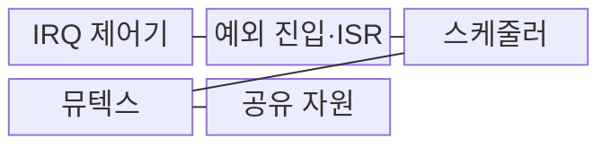

---
sidebar:
  order: 63
  label: "063. 인터럽트 레이턴시·우선순위 역전"
  badge:
    text: "기출 · 50%"
    variant: note
title: "인터럽트 레이턴시·우선순위 역전"
date: "2026-07-31T10:39:00+09:00"
tags:
  - "notes-hardware"
weight: 63
extra:
  question_no: "063"
  source_status: "기출"
  source_history: "137회"
  priority: 50
  priority_note: "IRQ 시작 지연·락 차단의 분리 통제"
---

## 미리 알고가기

- **인터럽트 요청(Interrupt Request, IRQ)**: 장치가 프로세서에 처리를 요구하는 비동기 신호
- **인터럽트 레이턴시(Interrupt Latency)**: IRQ 인가부터 ISR 시작까지의 지연
- **인터럽트 서비스 루틴(Interrupt Service Routine, ISR)**: 인터럽트 요청의 원인을 확인하고 긴급한 처리를 수행하는 짧은 코드
- **인터럽트 마스킹(Interrupt Masking)**: 프로세서의 특정 IRQ 처리를 잠시 억제
- **비마스킹 인터럽트(Non-Maskable Interrupt, NMI)**: 일반 마스크로 차단할 수 없는 최상위 긴급 인터럽트
- **예외 진입(Exception Entry)**: 상태 저장·벡터 조회 후 ISR로 전환
- **인터럽트 컨트롤러(Interrupt Controller)**: 여러 장치의 IRQ를 보류·우선순위화해 프로세서에 전달하는 하드웨어
- **인터럽트 벡터(Interrupt Vector)**: IRQ 종류별 ISR 시작 주소를 찾는 식별자나 주소표 항목
- **선점(Preemption)**: 더 높은 우선순위의 인터럽트나 태스크가 현재 실행권을 가져오는 동작
- **임계 구역(Critical Section)**: 공유 자원을 배타적으로 쓰는 코드 구간
- **뮤텍스(Mutex)**: 한 태스크만 공유 자원을 쓰게 하는 잠금
- **우선순위 역전(Priority Inversion)**: 고순위 태스크가 저순위 태스크 보유 락을 대기
- **우선순위 상속(Priority Inheritance)**: 락 보유자가 대기자의 높은 우선순위를 임시 상속
- **우선순위 천장(Priority Ceiling)**: 락 보유자를 자원별 최고 우선순위로 승격
- **최악 응답시간(Worst-Case Response Time)**: 이벤트·작업 준비부터 완료까지 최대 시간
- **데드라인(Deadline)**: 처리를 끝내야 하는 시각

## Ⅰ. 개요

- 정의/개념: **IRQ 시작 지연**과 **락 대기**를 구분하는 실시간 분석
- 배경/필요성: 단일 지연 측정으로는 **IRQ•락 차단 원인 분리 불가**

### 쉽게 이해하기 (학습용)

- 호출 응답 지연과 급한 작업의 열쇠 대기는 원인이 다르다.

## Ⅱ. 특징

- **마스킹·상위 ISR** 중첩에 따른 인터럽트 시작 지연 증가
- **저순위 락 보유**에 따른 고순위 태스크 실행 차단
- **중순위 선점**에 따른 우선순위 역전 시간 확대

### 쉽게 이해하기 (학습용)

- ISR 시작 전 지연과 ISR 이후 락 대기를 따로 측정한다.

## Ⅲ. 구조 및 구성요소

| 구성요소 | 책임 |
|:---|:---|
| IRQ 제어기 | **요청·우선순위 관리** |
| 예외 진입·ISR | **긴급 원인 처리** |
| 스케줄러 | **태스크 실행 결정** |
| 뮤텍스 | **배타 접근 관리** |
| 공유 자원 | **공통 상태 제공** |

### 쉽게 이해하기 (학습용)

- IRQ 경로와 태스크의 공유 자원 경로가 서로 다른 지연을 만든다.

## Ⅳ. 흐름도

**동작 원리**

1. **IRQ 벡터·우선순위**: 처리할 ISR 주소와 선점 순서 결정
2. **후속 태스크 정보**: 긴 처리를 준비 큐로 이관
3. **공유 자원 요청**: 고순위 태스크의 뮤텍스 획득 시도
4. **락 소유자 정보**: 저순위 태스크의 자원 보유 상태 보고
5. **상속 우선순위**: 락 소유자의 임계 구역 완료 촉진

### 쉽게 이해하기 (학습용)

- ISR은 짧게 끝내고 락 소유자가 자원을 빨리 반환하게 한다.

## Ⅴ. 종류 및 비교

| 지연 유형 | 인터럽트 레이턴시 | 우선순위 역전 |
|:---|:---|:---|
| 적용 기준 | **IRQ 시작 지연** 분석 | **공유 자원 차단** 분석 |
| 핵심 특징 | **IRQ부터 ISR 시작** | **고순위의 저순위 락 대기** |
| 한계 | **마스킹·상위 ISR** 영향 | **중순위 선점**으로 확대 |

### 쉽게 이해하기 (학습용)

- 시작 지연은 IRQ 경로, 락 차단은 스케줄링 경로를 살핀다.

## Ⅵ. 실무 고려사항 및 대책

| 고려사항 | 대책 | 효과 |
|:---|:---|:---|
| 긴 마스킹·ISR로 시작 지연 증가 | 긴 처리를 **후속 태스크로 이관** | **IRQ 시작 지연** 감소 |
| 상위 IRQ 중첩으로 하위 요청 기아 | **중첩 깊이·IRQ 요청률** 제한 | **하위 요청 기아** 방지 |
| 잠금 연쇄로 교착·차단시간 증가 | **잠금 순서·최대 보유시간** 지정 | **교착·차단시간** 제한 |
| 상속 설정 오류로 고순위 응답 지연 | **우선순위 상속 시나리오** 시험 | **고순위 응답시간** 상한 검증 |

### 쉽게 이해하기 (학습용)

- 최대 IRQ 지연과 락 보유시간을 측정해 각각 상한을 둔다.

## Ⅶ. 결론

- **IRQ 지연·락 차단 상한** 기반 ISR·우선순위 상속 정책 결정

### 쉽게 이해하기 (학습용)

- 호출 경로와 자원 대기를 따로 줄여 데드라인을 지킨다.
