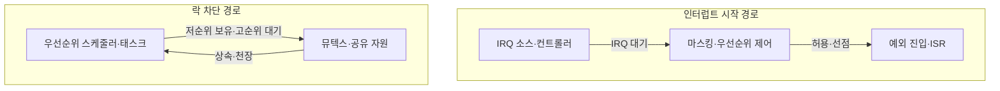
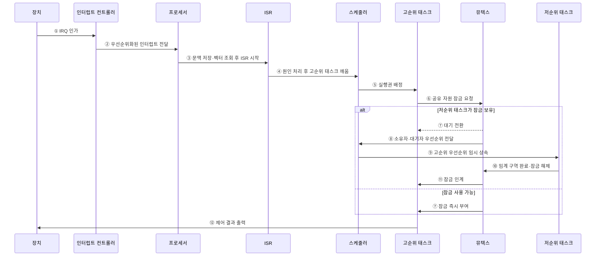

---
sidebar:
  order: 63
  label: "063. 인터럽트 레이턴시·우선순위 역전"
  badge:
    text: "기출 · 50%"
    variant: note
title: "인터럽트 레이턴시·우선순위 역전"
date: "2026-07-28T13:06:57+09:00"
tags:
  - "notes-hardware"
weight: 63
extra:
  question_no: "063"
  source_status: "기출"
  source_history: "137회"
  priority: 50
  priority_note: "IRQ 시작 지연·락 차단의 분리 통제"
---

## 미리 알고가기

- **인터럽트 요청(Interrupt Request, IRQ)**: 장치가 프로세서에 처리를 요구하는 비동기 신호
- **인터럽트 레이턴시(Interrupt Latency)**: IRQ 인가부터 ISR 시작까지의 지연
- **인터럽트 서비스 루틴(Interrupt Service Routine, ISR)**: 인터럽트 요청의 원인을 확인하고 긴급한 처리를 수행하는 짧은 코드
- **인터럽트 마스킹(Interrupt Masking)**: 프로세서의 특정 IRQ 처리를 잠시 억제
- **예외 진입(Exception Entry)**: 상태 저장·벡터 조회 후 ISR로 전환
- **인터럽트 컨트롤러(Interrupt Controller)**: 여러 장치의 IRQ를 보류·우선순위화해 프로세서에 전달하는 하드웨어
- **인터럽트 벡터(Interrupt Vector)**: IRQ 종류별 ISR 시작 주소를 찾는 식별자나 주소표 항목
- **선점(Preemption)**: 더 높은 우선순위의 인터럽트나 태스크가 현재 실행권을 가져오는 동작
- **임계 구역(Critical Section)**: 공유 자원을 배타적으로 쓰는 코드 구간
- **뮤텍스(Mutex)**: 한 태스크만 공유 자원을 쓰게 하는 잠금
- **우선순위 역전(Priority Inversion)**: 고순위 태스크가 저순위 태스크 보유 락을 대기
- **우선순위 상속(Priority Inheritance)**: 락 보유자가 대기자의 높은 우선순위를 임시 상속
- **우선순위 천장(Priority Ceiling)**: 락 보유자를 자원별 최고 우선순위로 승격
- **최악 응답시간(Worst-Case Response Time)**: 이벤트·작업 준비부터 완료까지 최대 시간
- **데드라인(Deadline)**: 처리를 끝내야 하는 시각

## Ⅰ. 개요

- 정의/개념: **IRQ 시작 지연**과 고순위 태스크의 **락 대기**
- 기존 한계: 단일 지연 분석은 **마스킹·자원 차단 원인** 구분 곤란

### 쉽게 이해하기 (학습용)

- 초인종 응답이 늦는 문제와 급한 사람이 열쇠를 기다리는 문제는 원인이 다르다

## Ⅱ. 특징

- **마스킹·상위 ISR**이 인터럽트 시작 지연 증가
- **저순위 락 보유**가 고순위 태스크 실행 차단
- **중순위 선점**이 우선순위 역전 차단시간 확대

### 쉽게 이해하기 (학습용)

- 문지기가 늦게 나오면 호출 경로를, 열쇠를 기다리면 잠금 순서를 살핀다

## Ⅲ. 아키텍처 및 구성요소

### 도표안 A. 인터럽트 시작·락 차단 정적 구조

| 설계 요소 | 입력·상태 | 역할 |
|:---|:---|:---|
| IRQ 소스·컨트롤러 | 요청·보류·우선순위 | IRQ 포착·전달 |
| 마스킹·우선순위 제어 | 마스크·현재 실행 상태 | 허용·선점 순서 결정 |
| 예외 진입·ISR | 벡터·저장 문맥 | 긴급 원인 처리 |
| 우선순위 스케줄러·태스크 | 준비 상태·우선순위 | 태스크 실행 순서 결정 |
| 뮤텍스·공유 자원 | 소유자·대기자·천장 | 배타 접근·차단 관리 |

> 요약: IRQ 시작 경로·락 차단 경로를 분리한다.

### 쉽게 이해하기 (학습용)

- 초인종 선로와 공용 열쇠 대기줄을 따로 보면 대기가 생긴 곳이 드러난다

인터럽트 레이턴시의 보수적 상한은 다음처럼 분해할 수 있다.

$$
L_{\mathrm{IRQ}} \le T_{\mathrm{mask,max}}
+ \sum_{h \in HP(\mathrm{IRQ})} C_h
+ T_{\mathrm{entry}}
$$

- \(T_{\mathrm{mask,max}}\): 측정 구간에서 관측·분석한 최대 인터럽트 비활성 시간
- \(HP(\mathrm{IRQ})\): 대상 IRQ보다 먼저 처리할 수 있는 상위 우선순위 ISR 집합
- \(C_h\): 상위 ISR \(h\)의 최악 실행시간, \(T_{\mathrm{entry}}\): 문맥 저장·벡터 조회 등 예외 진입시간
- 단일 코어에서 상위 ISR이 한 번씩 간섭하고, 비마스킹 NMI·버스 지연은 별도 예산으로 관리한다고 가정한다.

### 도표안 B. IRQ 처리와 우선순위 상속 시퀀스

#### 동작 원리

1. **IRQ 인가**: 장치가 비동기 사건을 인터럽트 컨트롤러에 알린다.
2. **인터럽트 전달**: 컨트롤러가 보류 요청을 우선순위화해 프로세서에 전달한다.
3. **ISR 진입**: 프로세서가 현재 문맥을 저장하고 벡터를 조회한 뒤 ISR을 시작한다.
4. **후속 태스크 기동**: ISR은 긴 처리를 직접 수행하지 않고 원인을 확인한 뒤 고순위 태스크를 깨운다.
5. **실행권 배정**: 스케줄러가 준비된 고순위 태스크에 실행권을 배정한다.
6. **잠금 요청**: 고순위 태스크가 후속 처리에 필요한 공유 자원 잠금을 요청한다.
7. **잠금 상태 판정**: 저순위 태스크가 보유 중이면 고순위 태스크를 대기시키고, 비어 있으면 즉시 잠금을 부여한다.
8. **역전 정보 전달**: 뮤텍스가 잠금 소유자와 고순위 대기자 정보를 스케줄러에 전달한다.
9. **우선순위 상속**: 스케줄러가 저순위 소유자의 우선순위를 임시로 높여 중순위 태스크의 선점을 억제한다.
10. **임계 구역 종료**: 저순위 태스크가 임계 구역을 마치고 잠금을 해제한다.
11. **잠금 인계**: 뮤텍스가 기다리던 고순위 태스크에 잠금을 넘긴다.
12. **결과 출력**: 고순위 태스크가 공유 자원 처리를 끝내고 장치에 제어 결과를 출력한다.

### 쉽게 이해하기 (학습용)

- 인터럽트는 문을 여는 데 걸린 시간, 우선순위 역전은 문을 연 뒤 공용 열쇠를 기다리는 시간이다.

## Ⅳ. 종류 및 비교

| 실시간 지연 유형 | 인터럽트 레이턴시 | 우선순위 역전 |
|:---|:---|:---|
| 적용 기준 | 인터럽트 **시작 지연 분석** | 공유 자원 **차단시간 분석** |
| 핵심 특징 | IRQ부터 **ISR 시작까지 지연** | 고순위 태스크의 **저순위 락 대기** |
| 한계 | 긴 마스킹·**상위 ISR·예외 진입** | 중순위 선점으로 **차단 확대** |

> 요약: 시작 지연은 IRQ 경로, 락 차단은 스케줄링으로 통제한다.

### 쉽게 이해하기 (학습용)

- 초인종 쪽은 문지기와 호출 장치를, 열쇠 쪽은 대기 순서와 잠금을 살핀다

## Ⅴ. 실무 고려사항 및 대응 방안

| 운영 위험 | 대응 | 기대 효과 |
|:---|:---|:---|
| 긴 인터럽트 마스킹·ISR로 시작 지연 증가 | 최대 비활성·ISR 시간을 계측하고 긴 처리를 태스크로 이관 | IRQ 지연 상한 축소 |
| 높은 우선순위 IRQ 중첩으로 하위 요청 기아 | 중첩 깊이·실행 예산과 요청률 제한 | 처리 공정성·스택 안정성 확보 |
| 여러 잠금 연쇄로 차단시간·교착 증가 | 잠금 순서·최대 보유시간과 중첩 자원 분석 | WCRT·교착 위험 통제 |
| 우선순위 상속·천장 설정 오류 | 자원별 최고 우선순위 검증과 역전 장애 주입 시험 | 고순위 태스크 응답 보장 |

### 쉽게 이해하기 (학습용)

- 초인종과 열쇠 대기 시간을 따로 재고 고친 뒤 가장 늦은 경우를 다시 잰다

### 적용 사례

- 모터 제어기는 ISR에서 원인 확인과 태스크 기동만 수행하고 긴 연산은 후속 태스크로 이관해 인터럽트 시작 지연의 누적을 줄인다.

### 쉽게 이해하기 (학습용)

- 모터 제어기는 문지기에게 긴 계산을 맡기지 않아 다음 호출을 빨리 받는다

## Ⅵ. 결론

- 고우선순위 태스크의 응답시간을 보장하기 위해 **인터럽트 비활성 구간·ISR 실행시간·락 보유시간·우선순위 역전**을 검토하고, ISR 단축과 우선순위 상속·천장 프로토콜로 지연을 통제한다

### 쉽게 이해하기 (학습용)

- 호출 지연과 열쇠 대기를 따로 고쳐야 급한 일이 약속 시간 안에 끝난다
