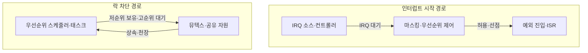
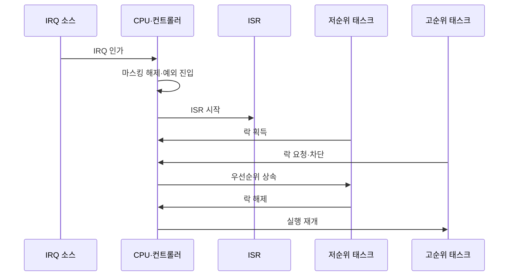

---
sidebar:
  order: 63
  label: "063. 인터럽트 레이턴시·우선순위 역전"
  badge:
    text: "기출 · 50%"
    variant: note
title: "인터럽트 레이턴시·우선순위 역전"
date: "2026-07-27T23:59:59+09:00"
tags:
  - "notes-hardware"
weight: 63
extra:
  question_no: "063"
  source_status: "기출"
  source_history: "137회"
  priority: 50
  priority_note: "IRQ 시작 지연·락 차단의 분리 통제"
---

## 미리 알고가기

- **인터럽트 요청(Interrupt Request, IRQ)**: ‘아이알큐’로 읽고 영문 머리글자를 딴 약어이며, 장치가 처리를 요구하는 비동기 신호
- **인터럽트 레이턴시(Interrupt Latency)**: IRQ 인가부터 ISR 시작까지의 지연
- **인터럽트 서비스 루틴(Interrupt Service Routine, ISR)**: ‘아이에스알’로 읽고 영문 머리글자를 딴 약어이며, IRQ에 대응하는 짧은 처리 코드
- **인터럽트 마스킹(Interrupt Masking)**: 프로세서의 특정 IRQ 처리를 잠시 억제
- **예외 진입(Exception Entry)**: 상태 저장·벡터 조회 후 ISR로 전환
- **인터럽트 컨트롤러(Interrupt Controller)**: 여러 장치의 IRQ를 보류·우선순위화해 프로세서에 전달하는 하드웨어
- **인터럽트 벡터(Interrupt Vector)**: IRQ 종류별 ISR 시작 주소를 찾는 식별자나 주소표 항목
- **선점(Preemption)**: 더 높은 우선순위의 인터럽트나 태스크가 현재 실행권을 가져오는 동작
- **임계 구역(Critical Section)**: 공유 자원을 배타적으로 쓰는 코드 구간
- **뮤텍스(Mutex)**: 한 태스크만 공유 자원을 쓰게 하는 잠금
- **우선순위 역전(Priority Inversion)**: 고순위 태스크가 저순위 태스크 보유 락을 대기
- **우선순위 상속(Priority Inheritance)**: 락 보유자가 대기자의 높은 우선순위를 임시 상속
- **우선순위 천장(Priority Ceiling)**: 락 보유자를 자원별 최고 우선순위로 승격
- **최악 응답시간(Worst-Case Response Time)**: 이벤트·작업 준비부터 완료까지 최대 시간
- **데드라인(Deadline)**: 처리를 끝내야 하는 시각

## Ⅰ. 개요

- 정의/개념: **IRQ 시작 지연**과 고순위 태스크의 **락 대기**
- 기존 한계: 단일 지연 분석은 **마스킹·자원 차단 원인** 구분 곤란

### 쉽게 이해하기 (학습용)

- 초인종 응답이 늦는 문제와 급한 사람이 열쇠를 기다리는 문제는 원인이 다르다

## Ⅱ. 특징

- **마스킹·상위 ISR**이 인터럽트 시작 지연 증가
- **저순위 락 보유**가 고순위 태스크 실행 차단
- **중순위 선점**이 우선순위 역전 차단시간 확대

### 쉽게 이해하기 (학습용)

- 문지기가 늦게 나오면 호출 경로를, 열쇠를 기다리면 잠금 순서를 살핀다

## Ⅲ. 아키텍처 및 구성요소

| 설계 요소 | 설명 |
|:---|:---|
| IRQ 소스·컨트롤러 | 요청 포착·보류·우선순위 전달 |
| 마스킹·우선순위 제어 | IRQ 차단·허용·선점 순서 결정 |
| 예외 진입·ISR | 상태 저장·벡터 조회·긴급 처리 |
| 우선순위 스케줄러·태스크 | 준비 태스크 실행 순서 결정 |
| 뮤텍스·공유 자원 | 락 소유·대기·배타 접근 관리 |

> 요약: IRQ 시작 경로·락 차단 경로를 분리한다.

### 쉽게 이해하기 (학습용)

- 초인종 선로와 공용 열쇠 대기줄을 따로 보면 대기가 생긴 곳이 드러난다

## Ⅳ. 원리 및 절차 흐름도

| 절차 | 설명 |
|:---|:---|
| IRQ 인가 | 장치가 컨트롤러에 처리 요청 전달 |
| 마스킹 해제·예외 진입 | CPU가 상태 저장 후 ISR로 전환 |
| ISR 시작 | 인터럽트 원인을 확인하고 처리 |
| 락 획득 | 저순위 태스크가 공유 자원 점유 |
| 락 요청·차단 | 고순위 태스크가 락을 기다림 |
| 우선순위 상속 | 락 보유자가 고순위 우선순위 상속 |
| 락 해제 | 저순위 태스크가 공유 자원 반환 |
| 실행 재개 | 고순위 태스크가 락을 얻어 실행 |

> 요약: IRQ는 예외 진입, 락은 상속 뒤 실행을 재개한다

### 쉽게 이해하기 (학습용)

- 초인종과 열쇠 대기 시간을 따로 재고 고친 뒤 가장 늦은 경우를 다시 잰다

## Ⅴ. 종류 및 비교

| 실시간 지연 유형 | 인터럽트 레이턴시 | 우선순위 역전 |
|:---|:---|:---|
| 적용 기준 | 인터럽트 **시작 지연 분석** | 공유 자원 **차단시간 분석** |
| 핵심 특징 | IRQ부터 **ISR 시작까지 지연** | 고순위 태스크의 **저순위 락 대기** |
| 한계 | 긴 마스킹·**상위 ISR·예외 진입** | 중순위 선점으로 **차단 확대** |

> 요약: 시작 지연은 IRQ 경로, 락 차단은 스케줄링으로 통제한다.

### 쉽게 이해하기 (학습용)

- 초인종 쪽은 문지기와 호출 장치를, 열쇠 쪽은 대기 순서와 잠금을 살핀다

## Ⅵ. 실무 사례

1. 모터 제어기는 **ISR 연산 이관**으로 시작 지연 단축

### 쉽게 이해하기 (학습용)

- 모터 제어기는 문지기에게 긴 계산을 맡기지 않아 다음 호출을 빨리 받는다

## Ⅶ. 결론

- 고우선순위 태스크의 응답시간을 보장하기 위해 **인터럽트 비활성 구간·ISR 실행시간·락 보유시간·우선순위 역전**을 검토하고, ISR 단축과 우선순위 상속·천장 프로토콜로 지연을 통제한다

### 쉽게 이해하기 (학습용)

- 호출 지연과 열쇠 대기를 따로 고쳐야 급한 일이 약속 시간 안에 끝난다
