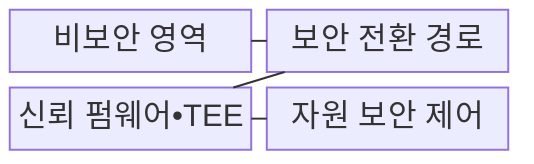
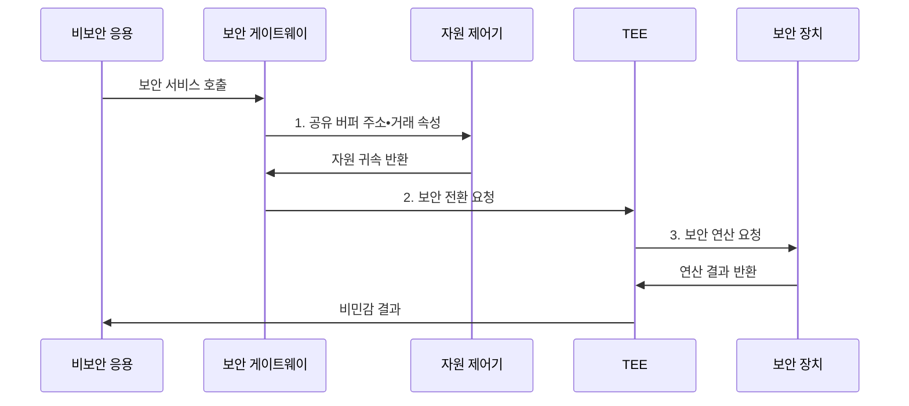

---
sidebar:
  order: 64
  label: "064. Arm TrustZone 보안 확장"
  badge:
    text: "기출 • 50%"
    variant: note
title: "Arm TrustZone 보안 확장"
date: "2026-08-03T09:07:03+09:00"
tags:
  - "notes-hardware"
weight: 64
extra:
  question_no: "064"
  source_status: "기출"
  source_history: "138회"
  priority: 50
  priority_note: "보안 상태•전환•자원 속성 검증"
---

## Ⅰ. 개요

핵심 용어

- **Arm TrustZone**: 하드웨어 보안 상태와 버스 거래 속성을 이용해 실행 환경과 자원을 격리하는 Arm 보안 기술이다.
- **보안 상태(Secure State)**: 승인된 보안 코드가 보안 메모리와 주변장치에 접근할 수 있는 프로세서 실행 상태이다.
- **비보안 상태(Non-secure State)**: 일반 운영체제와 응용이 실행되며 보안 자원 접근이 하드웨어로 차단되는 상태이다.

- 정의/개념: **Arm TrustZone 기반 보안 확장**, 실행 환경과 자원에는 **보안 상태•비보안 상태•거래 속성 기반 격리** 적용
- 배경/필요성: 운영체제(Operating System, OS) 권한 격리만으로는 커널 침해 시 **보안 자산 보호 불가**

#### 한줄 요약

- 일반 영역이 침해되어도 별도 보안 영역의 키를 보호한다.

## Ⅱ. 특징

핵심 용어

- **거래 보안 속성(Transaction Security Attribute)**: 버스 접근이 보안과 비보안 중 어느 상태에서 발생했는지 표시하는 하드웨어 신호이다.
- **자원 보안 속성(Resource Security Attribution)**: 메모리나 주변장치가 보안 또는 비보안 영역에 속하도록 지정한 접근 속성이다.
- **공유 버퍼(Shared Buffer)**: 보안 코드와 비보안 코드가 요청과 결과를 교환하는 비보안 메모리 영역이다.

- **보안•비보안 상태** 분리에 따른 실행 환경 격리
- **거래 보안 속성•자원 보안 속성** 비교에 따른 메모리•장치 접근 통제
- 비보안 입력 제한 수단은 **진입점•공유 버퍼 검증**

#### 한줄 요약

- 비보안 코드는 허용된 입구로만 보안 서비스를 요청한다.

## Ⅲ. 구조 및 구성요소

핵심 용어

- **보안 전환 경로(Secure Transition Path)**: 비보안 호출을 검증하고 프로세서를 보안 상태의 승인된 진입점으로 전환하는 경로이다.
- **신뢰 실행 환경(Trusted Execution Environment, TEE)**: 민감한 코드와 데이터를 일반 실행 환경에서 격리하여 실행하는 보안 환경이다.
- **신뢰 컴퓨팅 기반(Trusted Computing Base, TCB)**: 시스템 보안 보장에 반드시 신뢰해야 하는 최소 하드웨어와 소프트웨어의 집합이다.
- **자원 보안 제어(Resource Security Control)**: 거래 속성과 자원 귀속을 비교하여 메모리와 장치 접근을 허용하거나 차단하는 하드웨어이다.

비보안 영역의 실행 기반: 일반 운영체제(Operating System, OS), 보안 영역의 민감 서비스: **보안 전환 경로•신뢰 실행 환경(Trusted Execution Environment, TEE)**, 격리 검증과 접근 강제: **신뢰 컴퓨팅 기반(Trusted Computing Base, TCB) 최소화•자원 보안 제어**

| 구성요소 | 책임 |
|:---|:---|
| 비보안 영역 | **일반 OS•응용 실행** |
| 보안 전환 경로 | **호출•상태 전환 검증** |
| 신뢰 펌웨어•TEE | **민감 서비스 실행** |
| 자원 보안 제어 | **메모리•장치 접근 판정** |

#### 한줄 요약

- 검증된 입구와 하드웨어 접근 제어가 보안 영역을 보호한다.

## Ⅳ. 흐름도

핵심 용어

- **보안 게이트웨이(Secure Gateway)**: 비보안 코드가 허용된 보안 서비스 진입점으로 전환할 때 거치는 검증된 경계이다.
- **공유 버퍼 검증(Shared-buffer Validation)**: 비보안 코드가 전달한 주소와 길이가 허용된 메모리 범위인지 확인하는 절차이다.
- **보안 연산(Secure Operation)**: 키와 비밀 데이터를 보안 영역 밖으로 노출하지 않고 신뢰 실행 환경(Trusted Execution Environment, TEE)이나 보안 장치에서 수행하는 연산이다.

신뢰 실행 환경(Trusted Execution Environment, TEE)은 검증된 보안 게이트웨이를 통해 요청을 받고, **공유 버퍼 검증** 후 보안 장치의 연산 결과만 반환한다.

**동작 원리**

1. **공유 버퍼 주소•거래 속성**: 주소•길이와 자원의 보안 귀속 검증
2. **보안 전환 요청**: 검증된 게이트를 통한 TEE 문맥 진입
3. **보안 연산 요청**: 보안 장치 내부 키 연산과 비밀 유지

#### 한줄 요약

- TEE 안에서 키를 사용하고 공개 가능한 결과만 돌려준다.

## Ⅴ. 종류 및 비교

핵심 용어

- **운영체제 권한 격리(Operating System Privilege Isolation, OS Privilege Isolation)**: 페이지 테이블과 프로세스 권한으로 일반 응용의 주소 공간과 자원 접근을 분리하는 방식이다.
- **페이지 권한(Page Permission)**: 가상 메모리 페이지별로 읽기와 쓰기 및 실행 가능 여부를 지정하는 운영체제 속성이다.
- **커널 침해(Kernel Compromise)**: 공격자가 운영체제 최고 권한을 얻어 프로세스와 페이지 권한을 우회할 수 있는 상태이다.

| 격리 방식 | Arm TrustZone | 운영체제 권한 격리 |
|:---|:---|:---|
| 적용 기준 | **키•부팅 코드** 보호 | **응용•프로세스** 분리 |
| 핵심 특징 | **상태•버스 속성 격리** | **페이지 권한 격리** |
| 한계 | **진입점•속성** 설정 오류 | **커널 침해** 시 무력화 |

#### 한줄 요약

- 핵심 키는 TrustZone, 일반 응용은 운영체제로 격리한다.

## Ⅵ. 실무 고려사항 및 대책

핵심 용어

- **신뢰 컴퓨팅 기반 최소화(Trusted Computing Base Minimization, TCB 최소화)**: 보안 영역에 필수 서비스만 남겨 검증해야 할 코드와 자원의 범위를 줄이는 원칙이다.
- **경계 취약점(Boundary Vulnerability)**: 보안•비보안 영역 사이의 입력 검증이나 상태 전환 오류로 생기는 보안 결함이다.
- **직접 메모리 접근 보안 속성(Direct Memory Access Security Attribution, DMA 보안 속성)**: 장치의 직접 메모리 접근이 보안 또는 비보안 거래로 처리되도록 지정한 속성이다.
- **문맥•캐시 정리(Context•Cache Sanitization)**: 보안 상태 전환 전에 레지스터와 캐시에 남은 민감 정보를 제거하는 처리이다.

신뢰 실행 환경(Trusted Execution Environment, TEE)과 신뢰 컴퓨팅 기반(Trusted Computing Base, TCB)을 작게 유지하고, 직접 메모리 접근(Direct Memory Access, DMA)을 포함한 경계 입력을 검증한다.

| 문제 | 대책 | 효과 |
|:---|:---|:---|
| TEE 기능 증가로 TCB 검증 범위 확대 | 필수 서비스만 남겨 **TCB 최소화** | **검증 범위** 축소 |
| 공유 버퍼의 주소•길이 검증 누락 | **주소•길이 검증** 후 보안 영역 복사 | **경계 취약점** 방지 |
| DMA 자원 보안 속성 오설정 | **부팅 초기 속성 검증•잠금** | 비보안 **DMA 접근** 차단 |
| 상태 전환 뒤 캐시에 민감 정보 잔존 | **문맥•캐시 정리** | **정보 누출** 방지 |

#### 한줄 요약

- 보안 코드를 줄이고 모든 공유 입력과 장치 속성을 검증한다.

## Ⅶ. 결론

핵심 용어

- **핵심 자산(Critical Asset)**: 암호 키와 부팅 코드처럼 노출이나 변조 시 시스템 보안이 무너지는 데이터와 코드이다.
- **하드웨어 격리(Hardware Isolation)**: 운영체제 권한과 독립된 프로세서 상태 및 버스 제어로 접근 경계를 강제하는 방식이다.
- **최소 권한(Least Privilege)**: 각 보안 서비스에 기능 수행에 필요한 최소 자원과 권한만 부여하는 원칙이다.

- 핵심 자산: **TrustZone 하드웨어 격리**, 검증 범위: **신뢰 컴퓨팅 기반(Trusted Computing Base, TCB) 최소화**, 권한 원칙: **최소 권한**

#### 한줄 요약

- 핵심 키와 최소 코드만 보안 영역에 두고 입구를 검증한다.
