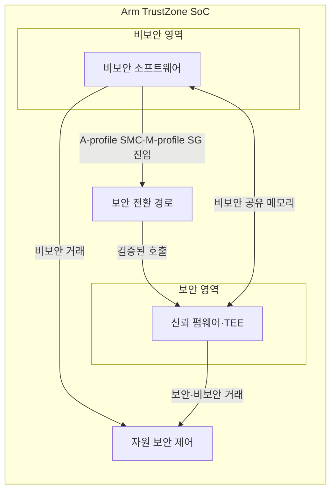
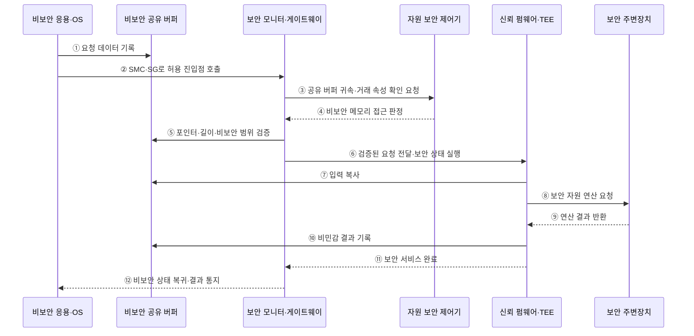

---
sidebar:
  order: 64
  label: "064. Arm TrustZone 보안 확장"
  badge:
    text: "기출 · 50%"
    variant: note
title: "Arm TrustZone 보안 확장"
date: "2026-07-28T13:07:24+09:00"
tags:
  - "notes-hardware"
weight: 64
extra:
  question_no: "064"
  source_status: "기출"
  source_history: "138회"
  priority: 50
  priority_note: "보안 상태·전환·자원 속성 검증"
---

## 미리 알고가기

- **Arm TrustZone**: 하드웨어 보안 상태를 기준으로 실행 환경과 자원을 격리하는 Arm 보안 기술
- **시스템 온 칩(System on Chip, SoC)**: 처리기·메모리 제어기·주변장치를 하나의 칩에 통합한 시스템
- **A-profile·M-profile**: A-profile은 고성능 운영체제용 Arm 구조이고 M-profile은 마이크로컨트롤러용 Arm 구조
- **예외 수준 3(Exception Level 3, EL3)**: Arm A-profile에서 보안·비보안 상태 전환과 보안 모니터 실행을 담당하는 최고 예외 수준
- **보안 상태(Secure State)**: 보안 코드와 자원에 접근 가능한 상태
- **비보안 상태(Non-secure State)**: 보안 자원 접근이 차단된 일반 실행 상태
- **신뢰 컴퓨팅 기반(Trusted Computing Base, TCB)**: 시스템 보안 보장에 반드시 신뢰해야 하는 최소 하드웨어·소프트웨어 구성요소
- **신뢰 실행 환경(Trusted Execution Environment, TEE)**: 민감한 코드와 데이터를 일반 실행 환경에서 격리하여 실행하는 보안 환경
- **보안 모니터 호출(Secure Monitor Call, SMC)**: Arm A-profile에서 EL3 보안 모니터를 호출하여 보안 상태를 전환하는 명령
- **보안 게이트웨이(Secure Gateway, SG)**: Arm M-profile에서 비보안 코드가 허용된 보안 함수로 진입할 때 사용하는 명령
- **자원 보안 속성(Resource Security Attribution)**: 메모리·주변장치의 보안 귀속
- **거래 보안 속성(Transaction Security Attribute)**: 버스 접근이 보안·비보안 중 어느 상태에서 발생했는지 표시하는 하드웨어 신호
- **진입점·포인터(Entry Point·Pointer)**: 진입점은 허용된 보안 서비스 시작 주소이고 포인터는 공유 메모리 위치를 가리키는 값
- **페이지 테이블(Page Table)**: 가상 주소를 물리 주소와 접근 권한에 연결하는 운영체제 자료구조
- **직접 메모리 접근(Direct Memory Access, DMA)**: 프로세서의 데이터 복사 없이 메모리와 장치 사이에서 직접 전송하는 방식
- **공유 버퍼(Shared Buffer)**: 보안·비보안 코드가 공유하는 비보안 메모리
- **검증 부팅(Verified Boot)**: 다음 부트 단계의 서명·해시 검증
- **읽기 전용 메모리(Read-Only Memory, ROM)**: 전원 인가 직후 실행하는 변경 불가능한 초기 부트 코드를 저장하는 메모리

## Ⅰ. 개요

- 정의/개념: 하드웨어 **보안 상태·트랜잭션 속성**으로 자원 격리
- 기존 한계: OS 권한 격리는 **커널 침해 시 보호 경계** 상실

### 쉽게 이해하기 (학습용)

- 일반 실행 환경이 침해되어도 보안 상태·접근 제어기·보안 게이트웨이가 신뢰 실행 환경의 자원을 격리한다

## Ⅱ. 특징

- **보안·비보안 상태**로 실행 환경 분리
- **트랜잭션 보안 속성**으로 메모리·주변장치 접근 통제
- **공유 버퍼·진입점 검증**이 경계 공격 차단

### 쉽게 이해하기 (학습용)

- 보안 상태는 정책에 따라 비보안 자원에 접근할 수 있지만 비보안 상태는 보안 자원에 직접 접근할 수 없다

## Ⅲ. 아키텍처 및 구성요소

### 도표안 A. TrustZone 보안 경계 정적 구조

| 설계 요소 | 입력·상태 | 역할 |
|:---|:---|:---|
| 비보안 소프트웨어 | 일반 OS·응용 요청 | 비신뢰 작업 실행 |
| 보안 전환 경로 | SMC·SG·진입점·인수 | 보안 호출 검증·상태 전환 |
| 신뢰 펌웨어·TEE | 보안 코드·키·서비스 상태 | 최소 신뢰 서비스 실행 |
| 자원 보안 제어 | 거래 속성·자원 귀속 | 메모리·주변장치 접근 판정 |

> 요약: 보안 진입과 거래 속성이 비보안 접근을 차단한다

### 쉽게 이해하기 (학습용)

- 비보안 요청은 보안 게이트웨이와 접근 권한 검사를 통과한 허용 인터페이스로만 보안 서비스에 전달된다

### 도표안 B. 비보안 영역의 보안 서비스 호출 시퀀스

#### 동작 원리

1. **요청 준비**: 비보안 응용·OS가 보안 서비스 입력을 비보안 공유 버퍼에 기록한다.
2. **보안 진입 요청**: A-profile은 SMC, M-profile은 허용된 SG 진입 경로로 보안 서비스를 호출한다.
3. **속성 확인 요청**: 보안 모니터·게이트웨이가 공유 버퍼의 자원 귀속과 거래 보안 속성 판정을 요청한다.
4. **접근 판정**: 자원 보안 제어기가 해당 주소가 비보안 공유 메모리인지 판정한다.
5. **경계 입력 검증**: 진입 경로가 포인터·길이·정렬과 비보안 메모리 범위를 검증한다.
6. **보안 서비스 실행**: 검증된 요청만 신뢰 펌웨어·TEE에 전달해 보안 상태에서 실행한다.
7. **입력 복사**: 신뢰 서비스가 재검증된 입력을 자신의 보안 메모리로 복사해 검사 후 사용한다.
8. **보안 연산 요청**: TEE가 키 저장소 등 보안 주변장치에 필요한 연산을 요청한다.
9. **결과 반환**: 보안 주변장치가 키 자체가 아닌 연산 결과를 TEE에 반환한다.
10. **공개 결과 기록**: TEE가 비민감 결과만 비보안 공유 버퍼에 기록한다.
11. **서비스 완료**: TEE가 민감한 임시 상태를 정리하고 보안 진입 경로에 완료를 알린다.
12. **비보안 복귀**: 보안 모니터·게이트웨이가 비보안 상태로 복귀해 호출자에게 결과를 알린다.

### 쉽게 이해하기 (학습용)

- 일반 영역은 열쇠를 직접 받지 않고, 검증된 창구를 통해 보안 영역 안에서 서명만 수행한 뒤 결과만 받는다.

## Ⅳ. 종류 및 비교

| 보안 격리 방식 | Arm TrustZone | 운영체제 권한 격리 |
|:---|:---|:---|
| 적용 기준 | 키·부팅 코드·**암호 서비스 격리** | 응용·프로세스 간 **권한 분리** |
| 핵심 특징 | 처리기 상태·**버스 속성 격리** | 커널 권한·**페이지 테이블 격리** |
| 한계 | 진입점·속성·**공유 메모리 오류** | 커널 침해 시 **격리 무력화** |

> 요약: 키·부팅은 TrustZone, 응용은 운영체제로 격리한다

### 쉽게 이해하기 (학습용)

- 일반 운영체제가 침해되어 페이지 권한이 변경되어도 보안 상태 기반 접근 제어기가 보안 메모리 접근을 차단한다

## Ⅴ. 실무 고려사항 및 대응 방안

| 운영 위험 | 대응 | 기대 효과 |
|:---|:---|:---|
| 보안 영역 기능 증가로 TCB·공격면 확대 | 키·부팅·필수 암호 서비스만 남기고 코드 최소화 | 검증 범위 축소 |
| 공유 버퍼 포인터·길이 검증 누락 | 비보안 메모리 범위·정렬·중복 접근을 호출마다 검증 | 경계 취약점 방지 |
| DMA·주변장치 보안 속성 오설정 | 부팅·복귀 후 속성 잠금과 비보안 침투 시험 | 우회 접근 차단 |
| 상태 전환 시 레지스터·캐시의 비밀 잔존 | 문맥 정리·캐시 관리와 반환값 최소화 | 교차 상태 정보 누출 방지 |

### 쉽게 이해하기 (학습용)

- 건물을 열 때 출입 구역을 잠그고 접수된 요청의 신분과 서류를 확인한다

### 적용 사례

- 기기 키 저장소는 개인키를 비보안 영역에 반환하지 않고 TEE 내부에서 서명한 결과만 공유 버퍼로 전달한다.

### 쉽게 이해하기 (학습용)

- 암호키를 신뢰 실행 환경 밖으로 노출하지 않고 보안 영역 내부에서 서명 연산만 수행한다

## Ⅵ. 결론

- 보안 자산을 일반 실행환경의 침해에서 격리하기 위해 **보호 자산·Secure World 경계·공유 메모리·호출 진입점**을 검토하고, 키와 부팅 코드는 TrustZone에 두며 모든 경계 입력을 검증한다

### 쉽게 이해하기 (학습용)

- 신뢰 실행 환경에는 핵심 키와 최소 보안 코드만 두고 호출 인터페이스와 메모리 접근 권한을 검증한다
