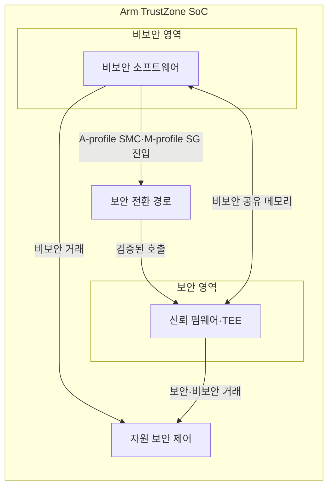
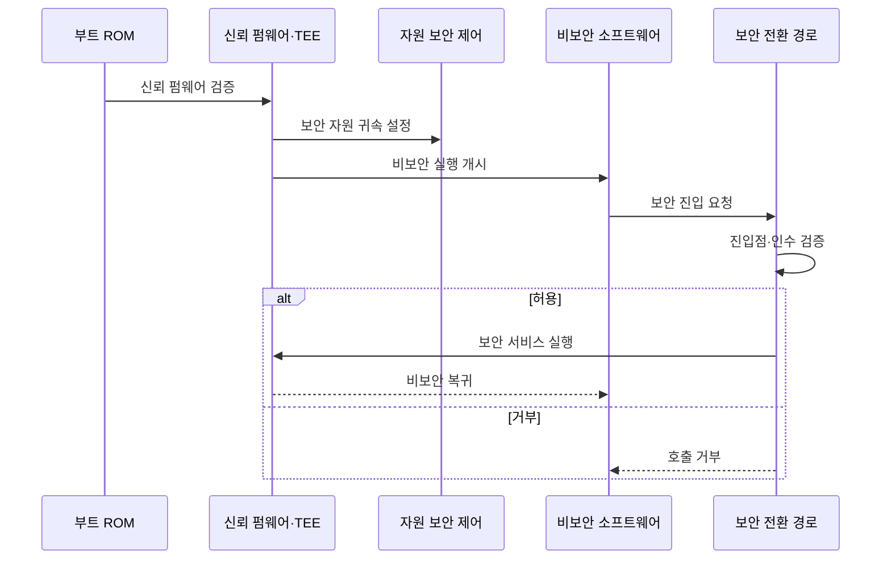

---
sidebar:
  order: 64
  label: "064. Arm TrustZone 보안 확장"
  badge:
    text: "기출 · 50%"
    variant: note
title: "Arm TrustZone 보안 확장"
date: "2026-07-27T23:59:59+09:00"
tags:
  - "notes-hardware"
weight: 64
extra:
  question_no: "064"
  source_status: "기출"
  source_history: "138회"
  priority: 50
  priority_note: "보안 상태·전환·자원 속성 검증"
---

## 미리 알고가기

- **Arm TrustZone**: ‘암 트러스트존’으로 읽는 Arm 보안 기술명이며, 하드웨어 보안 상태로 실행·자원을 격리
- **시스템 온 칩(System on Chip, SoC)**: ‘에스오씨’로 읽고 영문 핵심 글자를 딴 약어이며, 처리기·메모리·주변장치를 한 칩에 통합
- **A-profile·M-profile**: A-profile은 고성능 운영체제용 Arm 구조이고 M-profile은 마이크로컨트롤러용 Arm 구조
- **예외 수준 3(Exception Level 3, EL3)**: ‘이엘 쓰리’로 읽고 Exception Level의 머리글자와 단계 번호를 결합했으며, A-profile의 보안 상태 전환을 담당
- **보안 상태(Secure State)**: 보안 코드와 자원에 접근 가능한 상태
- **비보안 상태(Non-secure State)**: 보안 자원 접근이 차단된 일반 실행 상태
- **신뢰 컴퓨팅 기반(Trusted Computing Base, TCB)**: ‘티시비’로 읽고 영문 머리글자를 딴 약어이며, 보안에 필수인 최소 신뢰 요소
- **신뢰 실행 환경(Trusted Execution Environment, TEE)**: ‘티이이’로 읽고 영문 머리글자를 딴 약어이며, 보안 서비스를 격리 실행
- **보안 모니터 호출(Secure Monitor Call, SMC)**: ‘에스엠시’로 읽고 영문 머리글자를 딴 약어이며, A-profile의 EL3 보안 모니터를 호출
- **보안 게이트웨이(Secure Gateway, SG)**: ‘에스지’로 읽고 영문 머리글자를 딴 약어이며, M-profile 비보안 호출을 보안 영역으로 진입
- **자원 보안 속성(Resource Security Attribution)**: 메모리·주변장치의 보안 귀속
- **거래 보안 속성(Transaction Security Attribute)**: 버스 접근이 보안·비보안 중 어느 상태에서 발생했는지 표시하는 하드웨어 신호
- **진입점·포인터(Entry Point·Pointer)**: 진입점은 허용된 보안 서비스 시작 주소이고 포인터는 공유 메모리 위치를 가리키는 값
- **페이지 테이블(Page Table)**: 가상 주소를 물리 주소와 접근 권한에 연결하는 운영체제 자료구조
- **직접 메모리 접근(Direct Memory Access, DMA)**: ‘디엠에이’로 읽고 영문 머리글자를 딴 약어이며, 처리기 개입 없이 메모리·장치 사이를 전송
- **공유 버퍼(Shared Buffer)**: 보안·비보안 코드가 공유하는 비보안 메모리
- **검증 부팅(Verified Boot)**: 다음 부트 단계의 서명·해시 검증
- **읽기 전용 메모리(Read-Only Memory, ROM)**: ‘롬’으로 읽고 영문 머리글자를 단어처럼 만든 약어이며, 초기 부트 코드를 저장

## Ⅰ. 개요

- 정의/개념: 하드웨어 **보안 상태·트랜잭션 속성**으로 자원 격리
- 기존 한계: OS 권한 격리는 **커널 침해 시 보호 경계** 상실

### 쉽게 이해하기 (학습용)

- 로비가 침입당해도 출입 카드와 접수 창구가 금고실을 지킨다

## Ⅱ. 특징

- **보안·비보안 상태**로 실행 환경 분리
- **트랜잭션 보안 속성**으로 메모리·주변장치 접근 통제
- **공유 버퍼·진입점 검증**이 경계 공격 차단

### 쉽게 이해하기 (학습용)

- 금고 담당자는 로비에도 갈 수 있지만 로비 손님은 금고실에 들어갈 수 없다

## Ⅲ. 아키텍처 및 구성요소

| 설계 요소 | 설명 |
|:---|:---|
| 비보안 소프트웨어 | 일반 운영체제·응용 실행 |
| 보안 전환 경로 | A-profile SMC·M-profile SG 보안 진입 |
| 신뢰 펌웨어·TEE | 보안 상태에서 최소 신뢰 서비스 실행 |
| 자원 보안 제어 | 거래 속성으로 메모리·주변장치 접근 판정 |

> 요약: 보안 진입과 거래 속성이 비보안 접근을 차단한다

### 쉽게 이해하기 (학습용)

- 로비 요청은 접수 창구와 출입 카드 검사를 거쳐 금고 업무로 간다

## Ⅳ. 원리 및 절차 흐름도

| 절차 | 설명 |
|:---|:---|
| 신뢰 펌웨어 검증 | ROM이 펌웨어 서명 검증 뒤 제어권 전달 |
| 보안 자원 귀속 설정 | 메모리·주변장치·DMA 접근 속성 설정 |
| 비보안 실행 개시 | 경계 설정 뒤 일반 운영체제·응용 실행 |
| 보안 진입 요청 | A-profile SMC·M-profile SG 진입점 호출 |
| 진입점·인수 검증 | 허용된 진입점과 비보안 포인터 검사 |
| 보안 서비스 실행 | 검증된 요청만 최소 TCB에서 처리 |
| 비보안 복귀 | 비밀 제외 결과와 제어권 반환 |
| 호출 거부 | 진입점·인수 오류 시 보안 진입 차단 |

> 요약: 자원 경계 뒤 검증된 호출만 TCB에서 실행한다

### 쉽게 이해하기 (학습용)

- 건물을 열 때 출입 구역을 잠그고 접수된 요청의 신분과 서류를 확인한다

## Ⅴ. 종류 및 비교

| 보안 격리 방식 | Arm TrustZone | 운영체제 권한 격리 |
|:---|:---|:---|
| 적용 기준 | 키·부팅 코드·**암호 서비스 격리** | 응용·프로세스 간 **권한 분리** |
| 핵심 특징 | 처리기 상태·**버스 속성 격리** | 커널 권한·**페이지 테이블 격리** |
| 한계 | 진입점·속성·**공유 메모리 오류** | 커널 침해 시 **격리 무력화** |

> 요약: 키·부팅은 TrustZone, 응용은 운영체제로 격리한다

### 쉽게 이해하기 (학습용)

- 건물 관리자가 침해되면 일반 출입 명단은 바뀌지만 금고실 출입 카드는 별도 장치가 검사한다

## Ⅵ. 실무 사례

1. 기기 키 저장소는 **TEE 내부 서명** 후 키 미반환

### 쉽게 이해하기 (학습용)

- 금고 열쇠를 밖으로 주지 않고 금고실 안에서 서명만 처리한다

## Ⅶ. 결론

- 키·부팅 코드는 **TrustZone 격리**, 호출은 **진입점 검증**

### 쉽게 이해하기 (학습용)

- 금고에는 핵심 열쇠만 두고 접수 창구와 출입 카드를 검사한다
