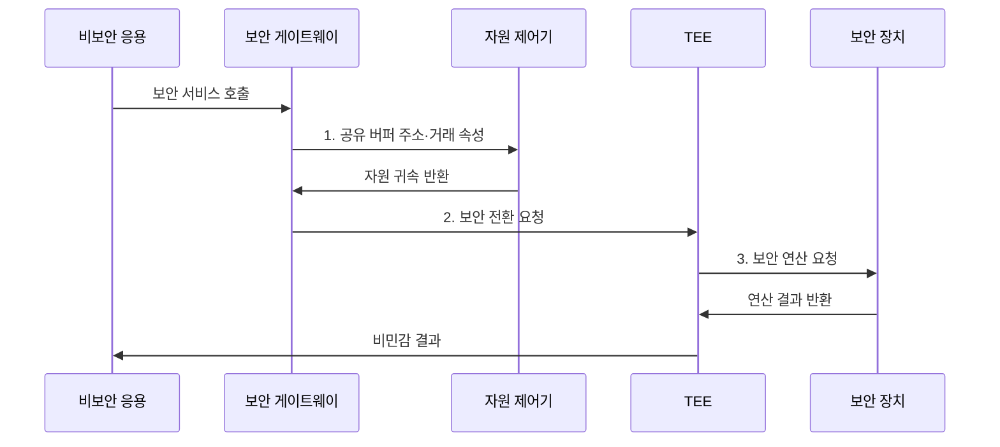

---
sidebar:
  order: 64
  label: "064. Arm TrustZone 보안 확장"
  badge:
    text: "기출 · 50%"
    variant: note
title: "Arm TrustZone 보안 확장"
date: "2026-07-30T21:20:41+09:00"
tags:
  - "notes-hardware"
weight: 64
extra:
  question_no: "064"
  source_status: "기출"
  source_history: "138회"
  priority: 50
  priority_note: "보안 상태·전환·자원 속성 검증"
---

## 미리 알고가기

- **Arm TrustZone**: 하드웨어 보안 상태를 기준으로 실행 환경과 자원을 격리하는 Arm 보안 기술
- **시스템 온 칩(System on Chip, SoC)**: 처리기·메모리 제어기·주변장치를 하나의 칩에 통합한 시스템
- **A-profile·M-profile**: A-profile은 고성능 운영체제용 Arm 구조이고 M-profile은 마이크로컨트롤러용 Arm 구조
- **예외 수준 3(Exception Level 3, EL3)**: Arm A-profile에서 보안·비보안 상태 전환과 보안 모니터 실행을 담당하는 최고 예외 수준
- **보안 상태(Secure State)**: 보안 코드와 자원에 접근 가능한 상태
- **비보안 상태(Non-secure State)**: 보안 자원 접근이 차단된 일반 실행 상태
- **신뢰 컴퓨팅 기반(Trusted Computing Base, TCB)**: 시스템 보안 보장에 반드시 신뢰해야 하는 최소 하드웨어·소프트웨어 구성요소
- **신뢰 실행 환경(Trusted Execution Environment, TEE)**: 민감한 코드와 데이터를 일반 실행 환경에서 격리하여 실행하는 보안 환경
- **보안 모니터 호출(Secure Monitor Call, SMC)**: Arm A-profile에서 EL3 보안 모니터를 호출하여 보안 상태를 전환하는 명령
- **보안 게이트웨이(Secure Gateway, SG)**: Arm M-profile에서 비보안 코드가 허용된 보안 함수로 진입할 때 사용하는 명령
- **자원 보안 속성(Resource Security Attribution)**: 메모리·주변장치의 보안 귀속
- **거래 보안 속성(Transaction Security Attribute)**: 버스 접근이 보안·비보안 중 어느 상태에서 발생했는지 표시하는 하드웨어 신호
- **진입점·포인터(Entry Point·Pointer)**: 진입점은 허용된 보안 서비스 시작 주소이고 포인터는 공유 메모리 위치를 가리키는 값
- **페이지 테이블(Page Table)**: 가상 주소를 물리 주소와 접근 권한에 연결하는 운영체제 자료구조
- **직접 메모리 접근(Direct Memory Access, DMA)**: 프로세서의 데이터 복사 없이 메모리와 장치 사이에서 직접 전송하는 방식
- **공유 버퍼(Shared Buffer)**: 보안·비보안 코드가 공유하는 비보안 메모리
- **검증 부팅(Verified Boot)**: 다음 부트 단계의 서명·해시 검증
- **읽기 전용 메모리(Read-Only Memory, ROM)**: 전원 인가 직후 실행하는 변경 불가능한 초기 부트 코드를 저장하는 메모리
- **캐시(Cache)**: 자주 쓰는 데이터와 명령을 프로세서 가까이에 보관하는 고속 메모리

## Ⅰ. 개요

- 정의/개념: **보안 상태·거래 속성**으로 실행 환경과 자원을 격리하는 Arm 보안 확장
- 배경/필요성: OS 권한 격리만으로는 커널 침해 시 **보안 자산 보호 불가**

### 쉽게 이해하기 (학습용)

- 일반 영역이 침해되어도 별도 보안 영역의 키를 보호한다.

## Ⅱ. 특징

- **보안·비보안 상태** 분리에 따른 실행 환경 격리
- **거래 보안 속성** 전파에 따른 메모리·장치 접근 통제
- **진입점·공유 버퍼 검증**에 따른 경계 공격 차단

### 쉽게 이해하기 (학습용)

- 비보안 코드는 허용된 입구로만 보안 서비스를 요청한다.

## Ⅲ. 구조 및 구성요소

| 구성요소 | 책임 |
|:---|:---|
| 비보안 영역 | **일반 OS·응용 실행** |
| 보안 전환 경로 | **호출·상태 전환 검증** |
| 신뢰 펌웨어·TEE | **민감 서비스 실행** |
| 자원 보안 제어 | **메모리·장치 접근 판정** |

### 쉽게 이해하기 (학습용)

- 검증된 입구와 하드웨어 접근 제어가 보안 영역을 보호한다.

## Ⅳ. 흐름도

**동작 원리**

- **1. 공유 버퍼 주소·거래 속성**: 주소·길이와 자원의 보안 귀속 검증
- **2. 보안 전환 요청**: 검증된 게이트를 통해 TEE 문맥으로 진입
- **3. 보안 연산 요청**: 보안 장치 내부 키로 연산하고 비밀 유지

### 쉽게 이해하기 (학습용)

- TEE 안에서 키를 사용하고 공개 가능한 결과만 돌려준다.

## Ⅴ. 종류 및 비교

| 격리 방식 | Arm TrustZone | 운영체제 권한 격리 |
|:---|:---|:---|
| 적용 기준 | **키·부팅 코드** 보호 | **응용·프로세스** 분리 |
| 핵심 특징 | **상태·버스 속성 격리** | **페이지 권한 격리** |
| 한계 | **진입점·속성** 설정 오류 | **커널 침해** 시 무력화 |

### 쉽게 이해하기 (학습용)

- 핵심 키는 TrustZone, 일반 응용은 운영체제로 격리한다.

## Ⅵ. 실무 고려사항 및 대책

| 고려사항 | 대책 | 효과 |
|:---|:---|:---|
| TEE 기능 증가로 TCB 검증 범위 확대 | 필수 서비스만 남겨 **TCB 최소화** | **검증 범위** 축소 |
| 공유 버퍼의 주소·길이 검증 누락 | **주소·길이 검증** 후 보안 영역 복사 | **경계 취약점** 방지 |
| DMA 자원 보안 속성 오설정 | **부팅 초기 속성 검증·잠금** | **우회 접근** 차단 |
| 상태 전환 뒤 캐시에 민감 정보 잔존 | **문맥·캐시 정리** | **정보 누출** 방지 |

### 쉽게 이해하기 (학습용)

- 보안 코드를 줄이고 모든 공유 입력과 장치 속성을 검증한다.

## Ⅶ. 결론

- 보호 자산·호출 경계에 따라 **TrustZone·TCB** 최소화

### 쉽게 이해하기 (학습용)

- 핵심 키와 최소 코드만 보안 영역에 두고 입구를 검증한다.
