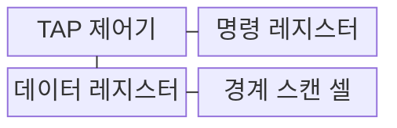
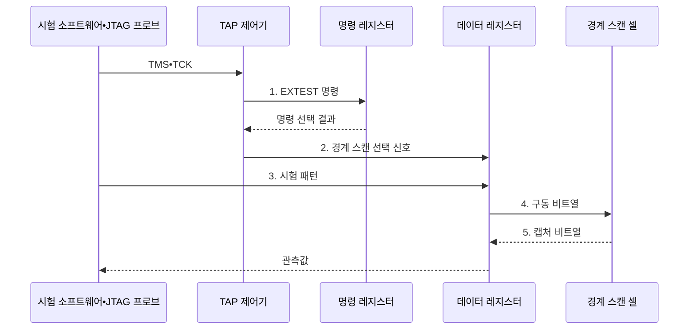

---
sidebar:
  order: 65
  label: "065. JTAG 디버깅 인터페이스 (JTAG)"
  badge:
    text: "기출 • 30%"
    variant: note
title: "JTAG 디버깅 인터페이스 (JTAG)"
date: "2026-08-03T08:48:47+09:00"
tags:
  - "notes-hardware"
weight: 65
extra:
  question_no: "065"
  source_status: "기출"
  source_history: "126회"
  priority: 30
  priority_note: "양산 연결 검사•출하 후 포트 통제"
---

## Ⅰ. 개요

핵심 용어

- **공동 시험 동작 그룹(Joint Test Action Group, JTAG) 인터페이스**: 경계 스캔과 칩 디버깅에 사용하는 국제전기전자공학회(Institute of Electrical and Electronics Engineers, IEEE) 1149.1 기반 직렬 시험 인터페이스이다.
- **테스트 접근 포트(Test Access Port, TAP)**: 시험 명령과 데이터를 직렬로 전송하고 상태 머신을 제어하는 JTAG 포트이다.
- **경계 스캔(Boundary Scan)**: 집적회로(Integrated Circuit, IC) 핀 주위의 셀을 직렬 체인으로 연결하여 핀 값을 구동하고 관찰하는 시험 방식이다.

- 정의/개념: 집적회로(Integrated Circuit, IC)와 인쇄회로기판(Printed Circuit Board, PCB) 연결 검사에는 **국제전기전자공학회(Institute of Electrical and Electronics Engineers, IEEE) 1149.1의 테스트 접근 포트(Test Access Port, TAP)•경계 스캔 활용**, 구현 방식은 공동 시험 동작 그룹(Joint Test Action Group, JTAG) 직렬 인터페이스
- 배경/필요성: 물리 탐침으로는 패키지 내부 **핀•배선 관측 불가**

#### 한줄 요약

- 기기를 뜯지 않고 칩 가장자리 핀과 보드 배선을 만지는 공용 점검구와 같다.

## Ⅱ. 특징

핵심 용어

- **직렬 스캔 체인(Serial Scan Chain)**: 여러 집적회로(Integrated Circuit, IC)의 시험 레지스터를 테스트 데이터 입력(Test Data In, TDI)과 테스트 데이터 출력(Test Data Out, TDO)으로 한 줄에 연결하여 순차 접근하는 구조이다.
- **경계 스캔 셀(Boundary-scan Cell)**: 코어 실행과 독립적으로 IC 핀의 입력을 캡처하거나 출력을 구동하는 시험 셀이다.
- **중앙처리장치 디버그(Central Processing Unit Debug, CPU Debug)**: 프로세서 구현이 별도로 제공하는 코어 정지와 레지스터•메모리 접근 기능이다.

- 다중 집적회로(Integrated Circuit, IC)의 단일 포트 검사는 **직렬 스캔 체인** 활용
- 코어 실행 없는 핀 구동•관찰에는 **경계 스캔 셀** 활용
- 별도 확인 대상은 표준 경계 스캔과 **중앙처리장치(Central Processing Unit, CPU) 디버그 구현**

#### 한줄 요약

- 여러 칩의 점검구를 한 줄로 이어 배선을 검사하며, 내부 디버그 기능은 칩마다 다르다.

## Ⅲ. 구조 및 구성요소

핵심 용어

- **테스트 접근 포트 제어기(Test Access Port Controller, TAP 제어기)**: 테스트 모드 선택(Test Mode Select, TMS) 입력과 테스트 클록(Test Clock, TCK)에 따라 명령•데이터 캡처, 이동 및 적용 상태를 전환하는 상태 머신이다.
- **명령 레지스터(Instruction Register, IR)**: 현재 실행할 공동 시험 동작 그룹(Joint Test Action Group, JTAG) 시험 명령을 직렬로 받아 저장하는 레지스터이다.
- **데이터 레지스터(Data Register, DR)**: 경계 스캔과 식별 코드(Identification Code, IDCODE) 및 우회(BYPASS) 같은 시험 데이터를 직렬 이동하는 레지스터이다.
- **테스트 데이터 입력•출력(Test Data In•Test Data Out, TDI•TDO)**: 선택된 JTAG 레지스터에 시험 비트를 직렬 입력하고 관측 비트를 직렬 출력하는 신호이다.

테스트 접근 포트(Test Access Port, TAP) 제어기는 테스트 모드 선택(Test Mode Select, TMS)과 테스트 클록(Test Clock, TCK)에 따라 명령 레지스터(Instruction Register, IR)와 데이터 레지스터(Data Register, DR)를 전환한다. 테스트 데이터 입력(Test Data In, TDI)과 테스트 데이터 출력(Test Data Out, TDO)은 공동 시험 동작 그룹(Joint Test Action Group, JTAG) 데이터를 직렬로 이동한다.

| 구성요소 | 책임 |
|:---|:---|
| TAP 제어기 | **IR•DR 상태 전이** |
| 명령 레지스터 | **시험 명령 선택** |
| 데이터 레지스터 | **시험 데이터 이동** |
| 경계 스캔 셀 | **핀 캡처•구동** |

#### 한줄 요약

- TAP가 명령과 데이터 경로를 골라 칩 핀을 읽고 구동한다.

## Ⅳ. 흐름도

핵심 용어

- **외부 시험(External Test, EXTEST)**: 경계 스캔 셀을 구동하고 관측하여 인쇄회로기판(Printed Circuit Board, PCB)의 집적회로(Integrated Circuit, IC) 사이 외부 연결을 검사하는 공동 시험 동작 그룹(Joint Test Action Group, JTAG) 명령이다.
- **시험 패턴(Test Pattern)**: 특정 핀 연결의 단선과 단락을 검출하도록 경계 셀에 적재하는 구동 비트열이다.
- **캡처 비트열(Captured Bitstream)**: 시험 패턴 전송 후 수신 측 경계 셀이 관찰하여 저장한 입력 값의 직렬 데이터이다.

공동 시험 동작 그룹(Joint Test Action Group, JTAG) 프로브는 테스트 모드 선택(Test Mode Select, TMS)과 테스트 클록(Test Clock, TCK)으로 외부 시험(External Test, EXTEST)을 지정하고, 인쇄회로기판(Printed Circuit Board, PCB)의 집적회로(Integrated Circuit, IC) 연결을 검사한다.

**동작 원리**

1. **EXTEST 명령**: 외부 연결 시험을 명령 레지스터에 지정
2. **경계 스캔 선택 신호**: 데이터 레지스터를 경계 셀 체인에 연결
3. **시험 패턴**: 데이터 레지스터에 핀 구동값 적재
4. **구동 비트열**: 경계 셀에서 PCB 연결망으로 출력
5. **캡처 비트열**: 반대편 경계 셀의 입력값 저장

#### 한줄 요약

- 한 IC의 경계 셀이 패턴을 구동하고 다른 IC의 경계 셀이 받은 값을 읽어 납땜 연결을 검사한다.

## Ⅴ. 종류 및 비교

핵심 용어

- **직렬 와이어 디버그(Serial Wire Debug, SWD)**: Arm 프로세서의 코어와 메모리를 제어하는 2선 패킷 디버그 인터페이스이다.
- **범용 비동기 송수신기(Universal Asynchronous Receiver-transmitter, UART)**: 로그와 콘솔 데이터를 비동기 직렬 방식으로 송수신하는 장치이다.
- **디버그 공격면(Debug Attack Surface)**: 시험 인터페이스를 통해 내부 메모리와 제어 기능에 비인가 접근할 수 있는 위험 범위이다.

공동 시험 동작 그룹(Joint Test Action Group, JTAG)은 인쇄회로기판(Printed Circuit Board, PCB)의 다중 집적회로(Integrated Circuit, IC) 연결을 검사하고, 직렬 와이어 디버그(Serial Wire Debug, SWD)는 Arm 코어를 제어하며, 범용 비동기 송수신기(Universal Asynchronous Receiver-transmitter, UART)는 로그를 전달한다.
세 인터페이스의 운영 단계 필수 항목: **디버그 공격면 통제**

| 디버그•시험 인터페이스 | JTAG | SWD | UART |
|:---|:---|:---|:---|
| 적용 기준 | PCB 연결•**다중 IC 시험** | 적은 핀의 **Arm 디버그** | 단순 로그•**명령 채널** |
| 핵심 특징 | 직렬 경계 스캔•**다중 IC** | 2선 **코어•메모리 디버그** | 비동기 **로그•콘솔** |
| 한계 | 시험•디버그 **경로 노출** | 코어•메모리 **접근 노출** | 콘솔 명령•**정보 노출** |

#### 한줄 요약

- JTAG는 배선 점검구, SWD는 Arm 정비구, UART는 로그 창구에 가깝다.

## Ⅵ. 실무 고려사항 및 대책

핵심 용어

- **디버그 인증•잠금(Debug Authentication•Lock)**: 허가된 정비 주체만 포트를 열고 운영 중에는 디버그 접근을 차단하는 통제이다.
- **시간 제한 서비스 모드(Time-limited Service Mode)**: 승인된 정비 시간에만 접근을 허용하고 만료 후 자동으로 잠그는 모드이다.
- **식별 코드•우회(Identification Code•Bypass, IDCODE•BYPASS)**: IDCODE는 체인 장치를 식별하고 BYPASS는 시험하지 않는 집적회로(Integrated Circuit, IC)를 1비트 레지스터로 통과시키는 명령이다.
- **안전 핀 마스크(Safe Pin Mask)**: 외부 시험(External Test, EXTEST) 중 구동하면 위험한 출력 핀을 시험 패턴 대상에서 제외하는 설정이다.

테스트 접근 포트(Test Access Port, TAP)는 식별 코드(Identification Code, IDCODE)와 우회(BYPASS) 명령으로 집적회로(Integrated Circuit, IC) 체인을 확인한다. 외부 시험(External Test, EXTEST)과 공동 시험 동작 그룹(Joint Test Action Group, JTAG) 접근은 출하 후 인증 정책으로 제한한다.

| 문제 | 대책 | 효과 |
|:---|:---|:---|
| 출하 장치에서 TAP 포트 노출 | **디버그 인증•운영 모드 잠금** | **디버그 공격면** 축소 |
| 영구 잠금으로 장애 분석 불가 | **시간 제한 서비스 모드** | **보안•정비성** 균형 |
| IC 체인 순서 불일치로 대상 오인 | **IDCODE•BYPASS 검증** | **시험 대상 식별** 정확도 향상 |
| EXTEST 구동 핀 충돌로 보드 손상 | **안전 핀 마스크** 적용 | **보드 손상** 방지 |

#### 한줄 요약

- 생산 단계에는 EXTEST를 사용하고 출하 후에는 인증된 서비스 모드 외 JTAG 접근을 잠근다.

## Ⅶ. 결론

핵심 용어

- **생산 시험(Production Test)**: 조립된 인쇄회로기판(Printed Circuit Board, PCB)의 납땜과 집적회로(Integrated Circuit, IC) 사이 연결을 출하 전에 자동 검사하는 공정이다.
- **출하 후 통제(Post-deployment Control)**: 고객 환경에 배포된 장치의 디버그 접근을 인증과 잠금 정책으로 제한하는 운영이다.
- **정비성(Serviceability)**: 장애 분석과 수리를 위해 승인된 절차로 필요한 진단 기능을 사용할 수 있는 성질이다.

- 인쇄회로기판(Printed Circuit Board, PCB)과 집적회로(Integrated Circuit, IC)의 생산 단계: **생산 시험•외부 시험(External Test, EXTEST) 사용**, 운영 단계: **출하 후 통제•공동 시험 동작 그룹(Joint Test Action Group, JTAG) 인증•잠금**, 유지보수 목표: **정비성 확보**

#### 한줄 요약

- 공장에서는 점검구를 쓰되 고객에게 나갈 때는 인증 자물쇠를 채우는 셈이다.
