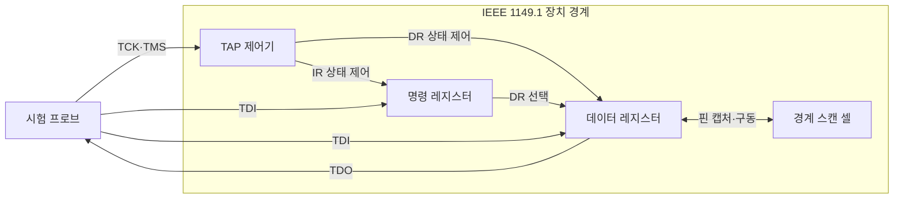
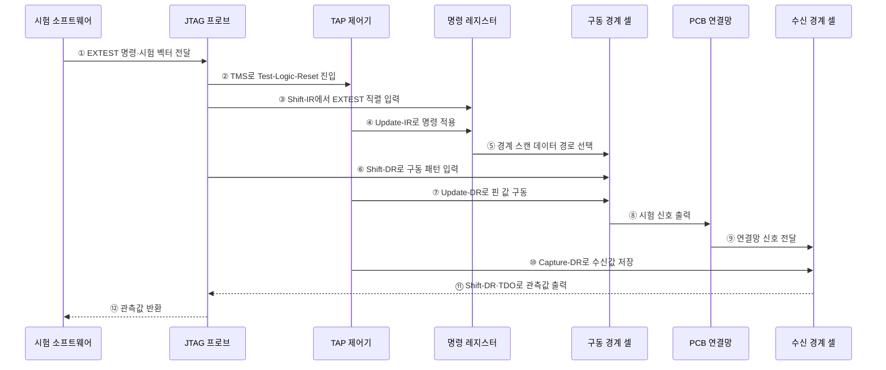

---
sidebar:
  order: 65
  label: "065. JTAG 디버깅 인터페이스 (JTAG)"
  badge:
    text: "기출 · 30%"
    variant: note
title: "JTAG 디버깅 인터페이스 (JTAG)"
date: "2026-07-28T13:07:47+09:00"
tags:
  - "notes-hardware"
weight: 65
extra:
  question_no: "065"
  source_status: "기출"
  source_history: "126회"
  priority: 30
  priority_note: "양산 연결 검사·출하 후 포트 통제"
---

## 미리 알고가기

- **합동 테스트 액션 그룹(Joint Test Action Group, JTAG)**: 경계 스캔과 칩 디버깅에 사용하는 IEEE 1149.1 직렬 시험 인터페이스
- **집적회로(Integrated Circuit, IC)·인쇄회로기판(Printed Circuit Board, PCB)**: IC는 반도체 회로 부품이고 PCB는 여러 IC를 장착하고 전기적으로 연결하는 기판
- **중앙처리장치(Central Processing Unit, CPU)**: 명령어를 실행하고 시스템의 연산·제어를 담당하는 처리장치
- **전기전자공학자협회 1149.1(Institute of Electrical and Electronics Engineers 1149.1, IEEE 1149.1)**: 테스트 접근 포트와 경계 스캔 절차를 정의한 JTAG 인터페이스 표준
- **테스트 접근 포트(Test Access Port, TAP)**: 시험 명령과 데이터를 직렬 전송하고 상태 머신을 제어하는 JTAG 포트
- **테스트 클록(Test Clock, TCK)·테스트 모드 선택(Test Mode Select, TMS)**: TCK는 시험 동작을 동기화하고 TMS는 TAP 상태 전이를 선택하는 JTAG 신호
- **테스트 데이터 입력(Test Data In, TDI)·출력(Test Data Out, TDO)**: 선택된 JTAG 레지스터의 시험 데이터를 직렬 입력·출력하는 신호
- **명령 레지스터(Instruction Register, IR)**: 현재 실행할 JTAG 시험 명령을 저장하는 레지스터
- **데이터 레지스터(Data Register, DR)**: 경계 스캔·바이패스 등의 시험 데이터를 직렬 이동하는 레지스터
- **TAP 상태(Test-Logic-Reset·Shift-IR·Update-IR·Shift-DR·Update-DR·Capture-DR)**: Test-Logic-Reset은 제어기를 초기화하고 Shift는 직렬 이동, Update는 적용, Capture는 입력 저장을 뜻하며 IR·DR의 명령·데이터 이동 순서를 제어
- **경계 스캔 레지스터(Boundary-Scan Register)**: IC 핀 값을 캡처·구동하는 경계 셀 체인
- **외부 검사(External Test, EXTEST)**: 경계 스캔 셀을 구동·관측하여 PCB의 IC 간 연결을 검사하는 JTAG 명령
- **우회(Bypass, BYPASS)**: 시험 대상이 아닌 IC를 1비트 우회 레지스터로 통과시키는 JTAG 명령
- **직렬 와이어 디버그(Serial Wire Debug, SWD)**: Arm 프로세서의 메모리·레지스터를 제어하는 2선 패킷 디버그 인터페이스
- **범용 비동기 송수신기(Universal Asynchronous Receiver-Transmitter, UART)**: 로그·콘솔 데이터를 비동기 직렬 방식으로 송수신하는 장치

## Ⅰ. 개요

- 정의/개념: TAP로 **IC 내부·PCB 연결**을 검사하는 직렬 포트
- 기존 한계: 고밀도 기판은 탐침으로 **내부 핀·배선 접근** 곤란

### 쉽게 이해하기 (학습용)

- 기기를 뜯지 않고 칩 가장자리 핀과 보드 배선을 만지는 공용 점검구와 같다.

## Ⅱ. 특징

- **직렬 스캔 체인**으로 다중 IC를 한 포트에서 검사
- **경계 스캔 셀**로 코어 실행 없이 핀 구동·관찰
- 표준 경계 스캔과 **CPU 디버그 구현**은 별도 확인

### 쉽게 이해하기 (학습용)

- 여러 칩의 점검구를 한 줄로 이어 배선을 검사하며, 내부 디버그 기능은 칩마다 다르다.

## Ⅲ. 아키텍처 및 구성요소

### 도표안 A. JTAG 경계 스캔 정적 구조

| 설계 요소 | 입력·상태 | 역할 |
|:---|:---|:---|
| TAP 제어기 | TCK·TMS·현재 상태 | IR·DR 상태 전이 제어 |
| 명령 레지스터 | TDI 명령·현재 명령 | EXTEST·BYPASS 등 DR 선택 |
| 데이터 레지스터 | TDI 데이터·선택 경로 | 시험 데이터 직렬 이동 |
| 경계 스캔 셀 | 핀 입력·시험 출력 | IC 핀 캡처·구동 |

> 요약: TAP 제어기가 IR로 DR을 골라 핀 값을 옮긴다

### 쉽게 이해하기 (학습용)

- 관리자가 명령표로 검사 통로를 고르면 컨베이어가 칩 가장자리 핀 값을 차례로 옮긴다.

### 도표안 B. EXTEST 기반 PCB 연결 검사 시퀀스

#### 동작 원리

1. **시험 준비**: 시험 소프트웨어가 EXTEST 명령과 보드 연결별 시험 벡터를 프로브에 전달한다.
2. **TAP 초기화**: 프로브가 TMS 상태 전이로 TAP 제어기를 Test-Logic-Reset 상태에 둔다.
3. **명령 이동**: Shift-IR 상태에서 EXTEST 명령 비트를 TDI로 명령 레지스터에 직렬 입력한다.
4. **명령 적용**: TAP 제어기가 Update-IR 상태에서 EXTEST 명령을 적용한다.
5. **데이터 경로 선택**: 명령 레지스터가 경계 스캔 레지스터를 시험 데이터 경로로 선택한다.
6. **패턴 이동**: 프로브가 Shift-DR 상태에서 구동할 시험 패턴을 경계 셀 체인에 입력한다.
7. **핀 값 갱신**: TAP 제어기가 Update-DR 상태에서 구동 경계 셀의 값을 실제 핀에 적용한다.
8. **시험 신호 출력**: 구동 경계 셀이 선택된 논리값을 PCB 연결망에 출력한다.
9. **연결망 전달**: 정상 연결이면 시험 신호가 납땜·배선을 거쳐 수신 경계 셀에 도달한다.
10. **수신값 캡처**: TAP 제어기가 Capture-DR 상태에서 수신 핀 값을 경계 셀에 저장한다.
11. **관측값 이동**: 저장한 값을 Shift-DR 상태에서 TDO를 통해 프로브로 직렬 출력한다.
12. **검사 판정 자료 반환**: 프로브가 관측값을 시험 소프트웨어에 반환하고, 소프트웨어가 기대 벡터와 비교해 단선·단락을 판정한다.

### 쉽게 이해하기 (학습용)

- 한 칩의 경계 셀이 시험 신호를 내보내고 다른 칩의 경계 셀이 받은 값을 읽어 납땜 연결을 확인한다.

## Ⅳ. 종류 및 비교

| 디버그·시험 인터페이스 | JTAG | SWD | UART |
|:---|:---|:---|:---|
| 적용 기준 | PCB 연결·**다중 IC 시험** | 적은 핀의 **Arm 디버그** | 단순 로그·**명령 채널** |
| 핵심 특징 | 직렬 경계 스캔·**다중 IC** | 2선 **코어·메모리 디버그** | 비동기 **로그·콘솔** |
| 한계 | 시험·디버그 **경로 노출** | 코어·메모리 **접근 노출** | 콘솔 명령·**정보 노출** |

> 요약: JTAG는 연결 시험, SWD는 Arm 디버그에 맞다

### 쉽게 이해하기 (학습용)

- JTAG는 배선 점검구, SWD는 Arm 정비구, UART는 로그 창구에 가깝다.

## Ⅴ. 실무 고려사항 및 대응 방안

| 운영 위험 | 대응 | 기대 효과 |
|:---|:---|:---|
| 출하 후 JTAG로 메모리·코어·비밀 접근 | 수명주기 상태별 인증·권한과 운영 모드 잠금 적용 | 디버그 공격면 축소 |
| 영구 비활성화로 현장 장애 분석 불가 | 인증된 서비스 모드·시간 제한 해제와 감사 로그 설계 | 보안·정비성 균형 |
| 다중 IC 스캔 체인 단선·순서 오류 | IDCODE·BYPASS 길이와 체인 연속성 자동 검증 | 시험 신뢰성 향상 |
| EXTEST 패턴이 전원·구동 핀 충돌 유발 | 안전 핀 마스크·보드 상태 조건과 전류 제한 적용 | 시험 중 하드웨어 손상 방지 |

### 쉽게 이해하기 (학습용)

- 점검 명령과 출력값을 넣은 뒤 반대편에 도착한 값을 읽어 배선 이상을 판정한다.

### 적용 사례

- PCB 양산 검사는 EXTEST로 한 IC의 경계 셀에서 신호를 구동하고 다른 IC에서 캡처해 납땜 연결을 확인한다.

### 쉽게 이해하기 (학습용)

- 공장에서는 칩 가장자리 셀로 납땜선을 양쪽에서 눌러 끊김을 찾는다.

## Ⅵ. 결론

- 칩 실장 불량을 효율적으로 검사하면서 디버그 경로의 악용을 막기 위해 **경계 스캔 범위·양산 시험성·디버그 권한·출하 상태**를 검토하고, 생산에는 EXTEST를 활용하며 출하 후 JTAG을 잠근다

### 쉽게 이해하기 (학습용)

- 공장에서는 점검구를 쓰되 고객에게 나갈 때는 인증 자물쇠를 채우는 셈이다.
