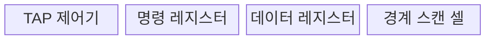
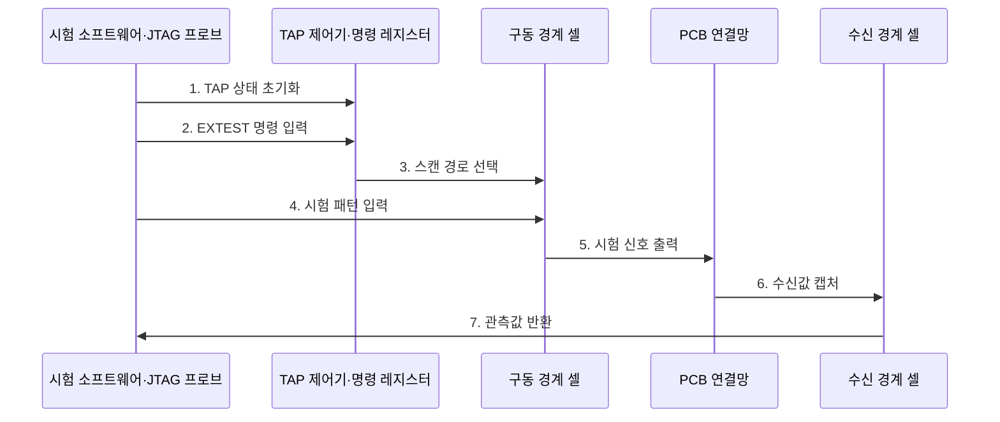

---
sidebar:
  order: 65
  label: "065. JTAG 디버깅 인터페이스 (JTAG)"
  badge:
    text: "기출 · 30%"
    variant: note
title: "JTAG 디버깅 인터페이스 (JTAG)"
date: "2026-07-28T13:07:47+09:00"
tags:
  - "notes-hardware"
weight: 65
extra:
  question_no: "065"
  source_status: "기출"
  source_history: "126회"
  priority: 30
  priority_note: "양산 연결 검사·출하 후 포트 통제"
---

## 미리 알고가기

- **합동 테스트 액션 그룹(Joint Test Action Group, JTAG)**: 경계 스캔과 칩 디버깅에 사용하는 IEEE 1149.1 직렬 시험 인터페이스
- **집적회로(Integrated Circuit, IC)·인쇄회로기판(Printed Circuit Board, PCB)**: IC는 반도체 회로 부품이고 PCB는 여러 IC를 장착하고 전기적으로 연결하는 기판
- **중앙처리장치(Central Processing Unit, CPU)**: 명령어를 실행하고 시스템의 연산·제어를 담당하는 처리장치
- **전기전자공학자협회 1149.1(Institute of Electrical and Electronics Engineers 1149.1, IEEE 1149.1)**: 테스트 접근 포트와 경계 스캔 절차를 정의한 JTAG 인터페이스 표준
- **테스트 접근 포트(Test Access Port, TAP)**: 시험 명령과 데이터를 직렬 전송하고 상태 머신을 제어하는 JTAG 포트
- **테스트 클록(Test Clock, TCK)·테스트 모드 선택(Test Mode Select, TMS)**: TCK는 시험 동작을 동기화하고 TMS는 TAP 상태 전이를 선택하는 JTAG 신호
- **테스트 데이터 입력(Test Data In, TDI)·출력(Test Data Out, TDO)**: 선택된 JTAG 레지스터의 시험 데이터를 직렬 입력·출력하는 신호
- **명령 레지스터(Instruction Register, IR)**: 현재 실행할 JTAG 시험 명령을 저장하는 레지스터
- **데이터 레지스터(Data Register, DR)**: 경계 스캔·바이패스 등의 시험 데이터를 직렬 이동하는 레지스터
- **TAP 상태(Test-Logic-Reset·Shift-IR·Update-IR·Shift-DR·Update-DR·Capture-DR)**: Test-Logic-Reset은 제어기를 초기화하고 Shift는 직렬 이동, Update는 적용, Capture는 입력 저장을 뜻하며 IR·DR의 명령·데이터 이동 순서를 제어
- **경계 스캔 레지스터(Boundary-Scan Register)**: IC 핀 값을 캡처·구동하는 경계 셀 체인
- **외부 검사(External Test, EXTEST)**: 경계 스캔 셀을 구동·관측하여 PCB의 IC 간 연결을 검사하는 JTAG 명령
- **우회(Bypass, BYPASS)**: 시험 대상이 아닌 IC를 1비트 우회 레지스터로 통과시키는 JTAG 명령
- **식별 코드(Identification Code, IDCODE)**: JTAG 체인에서 장치 제조사·부품·버전을 확인하는 식별 레지스터 값
- **직렬 와이어 디버그(Serial Wire Debug, SWD)**: Arm 프로세서의 메모리·레지스터를 제어하는 2선 패킷 디버그 인터페이스
- **범용 비동기 송수신기(Universal Asynchronous Receiver-Transmitter, UART)**: 로그·콘솔 데이터를 비동기 직렬 방식으로 송수신하는 장치

## Ⅰ. 개요

- 정의/개념: TAP로 **IC·PCB 연결**을 검사하는 포트
- 배경/필요성: 탐침이 닿지 않는 내부 핀·배선 검사

### 쉽게 이해하기 (학습용)

- 기기를 뜯지 않고 칩 가장자리 핀과 보드 배선을 만지는 공용 점검구와 같다.

## Ⅱ. 특징

- **직렬 스캔 체인**으로 다중 IC를 한 포트에서 검사
- **경계 스캔 셀**로 코어 실행 없이 핀 구동·관찰
- 표준 경계 스캔과 **CPU 디버그 구현**은 별도 확인

### 쉽게 이해하기 (학습용)

- 여러 칩의 점검구를 한 줄로 이어 배선을 검사하며, 내부 디버그 기능은 칩마다 다르다.

## Ⅲ. 구조 및 구성요소

| 구성요소 | 책임 |
|:---|:---|
| TAP 제어기 | **IR·DR 상태 전이** |
| 명령 레지스터 | **시험 명령 선택** |
| 데이터 레지스터 | **시험 데이터 이동** |
| 경계 스캔 셀 | **핀 캡처·구동** |

### 쉽게 이해하기 (학습용)

- TAP가 명령과 데이터 경로를 골라 칩 핀을 읽고 구동한다.

## Ⅳ. 흐름도

**동작 원리**

- **1. TAP 상태 초기화**: 제어기 리셋
- **2. EXTEST 명령 입력**: IR 이동·적용
- **3. 스캔 경로 선택**: 경계 셀 연결
- **4. 시험 패턴 입력**: DR 직렬 이동
- **5. 시험 신호 출력**: PCB 배선 구동
- **6. 수신값 캡처**: 입력 핀 저장
- **7. 관측값 반환**: 단선·단락 판정

### 쉽게 이해하기 (학습용)

- 한 IC의 경계 셀이 패턴을 구동하고 다른 IC의 경계 셀이 받은 값을 읽어 납땜 연결을 검사한다

## Ⅴ. 종류 및 비교

| 디버그·시험 인터페이스 | JTAG | SWD | UART |
|:---|:---|:---|:---|
| 적용 기준 | PCB 연결·**다중 IC 시험** | 적은 핀의 **Arm 디버그** | 단순 로그·**명령 채널** |
| 핵심 특징 | 직렬 경계 스캔·**다중 IC** | 2선 **코어·메모리 디버그** | 비동기 **로그·콘솔** |
| 한계 | 시험·디버그 **경로 노출** | 코어·메모리 **접근 노출** | 콘솔 명령·**정보 노출** |

### 쉽게 이해하기 (학습용)

- JTAG는 배선 점검구, SWD는 Arm 정비구, UART는 로그 창구에 가깝다.

## Ⅵ. 실무 고려사항 및 대책

| 고려사항 | 대책 | 효과 |
|:---|:---|:---|
| 출하 후 포트 노출 | 인증·운영 모드 잠금 | **디버그 공격면 축소** |
| 영구 잠금의 정비 제한 | 시간 제한 서비스 모드 | **보안·정비성 균형** |
| 스캔 체인 순서 오류 | IDCODE·BYPASS 검증 | **시험 신뢰성 향상** |
| 출력 핀 충돌 | 안전 핀 마스크 적용 | **보드 손상 방지** |

### 쉽게 이해하기 (학습용)

- 생산 단계에는 EXTEST를 사용하고 출하 후에는 인증된 서비스 모드 외 JTAG 접근을 잠근다

## Ⅶ. 결론

- 생산은 EXTEST, 출하 후 JTAG는 인증·잠금한다.

### 쉽게 이해하기 (학습용)

- 공장에서는 점검구를 쓰되 고객에게 나갈 때는 인증 자물쇠를 채우는 셈이다.
