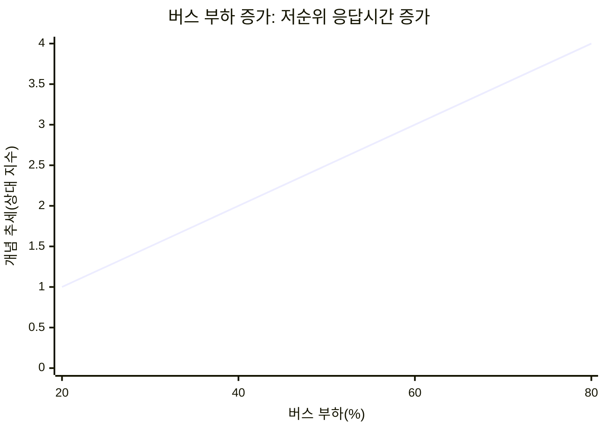
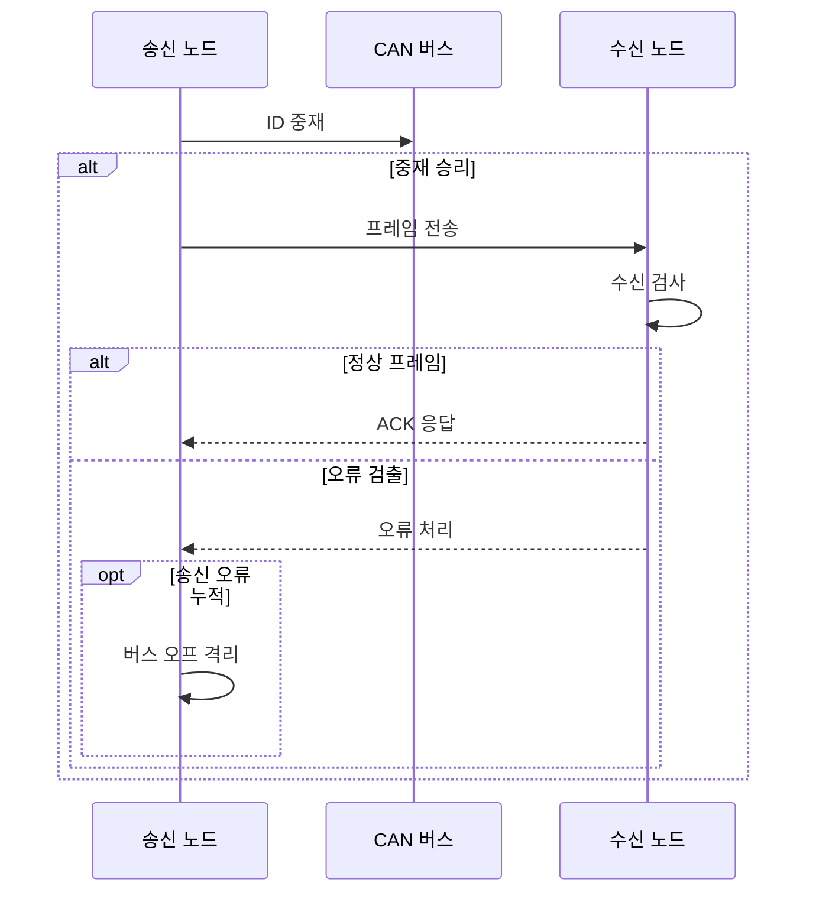

---
sidebar:
  order: 66
  label: "066. CAN 통신 (Controller Area Network)"
  badge:
    text: "기출 · 50%"
    variant: note
title: "CAN 통신 (Controller Area Network)"
date: "2026-07-25T10:36:00+09:00"
tags:
  - "notes-hardware"
weight: 66
extra:
  question_no: "066"
  source_status: "기출"
  source_history: "129회"
  priority: 50
  priority_note: "CAN 중재·오류 격리의 단일 기출 핵심"
---

## 미리 알고가기

- **제어기 영역 네트워크(Controller Area Network, CAN)**: ‘캔’으로 읽고 영문 머리글자를 단어처럼 만든 약어이며, 제어 메시지를 공유 차동 선로로 방송
- **전자 제어 장치(Electronic Control Unit, ECU)**: ‘이시유’로 읽고 영문 머리글자를 딴 약어이며, 차량 기능을 제어
- **메시지 식별자(Message Identifier, ID)**: ‘아이디’로 읽고 Identifier를 줄인 표기이며, 메시지 의미와 중재 우선순위를 표시
- **우성·열성 비트(Dominant·Recessive Bit)**: 중재 중 우성 비트가 선로를 점유하는 신호
- **비파괴 중재(Non-Destructive Arbitration)**: 승자 프레임을 손상하지 않는 중재
- **비트 스터핑(Bit Stuffing)**: 같은 비트 5개 뒤 반대 비트 삽입
- **순환 중복 검사(Cyclic Redundancy Check, CRC)**: ‘시알시’로 읽고 영문 머리글자를 딴 약어이며, 프레임 오류를 검출
- **수신 확인(Acknowledgement, ACK)**: ‘액’으로 읽고 Acknowledgement를 줄인 공식 표기이며, 정상 프레임 수신을 표시
- **오류 격리(Error Confinement)**: 오류 누적 노드의 송신 권한 제한
- **가변 데이터 전송률 CAN(CAN Flexible Data Rate, CAN FD)**: ‘캔 에프디’로 읽고 CAN과 Flexible Data Rate의 머리글자를 결합했으며, 최대 64바이트와 빠른 데이터 구간을 지원
- **버스 오프(Bus-off)**: 송신 오류 누적 노드의 버스 분리 상태
- **차동 신호선(CAN High·CAN Low, CAN_H·CAN_L)**: CAN_H·CAN_L은 ‘캔 하이·캔 로’로 읽고 High·Low의 첫 글자를 아래 첨자로 붙인 표기로, 두 선의 전압 차로 비트를 전달해 공통 잡음 영향을 줄임
- **다중 마스터(Multi-master)**: 여러 노드가 중앙 제어기 없이 버스 사용을 요청하고 중재 결과에 따라 송신하는 구조
- **발행·구독(Publish·Subscribe)**: 송신자는 ID로 메시지를 방송하고 수신자는 필요한 ID만 필터링하는 통신 방식
- **CAN 컨트롤러·트랜시버(CAN Controller·Transceiver)**: 컨트롤러는 프레임·중재·오류를 처리하고 트랜시버는 논리 비트와 차동 신호를 변환함
- **종단 저항(Termination Resistor)**: 버스 양 끝에서 신호 반사를 흡수해 파형 왜곡을 줄이는 저항
- **프레임·페이로드(Frame·Payload)**: 프레임은 제어 필드를 포함한 전송 단위이고 페이로드는 그 안의 실제 데이터
- **게이트웨이(Gateway)**: 서로 다른 차량 통신망 사이에서 메시지를 전달·필터링하는 장치

## Ⅰ. 개요

- **정의/개념**: ID로 비파괴 중재하는 다중 마스터 버스다
- **배경/필요성**: ECU 배선을 줄이고 제어 순서를 보장한다

### 쉽게 이해하기 (학습용)

- 여러 장치가 한 무전 채널에서 번호가 작은 긴급 메시지부터 끊김 없이 말하는 방식이다.

## Ⅱ. 특징

- ID 발행·구독은 송수신자를 분리해 변경 비용을 줄인다
- 우성 0 중재는 작은 ID 프레임을 손상 없이 보낸다
- 버스 부하 증가는 저순위 응답을 늦춰 마감을 놓치게 한다
- 오류 노드는 격리하지만 인증 부재로 위조를 막지 못한다

### 쉽게 이해하기 (학습용)

- 작은 번호가 먼저 말하고 채널이 붐빌수록 큰 번호는 더 기다리며 오류 장치는 퇴장하지만 발언자 신원은 따로 확인한다.

## Ⅲ. 아키텍처 및 구성요소

| 설계 요소 | 설명 |
|:---|:---|
| 응용 소프트웨어 | 메시지 값·주기·ID와 수신 조건 설정 |
| CAN 컨트롤러 | 프레임 생성·중재·필터·오류 검사 |
| CAN 트랜시버 | 논리 비트와 차동 전기 신호 변환 |
| CAN_H·CAN_L·종단 | 공유 선로의 신호 전달과 반사 억제 |

> 요약: 트랜시버가 프레임을 차동 신호로 변환한다

### 쉽게 이해하기 (학습용)

- 응용 프로그램이 쪽지를 만들면 컨트롤러가 봉투를 씌우고 송수신기가 두 가닥 선에 싣는다.

## Ⅳ. 원리 및 절차 흐름도

| 절차 | 설명 |
|:---|:---|
| ID 중재 | 송신값·선로값을 비교해 승패 결정 |
| 프레임 전송 | 제어·데이터·CRC 필드를 방송 |
| 수신 검사 | 비트·스터핑·형식·CRC 오류 검출 |
| ACK 응답 | 정상 수신 노드가 우성 비트 전송 |
| 오류 처리 | 오류 플래그·재전송·카운터 갱신 |
| 버스 오프 격리 | 송신 오류 카운터 255 초과 시 중단 |

> 요약: 중재 승자만 보내고 오류 누적 노드는 격리한다

### 쉽게 이해하기 (학습용)

- 번호 경쟁에서 진 장치는 다시 기다리고 오류가 쌓인 장치는 무전 채널에서 빠진다.

## Ⅴ. 종류 및 비교

| 판단 기준 | CAN | CAN FD | 자동차 이더넷 |
|:---|:---|:---|:---|
| 핵심 특징 | ID 중재의 짧은 제어 프레임 | 빠른 데이터 구간·확장 페이로드 | 스위치 기반 대용량 전송 |
| 적용 기준 | 차체·섀시의 짧은 제어 | 진단·센서·업데이트 데이터 | 카메라·백본의 대용량 데이터 |
| 주요 위험 | 저순위 지연·대역폭 한계 | 노드 호환·비트 타이밍 | 시간 동기·보안 복잡성 |

> 요약: 짧은 제어는 CAN, 대용량은 CAN FD를 택한다

### 쉽게 이해하기 (학습용)

- 짧은 쪽지는 CAN, 큰 묶음은 CAN FD, 영상 화물은 이더넷으로 보낸다.

## Ⅵ. 실무 사례

1. 차체 제어는 마감시간별 CAN ID를 설정한다
2. 차량 게이트웨이는 ID·주기·길이를 필터링한다

### 쉽게 이해하기 (학습용)

- 차체 제어는 더 급한 메시지에 작은 ID를 주고 최악 대기시간을 계산한다.
- 게이트웨이는 허용 목록과 다른 ID·주기·길이의 메시지를 차단한다.

## Ⅶ. 결론

- 응답시간·오류 격리를 검증하고 CAN 제어망을 택한다

### 쉽게 이해하기 (학습용)

- 메시지가 제때 도착하고 오류 노드를 격리할 수 있을 때 CAN을 선택한다.
