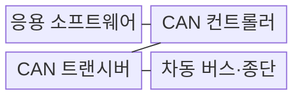
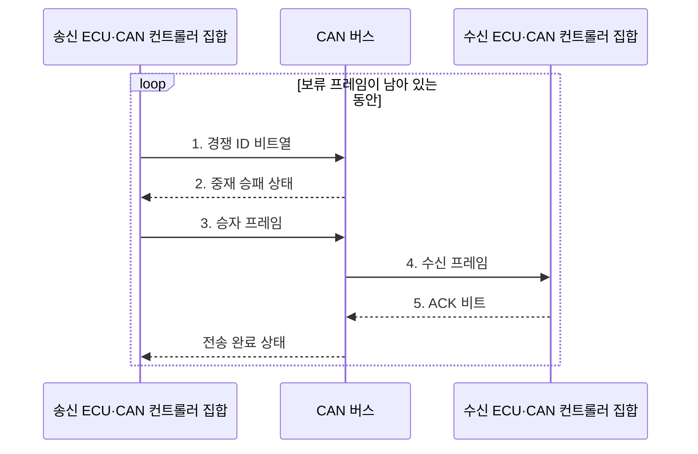

---
sidebar:
  order: 66
  label: "066. CAN 통신 (Controller Area Network)"
  badge:
    text: "기출 · 50%"
    variant: note
title: "CAN 통신 (Controller Area Network)"
date: "2026-07-31T10:02:05+09:00"
tags:
  - "notes-hardware"
weight: 66
extra:
  question_no: "066"
  source_status: "기출"
  source_history: "129회"
  priority: 50
  priority_note: "CAN 중재·오류 격리의 단일 기출 핵심"
---

## 미리 알고가기

- **제어기 영역 네트워크(Controller Area Network, CAN)**: 제어 메시지를 공유 차동 선로로 방송하는 차량용 통신 버스
- **전자 제어 장치(Electronic Control Unit, ECU)**: 센서 입력과 제어 로직에 따라 차량 기능을 제어하는 내장 컴퓨터
- **메시지 식별자(Message Identifier, ID)**: CAN 프레임의 메시지 의미와 버스 중재 우선순위를 나타내는 필드
- **우성·열성 비트(Dominant·Recessive Bit)**: 중재 중 우성 비트가 선로를 점유하는 신호
- **비파괴 중재(Non-Destructive Arbitration)**: 승자 프레임을 손상하지 않는 중재
- **비트 스터핑(Bit Stuffing)**: 같은 비트 5개 뒤 반대 비트 삽입
- **순환 중복 검사(Cyclic Redundancy Check, CRC)**: CAN 프레임 전송 중 발생한 비트 오류를 검출하는 코드
- **수신 확인(Acknowledgement, ACK)**: 하나 이상의 수신 노드가 프레임을 정상 수신했음을 표시하는 필드
- **오류 격리(Error Confinement)**: 오류 누적 노드의 송신 권한 제한
- **가변 데이터 전송률 CAN(CAN Flexible Data Rate, CAN FD)**: 데이터 필드를 최대 64바이트로 확장하고 데이터 구간의 전송률을 높인 CAN 규격
- **버스 오프(Bus-off)**: 송신 오류 누적 노드의 버스 분리 상태
- **차동 신호선(CAN High·CAN Low, CAN_H·CAN_L)**: 두 신호선의 전압 차로 비트를 전달하여 공통 모드 잡음의 영향을 줄이는 CAN 물리 계층 신호
- **다중 마스터(Multi-master)**: 여러 노드가 중앙 제어기 없이 버스 사용을 요청하고 중재 결과에 따라 송신하는 구조
- **발행·구독(Publish·Subscribe)**: 송신자는 ID로 메시지를 방송하고 수신자는 필요한 ID만 필터링하는 통신 방식
- **CAN 컨트롤러·트랜시버(CAN Controller·Transceiver)**: 컨트롤러는 프레임·중재·오류를 처리하고 트랜시버는 논리 비트와 차동 신호를 변환함
- **종단 저항(Termination Resistor)**: 버스 양 끝에서 신호 반사를 흡수해 파형 왜곡을 줄이는 저항
- **프레임·페이로드(Frame·Payload)**: 프레임은 제어 필드를 포함한 전송 단위이고 페이로드는 그 안의 실제 데이터
- **게이트웨이(Gateway)**: 서로 다른 차량 통신망 사이에서 메시지를 전달·필터링하는 장치
- **최악 응답시간(Worst-Case Response Time, WCRT)**: 메시지 송신 요청부터 중재·전송을 마칠 때까지 걸리는 최대 시간
- **송신 오류 카운터(Transmit Error Counter, TEC)**: 송신 오류마다 증가하며 노드의 오류 상태와 버스 오프 전환을 결정하는 값
- **메시지 인증 코드(Message Authentication Code, MAC)**: 비밀키와 메시지로 생성해 송신자와 데이터 무결성을 검증하는 값

> **키워드:** CAN 통신 (Controller Area Network)

## Ⅰ. 개요

- 정의/개념: 메시지 ID로 **비파괴 중재**하는 다중 마스터 버스
- 배경/필요성: ECU 증가 시 점대점 **배선량·통합 비용** 급증

### 쉽게 이해하기 (학습용)

- 여러 장치가 한 무전 채널에서 번호가 작은 긴급 메시지부터 끊김 없이 말하는 방식이다.

## Ⅱ. 특징

- **메시지 ID 발행·구독**으로 송수신 노드 결합 완화
- **우성 비트 비파괴 중재**로 높은 우선순위 프레임 보존
- **버스 부하·ID 우선순위**가 최악 응답시간 결정

### 쉽게 이해하기 (학습용)

- 작은 번호가 먼저 말하고 채널이 붐빌수록 큰 번호는 더 기다리며 오류 장치는 퇴장하지만 발언자 신원은 따로 확인한다.

## Ⅲ. 구조 및 구성요소

| 구성요소 | 책임 |
|:---|:---|
| 응용 소프트웨어 | **메시지·주기 설정** |
| CAN 컨트롤러 | **중재·오류 처리** |
| CAN 트랜시버 | **차동 신호 변환** |
| 차동 버스·종단 | **방송·반사 억제** |

### 쉽게 이해하기 (학습용)

- 컨트롤러가 프레임을 만들고 트랜시버가 버스 신호로 바꾼다.

## Ⅳ. 흐름도

**동작 원리**

1. **경쟁 ID 비트열**: 여러 ECU가 ID 비트를 동시에 전송
2. **중재 승패 상태**: 우성 비트를 읽은 작은 ID의 우선권 유지
3. **승자 프레임**: 중재 승자가 데이터와 CRC 전송
4. **수신 프레임**: 수신 노드가 형식·CRC 검증
5. **ACK 비트**: 정상 수신 노드가 우성 비트로 응답

### 쉽게 이해하기 (학습용)

- 작은 ID의 우성 비트가 이기고 패자는 승자 프레임을 손상하지 않은 채 유휴 뒤 재중재한다

## Ⅴ. 종류 및 비교

| 차량 통신 방식 | CAN | CAN FD | 자동차 이더넷 |
|:---|:---|:---|:---|
| 적용 기준 | 차체·섀시의 **짧은 제어** | 진단·센서·**업데이트 데이터** | 카메라·백본의 **대용량 데이터** |
| 핵심 특징 | ID 중재의 **제어 프레임** | 빠른 데이터·**확장 페이로드** | 스위치 기반 **대용량 전송** |
| 한계 | 저순위 지연·**대역폭 한계** | 노드 호환·**비트 타이밍** | 시간 동기·**보안 복잡성** |

### 쉽게 이해하기 (학습용)

- 짧은 쪽지는 CAN, 큰 묶음은 CAN FD, 영상 화물은 이더넷으로 보낸다.

## Ⅵ. 실무 고려사항 및 대책

| 고려사항 | 대책 | 효과 |
|:---|:---|:---|
| 버스 부하·우선순위로 저순위 ID 기아 | **최악 응답시간·버스 부하 상한** 분석 | **메시지 데드라인** 충족 |
| 송신 오류 누적으로 버스 오프 반복 | **TEC 진단 후 단계적 복귀** | 고장 노드의 **오류 격리** 유지 |
| 종단·배선 오류로 신호 반사 증가 | **종단 저항·파형 검증** 후 버스 길이 제한 | **프레임 오류율** 감소 |
| ID에 송신자 인증이 없어 메시지 위조 | 게이트웨이 필터와 **MAC** 적용 | **위조 메시지** 차단 |

### 쉽게 이해하기 (학습용)

- 긴급 메시지에는 작은 ID를 배정하고 버스 부하를 포함한 최악 응답시간을 검증한다

## Ⅶ. 결론

- **짧은 제어**는 CAN, **확장 데이터**는 CAN FD, 대용량은 이더넷 선택

### 쉽게 이해하기 (학습용)

- 메시지가 제때 도착하고 오류 노드를 격리할 수 있을 때 CAN을 선택한다.
