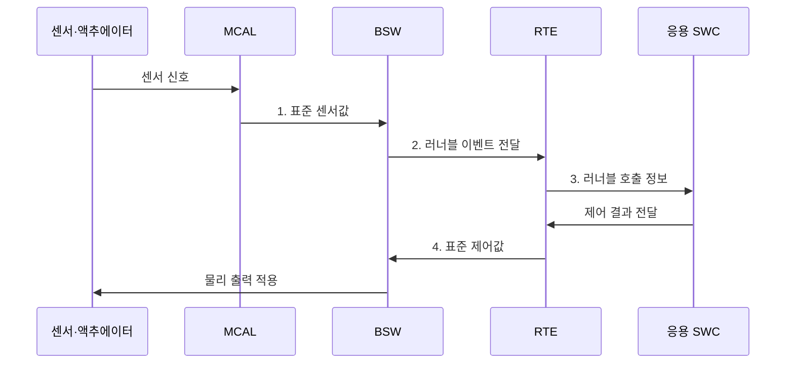

---
sidebar:
  order: 67
  label: "067. AUTOSAR 소프트웨어 플랫폼"
  badge:
    text: "기출 · 50%"
    variant: note
title: "AUTOSAR 소프트웨어 플랫폼"
date: "2026-08-02T11:27:00+09:00"
tags:
  - "notes-hardware"
weight: 67
extra:
  question_no: "067"
  source_status: "기출"
  source_history: "138회"
  priority: 50
  priority_note: "Classic·Adaptive 구조의 단일 기출 핵심"
---

## Ⅰ. 개요

핵심 용어

- **AUTOSAR(Automotive Open System Architecture)**: 차량 소프트웨어의 구조와 인터페이스 및 개발 방법을 표준화한 플랫폼이다.
- **전자제어장치(Electronic Control Unit, ECU)**: 센서 입력과 제어 소프트웨어에 따라 차량 기능을 실행하는 내장 컴퓨터이다.
- **소프트웨어 재사용(Software Reuse)**: 표준 인터페이스를 지킨 기능을 여러 차량과 하드웨어 구성에서 반복 활용하는 방식이다.

- 정의/개념: 차량 소프트웨어의 **구조·인터페이스·개발 방법**을 표준화한 플랫폼
- 배경/필요성: 공급사별 독자 인터페이스는 **통합•재사용 제약**

### 쉽게 이해하기 (학습용)

- 여러 회사의 차량 소프트웨어를 공통 설계도와 연결 규칙으로 조립하게 하는 표준이다.

## Ⅱ. 특징

핵심 용어

- **표준 인터페이스(Standard Interface)**: 공급사와 하드웨어가 달라도 데이터 형식과 호출 규칙을 일관되게 유지하는 접점이다.
- **AUTOSAR XML(ARXML)**: AUTOSAR 시스템과 소프트웨어 및 통신 설계 정보를 도구 사이에서 교환하는 XML 형식이다.
- **Classic Platform**: 정적 구성과 결정적인 주기 제어를 중심으로 하는 AUTOSAR 플랫폼이다.
- **Adaptive Platform**: 서비스 지향 구조와 고성능 동적 응용을 중심으로 하는 AUTOSAR 플랫폼이다.

- **표준 인터페이스**로 응용·하드웨어 결합 완화
- **ARXML 계약**으로 공급사·도구 간 설계 정보 교환
- **Classic·Adaptive**로 제어·서비스 분리

### 쉽게 이해하기 (학습용)

- 공통 규격을 써도 차량마다 기능 배치, 통신 지연, 안전 경계를 다시 맞춰야 한다.

## Ⅲ. 구조 및 구성요소

핵심 용어

- **소프트웨어 구성요소(Software Component, SWC)**: 차량 기능을 포트와 러너블 단위로 캡슐화한 AUTOSAR 응용 구성요소이다.
- **런타임 환경(Runtime Environment, RTE)**: Classic SWC와 기본 소프트웨어 사이의 포트 통신과 호출을 중개하는 계층이다.
- **기본 소프트웨어(Basic Software, BSW)**: 운영체제와 통신·진단·메모리 및 하드웨어 추상화 서비스를 제공하는 계층이다.
- **ARA·기능 클러스터**: Adaptive 응용에 통신과 실행 및 진단·상태 관리 서비스를 제공하는 표준 인터페이스와 모듈 집합이다.

| 구성요소 | 책임 |
|:---|:---|
| 응용 SWC | **차량 제어 기능 실행** |
| RTE | **포트·호출 중개** |
| BSW·MCAL | **서비스·장치 추상화** |
| Adaptive 응용 | **고성능 서비스 실행** |
| ARA·기능 클러스터 | **탐색·수명주기 관리** |

### 쉽게 이해하기 (학습용)

- Classic은 고정 계층, Adaptive는 동적 서비스 기반으로 동작한다.

## Ⅳ. 흐름도

핵심 용어

- **마이크로컨트롤러 추상화 계층(Microcontroller Abstraction Layer, MCAL)**: 상위 BSW가 특정 MCU 레지스터와 장치에 의존하지 않도록 하드웨어를 추상화하는 계층이다.
- **러너블(Runnable)**: 입력 이벤트나 주기에 따라 RTE가 호출하는 SWC 내부의 실행 코드 단위이다.
- **표준 제어값(Standardized Control Value)**: SWC의 출력이 BSW와 MCAL을 거쳐 액추에이터 장치 형식으로 변환되는 값이다.

**동작 원리**

1. **표준 센서값**: 장치별 레지스터 차이를 표준 형식으로 변환
2. **러너블 이벤트 전달**: 수집 값을 RTE 실행 조건으로 변환
3. **러너블 호출 정보**: RTE의 SWC 호출과 포트 결과 수신
4. **표준 제어값**: BSW·MCAL 경로에서 액추에이터 신호로 변환

### 쉽게 이해하기 (학습용)

- SWC는 RTE와 BSW라는 공통 창구 덕분에 센서·칩별 명령을 몰라도 된다.

## Ⅴ. 종류 및 비교

핵심 용어

- **정적 구성(Static Configuration)**: 빌드와 배포 전에 태스크와 통신 및 메모리 배치를 확정하는 방식이다.
- **서비스 지향 아키텍처(Service-oriented Architecture, SOA)**: 기능을 독립 서비스로 제공하고 실행 중 탐색하여 호출하는 구조이다.
- **동적 업데이트(Dynamic Update)**: 시스템 운용 중 응용이나 서비스를 교체하고 수명주기를 관리하는 기능이다.

| AUTOSAR 플랫폼 | Classic | Adaptive |
|:---|:---|:---|
| 적용 기준 | 하드 실시간·**주기 제어** | 고성능·**동적 업데이트** |
| 핵심 특징 | 정적 **SWC·RTE·BSW 계층** | 동적 응용·**ARA 서비스** |
| 한계 | 정적 설정·**통합 복잡성** | 수명주기·자원·**업데이트 복잡성** |

### 쉽게 이해하기 (학습용)

- Classic은 정해진 시간표의 제어반이고 Adaptive는 서비스를 바꿔 싣는 컴퓨터다.

## Ⅵ. 실무 고려사항 및 대책

핵심 용어

- **ARXML 스키마·프로파일(ARXML Schema·Profile)**: 허용 요소와 형식을 정의하고 프로젝트가 사용할 규칙 범위를 고정한 도구 계약이다.
- **종단 최악 지연(End-to-end Worst-case Latency)**: 센서 입력부터 태스크와 통신을 거쳐 제어 출력 완료까지 걸리는 최대 시간이다.
- **원자적 갱신·롤백(Atomic Update·Rollback)**: 전체 변경을 한 단위로 반영하고 실패하면 이전 정상 버전으로 복귀하는 방식이다.
- **인터페이스 계약(Interface Contract)**: 서비스의 데이터 형식과 호출 조건 및 오류 응답을 합의한 규칙이다.

| 문제 | 대책 | 효과 |
|:---|:---|:---|
| 도구별 ARXML 스키마 버전 불일치 | **ARXML 스키마·프로파일 고정** | **도구 간 통합 오류** 감소 |
| 태스크·통신 지연으로 제어 마감시간 초과 | **종단 최악 지연 분석** | **Classic 데드라인** 충족 입증 |
| Adaptive 업데이트 중 서비스 상태 불일치 | **원자적 갱신·롤백** | **서비스 상태** 정상 버전 복구 |
| Classic·Adaptive 경계의 인터페이스·격리 불일치 | **인터페이스 계약·격리 시험** | **플랫폼 경계 위반** 검출 |

### 쉽게 이해하기 (학습용)

- 차체 ECU는 주기 실행과 차량 신호 전달 시점을 함께 시험한다.

## Ⅶ. 결론

핵심 용어

- **결정적 제어(Deterministic Control)**: 최악 조건에서도 정해진 주기와 데드라인 안에 센서 처리와 출력을 완료하는 제어이다.
- **동적 서비스(Dynamic Service)**: 실행 중 탐색·시작·중지·업데이트가 가능한 독립 소프트웨어 기능이다.
- **플랫폼 선택(Platform Selection)**: 차량 기능의 시간 요구와 변경성 및 자원 규모에 따라 Classic 또는 Adaptive를 정하는 판단이다.

- 결정적 제어는 **Classic**, 동적 서비스는 **Adaptive** 선택

### 쉽게 이해하기 (학습용)

- 시간표가 고정된 제어는 Classic, 실행 중 바뀌는 서비스는 Adaptive를 선택한다.
