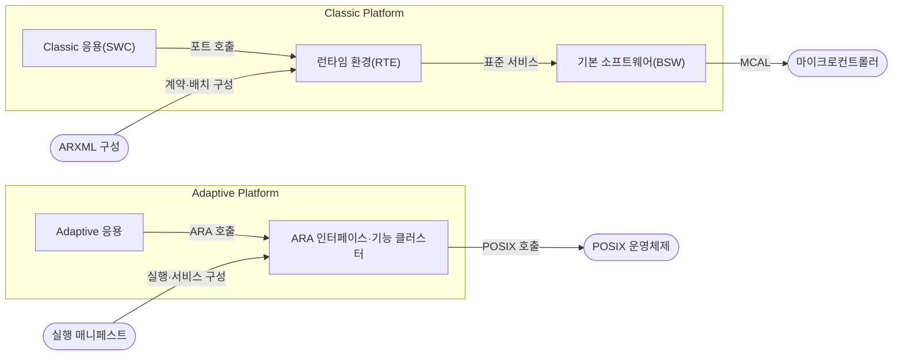
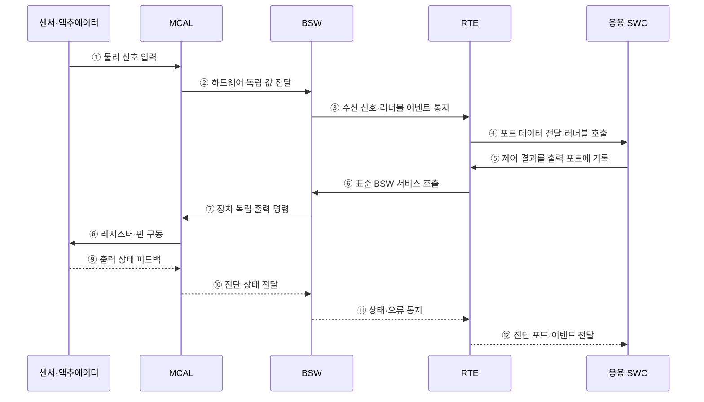

---
sidebar:
  order: 67
  label: "067. AUTOSAR 소프트웨어 플랫폼"
  badge:
    text: "기출 · 50%"
    variant: note
title: "AUTOSAR 소프트웨어 플랫폼"
date: "2026-07-28T13:09:03+09:00"
tags:
  - "notes-hardware"
weight: 67
extra:
  question_no: "067"
  source_status: "기출"
  source_history: "138회"
  priority: 50
  priority_note: "Classic·Adaptive 구조의 단일 기출 핵심"
---

## 미리 알고가기

- **자동차 개방형 시스템 아키텍처(Automotive Open System Architecture, AUTOSAR)**: 차량 소프트웨어의 구조·인터페이스·개발 방법론을 표준화한 플랫폼
- **전자제어장치(Electronic Control Unit, ECU)**: 센서 입력과 제어 소프트웨어로 차량 기능을 실행하는 내장 컴퓨터
- **Classic Platform**: 정적 구성과 결정적 제어 중심의 플랫폼
- **Adaptive Platform**: 서비스 지향 고성능 응용 중심의 플랫폼
- **소프트웨어 구성요소(Software Component, SWC)**: 차량 기능을 포트·러너블 단위로 캡슐화한 AUTOSAR 응용 구성요소
- **포트·러너블(Port·Runnable)**: 포트는 SWC의 통신 접점이고 러너블은 이벤트에 따라 실행되는 내부 코드 단위
- **서비스 지향 아키텍처(Service-Oriented Architecture, SOA)**: 차량 기능을 독립 서비스로 제공하고 동적으로 탐색·호출하는 구조
- **런타임 환경(Runtime Environment, RTE)**: AUTOSAR Classic의 소프트웨어 구성요소와 기본 소프트웨어 사이 통신을 중개하는 계층
- **기본 소프트웨어(Basic Software, BSW)**: 운영체제·통신·진단·메모리·하드웨어 추상화 서비스를 제공하는 AUTOSAR 계층
- **마이크로컨트롤러 추상화 계층(Microcontroller Abstraction Layer, MCAL)**: 상위 기본 소프트웨어가 특정 마이크로컨트롤러에 의존하지 않도록 하드웨어를 추상화하는 계층
- **AUTOSAR XML(ARXML)**: AUTOSAR의 시스템·소프트웨어·통신 설계 정보를 도구 사이에서 교환하는 XML 형식
- **확장 가능 마크업 언어(Extensible Markup Language, XML)**: 태그와 계층 구조로 데이터를 표현·교환하는 마크업 형식
- **기능 클러스터(Function Cluster)**: Adaptive 응용에 통신·실행·진단 같은 플랫폼 서비스를 제공하는 모듈 집합
- **적응형 응용 런타임(AUTOSAR Runtime for Adaptive Applications, ARA)**: Adaptive 응용이 통신·진단·상태 관리 기능 클러스터를 호출하는 표준 인터페이스
- **이식형 운영체제 인터페이스(Portable Operating System Interface, POSIX)**: AUTOSAR Adaptive가 운영체제 이식성을 확보하기 위해 사용하는 표준 시스템 인터페이스
- **실행 매니페스트(Execution Manifest)**: 프로세스 시작·수명주기 설정

## Ⅰ. 개요

- 정의/개념: 차량 소프트웨어의 **구조·인터페이스 표준**
- 기존 한계: 공급사별 구조는 **통합·재사용·도구 호환**에 한계

### 쉽게 이해하기 (학습용)

- 여러 회사의 차량 소프트웨어를 공통 설계도와 연결 규칙으로 조립하게 하는 표준이다.

## Ⅱ. 특징

- **표준 인터페이스**로 응용·하드웨어 결합 완화
- **ARXML 계약**으로 공급사·도구 간 설계 정보 교환
- **Classic·Adaptive 플랫폼**으로 제어·고성능 서비스 분리

### 쉽게 이해하기 (학습용)

- 공통 규격을 써도 차량마다 기능 배치, 통신 지연, 안전 경계를 다시 맞춰야 한다.

## Ⅲ. 아키텍처

**도표안 A — 구조도**

**도표안 B — sequenceDiagram**

| 설계 요소 | 입력·상태 | 역할 |
|:---|:---|:---|
| Classic 응용(SWC) | 포트 데이터·러너블 이벤트 | 주기·이벤트 차량 기능 구현 |
| 런타임 환경(RTE) | SWC·BSW 인터페이스 계약 | 호출·데이터 중개 |
| 기본 소프트웨어(BSW) | 하드웨어·통신·진단 상태 | OS·통신·진단·MCAL 제공 |
| Adaptive 응용 | 서비스 요청·프로세스 상태 | 고성능 차량 서비스 실행 |
| ARA 인터페이스·기능 클러스터 | 서비스·실행 매니페스트 | 탐색·통신·수명주기 관리 |

> 요약: 구성 산출물로 두 플랫폼의 계층을 설정한다.

**동작 원리**

1. **센서 입력**: 센서의 물리 신호를 MCAL이 받는다.
2. **하드웨어 추상화**: MCAL이 장치 차이를 감춘 값을 BSW에 전달한다.
3. **이벤트 통지**: BSW가 수신 신호와 러너블 이벤트를 RTE에 알린다.
4. **SWC 실행**: RTE가 포트 계약에 따라 입력과 실행 요청을 SWC에 전달한다.
5. **결과 기록**: SWC가 제어 결과를 출력 포트에 기록한다.
6. **서비스 중개**: RTE가 표준 BSW 서비스를 호출한다.
7. **출력 전달**: BSW가 장치 독립 명령을 MCAL에 전달한다.
8. **물리 출력**: MCAL이 레지스터와 핀을 구동한다.
9. **상태 피드백**: 구동 장치가 실제 출력 상태를 MCAL에 돌려준다.
10. **진단 전달**: MCAL이 하드웨어 상태를 BSW에 전달한다.
11. **오류 통지**: BSW가 상태와 오류를 RTE에 알린다.
12. **응용 반영**: RTE가 진단 이벤트를 SWC에 전달해 대체 제어를 시작한다.

### 쉽게 이해하기 (학습용)

- SWC는 RTE와 BSW라는 공통 창구 덕분에 센서·칩별 명령을 몰라도 된다.

## Ⅳ. 종류 및 비교

| AUTOSAR 플랫폼 | Classic | Adaptive |
|:---|:---|:---|
| 적용 기준 | 하드 실시간·**주기 제어** | 고성능·**동적 업데이트** |
| 핵심 특징 | 정적 **SWC·RTE·BSW 계층** | 동적 응용·**ARA 서비스** |
| 한계 | 정적 설정·**통합 복잡성** | 수명주기·자원·**업데이트 복잡성** |

> 요약: Classic은 실시간 제어, Adaptive는 동적 서비스다.

### 쉽게 이해하기 (학습용)

- Classic은 정해진 시간표의 제어반이고 Adaptive는 서비스를 바꿔 싣는 컴퓨터다.

## Ⅴ. 실무 고려사항 및 대책

| 운영 위험 | 대응 | 기대 효과 |
|:---|:---|:---|
| 공급사·도구별 ARXML 해석·버전 불일치 | 스키마·프로파일 고정과 왕복 변환·계약 검증 | 통합 오류 감소 |
| RTE·BSW 호출·통신이 제어 마감시간 초과 | 러너블·버스·태스크 최악 지연을 종단 분석 | Classic 결정성 확보 |
| Adaptive 서비스 발견·업데이트 중 상태 불일치 | 매니페스트·수명주기·원자적 업데이트·롤백 적용 | 동적 서비스 복구성 향상 |
| Classic–Adaptive 경계의 지연·안전 등급 혼합 | 게이트웨이 계약·시간 예산·격리·고장 전파 시험 | 플랫폼 경계 안전성 확보 |

### 적용 사례

- 차체 ECU는 Classic의 주기 러너블과 신호 경로를 구성하고 종단 최악 지연을 시험한다.

### 쉽게 이해하기 (학습용)

- 차체 ECU는 주기 실행과 차량 신호 전달 시점을 함께 시험한다.

## Ⅵ. 결론

- 실시간 결정성과 동적 서비스 요구를 기준으로 주기 제어에는 Classic, 고성능 서비스에는 Adaptive를 선택한다.

### 쉽게 이해하기 (학습용)

- 시간표가 고정된 제어는 Classic, 실행 중 바뀌는 서비스는 Adaptive를 선택한다.
