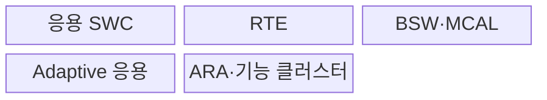
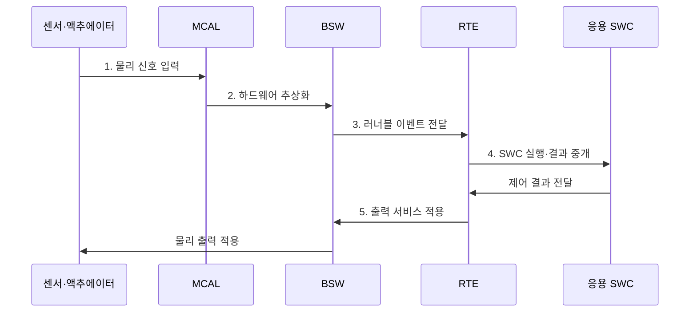

---
sidebar:
  order: 67
  label: "067. AUTOSAR 소프트웨어 플랫폼"
  badge:
    text: "기출 · 50%"
    variant: note
title: "AUTOSAR 소프트웨어 플랫폼"
date: "2026-07-30T18:21:35+09:00"
tags:
  - "notes-hardware"
weight: 67
extra:
  question_no: "067"
  source_status: "기출"
  source_history: "138회"
  priority: 50
  priority_note: "Classic·Adaptive 구조의 단일 기출 핵심"
---

## 미리 알고가기

- **자동차 개방형 시스템 아키텍처(Automotive Open System Architecture, AUTOSAR)**: 차량 소프트웨어의 구조·인터페이스·개발 방법론을 표준화한 플랫폼
- **전자제어장치(Electronic Control Unit, ECU)**: 센서 입력과 제어 소프트웨어로 차량 기능을 실행하는 내장 컴퓨터
- **Classic Platform**: 정적 구성과 결정적 제어 중심의 플랫폼
- **Adaptive Platform**: 서비스 지향 고성능 응용 중심의 플랫폼
- **소프트웨어 구성요소(Software Component, SWC)**: 차량 기능을 포트·러너블 단위로 캡슐화한 AUTOSAR 응용 구성요소
- **포트·러너블(Port·Runnable)**: 포트는 SWC의 통신 접점이고 러너블은 이벤트에 따라 실행되는 내부 코드 단위
- **서비스 지향 아키텍처(Service-Oriented Architecture, SOA)**: 차량 기능을 독립 서비스로 제공하고 동적으로 탐색·호출하는 구조
- **런타임 환경(Runtime Environment, RTE)**: AUTOSAR Classic의 소프트웨어 구성요소와 기본 소프트웨어 사이 통신을 중개하는 계층
- **기본 소프트웨어(Basic Software, BSW)**: 운영체제·통신·진단·메모리·하드웨어 추상화 서비스를 제공하는 AUTOSAR 계층
- **마이크로컨트롤러 추상화 계층(Microcontroller Abstraction Layer, MCAL)**: 상위 기본 소프트웨어가 특정 마이크로컨트롤러에 의존하지 않도록 하드웨어를 추상화하는 계층
- **AUTOSAR XML(ARXML)**: AUTOSAR의 시스템·소프트웨어·통신 설계 정보를 도구 사이에서 교환하는 XML 형식
- **확장 가능 마크업 언어(Extensible Markup Language, XML)**: 태그와 계층 구조로 데이터를 표현·교환하는 마크업 형식
- **기능 클러스터(Function Cluster)**: Adaptive 응용에 통신·실행·진단 같은 플랫폼 서비스를 제공하는 모듈 집합
- **적응형 응용 런타임(AUTOSAR Runtime for Adaptive Applications, ARA)**: Adaptive 응용이 통신·진단·상태 관리 기능 클러스터를 호출하는 표준 인터페이스
- **이식형 운영체제 인터페이스(Portable Operating System Interface, POSIX)**: AUTOSAR Adaptive가 운영체제 이식성을 확보하기 위해 사용하는 표준 시스템 인터페이스
- **실행 매니페스트(Execution Manifest)**: 프로세스 시작·수명주기 설정

## Ⅰ. 개요

- 정의/개념: 차량 소프트웨어의 **구조·인터페이스 표준**
- 배경/필요성: 공급사별 독자 인터페이스는 **통합•재사용 제약**

### 쉽게 이해하기 (학습용)

- 여러 회사의 차량 소프트웨어를 공통 설계도와 연결 규칙으로 조립하게 하는 표준이다.

## Ⅱ. 특징

- **표준 인터페이스**로 응용·하드웨어 결합 완화
- **ARXML 계약**으로 공급사·도구 간 설계 정보 교환
- **Classic·Adaptive**로 제어·서비스 분리

### 쉽게 이해하기 (학습용)

- 공통 규격을 써도 차량마다 기능 배치, 통신 지연, 안전 경계를 다시 맞춰야 한다.

## Ⅲ. 구조 및 구성요소

| 구성요소 | 책임 |
|:---|:---|
| 응용 SWC | **차량 제어 기능 실행** |
| RTE | **포트·호출 중개** |
| BSW·MCAL | **서비스·장치 추상화** |
| Adaptive 응용 | **고성능 서비스 실행** |
| ARA·기능 클러스터 | **탐색·수명주기 관리** |

### 쉽게 이해하기 (학습용)

- Classic은 고정 계층, Adaptive는 동적 서비스 기반으로 동작한다.

## Ⅳ. 흐름도

**동작 원리**

- **1. 물리 신호 입력**: 센서값 수신
- **2. 하드웨어 추상화**: MCAL이 장치별 레지스터 차이를 표준 인터페이스로 은닉
- **3. 러너블 이벤트 전달**: BSW가 수집한 값을 RTE의 실행 조건으로 변환
- **4. SWC 실행·결과 중개**: RTE가 응용 컴포넌트를 호출하고 포트 결과를 수신
- **5. 출력 서비스 적용**: BSW·MCAL 경로로 표준 제어값을 실제 액추에이터 신호로 변환

### 쉽게 이해하기 (학습용)

- SWC는 RTE와 BSW라는 공통 창구 덕분에 센서·칩별 명령을 몰라도 된다.

## Ⅴ. 종류 및 비교

| AUTOSAR 플랫폼 | Classic | Adaptive |
|:---|:---|:---|
| 적용 기준 | 하드 실시간·**주기 제어** | 고성능·**동적 업데이트** |
| 핵심 특징 | 정적 **SWC·RTE·BSW 계층** | 동적 응용·**ARA 서비스** |
| 한계 | 정적 설정·**통합 복잡성** | 수명주기·자원·**업데이트 복잡성** |

### 쉽게 이해하기 (학습용)

- Classic은 정해진 시간표의 제어반이고 Adaptive는 서비스를 바꿔 싣는 컴퓨터다.

## Ⅵ. 실무 고려사항 및 대책

| 고려사항 | 대책 | 효과 |
|:---|:---|:---|
| ARXML 버전 불일치 | 스키마·프로파일 고정 | **통합 오류 감소** |
| 제어 마감시간 초과 | 종단 최악 지연 분석 | **Classic 결정성 확보** |
| 서비스 상태 불일치 | 원자적 갱신·롤백 | **복구성 향상** |
| 플랫폼 경계 혼합 | 계약·시간·격리 시험 | **경계 안전성 확보** |

### 쉽게 이해하기 (학습용)

- 차체 ECU는 주기 실행과 차량 신호 전달 시점을 함께 시험한다.

## Ⅶ. 결론

- 결정적 제어는 **Classic**, 동적 서비스는 **Adaptive** 선택

### 쉽게 이해하기 (학습용)

- 시간표가 고정된 제어는 Classic, 실행 중 바뀌는 서비스는 Adaptive를 선택한다.
