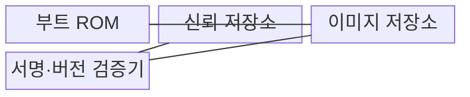
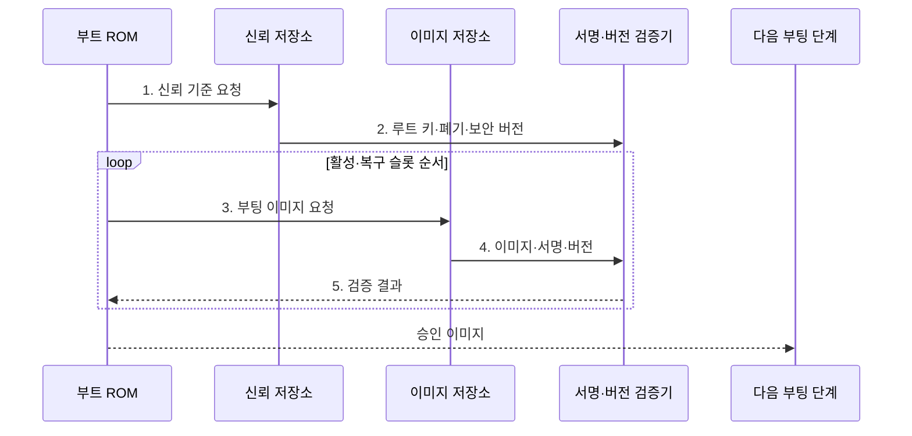

---
sidebar:
  order: 68
  label: "068. 보안 부팅 (Secure Boot)"
  badge:
    text: "기출 · 50%"
    variant: note
title: "보안 부팅 (Secure Boot)"
date: "2026-07-31T10:04:05+09:00"
tags:
  - "notes-hardware"
weight: 68
extra:
  question_no: "068"
  source_status: "기출"
  source_history: "138회"
  priority: 50
  priority_note: "신뢰 사슬·롤백 방지의 단일 기출 핵심"
---

## 미리 알고가기

- **보안 부팅(Secure Boot)**: 승인된 부팅 이미지만 검증해 실행하는 방식
- **신뢰 루트(Root of Trust)**: 첫 검증을 시작하며 하드웨어로 변경을 제한한 기준점
- **부트 읽기 전용 메모리(Boot Read-Only Memory, Boot ROM)**: 전원 인가 직후 실행하는 변경 불가능한 초기 검증 코드를 저장하는 메모리
- **일회 프로그램 가능 메모리(One-Time Programmable, OTP)·전자 퓨즈(Electronic Fuse, eFuse)**: 루트 키 해시·보안 버전·장치 설정을 변경하기 어렵게 저장하는 비휘발성 보안 영역
- **디지털 서명(Digital Signature)**: 이미지 출처·무결성을 검증하는 서명값
- **해시·무결성(Hash·Integrity)**: 해시는 이미지를 고정 길이 값으로 바꾸는 함수이고 무결성은 저장·전송 중 이미지가 변조되지 않은 성질
- **기밀성(Confidentiality)**: 허가되지 않은 주체가 코드나 데이터를 읽을 수 없게 하는 보안 성질
- **신뢰 사슬(Chain of Trust)**: 검증된 단계가 다음 단계를 검증하는 구조
- **롤백 방지(Anti-Rollback)**: 허용값보다 낮은 서명 이미지 실행 차단
- **단조 증가 카운터(Monotonic Counter)**: 값이 감소하지 않게 보호해 최소 허용 보안 버전을 기록하는 저장값
- **키 폐기(Key Revocation)**: 노출·폐기된 키의 검증 권한 제거
- **A/B 슬롯(A/B Slot)**: 활성 이미지와 갱신 이미지를 두 저장 영역에 교대로 보관하여 부팅 실패 시 검증된 슬롯으로 복구하는 구조
- **무선 업데이트(Over-the-Air Update, OTA Update)**: 네트워크를 통해 펌웨어 이미지를 원격 배포·검증·설치하는 방식
- **신뢰 저장소(Trust Store)**: 루트 키·폐기 정보·최소 보안 버전을 변조하기 어렵게 보관하는 영역
- **폐기 비트(Revocation Bit)**: 노출된 키나 인증서의 검증 권한을 끄는 보호 설정값
- **원격 증명(Remote Attestation)**: 장치의 현재 부팅·소프트웨어 상태를 서명된 증거로 원격 검증하는 절차

> **키워드:** 보안 부팅 (Secure Boot)

## Ⅰ. 개요

- 정의/개념: **신뢰 루트**가 각 단계의 **서명·버전**을 검증한 뒤 실행하는 체계
- 배경/필요성: 일반 부팅은 초기 코드의 출처·취약 버전 판별 불가

### 쉽게 이해하기 (학습용)

- 첫 문지기가 신분증을 확인하고 통과한 다음 문지기에게 검문을 넘기는 구조다.

## Ⅱ. 특징

- **서명 연쇄 검증**으로 부팅 단계의 무결성·출처 확인
- 서명은 **무결성·출처**만 검증하고 기밀성은 별도 암호화
- **단조 증가 보안 버전**으로 취약 구버전 롤백 차단

### 쉽게 이해하기 (학습용)

- 도장이 맞아도 내용이 안전하다는 뜻은 아니며 폐기 도장·구버전·미검증 예비 이미지는 거부한다.

## Ⅲ. 구조 및 구성요소

| 구성요소 | 책임 |
|:---|:---|
| 부트 ROM | **첫 검증 실행** |
| 신뢰 저장소 | **루트 키·보안 버전**과 폐기 정보 보관 |
| 이미지 저장소 | **활성·복구 이미지 보관** |
| 서명·버전 검증기 | 해시·**서명·롤백** 판정 |

### 쉽게 이해하기 (학습용)

- 변경할 수 없는 첫 코드가 키와 버전으로 다음 단계를 검증한다.

## Ⅳ. 흐름도

**동작 원리**

1. **신뢰 기준 요청**: 검증에 필요한 보호값 조회
2. **루트 키·폐기·보안 버전**: 서명 신뢰와 최소 버전 기준 전달
3. **부팅 이미지 요청**: 활성 슬롯부터 검증 대상 선택
4. **이미지·서명·버전**: 코드와 검증 메타데이터 전달
5. **검증 결과**: 출처·무결성·롤백 조건 판정

### 쉽게 이해하기 (학습용)

- 활성 슬롯이 도장이나 버전 검사에 실패하면 바로 실행하지 않고, 예비 슬롯도 같은 검문 절차로 다시 확인한다.

## Ⅴ. 종류 및 비교

| 부팅 검증 방식 | 보안 부팅 | 보안 부팅·롤백 방지 | 일반 부팅 |
|:---|:---|:---|:---|
| 적용 기준 | 비승인·**변조 이미지 차단** | 취약 구버전까지 **실행 차단** | 신뢰 검증 불필요 **폐쇄 장치** |
| 핵심 특징 | 서명 이미지의 **신뢰 사슬** | 서명·보안 버전 **연쇄 검증** | 위치·형식만 **확인 후 실행** |
| 한계 | 서명된 취약 코드·**키 노출** | 카운터·키 복구 **설계 오류** | 초기 코드 변조·**악성 실행** |

### 쉽게 이해하기 (학습용)

- 도장은 비승인 문서를 거부하고 유효기간은 폐기된 옛 문서를 차단한다.

## Ⅵ. 실무 고려사항 및 대책

| 고려사항 | 대책 | 효과 |
|:---|:---|:---|
| 노출 키가 폐기 정보에 반영되지 않음 | **폐기 비트·키 교체 훈련** | 노출 키의 **검증 권한 제거** |
| 이미지 검증 전에 보안 버전 카운터 확정 | **부팅 성공 후 카운터 갱신** | **검증된 슬롯 복구** 보장 |
| A/B 슬롯 모두 실패해 부팅 반복 | **재시도 횟수 제한·복구 모드** | **부팅 루프** 방지 |
| 서명됐지만 취약한 이미지 배포 | **취약점 관리·원격 증명** | 실행 중 **보안 상태** 검증 |

### 쉽게 이해하기 (학습용)

- 원격 갱신은 새 슬롯 성공 뒤 버전을 확정하고 실패하면 검증된 예비 슬롯으로 복구하는지 확인한다.

## Ⅶ. 결론

- **서명·보안 버전**과 키 폐기를 검증해 승인 펌웨어만 실행

### 쉽게 이해하기 (학습용)

- 루트 키·보안 버전·키 폐기 상태를 통과한 이미지에만 실행권을 넘긴다.
