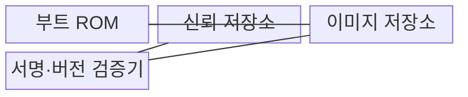
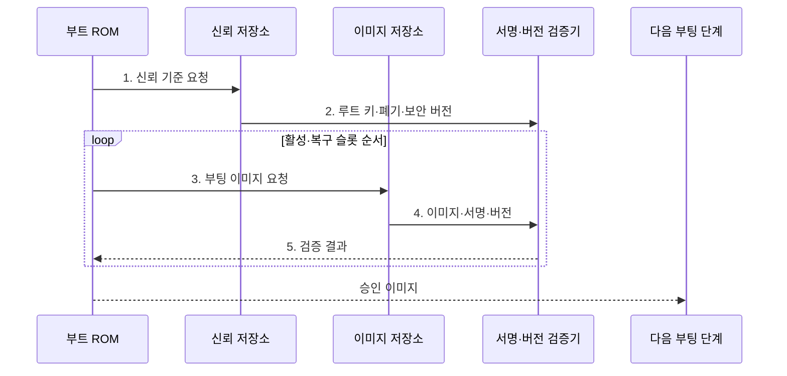

---
sidebar:
  order: 68
  label: "068. 보안 부팅 (Secure Boot)"
  badge:
    text: "기출 · 50%"
    variant: note
title: "보안 부팅 (Secure Boot)"
date: "2026-08-02T11:28:00+09:00"
tags:
  - "notes-hardware"
weight: 68
extra:
  question_no: "068"
  source_status: "기출"
  source_history: "138회"
  priority: 50
  priority_note: "신뢰 사슬·롤백 방지의 단일 기출 핵심"
---

## Ⅰ. 개요

핵심 용어

- **보안 부팅(Secure Boot)**: 하드웨어 신뢰 루트에서 시작하여 승인된 서명과 버전의 부팅 이미지만 실행하는 체계이다.
- **신뢰 루트(Root of Trust)**: 첫 검증을 시작하며 키와 코드의 변경을 하드웨어적으로 제한한 신뢰 기준점이다.
- **신뢰 사슬(Chain of Trust)**: 앞 단계가 다음 단계의 무결성과 출처를 검증한 뒤 실행권을 넘기는 구조이다.

- 정의/개념: **신뢰 루트**가 각 단계의 **서명·버전**을 검증한 뒤 실행하는 체계
- 배경/필요성: 일반 부팅은 초기 코드의 출처·취약 버전 판별 불가

### 쉽게 이해하기 (학습용)

- 첫 문지기가 신분증을 확인하고 통과한 다음 문지기에게 검문을 넘기는 구조다.

## Ⅱ. 특징

핵심 용어

- **디지털 서명(Digital Signature)**: 이미지가 승인된 키로 서명되었고 이후 변조되지 않았는지 확인하는 암호학적 값이다.
- **무결성(Integrity)**: 코드와 데이터가 저장이나 전송 중 승인 없이 변경되지 않은 성질이다.
- **기밀성(Confidentiality)**: 허가되지 않은 주체가 코드나 데이터를 읽을 수 없도록 보호하는 별도의 보안 성질이다.
- **롤백 방지(Anti-rollback)**: 최소 허용 보안 버전보다 낮은 취약 이미지를 서명이 유효해도 실행하지 않는 통제이다.

- **서명 연쇄 검증**으로 부팅 단계의 무결성·출처 확인
- 서명은 **무결성·출처**만 검증하고 기밀성은 별도 암호화
- **단조 증가 보안 버전**으로 취약 구버전 롤백 차단

### 쉽게 이해하기 (학습용)

- 도장이 맞아도 내용이 안전하다는 뜻은 아니며 폐기 도장·구버전·미검증 예비 이미지는 거부한다.

## Ⅲ. 구조 및 구성요소

핵심 용어

- **부트 읽기 전용 메모리(Boot Read-only Memory, Boot ROM)**: 전원 인가 직후 실행되는 변경 불가능한 초기 검증 코드를 저장하는 메모리이다.
- **신뢰 저장소(Trust Store)**: 루트 키와 키 폐기 정보 및 최소 보안 버전을 변조하기 어렵게 보관하는 영역이다.
- **이미지 저장소(Image Store)**: 활성 부팅 이미지와 복구 이미지를 슬롯별로 보관하는 비휘발성 저장 영역이다.
- **서명·버전 검증기(Signature·Version Verifier)**: 이미지 해시와 서명 및 보안 버전을 신뢰 기준과 비교하는 구성이다.

| 구성요소 | 책임 |
|:---|:---|
| 부트 ROM | **첫 검증 실행** |
| 신뢰 저장소 | **루트 키·보안 버전**과 폐기 정보 보관 |
| 이미지 저장소 | **활성·복구 이미지 보관** |
| 서명·버전 검증기 | 해시·**서명·롤백** 판정 |

### 쉽게 이해하기 (학습용)

- 변경할 수 없는 첫 코드가 키와 버전으로 다음 단계를 검증한다.

## Ⅳ. 흐름도

핵심 용어

- **신뢰 기준(Trust Anchor Data)**: 이미지 검증에 사용할 루트 공개키와 폐기 상태 및 최소 보안 버전 정보이다.
- **A/B 슬롯(A/B Slot)**: 활성 이미지와 갱신 이미지를 두 저장 영역에 교대로 보관하여 실패 시 정상 슬롯으로 복구하는 구조이다.
- **검증 메타데이터(Verification Metadata)**: 이미지와 함께 저장되는 서명과 버전 및 해시 알고리즘 정보이다.

**동작 원리**

1. **신뢰 기준 요청**: 검증에 필요한 보호값 조회
2. **루트 키·폐기·보안 버전**: 서명 신뢰와 최소 버전 기준 전달
3. **부팅 이미지 요청**: 활성 슬롯부터 검증 대상 선택
4. **이미지·서명·버전**: 코드와 검증 메타데이터 전달
5. **검증 결과**: 출처·무결성·롤백 조건 판정

### 쉽게 이해하기 (학습용)

- 활성 슬롯이 도장이나 버전 검사에 실패하면 바로 실행하지 않고, 예비 슬롯도 같은 검문 절차로 다시 확인한다.

## Ⅴ. 종류 및 비교

핵심 용어

- **일반 부팅(Normal Boot)**: 이미지 위치와 형식만 확인하고 암호학적 출처나 무결성 검증 없이 실행하는 방식이다.
- **서명된 취약 코드(Signed Vulnerable Code)**: 승인된 키로 서명되었지만 알려진 보안 결함을 포함한 이전 이미지이다.
- **단조 증가 카운터(Monotonic Counter)**: 값이 감소하지 않도록 보호하여 최소 허용 보안 버전을 기록하는 저장값이다.

| 부팅 검증 방식 | 보안 부팅 | 보안 부팅·롤백 방지 | 일반 부팅 |
|:---|:---|:---|:---|
| 적용 기준 | 비승인·**변조 이미지 차단** | 취약 구버전까지 **실행 차단** | 신뢰 검증 불필요 **폐쇄 장치** |
| 핵심 특징 | 서명 이미지의 **신뢰 사슬** | 서명·보안 버전 **연쇄 검증** | 위치·형식만 **확인 후 실행** |
| 한계 | 서명된 취약 코드·**키 노출** | 카운터·키 복구 **설계 오류** | 초기 코드 변조·**악성 실행** |

### 쉽게 이해하기 (학습용)

- 도장은 비승인 문서를 거부하고 유효기간은 폐기된 옛 문서를 차단한다.

## Ⅵ. 실무 고려사항 및 대책

핵심 용어

- **키 폐기(Key Revocation)**: 노출되거나 더 이상 신뢰하지 않는 키의 이미지 검증 권한을 제거하는 절차이다.
- **보안 버전 확정(Security-version Commit)**: 새 이미지가 정상 부팅된 뒤 최소 허용 버전 카운터를 올리는 처리이다.
- **복구 모드(Recovery Mode)**: 정상 슬롯들이 모두 실패했을 때 제한된 신뢰 경로로 새 이미지를 설치하는 실행 환경이다.
- **원격 증명(Remote Attestation)**: 장치의 현재 부팅과 소프트웨어 상태를 서명된 증거로 원격 검증하는 절차이다.

| 문제 | 대책 | 효과 |
|:---|:---|:---|
| 노출 키가 폐기 정보에 반영되지 않음 | **폐기 비트·키 교체 훈련** | 노출 키의 **검증 권한 제거** |
| 이미지 검증 전에 보안 버전 카운터 확정 | **부팅 성공 후 카운터 갱신** | **검증된 슬롯 복구** 보장 |
| A/B 슬롯 모두 실패해 부팅 반복 | **재시도 횟수 제한·복구 모드** | **부팅 루프** 방지 |
| 서명됐지만 취약한 이미지 배포 | **취약점 관리·원격 증명** | 실행 중 **보안 상태** 검증 |

### 쉽게 이해하기 (학습용)

- 원격 갱신은 새 슬롯 성공 뒤 버전을 확정하고 실패하면 검증된 예비 슬롯으로 복구하는지 확인한다.

## Ⅶ. 결론

핵심 용어

- **승인 펌웨어(Authorized Firmware)**: 신뢰 키의 서명과 최소 보안 버전 및 폐기 정책을 모두 통과한 실행 이미지이다.
- **키 수명주기(Key Lifecycle)**: 키의 생성과 배포, 사용, 교체 및 폐기를 관리하는 전체 절차이다.
- **부팅 신뢰성(Boot Trustworthiness)**: 전원 인가부터 승인된 소프트웨어 실행까지 각 단계가 검증된 상태를 유지하는 성질이다.

- **서명·보안 버전**과 키 폐기를 검증해 승인 펌웨어만 실행

### 쉽게 이해하기 (학습용)

- 루트 키·보안 버전·키 폐기 상태를 통과한 이미지에만 실행권을 넘긴다.
