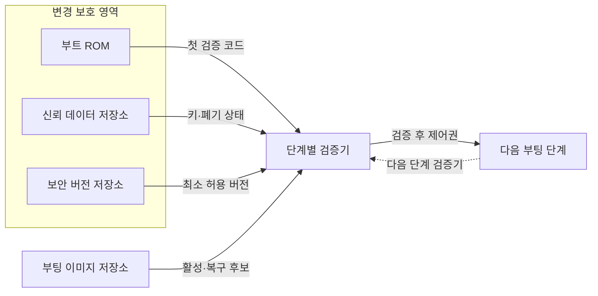
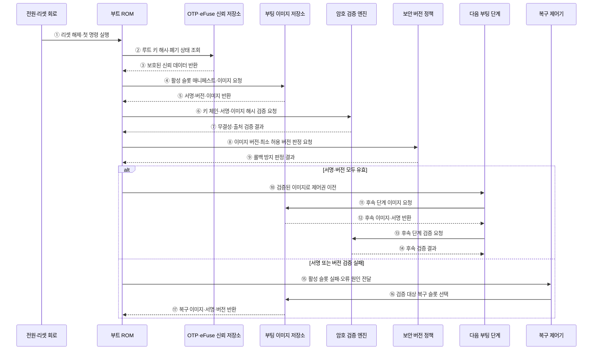

---
sidebar:
  order: 68
  label: "068. 보안 부팅 (Secure Boot)"
  badge:
    text: "기출 · 50%"
    variant: note
title: "보안 부팅 (Secure Boot)"
date: "2026-07-28T13:09:30+09:00"
tags:
  - "notes-hardware"
weight: 68
extra:
  question_no: "068"
  source_status: "기출"
  source_history: "138회"
  priority: 50
  priority_note: "신뢰 사슬·롤백 방지의 단일 기출 핵심"
---

## 미리 알고가기

- **보안 부팅(Secure Boot)**: 승인된 부팅 이미지만 검증해 실행하는 방식
- **신뢰 루트(Root of Trust)**: 첫 검증을 시작하며 하드웨어로 변경을 제한한 기준점
- **부트 읽기 전용 메모리(Boot Read-Only Memory, Boot ROM)**: 전원 인가 직후 실행하는 변경 불가능한 초기 검증 코드를 저장하는 메모리
- **일회 프로그램 가능 메모리(One-Time Programmable, OTP)·전자 퓨즈(Electronic Fuse, eFuse)**: 루트 키 해시·보안 버전·장치 설정을 변경하기 어렵게 저장하는 비휘발성 보안 영역
- **디지털 서명(Digital Signature)**: 이미지 출처·무결성을 검증하는 서명값
- **해시·무결성(Hash·Integrity)**: 해시는 이미지를 고정 길이 값으로 바꾸는 함수이고 무결성은 저장·전송 중 이미지가 변조되지 않은 성질
- **기밀성(Confidentiality)**: 허가되지 않은 주체가 코드나 데이터를 읽을 수 없게 하는 보안 성질
- **신뢰 사슬(Chain of Trust)**: 검증된 단계가 다음 단계를 검증하는 구조
- **롤백 방지(Anti-Rollback)**: 허용값보다 낮은 서명 이미지 실행 차단
- **단조 증가 카운터(Monotonic Counter)**: 값이 감소하지 않게 보호해 최소 허용 보안 버전을 기록하는 저장값
- **키 폐기(Key Revocation)**: 노출·폐기된 키의 검증 권한 제거
- **A/B 슬롯(A/B Slot)**: 활성 이미지와 갱신 이미지를 두 저장 영역에 교대로 보관하여 부팅 실패 시 검증된 슬롯으로 복구하는 구조
- **무선 업데이트(Over-the-Air Update, OTA Update)**: 네트워크를 통해 펌웨어 이미지를 원격 배포·검증·설치하는 방식

## Ⅰ. 개요

- 정의/개념: 하드웨어 신뢰 루트에서 **서명된 단계만 실행**하는 체계
- 기존 한계: 무검증 부팅은 **초기 코드 변조·악성 실행** 허용

### 쉽게 이해하기 (학습용)

- 첫 문지기가 신분증을 확인하고 통과한 다음 문지기에게 검문을 넘기는 구조다.

## Ⅱ. 특징

- **서명 연쇄 검증**으로 부팅 단계의 무결성·출처 확인
- **단조 증가 보안 버전**으로 취약 구버전 롤백 차단
- **키 교체·폐기·복구 검증**으로 신뢰 수명주기 관리
- 서명 검증은 **기밀성을 제공하지 않으므로** 코드 노출 방지는 별도 암호화·키 관리 필요

### 쉽게 이해하기 (학습용)

- 도장이 맞아도 내용이 안전하다는 뜻은 아니며 폐기 도장·구버전·미검증 예비 이미지는 거부한다.

## Ⅲ. 아키텍처 및 구성요소

### 도표안 A. 보안 부팅 신뢰 사슬 정적 구조

| 설계 요소 | 입력·상태 | 역할 |
|:---|:---|:---|
| 부트 ROM | 전원 인가·고정 코드 | 첫 검증 실행 |
| 신뢰 데이터 저장소 | 루트 키 해시·폐기 상태 | 승인 키 기준 보호 |
| 보안 버전 저장소 | 최소 버전·단조 카운터 | 구버전 실행 차단 |
| 부팅 이미지 저장소 | 활성·복구 이미지·상태 | 검증 후보 제공 |
| 단계별 검증기 | 이미지·서명·해시·버전 | 다음 단계 승인 판정 |
| 다음 부팅 단계 | 검증 결과·후속 이미지 | 실행·신뢰 사슬 연장 |

> 요약: 보호된 키·버전으로 다음 부팅 단계를 검증한다.

### 쉽게 이해하기 (학습용)

- 첫 도장과 폐기 명단과 유효기간표로 현재 문서와 예비 문서를 검사하는 구조다.

### 도표안 B. 서명·버전 검증 및 복구 부팅 시퀀스

#### 동작 원리

1. **신뢰 실행 시작**: 전원·리셋 회로가 변경 불가능한 부트 ROM의 첫 명령부터 실행하게 한다.
2. **신뢰 기준 조회**: 부트 ROM이 OTP·eFuse에서 루트 키 해시와 키 폐기 상태를 요청한다.
3. **보호 데이터 반환**: 신뢰 저장소가 하드웨어로 변경을 제한한 검증 기준을 반환한다.
4. **활성 이미지 요청**: 부트 ROM이 현재 활성 슬롯의 매니페스트와 이미지를 읽는다.
5. **검증 자료 반환**: 저장소가 서명·보안 버전·이미지 본문을 부트 ROM에 제공한다.
6. **암호 검증 요청**: 부트 ROM이 승인 키 체인, 디지털 서명과 계산된 이미지 해시의 검증을 요청한다.
7. **출처·무결성 판정**: 암호 검증 엔진이 승인된 키의 서명인지, 이미지가 변조되지 않았는지 반환한다.
8. **버전 판정 요청**: 부트 ROM이 이미지 버전과 보호된 최소 허용 버전의 비교를 요청한다.
9. **롤백 판정**: 보안 버전 정책이 이미지 버전이 최소 허용값 이상인지 반환한다.
10. **제어권 이전**: 서명과 버전이 모두 유효할 때만 다음 부팅 단계의 검증된 진입점으로 이동한다.
11. **후속 이미지 요청**: 검증된 다음 단계가 커널 등 후속 단계 이미지를 저장소에 요청한다.
12. **후속 자료 반환**: 저장소가 후속 이미지와 서명을 다음 단계에 반환한다.
13. **신뢰 사슬 연장**: 현재의 검증된 단계가 후속 단계의 서명·해시 검증을 요청한다.
14. **후속 검증 완료**: 검증 결과가 유효할 때만 후속 단계로 신뢰 사슬을 연장한다.
15. **실패 전달**: 서명이나 버전이 유효하지 않으면 부트 ROM이 오류 원인과 슬롯 상태를 복구 제어기에 전달한다.
16. **복구 후보 선택**: 복구 제어기가 시도 횟수와 건강 상태를 고려해 검증할 A/B 복구 슬롯을 선택한다.
17. **복구 재검증**: 저장소가 복구 후보를 부트 ROM에 반환하며, 부트 ROM은 동일한 서명·버전 절차를 처음부터 다시 적용한다.

### 쉽게 이해하기 (학습용)

- 활성 슬롯이 도장이나 버전 검사에 실패하면 바로 실행하지 않고, 예비 슬롯도 같은 검문 절차로 다시 확인한다.

## Ⅳ. 종류 및 비교

| 부팅 검증 방식 | 보안 부팅 | 보안 부팅·롤백 방지 | 일반 부팅 |
|:---|:---|:---|:---|
| 적용 기준 | 비승인·**변조 이미지 차단** | 취약 구버전까지 **실행 차단** | 신뢰 검증 불필요 **폐쇄 장치** |
| 핵심 특징 | 서명 이미지의 **신뢰 사슬** | 서명·보안 버전 **연쇄 검증** | 위치·형식만 **확인 후 실행** |
| 한계 | 서명된 취약 코드·**키 노출** | 카운터·키 복구 **설계 오류** | 초기 코드 변조·**악성 실행** |

> 요약: 서명은 비승인 코드, 버전은 구버전을 차단한다.

### 쉽게 이해하기 (학습용)

- 도장은 비승인 문서를 거부하고 유효기간은 폐기된 옛 문서를 차단한다.

## Ⅴ. 실무 고려사항 및 대응 방안

| 운영 위험 | 대응 | 기대 효과 |
|:---|:---|:---|
| 노출 키가 폐기 목록에 반영되지 않음 | 다중 루트·폐기 비트와 키 교체·복구 훈련 적용 | 신뢰 수명주기 유지 |
| 새 이미지 확인 전에 보안 버전을 올려 롤백 불가 | 부팅 성공·상태 마이그레이션 후 카운터 확정 | 업데이트 실패 복구 보장 |
| A/B 슬롯이 반복 실패하며 부팅 루프 발생 | 시도 횟수·건강 확인·최종 복구 모드와 진단 로그 적용 | 가용성·원인 분석 향상 |
| 서명된 취약 코드가 정상 실행 | 서명·버전 외 측정·취약점 관리와 원격 증명 연계 | 승인 코드의 보안 상태 확인 |

### 쉽게 이해하기 (학습용)

- 서명이나 버전 검증에 실패하면 미검증 복구 이미지를 시험하고 없으면 부팅을 중단한다.

### 적용 사례

- 무선 업데이트는 비활성 A/B 슬롯에 새 이미지를 기록하고 서명·버전·부팅 건강 상태를 확인한 뒤 활성화하며, 실패하면 기존의 검증된 슬롯으로 복구한다.

### 쉽게 이해하기 (학습용)

- 원격 갱신은 새 슬롯 성공 뒤 버전을 확정하고 실패하면 검증된 예비 슬롯으로 복구하는지 확인한다.

## Ⅵ. 결론

- 변조되거나 취약한 펌웨어의 실행을 차단하기 위해 **신뢰 시작점·서명 체인·버전 롤백·키 폐기·복구 이미지**를 검토하고, 모든 검증을 통과한 부팅과 복구만 허용한다

### 쉽게 이해하기 (학습용)

- 루트 키부터 인증서 유효기간·폐기 상태·복구 이미지까지 신뢰 체인을 끊김 없이 검증해야 한다.
