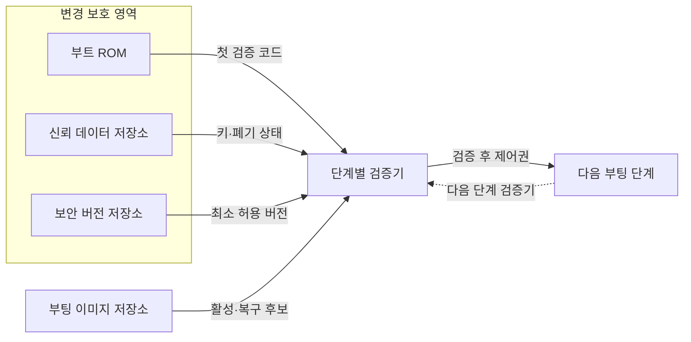
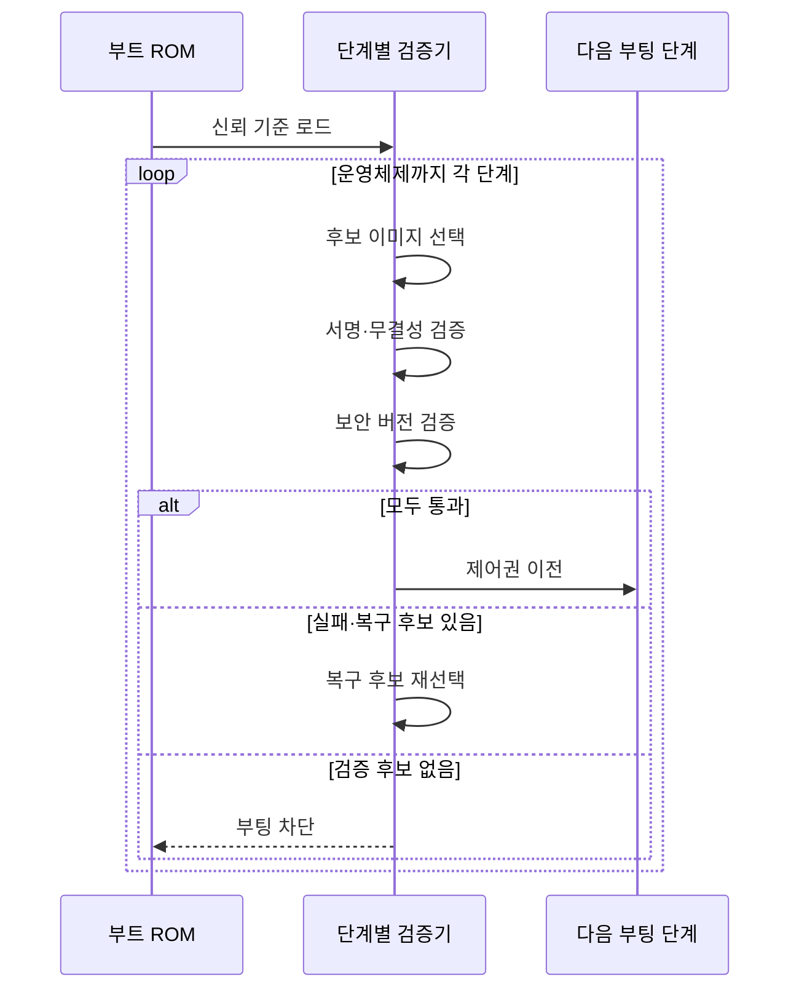

---
sidebar:
  order: 68
  label: "068. 보안 부팅 (Secure Boot)"
  badge:
    text: "기출 · 50%"
    variant: note
title: "보안 부팅 (Secure Boot)"
date: "2026-07-27T23:59:59+09:00"
tags:
  - "notes-hardware"
weight: 68
extra:
  question_no: "068"
  source_status: "기출"
  source_history: "138회"
  priority: 50
  priority_note: "신뢰 사슬·롤백 방지의 단일 기출 핵심"
---

## 미리 알고가기

- **보안 부팅(Secure Boot)**: 승인된 부팅 이미지만 검증해 실행하는 방식
- **신뢰 루트(Root of Trust)**: 첫 검증을 시작하며 하드웨어로 변경을 제한한 기준점
- **부트 읽기 전용 메모리(Boot Read-Only Memory, Boot ROM)**: ‘부트 롬’으로 읽고 Read-Only Memory의 머리글자를 단어처럼 만든 약어이며, 초기 검증 코드를 저장
- **일회 프로그램 가능 메모리(One-Time Programmable, OTP)·전자 퓨즈(Electronic Fuse, eFuse)**: ‘오티피·이퓨즈’로 읽고 OTP는 영문 머리글자, eFuse는 electronic과 fuse를 결합한 표기이며, 루트 키 해시·버전을 보호
- **디지털 서명(Digital Signature)**: 이미지 출처·무결성을 검증하는 서명값
- **해시·무결성(Hash·Integrity)**: 해시는 이미지를 고정 길이 값으로 바꾸는 함수이고 무결성은 저장·전송 중 이미지가 변조되지 않은 성질
- **기밀성(Confidentiality)**: 허가되지 않은 주체가 코드나 데이터를 읽을 수 없게 하는 보안 성질
- **신뢰 사슬(Chain of Trust)**: 검증된 단계가 다음 단계를 검증하는 구조
- **롤백 방지(Anti-Rollback)**: 허용값보다 낮은 서명 이미지 실행 차단
- **단조 증가 카운터(Monotonic Counter)**: 값이 감소하지 않게 보호해 최소 허용 보안 버전을 기록하는 저장값
- **키 폐기(Key Revocation)**: 노출·폐기된 키의 검증 권한 제거
- **A/B 슬롯(A/B Slot)**: A/B는 ‘에이·비’로 읽고 두 교대 저장 영역을 구분하는 관례적 표기로, 활성 이미지와 복구 이미지를 나눠 저장해 갱신 실패 시 검증된 슬롯으로 전환
- **무선 업데이트(Over-the-Air Update, OTA Update)**: ‘오티에이 업데이트’로 읽고 영문 머리글자를 딴 약어이며, 네트워크로 펌웨어를 배포·설치

## Ⅰ. 개요

- 정의/개념: 하드웨어 신뢰 루트에서 **서명된 단계만 실행**하는 체계
- 기존 한계: 무검증 부팅은 **초기 코드 변조·악성 실행** 허용

### 쉽게 이해하기 (학습용)

- 첫 문지기가 신분증을 확인하고 통과한 다음 문지기에게 검문을 넘기는 구조다.

## Ⅱ. 특징

- **서명 연쇄 검증**으로 부팅 단계의 무결성·출처 확인
- **단조 증가 보안 버전**으로 취약 구버전 롤백 차단
- **키 교체·폐기·복구 검증**으로 신뢰 수명주기 관리

### 쉽게 이해하기 (학습용)

- 도장이 맞아도 내용이 안전하다는 뜻은 아니며 폐기 도장·구버전·미검증 예비 이미지는 거부한다.

## Ⅲ. 아키텍처 및 구성요소

| 설계 요소 | 설명 |
|:---|:---|
| 부트 ROM | 하드웨어로 변경을 제한한 첫 검증 코드 |
| 신뢰 데이터 저장소 | OTP·eFuse에 루트 키 해시·폐기 상태 보호 |
| 보안 버전 저장소 | 최소 허용 버전을 단조 증가로 보호 |
| 부팅 이미지 저장소 | 활성 이미지와 구성된 복구 후보 저장 |
| 단계별 검증기 | 다음 이미지의 서명·해시·버전 검사 |
| 다음 부팅 단계 | 검증 후 실행되어 신뢰 사슬 연장 |

> 요약: 보호된 키·버전으로 다음 부팅 단계를 검증한다.

### 쉽게 이해하기 (학습용)

- 첫 도장과 폐기 명단과 유효기간표로 현재 문서와 예비 문서를 검사하는 구조다.

## Ⅳ. 원리 및 절차 흐름도

| 절차 | 설명 |
|:---|:---|
| 신뢰 기준 로드 | 루트 키·폐기 상태·최소 버전 로드 |
| 후보 이미지 선택 | 활성 슬롯이나 미검증 복구 슬롯 지정 |
| 서명·무결성 검증 | 승인 키의 서명과 이미지 해시 확인 |
| 보안 버전 검증 | 버전을 보호 저장소의 최솟값과 비교 |
| 제어권 이전 | 통과한 다음 부팅 단계만 실행 |
| 복구 후보 재선택 | 실패 슬롯을 제외하고 예비 슬롯 지정 |
| 부팅 차단 | 검증 후보가 없으면 실행 차단 |

> 요약: 각 단계를 검증하고 실패하면 복구 후보를 재검증한다.

### 쉽게 이해하기 (학습용)

- 서명이나 버전 검증에 실패하면 미검증 복구 이미지를 시험하고 없으면 부팅을 중단한다.

## Ⅴ. 종류 및 비교

| 부팅 검증 방식 | 보안 부팅 | 보안 부팅·롤백 방지 | 일반 부팅 |
|:---|:---|:---|:---|
| 적용 기준 | 비승인·**변조 이미지 차단** | 취약 구버전까지 **실행 차단** | 신뢰 검증 불필요 **폐쇄 장치** |
| 핵심 특징 | 서명 이미지의 **신뢰 사슬** | 서명·보안 버전 **연쇄 검증** | 위치·형식만 **확인 후 실행** |
| 한계 | 서명된 취약 코드·**키 노출** | 카운터·키 복구 **설계 오류** | 초기 코드 변조·**악성 실행** |

> 요약: 서명은 비승인 코드, 버전은 구버전을 차단한다.

### 쉽게 이해하기 (학습용)

- 도장은 비승인 문서를 거부하고 유효기간은 폐기된 옛 문서를 차단한다.

## Ⅵ. 실무 사례

1. 무선 업데이트는 **A/B 서명·버전·복구** 시험

### 쉽게 이해하기 (학습용)

- 원격 갱신은 새 슬롯 성공 뒤 버전을 확정하고 실패하면 검증된 예비 슬롯으로 복구하는지 확인한다.

## Ⅶ. 결론

- **서명·버전·키 상태**를 검증한 부팅·복구만 허용

### 쉽게 이해하기 (학습용)

- 첫 도장부터 유효기간과 폐기 명단과 예비 문서까지 끊김 없이 검증해야 한다.
