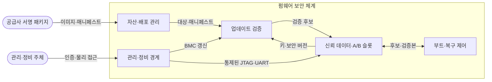
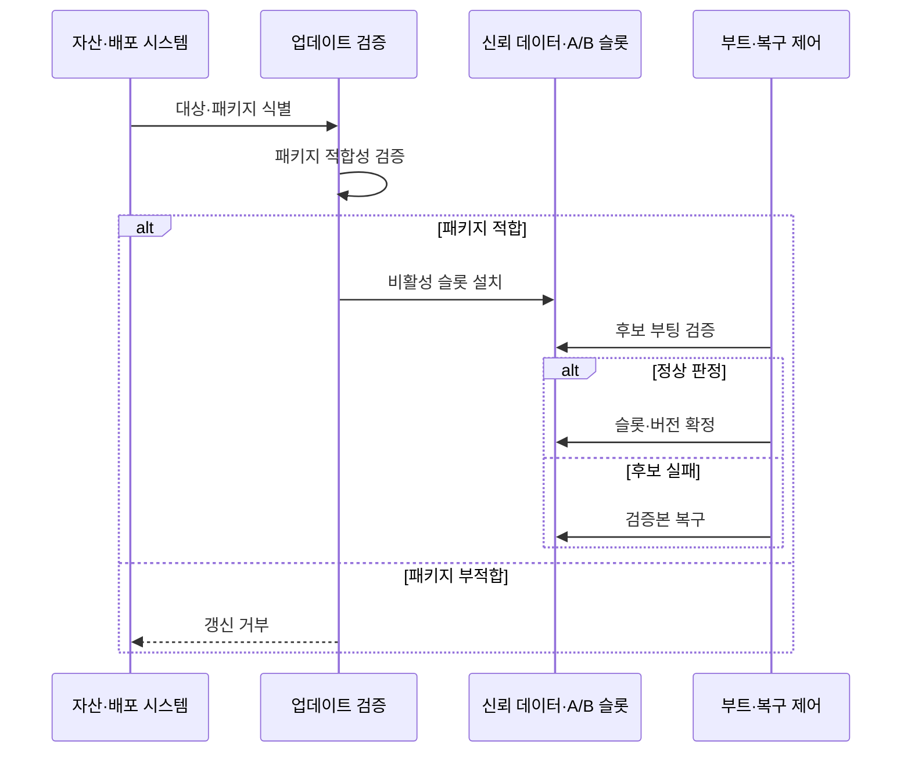

---
sidebar:
  order: 69
  label: "069. 펌웨어 보안 취약점"
  badge:
    text: "기출 · 70%"
    variant: note
title: "펌웨어 보안 취약점"
date: "2026-07-27T23:59:59+09:00"
tags:
  - "notes-hardware"
weight: 69
extra:
  question_no: "069"
  source_status: "기출"
  source_history: "138회"
  priority: 70
  priority_note: "공급망·부트·복구의 고확장 기출 핵심"
---

## 미리 알고가기

- **펌웨어(Firmware)**: 부팅과 하드웨어 제어를 맡는 저수준 코드
- **운영체제(Operating System, OS)**: ‘오에스’로 읽고 영문 머리글자를 딴 약어이며, 응용과 하드웨어 자원을 관리
- **베이스보드 관리 제어기(Baseboard Management Controller, BMC)**: ‘비엠시’로 읽고 영문 머리글자를 딴 약어이며, 서버를 운영체제와 독립적으로 원격 관리
- **보안 부팅(Secure Boot)**: 부팅 구성요소의 서명을 검증해 실행
- **펌웨어 매니페스트(Firmware Manifest)**: 모델·버전·해시·의존성·서명 정보
- **소프트웨어 자재 명세서(Software Bill of Materials, SBOM)**: ‘에스봄’으로 읽고 영문 머리글자를 단어처럼 만든 약어이며, 구성요소·버전·공급처를 추적
- **합동 테스트 작업 그룹(Joint Test Action Group, JTAG) 인터페이스**: ‘제이태그’로 읽고 작업 그룹명 머리글자를 단어처럼 만든 약어이며, 칩 시험·디버그용 물리 포트
- **범용 비동기 송수신기(Universal Asynchronous Receiver-Transmitter, UART)**: ‘유아트’로 읽고 영문 머리글자를 단어처럼 만든 약어이며, 직렬 통신·부팅 콘솔을 제공
- **서명 업데이트(Signed Update)**: 승인 키로 서명한 패키지만 설치
- **A/B 업데이트(A/B Update)**: A/B는 ‘에이·비’로 읽고 두 교대 저장 영역을 구분하는 관례적 표기로, 새 펌웨어를 비활성 슬롯에서 검증하고 실패하면 정상 슬롯으로 복귀
- **롤백 방지(Anti-Rollback)**: 보안 버전보다 낮은 서명 이미지 설치 차단
- **공급망(Supply Chain)**: 펌웨어의 설계·구성요소 조달·빌드·서명·배포에 참여하는 조직과 절차의 연결망
- **권한 상승(Privilege Escalation)**: 취약점을 이용해 원래 허용 범위보다 높은 시스템 권한을 얻는 공격
- **의존성(Dependency)**: 펌웨어가 빌드나 실행에 필요로 하는 외부 구성요소와 버전 관계
- **자격 증명(Credential)**: 장치나 관리자의 신원을 증명하는 키·인증서·암호 정보
- **무결성 측정(Integrity Measurement)**: 펌웨어의 해시를 기록·비교해 실행 코드의 변조 여부를 확인하는 절차
- **관리망(Management Network)**: BMC 같은 관리 인터페이스만 분리해 연결하는 전용 네트워크

## Ⅰ. 개요

- 정의/개념: 부팅·장치 제어를 담당하는 **고권한 코드의 취약성**
- 기존 한계: OS 보안만으로는 **부팅 전 침해·재설치 후 잔존** 통제 곤란

### 쉽게 이해하기 (학습용)

- 경비원보다 먼저 문과 전기를 다루는 관리실은 건물 안 보안만으로 복구되지 않는다.

## Ⅱ. 특징

- **OS 이전 고권한 실행**으로 침해 지속성 증가
- **긴 수명·공급망 분산**으로 패치 지연 확대
- 서명 검증만으로 **취약 코드·오설정** 차단 불가

### 쉽게 이해하기 (학습용)

- 관리실 코드는 운영체제보다 먼저 켜지고 여러 업체가 오래 관리해 침해와 패치 누락이 오래 남는다.

## Ⅲ. 아키텍처 및 구성요소

| 설계 요소 | 설명 |
|:---|:---|
| 자산·배포 관리 | 기기·SBOM·버전·공급처·패키지 매핑 |
| 업데이트 검증 | 서명·권한·모델·의존성·보안 버전 판정 |
| 신뢰 데이터·A/B 슬롯 | 검증 키·비밀과 A/B 이미지 분리 보호 |
| 부트·복구 제어 | 후보 부팅 판정과 검증본 복구 |
| 관리·정비 경계 | BMC·JTAG·UART 접근 인증·격리 |

> 요약: 자산·갱신·부트·관리 경계를 분리해 통제한다

### 쉽게 이해하기 (학습용)

- 새 관리 프로그램은 서명, 원격 관리자는 열쇠, 정비자는 출입 권한을 확인한 뒤 관리실에 들인다.

## Ⅳ. 원리 및 절차 흐름도

| 절차 | 설명 |
|:---|:---|
| 대상·패키지 식별 | 기기·모델·구성·버전과 패키지 매핑 |
| 패키지 적합성 검증 | 서명·권한·모델·의존성·버전 판정 |
| 비활성 슬롯 설치 | 활성 슬롯과 분리해 후보 기록 |
| 후보 부팅 검증 | 이미지 인증 후 부팅·기능 판정 |
| 슬롯·버전 확정 | 성공 슬롯 활성화·보안 버전 상향 |
| 검증본 복구 | 후보 실패 시 이전 검증본 재선택 |
| 갱신 거부 | 서명·권한·대상·버전 부적합 |

> 요약: 후보를 분리 설치하고 실패하면 검증본으로 복구한다

### 쉽게 이해하기 (학습용)

- 새 관리 프로그램은 예비 방에서 검사하고 정상 동작을 확인한 뒤에만 주 방으로 바꾼다.

## Ⅴ. 종류 및 비교

| 취약점 위치 | 펌웨어 | 애플리케이션 |
|:---|:---|:---|
| 적용 기준 | 공급망·부트·**BMC·디버그 보호** | 입력·라이브러리·**응용 권한 보호** |
| 핵심 특징 | OS 밖 **고권한 부팅·장치 제어** | OS 위 **사용자 프로세스 실행** |
| 한계 | 재설치 후 잔존·**복구 경로 제한** | 패치 지연·**권한 상승** |

> 요약: 펌웨어 보안은 OS 밖 실행·갱신 경계를 통제한다

### 쉽게 이해하기 (학습용)

- 방 안 프로그램은 다시 깔 수 있지만 관리실 코드는 예비 관리실과 수리 통로까지 준비해야 한다.

## Ⅵ. 실무 사례

1. 서버 BMC는 **기기별 자격증명**으로 관리망 접속

### 쉽게 이해하기 (학습용)

- 서버 관리실은 업무망과 분리하고 기기마다 다른 열쇠로만 들어간다.

## Ⅶ. 결론

- 자산별 **서명 갱신·측정 부팅·검증본 복구** 적용

### 쉽게 이해하기 (학습용)

- 관리실마다 승인된 변경·변조 확인·정상본 복구 방법을 선택한다.
