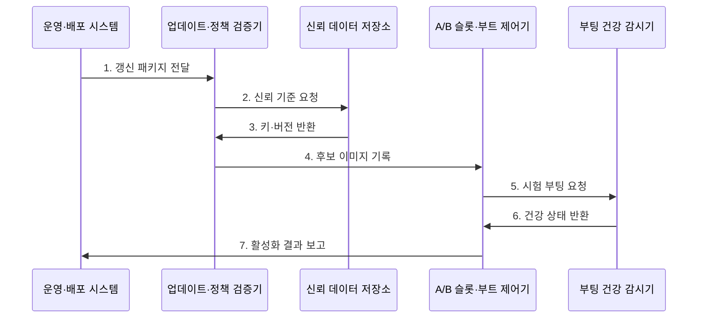

---
sidebar:
  order: 69
  label: "069. 펌웨어 보안 취약점"
  badge:
    text: "기출 · 70%"
    variant: note
title: "펌웨어 보안 취약점"
date: "2026-07-28T13:09:56+09:00"
tags:
  - "notes-hardware"
weight: 69
extra:
  question_no: "069"
  source_status: "기출"
  source_history: "138회"
  priority: 70
  priority_note: "공급망·부트·복구의 고확장 기출 핵심"
---

## 미리 알고가기

- **펌웨어(Firmware)**: 부팅과 하드웨어 제어를 맡는 저수준 코드
- **운영체제(Operating System, OS)**: 응용 프로그램의 실행과 프로세서·메모리·장치 자원을 관리하는 시스템 소프트웨어
- **베이스보드 관리 제어기(Baseboard Management Controller, BMC)**: 운영체제와 독립적으로 서버의 전원·센서·펌웨어를 원격 관리하는 제어기
- **보안 부팅(Secure Boot)**: 부팅 구성요소의 서명을 검증해 실행
- **펌웨어 매니페스트(Firmware Manifest)**: 모델·버전·해시·의존성·서명 정보
- **소프트웨어 자재 명세서(Software Bill of Materials, SBOM)**: 펌웨어에 포함된 구성요소·버전·공급처·의존성을 추적하는 명세
- **합동 테스트 작업 그룹(Joint Test Action Group, JTAG) 인터페이스**: 칩의 경계 스캔·시험·디버깅에 사용하는 물리 인터페이스
- **범용 비동기 송수신기(Universal Asynchronous Receiver-Transmitter, UART)**: 펌웨어 로그와 부팅 콘솔을 제공하는 비동기 직렬 통신 장치
- **서명 업데이트(Signed Update)**: 승인 키로 서명한 패키지만 설치
- **A/B 업데이트(A/B Update)**: 새 펌웨어를 비활성 슬롯에 설치·검증하고 부팅 실패 시 기존 정상 슬롯으로 복귀하는 갱신 방식
- **롤백 방지(Anti-Rollback)**: 보안 버전보다 낮은 서명 이미지 설치 차단
- **공급망(Supply Chain)**: 펌웨어의 설계·구성요소 조달·빌드·서명·배포에 참여하는 조직과 절차의 연결망
- **권한 상승(Privilege Escalation)**: 취약점을 이용해 원래 허용 범위보다 높은 시스템 권한을 얻는 공격
- **의존성(Dependency)**: 펌웨어가 빌드나 실행에 필요로 하는 외부 구성요소와 버전 관계
- **자격 증명(Credential)**: 장치나 관리자의 신원을 증명하는 키·인증서·암호 정보
- **무결성 측정(Integrity Measurement)**: 펌웨어의 해시를 기록·비교해 실행 코드의 변조 여부를 확인하는 절차
- **관리망(Management Network)**: BMC 같은 관리 인터페이스만 분리해 연결하는 전용 네트워크

## Ⅰ. 개요

- 정의/개념: 부팅·장치 제어용 **고권한 코드를 보호하는 보안 영역**
- 배경/필요성: 부팅 전 침해와 재설치 후 잔존 통제

### 쉽게 이해하기 (학습용)

- 운영체제보다 먼저 실행되고 하드웨어를 직접 제어하는 펌웨어가 침해되면 운영체제 보안만으로 신뢰를 복구할 수 없다.

## Ⅱ. 특징

- **OS 이전 고권한 실행**으로 침해 지속성 증가
- **긴 수명·공급망 분산**으로 패치 지연 확대
- 서명 검증만으로 **취약 코드·오설정** 차단 불가

### 쉽게 이해하기 (학습용)

- 관리실 코드는 운영체제보다 먼저 켜지고 여러 업체가 오래 관리해 침해와 패치 누락이 오래 남는다.

## Ⅲ. 구조 및 구성요소

| 구성요소 | 책임 |
|:---|:---|
| 자산·배포 관리 | **기기·SBOM 추적** |
| 업데이트 검증 | **서명·버전 판정** |
| 신뢰 데이터 | **키·폐기 상태 보호** |
| A/B 슬롯 | **후보·정상본 분리** |
| 부트·복구 제어 | **활성화·롤백 결정** |

### 쉽게 이해하기 (학습용)

- 새 이미지는 별도 슬롯에서 검증한 뒤 정상일 때만 활성화한다.

## Ⅳ. 흐름도

**동작 원리**

- **1. 갱신 패키지 전달**: 이미지·SBOM 수신
- **2. 신뢰 기준 요청**: 키·폐기·버전 조회
- **3. 키·버전 반환**: 보호 기준 제공
- **4. 후보 이미지 기록**: 비활성 슬롯 저장
- **5. 시험 부팅 요청**: 제한 실행
- **6. 건강 상태 반환**: 서비스·장치 확인
- **7. 활성화 결과 보고**: 확정 또는 롤백

### 쉽게 이해하기 (학습용)

- 새 펌웨어는 빈 방에 설치해 서명·취약점·부팅 상태를 모두 확인한 뒤에만 주 방으로 확정한다.

## Ⅴ. 종류 및 비교

| 취약점 위치 | 펌웨어 | 애플리케이션 |
|:---|:---|:---|
| 적용 기준 | 공급망·부트·**BMC·디버그 보호** | 입력·라이브러리·**응용 권한 보호** |
| 핵심 특징 | OS 밖 **고권한 부팅·장치 제어** | OS 위 **사용자 프로세스 실행** |
| 한계 | 재설치 후 잔존·**복구 경로 제한** | 패치 지연·**권한 상승** |

### 쉽게 이해하기 (학습용)

- 방 안 프로그램은 다시 깔 수 있지만 관리실 코드는 예비 관리실과 수리 통로까지 준비해야 한다.

## Ⅵ. 실무 고려사항 및 대책

| 고려사항 | 대책 | 효과 |
|:---|:---|:---|
| 자산·SBOM 누락 | 배포 이력과 식별자 연결 | **영향 범위 파악** |
| 취약 코드 설치 | 취약점·의존성 검증 | **취약 버전 차단** |
| 관리 포트 노출 | 관리망 격리·출하 잠금 | **고권한 경로 보호** |
| 복구 이미지 실패 | 다중 키·A/B 복구 훈련 | **갱신 복원력 확보** |

### 쉽게 이해하기 (학습용)

- 서버 관리실은 업무망과 분리하고 기기마다 다른 열쇠로만 들어간다.

## Ⅶ. 결론

- 서명·버전·A/B 복구를 기준으로 펌웨어 갱신을 통제한다.

### 쉽게 이해하기 (학습용)

- 관리실마다 승인된 변경·변조 확인·정상본 복구 방법을 선택한다.
