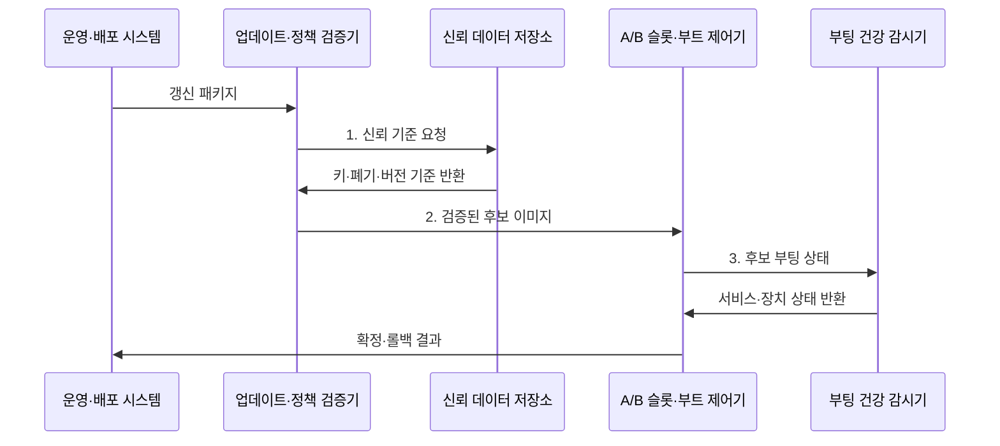

---
sidebar:
  order: 69
  label: "069. 펌웨어 보안 취약점"
  badge:
    text: "기출 · 70%"
    variant: note
title: "펌웨어 보안 취약점"
date: "2026-08-02T11:29:00+09:00"
tags:
  - "notes-hardware"
weight: 69
extra:
  question_no: "069"
  source_status: "기출"
  source_history: "138회"
  priority: 70
  priority_note: "공급망·부트·복구의 고확장 기출 핵심"
---

## Ⅰ. 개요

핵심 용어

- **펌웨어(Firmware)**: 운영체제보다 먼저 실행되어 부팅과 하드웨어 초기화 및 장치 제어를 담당하는 저수준 코드이다.
- **펌웨어 취약점(Firmware Vulnerability)**: 공급망과 부팅·갱신·관리 경로에서 고권한 코드의 변조나 오용을 허용하는 보안 결함이다.
- **침해 잔존성(Compromise Persistence)**: 운영체제를 재설치해도 더 낮은 계층의 악성 코드나 설정이 계속 남아 실행되는 성질이다.

- 정의/개념: 공급망·부팅·갱신·관리 경로에서 **고권한 펌웨어의 변조나 오용을 허용하는 보안 결함**
- 배경/필요성: OS 재설치만으로는 **펌웨어 침해 잔존 제거 불가**

### 쉽게 이해하기 (학습용)

- 운영체제보다 먼저 실행되고 하드웨어를 직접 제어하는 펌웨어가 침해되면 운영체제 보안만으로 신뢰를 복구할 수 없다.

## Ⅱ. 특징

핵심 용어

- **OS 이전 실행(Pre-OS Execution)**: 운영체제 보안 기능이 시작되기 전에 펌웨어가 높은 권한으로 실행되는 단계이다.
- **공급망(Supply Chain)**: 펌웨어 설계와 구성요소 조달, 빌드, 서명 및 배포에 참여하는 조직과 절차의 연결망이다.
- **서명된 취약 코드(Signed Vulnerable Code)**: 출처와 무결성 검증은 통과하지만 알려진 보안 결함을 포함한 이미지이다.

- **OS 이전 고권한 실행**으로 침해 지속성 증가
- **긴 수명·공급망 분산**으로 패치 지연 확대
- 서명 검증만으로 **취약 코드·오설정** 차단 불가

### 쉽게 이해하기 (학습용)

- 관리실 코드는 운영체제보다 먼저 켜지고 여러 업체가 오래 관리해 침해와 패치 누락이 오래 남는다.

## Ⅲ. 구조 및 구성요소

핵심 용어

- **소프트웨어 자재 명세서(Software Bill of Materials, SBOM)**: 펌웨어에 포함된 구성요소와 버전, 공급처 및 의존성을 추적하는 명세이다.
- **업데이트 검증(Update Verification)**: 후보 이미지의 서명과 버전, 해시 및 장치 호환성을 설치 전에 판정하는 과정이다.
- **신뢰 저장소(Trust Store)**: 서명 키와 키 폐기 상태 및 최소 보안 버전을 변조하기 어렵게 보관하는 영역이다.
- **A/B 슬롯(A/B Slot)**: 새 후보와 기존 정상 이미지를 별도 영역에 보관하여 실패 시 복구할 수 있게 한 구성이다.

| 구성요소 | 책임 |
|:---|:---|
| 자산·배포 관리 | **기기·SBOM 추적** |
| 업데이트 검증 | **서명·버전 판정** |
| 신뢰 저장소 | **서명 키·보안 버전**과 폐기 상태 보호 |
| A/B 슬롯 | **후보·정상본 분리** |
| 부트·복구 제어 | **활성화·롤백 결정** |

### 쉽게 이해하기 (학습용)

- 새 이미지는 별도 슬롯에서 검증한 뒤 정상일 때만 활성화한다.

## Ⅳ. 흐름도

핵심 용어

- **갱신 패키지(Update Package)**: 펌웨어 이미지와 모델·버전·해시·의존성 및 서명을 함께 담은 배포 단위이다.
- **비활성 슬롯(Inactive Slot)**: 현재 부팅에 사용하지 않아 새 후보 이미지를 안전하게 기록하고 검증할 수 있는 저장 영역이다.
- **부팅 건강 감시(Boot-health Monitoring)**: 후보 부팅 뒤 핵심 서비스와 장치가 정상 동작하는지 확인하는 절차이다.

**동작 원리**

1. **신뢰 기준 요청**: 키·폐기 목록·최소 보안 버전 조회
2. **검증된 후보 이미지**: 정상 슬롯을 보존하고 비활성 슬롯에 기록
3. **후보 부팅 상태**: 핵심 서비스와 장치의 정상 동작 검증

### 쉽게 이해하기 (학습용)

- 새 펌웨어는 빈 방에 설치해 서명·취약점·부팅 상태를 모두 확인한 뒤에만 주 방으로 확정한다.

## Ⅴ. 종류 및 비교

핵심 용어

- **베이스보드 관리 제어기(Baseboard Management Controller, BMC)**: 운영체제와 독립적으로 서버의 전원과 센서 및 펌웨어를 원격 관리하는 제어기이다.
- **권한 상승(Privilege Escalation)**: 취약점을 이용하여 원래 허용된 범위보다 높은 시스템 권한을 얻는 공격이다.
- **복구 경로(Recovery Path)**: 정상 부팅이나 업데이트가 실패했을 때 검증된 이미지와 제한된 기능으로 장치를 복원하는 경로이다.

| 취약점 위치 | 펌웨어 | 애플리케이션 |
|:---|:---|:---|
| 적용 기준 | 공급망·부트·**BMC·디버그 보호** | 입력·라이브러리·**응용 권한 보호** |
| 핵심 특징 | OS 밖 **고권한 부팅·장치 제어** | OS 위 **사용자 프로세스 실행** |
| 한계 | 재설치 후 잔존·**복구 경로 제한** | 패치 지연·**권한 상승** |

### 쉽게 이해하기 (학습용)

- 방 안 프로그램은 다시 깔 수 있지만 관리실 코드는 예비 관리실과 수리 통로까지 준비해야 한다.

## Ⅵ. 실무 고려사항 및 대책

핵심 용어

- **배포 이력(Deployment History)**: 장치별로 설치한 펌웨어 버전과 시각 및 성공·실패 결과를 연결해 기록한 자료이다.
- **의존성 검증(Dependency Validation)**: SBOM의 구성요소 버전과 알려진 취약점 및 호환 관계를 설치 전에 확인하는 과정이다.
- **관리망 격리(Management-network Isolation)**: BMC와 관리 포트를 서비스 데이터망에서 분리하여 접근 경로를 제한하는 통제이다.
- **다중 키(Multiple Signing Keys)**: 한 서명 키의 폐기나 장애에도 승인된 대체 키로 업데이트와 복구를 계속할 수 있게 한 구성이다.

| 문제 | 대책 | 효과 |
|:---|:---|:---|
| 펌웨어 자산·SBOM 누락으로 영향 장치 식별 지연 | **배포 이력·장치 식별자 연결** | **영향 장치 범위** 추적 |
| 알려진 취약 의존성이 후보 이미지에 포함 | **SBOM 취약점·의존성 검증** | **취약 버전 설치** 차단 |
| BMC·JTAG·UART 관리 포트 외부 노출 | **관리망 격리·출하 잠금** | **고권한 접근 경로** 제한 |
| 복구 이미지·서명 키 실패로 갱신 중단 | **다중 키·A/B 복구 훈련** | **갱신 실패 복구** 가능 |

### 쉽게 이해하기 (학습용)

- 서버 관리실은 업무망과 분리하고 기기마다 다른 열쇠로만 들어간다.

## Ⅶ. 결론

핵심 용어

- **서명 업데이트(Signed Update)**: 승인된 키로 서명되고 무결성을 검증한 펌웨어 패키지만 설치하는 방식이다.
- **롤백 방지(Anti-rollback)**: 최소 보안 버전보다 낮은 취약 이미지를 서명이 유효해도 설치하지 않는 통제이다.
- **갱신 승인(Update Approval)**: 서명과 버전, 의존성 및 복구 가능성 검증을 모두 통과한 후보만 활성화하는 결정이다.

- **서명·보안 버전**과 A/B 복구를 검증해 펌웨어 갱신 승인

### 쉽게 이해하기 (학습용)

- 서명·취약 의존성·복구 슬롯을 통과한 펌웨어만 활성화한다.
