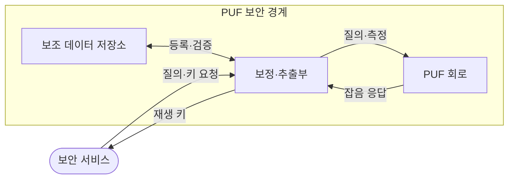
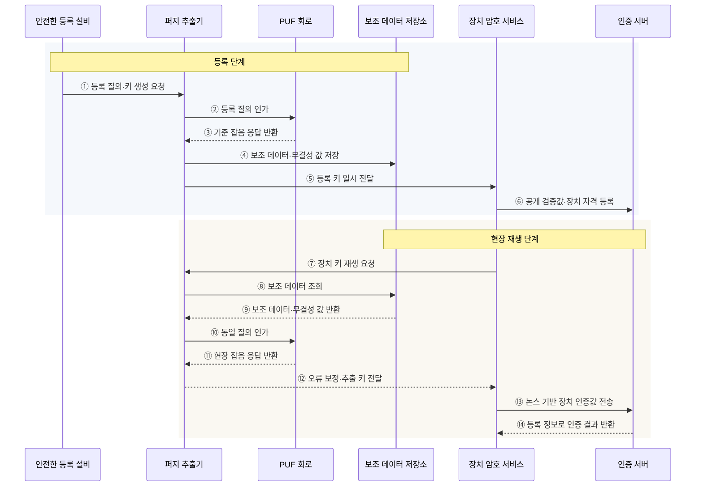

---
sidebar:
  order: 70
  label: "070. 물리적 복제 불가 함수 (PUF)"
  badge:
    text: "기출 · 30%"
    variant: note
title: "물리적 복제 불가 함수 (PUF)"
date: "2026-07-28T13:10:29+09:00"
tags:
  - "notes-hardware"
weight: 70
extra:
  question_no: "070"
  source_status: "기출"
  source_history: "125회"
  priority: 30
  priority_note: "장치 고유 키 재생·인증 적용"
---

## 미리 알고가기

- **물리적 복제 불가 함수(Physical Unclonable Function, PUF)**: 반도체 제조 편차를 장치마다 고유한 응답으로 변환하는 하드웨어 보안 기술
- **질의(Challenge)**: PUF 응답 생성을 지정하는 입력값
- **응답(Response)**: 질의가 지정한 물리 상태의 출력값
- **질의·응답 쌍(Challenge-Response Pair, CRP)**: PUF에 입력한 질의와 제조 편차로 생성된 고유 응답의 대응 관계
- **약한 PUF(Weak PUF)**: 제한된 CRP로 장치 키를 재생하는 유형
- **강한 PUF(Strong PUF)**: 대규모 CRP로 장치를 인증하는 유형
- **고유성(Uniqueness)**: 장치 간 응답이 구별되는 정도
- **신뢰성(Reliability)**: 같은 장치 응답이 재현되는 정도
- **엔트로피(Entropy)**: 응답의 예측 불가능성
- **퍼지 추출기(Fuzzy Extractor)**: 잡음 응답에서 같은 키 복원
- **보조 데이터(Helper Data)**: 키 복원을 돕는 오류 정정 정보
- **응답 오류율(Response Error Rate)**: 같은 질의를 다시 측정했을 때 기준 응답과 달라진 비트의 비율
- **안정 비트(Stable Bit)**: 온도·전압·노화 변화에서도 같은 값으로 반복 측정되는 응답 비트
- **정적 임의 접근 메모리 기반 PUF(Static Random-Access Memory PUF, SRAM PUF)**: SRAM 셀의 전원 인가 초기값 편차로 장치 고유 응답을 생성하는 PUF
- **진난수 생성기(True Random Number Generator, TRNG)**: 열잡음·발진기 지터 등의 물리적 엔트로피로 예측하기 어려운 난수를 생성하는 장치
- **일회 프로그래밍 메모리(One-Time Programmable Memory)**: 한 번 기록한 비밀값을 유지하는 메모리
- **사물인터넷(Internet of Things, IoT)**: 센서·제어 장치가 네트워크로 상태와 명령을 주고받는 연결 환경
- **등록(Enrollment)**: 기준 응답과 보조 정보를 생성하는 단계
- **재생(Reconstruction)**: 현장 응답으로 같은 키를 복원하는 단계
- **모델링 공격(Modeling Attack)**: CRP로 PUF 동작을 예측하는 공격
- **측채널 공격(Side-Channel Attack)**: 시간·전력 누설로 비밀을 추론하는 공격
- **논스(Nonce)**: 재사용 공격을 막으려고 인증마다 새로 생성하는 일회성 난수
- **키 시드(Key Seed)**: 암호 키나 난수열을 유도하는 초기 비밀값

## Ⅰ. 개요

- 정의/개념: 반도체 **제조 편차로 장치 고유 응답**을 만드는 함수
- 기존 한계: 비휘발성 고정 키는 **물리 판독·복제 공격**에 노출

### 쉽게 이해하기 (학습용)

- 같은 도면의 칩에도 남는 미세한 차이를 장치 전용 지문처럼 이용한다.

## Ⅱ. 특징

- **고유성·엔트로피**가 복제·예측 저항성 결정
- **온도·전압·노화 안정성**이 키 재생 오류율 결정
- **퍼지 추출기·보조 데이터**로 안정된 키 재생

### 쉽게 이해하기 (학습용)

- 사람마다 지문이 달라도 센서 오차를 보정해야 같은 사람으로 알아본다.

## Ⅲ. 아키텍처 및 구성요소

### 도표안 A. PUF 키 재생 정적 구조

| 설계 요소 | 입력·상태 | 역할 |
|:---|:---|:---|
| PUF 회로 | 질의·온도·전압·노화 상태 | 공정 편차 기반 잡음 응답 생성 |
| 보정·추출부 | 응답·보조 데이터 | 오류 보정·균일 키 유도 |
| 보조 데이터 저장소 | 오류 정정 정보·무결성 값 | 키 재생 보조·변조 검증 |

> 요약: 질의별 편차 응답을 보정해 장치 키를 복원한다

### 쉽게 이해하기 (학습용)

- 칩의 미세한 차이를 읽고 보정표로 응답 오차를 고쳐 같은 열쇠를 만든다.

동일 장치의 응답 재현성은 응답 오류율로 확인한다.

$$
\mathrm{RER}(\%) = \frac{d_H(R_{\mathrm{enroll}}, R_{\mathrm{retest}})}{n} \times 100
$$

- \(d_H\): 두 응답에서 값이 다른 비트 수인 해밍 거리, \(n\): 비교한 전체 응답 비트 수
- 등록과 재측정에 동일한 질의를 사용하고, 온도·전압·노화 조건별로 반복 측정한다고 가정한다.
- RER이 낮을수록 재현성은 높지만, 실제 키 복원 가능 여부는 퍼지 추출기의 오류 정정 한계와 잔여 엔트로피를 함께 확인해야 한다.

### 도표안 B. PUF 등록·현장 키 재생 시퀀스

#### 동작 원리

1. **등록 요청**: 통제된 등록 설비가 퍼지 추출기에 등록 질의와 키 생성 요청을 전달한다.
2. **기준 측정**: 퍼지 추출기가 PUF 회로에 등록 질의를 인가한다.
3. **기준 응답 수집**: PUF 회로가 제조 편차와 측정 잡음이 반영된 기준 응답을 반환한다.
4. **보조 데이터 저장**: 퍼지 추출기가 키 자체가 아닌 오류 정정 보조 데이터와 무결성 값을 저장한다.
5. **등록 키 사용**: 추출된 키를 보안 경계 안의 암호 서비스에 일시적으로 전달한다.
6. **장치 자격 등록**: 암호 서비스가 키를 직접 노출하지 않고 파생한 공개 검증값이나 장치 자격을 인증 서버에 등록한다.
7. **현장 재생 요청**: 부팅·인증 시 장치 암호 서비스가 퍼지 추출기에 키 재생을 요청한다.
8. **보조 데이터 조회**: 퍼지 추출기가 등록 때 저장한 보조 데이터를 요청한다.
9. **변조 검증 자료 반환**: 저장소가 보조 데이터와 무결성 값을 반환한다.
10. **동일 질의 재인가**: 퍼지 추출기가 등록 때와 같은 질의를 PUF 회로에 인가한다.
11. **현장 응답 수집**: PUF 회로가 현재 온도·전압·노화와 잡음이 반영된 응답을 반환한다.
12. **키 복원**: 퍼지 추출기가 응답 오류를 보정하고 안정된 키를 재생해 암호 서비스에 전달한다.
13. **인증값 전송**: 암호 서비스가 서버의 새 논스를 포함한 인증값을 계산해 재전송 공격을 막는다.
14. **장치 인증**: 인증 서버가 등록 정보로 인증값을 검증해 장치의 진위를 반환한다.

### 쉽게 이해하기 (학습용)

- 등록 때 보정 자료만 남기고, 현장에서는 같은 칩 지문을 다시 읽어 열쇠를 잠시 복원한다.

## Ⅳ. 종류 및 비교

| 하드웨어 비밀 생성 | PUF | 진난수 생성기(TRNG) | 일회 프로그래밍 메모리 |
|:---|:---|:---|:---|
| 적용 기준 | 키 재생·**CRP 장치 인증** | 일회용 값·**키 시드** | 부트 키·**보안 설정** |
| 핵심 특징 | 제조 편차로 **동일 키 재생** | 물리 잡음으로 **새 난수 생성** | 프로그래밍한 **고정값 저장** |
| 한계 | 모델링·측채널·**보조 데이터 조작** | 엔트로피 고갈·**편향** | 판독·**물리 추출** |

> 요약: PUF는 키를 재생하고 TRNG는 난수를 만든다

### 쉽게 이해하기 (학습용)

- PUF는 열쇠를 되살리고 TRNG는 난수를 만들며 일회 메모리는 값을 새긴다.

## Ⅴ. 실무 고려사항 및 대응 방안

| 운영 위험 | 대응 | 기대 효과 |
|:---|:---|:---|
| 온도·전압·노화 변화로 키 재생 실패 | 환경 모서리 등록·안정 비트 선별과 오류율 여유 검증 | 현장 신뢰성 확보 |
| 보조 데이터 변조·과도한 정보 누출 | 무결성 인증·접근 통제와 잔여 엔트로피 평가 | 키 추론·복구 방해 차단 |
| 강한 PUF의 CRP 수집으로 모델링 가능 | 질의 수 제한·논스·인증된 인터페이스와 응답률 제한 | 예측 공격 완화 |
| 재생 키가 메모리에 잔존하거나 측채널로 누출 | 최소 시간 사용·즉시 삭제·상수 시간 처리와 누설 시험 | 비밀 노출 축소 |

### 쉽게 이해하기 (학습용)

- 처음 만든 보정표로 다시 읽은 지문 오차를 고쳐 같은 열쇠를 찾는다.

### 적용 사례

- 보안 칩은 부팅 때 PUF 응답과 보조 데이터로 저장장치 복호화 키를 재생하고, 사용 직후 작업 메모리에서 삭제한다.

### 쉽게 이해하기 (학습용)

- 보안 칩은 부팅할 때만 열쇠를 되살리고 사용 뒤 지워 저장 노출을 줄인다.

## Ⅵ. 결론

- 복제하기 어려운 장치 고유 키를 생성하기 위해 **응답 재현성·개체 간 고유성·엔트로피·환경 변화·CRP 노출 위험**을 검토하고, 오류 보정과 공격 내성을 입증한 PUF 방식을 선택한다

### 쉽게 이해하기 (학습용)

- 칩 지문의 응답 오차·예측 가능성을 확인해 키 재생이나 장치 인증 방식을 선택한다.
