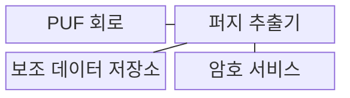
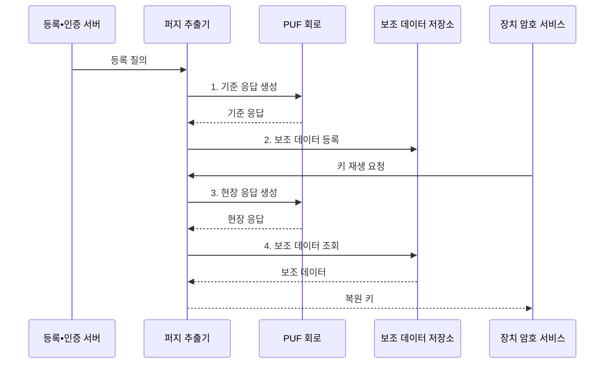

---
sidebar:
  order: 70
  label: "070. 물리적 복제 불가 함수 (PUF)"
  badge:
    text: "기출 • 30%"
    variant: note
title: "물리적 복제 불가 함수 (PUF)"
date: "2026-08-03T08:48:47+09:00"
tags:
  - "notes-hardware"
weight: 70
extra:
  question_no: "070"
  source_status: "기출"
  source_history: "125회"
  priority: 30
  priority_note: "장치 고유 키 재생•인증 적용"
---

## Ⅰ. 개요

핵심 용어

- **물리적 복제 불가 함수(Physical Unclonable Function, PUF)**: 반도체 제조 편차를 장치마다 고유한 응답으로 변환하는 하드웨어 보안 함수이다.
- **제조 편차(Manufacturing Variation)**: 같은 설계로 만든 반도체에서도 공정의 미세한 차이 때문에 생기는 전기적 특성 차이이다.
- **고정 비밀 저장(Stored Secret)**: 암호 키를 비휘발성 메모리에 값 자체로 기록하여 물리 판독의 대상이 되는 방식이다.

- 정의/개념: 반도체 **제조 편차** 를 **장치 고유 응답** 으로 변환하는 하드웨어 보안 함수
- 배경/필요성: 고정 비밀 저장은 물리 판독 시 **키 복제 위험**

#### 한줄 요약

- 같은 도면의 칩에도 남는 미세한 차이를 장치 전용 지문처럼 이용한다.

## Ⅱ. 특징

핵심 용어

- **고유성(Uniqueness)**: 같은 질의에 대한 서로 다른 장치의 응답이 충분히 구별되는 정도이다.
- **신뢰성(Reliability)**: 환경이 달라져도 동일 장치가 같은 질의에 거의 같은 응답을 재현하는 정도이다.
- **엔트로피(Entropy)**: PUF 응답이나 유도 키를 공격자가 예측하기 어려운 정도를 나타내는 정보량이다.
- **퍼지 추출기(Fuzzy Extractor)**: 잡음이 섞인 PUF 응답과 보조 데이터에서 매번 같은 암호 키를 복원하는 구성이다.

- 장치 간 **고유성** 과 응답 **엔트로피** 로 복제•예측 난이도 평가
- 환경 변화에 따른 **응답 오류율** 로 키 재생 신뢰성 판단
- **퍼지 추출기•보조 데이터** 로 안정된 키 재생

#### 한줄 요약

- 사람마다 지문이 달라도 센서 오차를 보정해야 같은 사람으로 알아본다.

## Ⅲ. 구조 및 구성요소

핵심 용어

- **PUF 회로(PUF Circuit)**: 질의를 받아 제조 편차에 따른 장치 고유 응답을 생성하는 물리 회로이다.
- **보조 데이터(Helper Data)**: PUF 응답의 잡음을 보정하여 키를 복원하도록 돕지만 키 자체는 아닌 공개 정보이다.
- **보조 데이터 저장소(Helper-data Store)**: 등록 단계에서 생성한 오류 정정 정보를 비휘발성으로 보관하는 영역이다.
- **암호 서비스(Cryptographic Service)**: 복원된 키로 암호 연산을 수행하고 사용 후 키를 메모리에서 삭제하는 기능이다.

| 구성요소 | 책임 |
|:---|:---|
| PUF 회로 | **편차 응답 생성** |
| 퍼지 추출기 | **오류 보정•키 유도** |
| 보조 데이터 저장소 | **오류 정정 정보** 보관 |
| 암호 서비스 | **재생 키 사용•삭제** |

#### 한줄 요약

- 칩의 미세한 편차를 보정해 같은 장치 키를 다시 만든다.

## Ⅳ. 흐름도

핵심 용어

- **등록(Enrollment)**: 통제된 환경에서 기준 응답을 측정하고 키 복원에 필요한 보조 데이터를 생성하는 단계이다.
- **재생(Reconstruction)**: 현장에서 다시 측정한 잡음 응답과 보조 데이터로 동일한 키를 복원하는 단계이다.
- **응답 오류율(Response Error Rate, RER)**: 같은 장치의 등록 응답과 재측정 응답에서 서로 다른 비트의 비율이다.
- **해밍 거리(Hamming Distance)**: 같은 길이의 두 비트열에서 값이 서로 다른 위치의 개수이다.

동일 장치의 응답 재현성은 응답 오류율로 확인한다.

$$
\mathrm{RER}(\%) = \frac{d_H(R_{\mathrm{enroll}}, R_{\mathrm{retest}})}{n} \times 100
$$

> 요약: **RER** 이 낮을수록 동일 장치의 **응답 신뢰성** 향상

**동작 원리**

1. **기준 응답 생성**: 제조 편차에서 등록 응답 측정
2. **보조 데이터 등록**: 응답 대신 오류 정정 정보 보관
3. **현장 응답 생성**: 같은 질의로 잡음이 섞인 응답 재측정
4. **보조 데이터 조회**: 현장 응답을 보정해 동일 키 복원

#### 한줄 요약

- 등록 때 보정 자료만 남기고, 현장에서는 같은 칩 지문을 다시 읽어 열쇠를 잠시 복원한다.

## Ⅴ. 종류 및 비교

핵심 용어

- **약한 PUF(Weak PUF)**: 제한된 수의 안정된 응답으로 장치 내부 암호 키를 재생하는 PUF 유형이다.
- **강한 PUF(Strong PUF)**: 매우 많은 질의•응답 쌍을 이용하여 원격 장치 인증에 사용하는 PUF 유형이다.
- **진난수 생성기(True Random Number Generator, TRNG)**: 열잡음이나 발진기 지터 같은 물리 엔트로피로 매번 새로운 난수를 생성하는 장치이다.
- **일회 프로그래밍 메모리(One-time Programmable Memory)**: 비밀값이나 보안 설정을 한 번 기록한 뒤 고정하여 보관하는 메모리이다.

| 하드웨어 비밀 생성 | PUF | 진난수 생성기(TRNG) | 일회 프로그래밍 메모리 |
|:---|:---|:---|:---|
| 적용 기준 | 키 재생•**CRP 장치 인증** | 일회용 값•**키 시드** | 부트 키•**보안 설정** |
| 핵심 특징 | 제조 편차로 **동일 키 재생** | 물리 잡음으로 **새 난수 생성** | 프로그래밍한 **고정값 저장** |
| 한계 | 모델링•측채널•**보조 데이터 조작** | 엔트로피 고갈•**편향** | 판독•**물리 추출** |

#### 한줄 요약

- PUF는 열쇠를 되살리고 TRNG는 난수를 만들며 일회 메모리는 값을 새긴다.

## Ⅵ. 실무 고려사항 및 대책

핵심 용어

- **안정 비트(Stable Bit)**: 온도와 전압 및 노화 변화에서도 같은 값으로 반복 측정되는 PUF 응답 비트이다.
- **보조 데이터 무결성(Helper-data Integrity)**: 저장된 보조 정보가 비인가 변경 없이 등록 당시 상태를 유지하는 성질이다.
- **모델링 공격(Modeling Attack)**: 수집한 대량의 질의•응답 쌍으로 PUF 동작을 학습하여 미지 응답을 예측하는 공격이다.
- **키 삭제(Key Zeroization)**: 암호 연산이 끝난 직후 복원 키가 있던 레지스터와 메모리를 지워 노출 시간을 줄이는 처리이다.

| 문제 | 대책 | 효과 |
|:---|:---|:---|
| 온도•전압•노화 변화로 응답 오류율 증가 | **안정 비트 선별•RER 검증** | **현장 키 재생률** 향상 |
| 보조 데이터 변조로 오류 보정 결과 조작 | **무결성 인증•접근 통제** | **키 복원 조작** 방지 |
| 대량 CRP 노출로 모델링 정확도 증가 | **질의 수•응답률 제한** | **모델링 공격** 성공률 감소 |
| 암호 연산 뒤 재생 키가 메모리에 잔존 | **사용 직후 키 삭제** | **비밀 노출 시간** 단축 |

#### 한줄 요약

- 보안 칩은 부팅할 때만 열쇠를 되살리고 사용 뒤 지워 저장 노출을 줄인다.

## Ⅶ. 결론

핵심 용어

- **키 재생(Key Reconstruction)**: 장치 내부에 키 자체를 저장하지 않고 PUF 응답에서 필요할 때 동일한 키를 복원하는 방식이다.
- **장치 인증(Device Authentication)**: 장치 고유의 질의•응답 특성을 검증하여 통신 상대가 등록된 실제 장치인지 확인하는 절차이다.
- **질의•응답 쌍(Challenge-response Pair, CRP)**: PUF에 입력한 질의와 제조 편차로 생성된 고유 응답의 대응 관계이다.

- **키 재생** 은 약한 PUF, **장치 인증** 은 강한 PUF 선택

#### 한줄 요약

- 칩 지문의 응답 오차•예측 가능성을 확인해 키 재생이나 장치 인증 방식을 선택한다.
