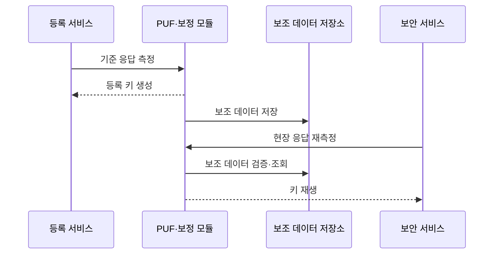

---
sidebar:
  order: 70
  label: "070. 물리적 복제 불가 함수 (PUF)"
  badge:
    text: "기출 · 30%"
    variant: note
title: "물리적 복제 불가 함수 (PUF)"
date: "2026-07-25T10:44:00+09:00"
tags:
  - "notes-hardware"
weight: 70
extra:
  question_no: "070"
  source_status: "기출"
  source_history: "125회"
  priority: 30
  priority_note: "장치 고유 키 재생·인증 적용"
---

## 미리 알고가기

- **물리적 복제 불가 함수(Physical Unclonable Function, PUF)**: ‘퍼프’로 읽고 영문 머리글자를 단어처럼 만든 약어이며, 제조 편차를 장치별 응답으로 변환
- **질의(Challenge)**: PUF 응답 생성을 지정하는 입력값
- **응답(Response)**: 질의가 지정한 물리 상태의 출력값
- **질의·응답 쌍(Challenge-Response Pair, CRP)**: ‘시알피’로 읽고 영문 머리글자를 딴 약어이며, PUF 질의와 그 응답의 묶음
- **약한 PUF(Weak PUF)**: 제한된 CRP로 장치 키를 재생하는 유형
- **강한 PUF(Strong PUF)**: 대규모 CRP로 장치를 인증하는 유형
- **고유성(Uniqueness)**: 장치 간 응답이 구별되는 정도
- **신뢰성(Reliability)**: 같은 장치 응답이 재현되는 정도
- **엔트로피(Entropy)**: 응답의 예측 불가능성
- **퍼지 추출기(Fuzzy Extractor)**: 잡음 응답에서 같은 키 복원
- **보조 데이터(Helper Data)**: 키 복원을 돕는 오류 정정 정보
- **응답 오류율(Response Error Rate)**: 같은 질의를 다시 측정했을 때 기준 응답과 달라진 비트의 비율
- **안정 비트(Stable Bit)**: 온도·전압·노화 변화에서도 같은 값으로 반복 측정되는 응답 비트
- **정적 임의 접근 메모리 기반 PUF(Static Random-Access Memory PUF, SRAM PUF)**: ‘에스램 퍼프’로 읽고 영문 머리글자를 단어처럼 만든 약어이며, 메모리 시작값 편차를 이용
- **진난수 생성기(True Random Number Generator, TRNG)**: ‘티알엔지’로 읽고 영문 머리글자를 딴 약어이며, 물리 잡음에서 새 난수를 생성
- **일회 프로그래밍 메모리(One-Time Programmable Memory)**: 한 번 기록한 비밀값을 유지하는 메모리
- **사물인터넷(Internet of Things, IoT)**: ‘아이오티’로 읽고 영문 머리글자를 딴 약어이며, 연결 장치가 정보를 주고받는 환경
- **등록(Enrollment)**: 기준 응답과 보조 정보를 생성하는 단계
- **재생(Reconstruction)**: 현장 응답으로 같은 키를 복원하는 단계
- **모델링 공격(Modeling Attack)**: CRP로 PUF 동작을 예측하는 공격
- **측채널 공격(Side-Channel Attack)**: 시간·전력 누설로 비밀을 추론하는 공격
- **논스(Nonce)**: 재사용 공격을 막으려고 인증마다 새로 생성하는 일회성 난수
- **키 시드(Key Seed)**: 암호 키나 난수열을 유도하는 초기 비밀값

## Ⅰ. 개요

- **정의/개념**: 제조 편차로 장치 응답을 만드는 함수다
- **배경/필요성**: 고정 키 저장 없이 장치 비밀을 재생한다

### 쉽게 이해하기 (학습용)

- 같은 도면의 칩에도 남는 미세한 차이를 장치 전용 지문처럼 이용한다.

## Ⅱ. 특징

- 고유성·엔트로피가 낮으면 복제·예측 공격이 쉬워진다
- 온도·전압·노화는 오류율을 높여 키 재생을 실패시킨다
- 원시 응답을 저장하지 않아 비밀 추출 표면을 줄인다

### 쉽게 이해하기 (학습용)

- 사람마다 지문이 달라도 센서 오차를 보정해야 같은 사람으로 알아본다.

## Ⅲ. 아키텍처 및 구성요소

| 설계 요소 | 설명 |
|:---|:---|
| PUF 회로 | 공정 편차를 질의별 잡음 응답으로 변환 |
| 보정·추출부 | 응답 잡음 보정·안정 키 유도 |
| 보조 데이터 저장소 | 공개 오류 정정 정보·무결성 값 보관 |

> 요약: 질의별 편차 응답을 보정해 장치 키를 복원한다

### 쉽게 이해하기 (학습용)

- 칩의 미세한 차이를 읽고 보정표로 응답 오차를 고쳐 같은 열쇠를 만든다.

## Ⅳ. 원리 및 절차 흐름도

| 절차 | 설명 |
|:---|:---|
| 기준 응답 측정 | 등록 환경에서 반복 측정해 안정 비트 선택 |
| 등록 키 생성 | 기준 응답의 엔트로피에서 균일 키 유도 |
| 보조 데이터 저장 | 공개 보조 정보와 무결성 값 등록 |
| 현장 응답 재측정 | 같은 질의로 잡음 응답 획득 |
| 보조 데이터 검증·조회 | 변조 여부 확인 후 보조 정보 획득 |
| 키 재생 | 응답 오차를 보정해 동일 키 유도 |

> 요약: 등록 정보로 응답 잡음을 보정해 같은 키를 재생한다

### 쉽게 이해하기 (학습용)

- 처음 만든 보정표로 다시 읽은 지문 오차를 고쳐 같은 열쇠를 찾는다.

## Ⅴ. 종류 및 비교

| 판단 기준 | PUF | 진난수 생성기(TRNG) | 일회 프로그래밍 메모리 |
|:---|:---|:---|:---|
| 핵심 특징 | 제조 편차로 같은 키 재생 | 물리 잡음으로 새 난수 생성 | 프로그래밍한 고정값 저장 |
| 적용 기준 | 약한 PUF 키 재생·강한 PUF CRP 인증 | 일회용 값·키 시드 | 부트 키·보안 설정 |
| 주요 위험 | 모델링·측채널·보조 데이터 조작 | 엔트로피 고갈·편향 | 판독·물리 추출 |

> 요약: PUF는 키를 재생하고 TRNG는 난수를 만든다

### 쉽게 이해하기 (학습용)

- PUF는 열쇠를 되살리고 TRNG는 난수를 만들며 일회 메모리는 값을 새긴다.

## Ⅵ. 실무 사례

1. 보안 칩은 PUF로 부팅 키를 재생·삭제한다
2. IoT 기기는 PUF 재생 키로 서버 난수에 서명한다

### 쉽게 이해하기 (학습용)

- 보안 칩은 부팅할 때만 열쇠를 되살리고 사용 뒤 지워 저장 노출을 줄인다.
- IoT 서버는 공개 키로 서명을 검증해 원시 응답 공개를 피한다.

## Ⅶ. 결론

- 재현성·엔트로피·CRP 노출로 PUF 방식을 정한다

### 쉽게 이해하기 (학습용)

- 칩 지문의 응답 오차·예측 가능성을 확인해 키 재생이나 장치 인증 방식을 선택한다.
