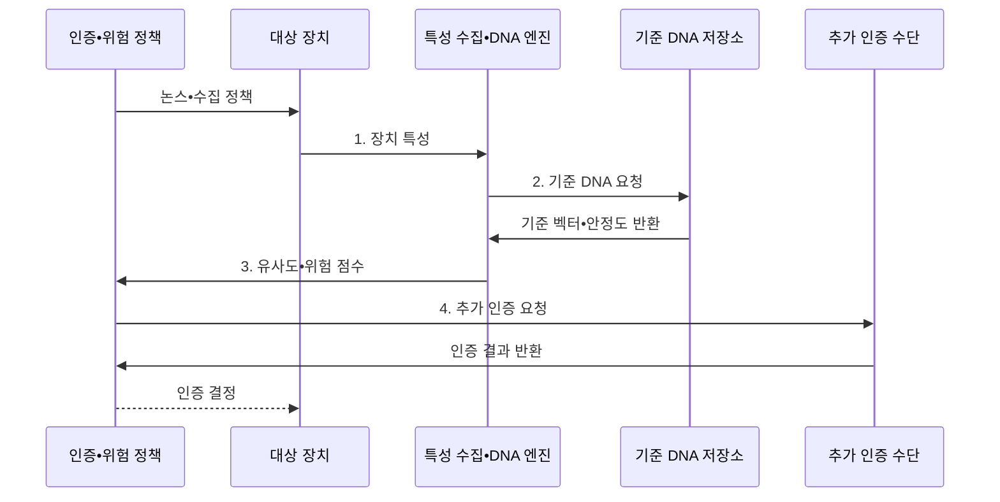

---
sidebar:
  order: 71
  label: "071. 디바이스 DNA (Device DNA)"
  badge:
    text: "기출 • 30%"
    variant: note
title: "디바이스 DNA (Device DNA)"
date: "2026-08-05T02:00:00+09:00"
tags:
  - "notes-hardware"
weight: 71
extra:
  question_no: "071"
  source_status: "기출"
  source_history: "125회"
  priority: 30
  priority_note: "복합 장치 지문 생성•위험 기반 인증"
---

## Ⅰ. 개요

<details><summary>핵심 용어</summary>

- **DNA**: Deoxyribonucleic Acid, 생물학적 고유성에서 차용한 장치 지문 비유
- **Device DNA**: 하드웨어•소프트웨어•행동 특성을 결합한 복합 장치 지문
- **장치 지문(Device Fingerprint)**: 장치에서 관측한 여러 특성을 결합해 생성한 식별값이다.
- **ID**: Identifier, 대상을 구분하는 식별값
- **고정 식별자(Static Identifier)**: 장치에 저장한 하나의 고정 ID

</details>

- 정의/개념: 하드웨어•소프트웨어•행동 특성을 결합해 **장치 지문** 으로 식별하는 기법
- 배경/필요성: 단일 고정 ID는 복제•재전송 시 **장치 진위 판별 불가**

#### 한줄 요약

- 기종•설정•사용 습관을 함께 보고 같은 장치인지 판단하는 방식이다.

## Ⅱ. 특징

<details><summary>핵심 용어</summary>

- **복합 특성(Composite Attributes)**: 모델•설정•버전•접속 패턴처럼 서로 다른 장치 특징을 함께 사용한 정보이다.
- **유사도 점수(Similarity Score)**: 현재 장치 지문과 등록된 기준 지문이 일치하는 정도를 수치화한 값이다.
- **드리프트(Drift)**: 업데이트와 환경 또는 사용 변화 때문에 정상 장치의 지문 특성이 시간에 따라 달라지는 현상이다.
- **개인정보 노출(Privacy Exposure)**: 수집한 장치 특성을 통해 사용자의 장치와 행동을 과도하게 추적할 수 있는 위험이다.

</details>

- **복합 특성 결합** 으로 단일 식별자보다 위장 비용 증가
- **유사도•위험 점수** 로 장치 변화 허용 범위 판정
- **지속 수집** 은 드리프트 적응을 높이지만 개인정보 노출 확대

#### 한줄 요약

- 이름표 하나보다 생김새와 습관을 함께 보되 바뀐 특징은 정상 변화인지 다시 확인한다.

## Ⅲ. 구조 및 구성요소

<details><summary>핵심 용어</summary>

- **특성 수집기(Feature Collector)**: 정책이 허용한 하드웨어•소프트웨어•행동 특징을 장치에서 획득하는 구성요소이다.
- **특성 벡터(Feature Vector)**: 서로 다른 특성값을 비교 가능한 순서와 척도로 정리한 값의 집합이다.
- **기준 DNA 저장소(Baseline DNA Store)**: 등록 지문과 특성별 안정도 및 변경 이력을 보호하여 보관하는 영역이다.
- **위험 엔진(Risk Engine)**: 지문 유사도와 접속 상황을 결합하여 인증 조치를 결정하는 구성요소이다.

</details>

```text
[특성 수집기] -- [DNA 생성 엔진]
                          /     \
             [기준 DNA 저장소] -- [매칭•위험 엔진]
```

선의 의미: DNA 생성 엔진이 수집 특성을 지문화하고 기준 저장소와 매칭•위험 엔진이 생성 지문과 등록 이력을 공유하는 정적 의존망이다.

| 구성요소 | 책임 |
|:---|:---|
| 특성 수집기 | **장치 특징 획득** |
| DNA 생성 엔진 | **복합 지문 생성** |
| 기준 DNA 저장소 | **등록•변경 이력 보호** |
| 매칭•위험 엔진 | **유사도•조치 결정** |

#### 한줄 요약

- 여러 장치 특징을 하나의 지문으로 만들고 등록값과 비교한다.

## Ⅳ. 흐름도

<details><summary>핵심 용어</summary>

- **논스(Nonce)**: 인증 요청마다 새로 생성하여 이전 장치 응답의 재사용을 막는 일회성 값이다.
- **특성 안정도(Feature Stability)**: 정상 업데이트와 환경 변화에도 특정 장치 특성이 같은 범위에 머무는 정도이다.
- **위험 기반 인증(Risk-based Authentication)**: 지문 일치도와 거래 위험에 따라 추가 인증 여부를 다르게 정하는 방식이다.

</details>



**동작 원리**

1. **장치 특성**: 허용한 최소 특징을 현재 벡터로 구성
2. **기준 DNA 요청**: 등록 이력과 특징별 안정도 조회
3. **유사도•위험 점수**: 자연 변동과 위장 가능성 계산
4. **추가 인증 요청**: 위험 구간에서 별도 인증 수행

#### 한줄 요약

- 장치 모습이 조금 달라졌다고 즉시 공격으로 단정하지 않고, 거래 위험과 별도 인증 결과까지 함께 본다.

## Ⅴ. 종류 및 비교

<details><summary>핵심 용어</summary>

- **물리적 복제 불가 함수(Physical Unclonable Function, PUF)**: 반도체 제조 편차로 장치 고유 응답과 암호 키를 생성하는 하드웨어 기술이다.
- **완전 일치(Exact Match)**: 현재 식별값이 저장된 고정 ID와 비트 단위로 동일한지 확인하는 판정이다.
- **보조 인증(Supplementary Authentication)**: 단독으로 신원을 확정하지 않고 다른 인증 요소의 위험 판단을 보완하는 증거이다.

</details>

| 장치 식별 방식 | 디바이스 DNA | PUF | 고정 식별자 |
|:---|:---|:---|:---|
| 적용 기준 | 위험 기반 **보조 인증** | 하드웨어 키•**장치 인증** | 자산 식별•**조회 키** |
| 핵심 특징 | 복합 특성의 **유사도•위험 판정** | 제조 편차의 **응답•키 재현** | 저장 번호의 **완전 일치** |
| 한계 | 특성 위장•**개인정보•오탐** | 잡음•모델링•**측채널 공격** | 복사•변조•**재전송** |

#### 한줄 요약

- DNA는 여러 특징을 비교하고 PUF는 칩 편차를 재현하며 고정 ID는 번호만 맞춘다.

## Ⅵ. 실무 고려사항 및 대책

<details><summary>핵심 용어</summary>

- **오탐(False Positive)**: 정상 장치를 위장 또는 이상 장치로 잘못 판정하는 오류이다.
- **세션 바인딩(Session Binding)**: 장치 지문을 논스와 현재 접속 세션에 묶어 다른 세션에서 재사용하지 못하게 하는 통제이다.
- **최소 수집(Data Minimization)**: 장치 판정에 꼭 필요한 특성만 수집하고 불필요한 식별 정보를 배제하는 원칙이다.
- **감사 로그(Audit Log)**: 기준 DNA의 등록과 변경 및 승인 이력을 사후 추적할 수 있게 남긴 기록이다.

</details>

| 문제 | 대책 | 효과 |
|:---|:---|:---|
| 업데이트 뒤 정상 드리프트를 위장으로 오탐 | **특성 안정도•변경 이력** 반영 | **정상 장치 차단률** 감소 |
| 이전 지문을 재전송해 현재 장치로 위장 | **논스•세션 바인딩** | 재전송 지문의 **장치 위장** 방지 |
| 식별에 불필요한 장치 특성 과수집 | **최소 수집•보존 기한** 설정 | **개인정보 노출 범위** 축소 |
| 공격자 재등록으로 기준 DNA 오염 | **재등록 승인•감사 로그** | **기준 지문 신뢰성** 유지 |

#### 한줄 요약

- 금융 서비스는 평소 장치와 달라진 특성이 많으면 추가 확인을 요구한다.

## Ⅶ. 결론

<details><summary>핵심 용어</summary>

- **구분력(Discriminability)**: 서로 다른 장치의 지문을 충분히 다른 것으로 판별할 수 있는 정도이다.
- **장치 위장(Device Spoofing)**: 관측 속성을 조작하여 공격자 장치를 등록된 다른 장치로 가장하는 공격이다.
- **인증 보조 증거(Authentication Signal)**: 단독 인증 요소가 아니라 위험 점수에 추가하는 장치 식별 정보이다.

</details>

- 특성 안정성•구분력이 충분하고 개인정보 위험이 낮을 때만 **Device DNA 보조 인증** 적용

#### 한줄 요약

- 장치 특징의 변화와 위조 가능성을 함께 봐 단독 열쇠가 아닌 보조 증거로 쓴다.
