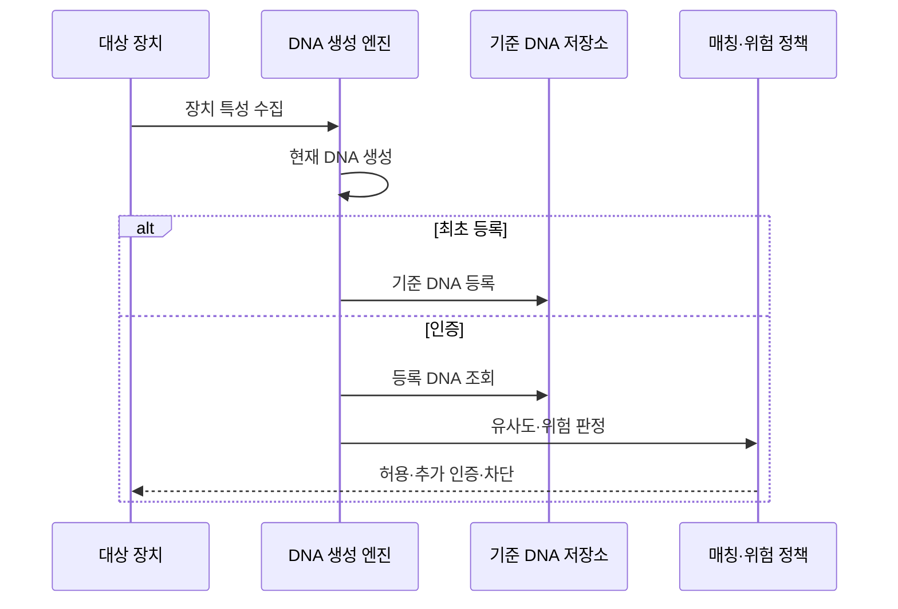

---
sidebar:
  order: 71
  label: "071. 디바이스 DNA (Device DNA)"
  badge:
    text: "기출 · 30%"
    variant: note
title: "디바이스 DNA (Device DNA)"
date: "2026-07-27T23:59:59+09:00"
tags:
  - "notes-hardware"
weight: 71
extra:
  question_no: "071"
  source_status: "기출"
  source_history: "125회"
  priority: 30
  priority_note: "복합 장치 지문 생성·위험 기반 인증"
---

## 미리 알고가기

- **디바이스 DNA(Device DNA)**: 장치 특성을 조합해 만든 식별 지문
- **디옥시리보핵산(Deoxyribonucleic Acid, DNA)**: ‘디엔에이’로 읽고 영문 머리글자를 딴 약어이며, 장치별 특성 조합이 고유 지문이라는 비유에 사용
- **장치 지문(Device Fingerprint)**: 여러 관측값을 결합한 장치 식별값
- **하드웨어 특성(Hardware Attribute)**: 모델·화면·센서·CPU 등 물리 속성
- **소프트웨어 특성(Software Attribute)**: 운영체제(Operating System, OS)의 OS는 ‘오에스’로 읽고 영문 머리글자를 딴 약어이며, 운영체제·브라우저·설정 같은 논리 속성
- **행동 특성(Behavioral Attribute)**: 접속·입력·통신 패턴 등 동적 속성
- **특성 벡터(Feature Vector)**: 비교 가능한 형태로 정규화한 특성 집합
- **정규화(Normalization)**: 단위와 범위가 다른 특성값을 같은 비교 척도로 변환하는 처리
- **유사도 점수(Similarity Score)**: 현재 지문과 기준 지문의 일치 정도
- **드리프트(Drift)**: 갱신·환경 변화로 지문 특성이 달라지는 현상
- **장치 위장(Device Spoofing)**: 속성을 조작해 다른 장치로 가장하는 공격
- **위험 기반 인증(Risk-Based Authentication)**: 지문 일치도와 접속 상황의 위험 점수에 따라 추가 인증 여부를 정하는 방식
- **오탐(False Positive)**: 정상 장치를 위장·이상 장치로 잘못 판정하는 오류
- **재전송 공격(Replay Attack)**: 이전에 가로챈 정상 식별값이나 인증 메시지를 다시 보내 인증을 우회하는 공격
- **고정 식별자(Static Identifier, ID)**: ‘아이디’로 읽고 Identifier를 줄인 표기이며, 장치에 저장된 고정 번호로 자산을 조회
- **물리적 복제 불가 함수(Physical Unclonable Function, PUF)**: ‘퍼프’로 읽고 영문 머리글자를 단어처럼 만든 약어이며, 제조 편차로 응답·키를 생성
- **사물인터넷(Internet of Things, IoT)**: ‘아이오티’로 읽고 영문 머리글자를 딴 약어이며, 연결 장치의 등록·위장 지문을 비교하는 적용 환경

## Ⅰ. 개요

- 정의/개념: 하드웨어·소프트웨어·행동 특성을 **결합한 장치 지문**
- 기존 한계: 단일 식별자는 **복제·변조·재전송**으로 위장 가능

### 쉽게 이해하기 (학습용)

- 기종·설정·사용 습관을 함께 보고 같은 장치인지 판단하는 방식이다.

## Ⅱ. 특징

- **복합 특성 결합**으로 단일 식별자보다 위장 비용 증가
- **유사도·위험 점수**로 장치 변화 허용 범위 판정
- **환경·갱신 변화**가 오탐·개인정보 위험 증가

### 쉽게 이해하기 (학습용)

- 이름표 하나보다 생김새와 습관을 함께 보되 바뀐 특징은 정상 변화인지 다시 확인한다.

## Ⅲ. 아키텍처 및 구성요소

| 설계 요소 | 설명 |
|:---|:---|
| 특성 수집기 | 하드웨어·소프트웨어·행동 관측값 수집 |
| DNA 생성 엔진 | 특성 정규화·선택 후 복합 지문 생성 |
| 기준 DNA 저장소 | 장치별 기준 지문·변경 이력 보호 |
| 매칭·위험 정책 | 유사도·위장 징후로 인증 조치 결정 |

> 요약: 복합 특성을 기준 DNA와 비교해 위험 판정

### 쉽게 이해하기 (학습용)

- 장치의 생김새와 습관을 묶어 등록 사진과 비교하는 검사대다.

## Ⅳ. 원리 및 절차 흐름도

| 절차 | 설명 |
|:---|:---|
| 장치 특성 수집 | 하드웨어·소프트웨어·행동값 획득 |
| 현재 DNA 생성 | 특성을 정규화·선택해 지문 생성 |
| 기준 DNA 등록 | 신뢰 등록 시 지문·장치 관계 저장 |
| 등록 DNA 조회 | 인증 대상의 기준 지문·이력 획득 |
| 유사도·위험 판정 | 일치도·드리프트·위장 징후 평가 |
| 허용·추가 인증·차단 | 위험 수준에 따른 인증 조치 |

> 요약: 기준 지문과 현재 지문을 비교해 인증 수준 결정

### 쉽게 이해하기 (학습용)

- 처음에는 장치 사진을 등록하고 다음부터 현재 모습과 비교해 통과 여부를 정한다.

## Ⅴ. 종류 및 비교

| 장치 식별 방식 | 디바이스 DNA | PUF | 고정 식별자 |
|:---|:---|:---|:---|
| 적용 기준 | 위험 기반 **보조 인증** | 하드웨어 키·**장치 인증** | 자산 식별·**조회 키** |
| 핵심 특징 | 복합 특성의 **유사도·위험 판정** | 제조 편차의 **응답·키 재현** | 저장 번호의 **완전 일치** |
| 한계 | 특성 위장·**개인정보·오탐** | 잡음·모델링·**측채널 공격** | 복사·변조·**재전송** |

> 요약: DNA는 복합 지문, PUF는 제조 편차 기반 함수

### 쉽게 이해하기 (학습용)

- DNA는 여러 특징을 비교하고 PUF는 칩 편차를 재현하며 고정 ID는 번호만 맞춘다.

## Ⅵ. 실무 사례

1. 모바일 금융은 **기기·OS·센서 특성**으로 추가 인증

### 쉽게 이해하기 (학습용)

- 금융 서비스는 평소 장치와 달라진 특성이 많으면 추가 확인을 요구한다.

## Ⅶ. 결론

- **특성 안정성·위장·개인정보** 검증 후 보조 인증 적용

### 쉽게 이해하기 (학습용)

- 장치 특징의 변화와 위조 가능성을 함께 봐 단독 열쇠가 아닌 보조 증거로 쓴다.
