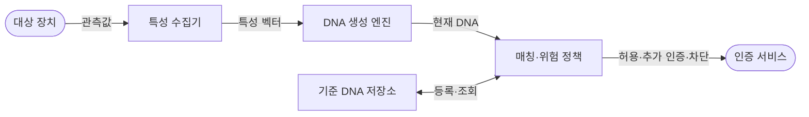

---
sidebar:
  order: 71
  label: "071. 디바이스 DNA (Device DNA)"
  badge:
    text: "기출 · 30%"
    variant: note
title: "디바이스 DNA (Device DNA)"
date: "2026-07-28T13:10:54+09:00"
tags:
  - "notes-hardware"
weight: 71
extra:
  question_no: "071"
  source_status: "기출"
  source_history: "125회"
  priority: 30
  priority_note: "복합 장치 지문 생성·위험 기반 인증"
---

## 미리 알고가기

- **디바이스 DNA(Device DNA)**: 하드웨어·소프트웨어·행동 특성을 조합하여 장치를 지속적으로 식별하는 고유 지문
- **장치 지문(Device Fingerprint)**: 여러 관측값을 결합한 장치 식별값
- **하드웨어 특성(Hardware Attribute)**: 모델·화면·센서·CPU 등 물리 속성
- **소프트웨어 특성(Software Attribute)**: 운영체제·브라우저·펌웨어 버전·설정과 같이 장치에서 수집하는 논리 속성
- **행동 특성(Behavioral Attribute)**: 접속·입력·통신 패턴 등 동적 속성
- **특성 벡터(Feature Vector)**: 비교 가능한 형태로 정규화한 특성 집합
- **정규화(Normalization)**: 단위와 범위가 다른 특성값을 같은 비교 척도로 변환하는 처리
- **유사도 점수(Similarity Score)**: 현재 지문과 기준 지문의 일치 정도
- **드리프트(Drift)**: 갱신·환경 변화로 지문 특성이 달라지는 현상
- **장치 위장(Device Spoofing)**: 속성을 조작해 다른 장치로 가장하는 공격
- **위험 기반 인증(Risk-Based Authentication)**: 지문 일치도와 접속 상황의 위험 점수에 따라 추가 인증 여부를 정하는 방식
- **오탐(False Positive)**: 정상 장치를 위장·이상 장치로 잘못 판정하는 오류
- **재전송 공격(Replay Attack)**: 이전에 가로챈 정상 식별값이나 인증 메시지를 다시 보내 인증을 우회하는 공격
- **고정 식별자(Static Identifier, ID)**: 장치에 저장한 고정 번호로 자산을 조회하는 식별 정보
- **물리적 복제 불가 함수(Physical Unclonable Function, PUF)**: 반도체 제조 편차로 장치 고유 응답과 암호키를 생성하는 하드웨어 보안 기술
- **사물인터넷(Internet of Things, IoT)**: 다수 연결 장치의 등록 정보와 현재 지문을 비교하여 위장 여부를 판정하는 적용 환경

## Ⅰ. 개요

- 정의/개념: 하드웨어·소프트웨어·행동 특성을 **결합한 장치 지문**
- 기존 한계: 단일 식별자는 **복제·변조·재전송**으로 위장 가능

### 쉽게 이해하기 (학습용)

- 기종·설정·사용 습관을 함께 보고 같은 장치인지 판단하는 방식이다.

## Ⅱ. 특징

- **복합 특성 결합**으로 단일 식별자보다 위장 비용 증가
- **유사도·위험 점수**로 장치 변화 허용 범위 판정
- **환경·갱신 변화**가 오탐·개인정보 위험 증가

### 쉽게 이해하기 (학습용)

- 이름표 하나보다 생김새와 습관을 함께 보되 바뀐 특징은 정상 변화인지 다시 확인한다.

## Ⅲ. 아키텍처 및 구성요소

| 설계 요소 | 입력·상태 | 역할 |
|:---|:---|:---|
| 특성 수집기 | 하드웨어·소프트웨어·행동 관측값 | 장치 특징 획득 |
| DNA 생성 엔진 | 원시 특성·정규화 규칙 | 복합 지문 생성 |
| 기준 DNA 저장소 | 장치별 지문·변경 이력 | 등록 기준 보호 |
| 매칭·위험 정책 | 현재·기준 지문·접속 맥락 | 유사도·위험 조치 결정 |

> 요약: 복합 특성을 기준 DNA와 비교해 위험 판정

### 쉽게 이해하기 (학습용)

- 장치의 생김새와 습관을 묶어 등록 사진과 비교하는 검사대다.

## Ⅳ. 운영 고려사항

| 운영 위험 | 대응 | 기대 효과 |
|:---|:---|:---|
| 정상 업데이트·환경 변화로 드리프트·오탐 증가 | 특성별 안정도·변경 이력과 단계적 재등록 적용 | 정상 장치 차단 감소 |
| 수집 속성 복제·재전송으로 위장 | 논스·세션 바인딩과 독립 자격 증명·행동 맥락 결합 | 재사용 공격 완화 |
| 과도한 특성 수집·장기 보관으로 개인정보 침해 | 최소 수집·해시·보존 기한·접근 통제 적용 | 프라이버시 위험 축소 |
| 공격자가 재등록을 통해 기준 DNA 오염 | 강한 최초·재등록 인증과 변경 승인·감사 로그 적용 | 기준 지문 신뢰성 확보 |

### 쉽게 이해하기 (학습용)

- 처음에는 장치 사진을 등록하고 다음부터 현재 모습과 비교해 통과 여부를 정한다.

## Ⅴ. 종류 및 비교

| 장치 식별 방식 | 디바이스 DNA | PUF | 고정 식별자 |
|:---|:---|:---|:---|
| 적용 기준 | 위험 기반 **보조 인증** | 하드웨어 키·**장치 인증** | 자산 식별·**조회 키** |
| 핵심 특징 | 복합 특성의 **유사도·위험 판정** | 제조 편차의 **응답·키 재현** | 저장 번호의 **완전 일치** |
| 한계 | 특성 위장·**개인정보·오탐** | 잡음·모델링·**측채널 공격** | 복사·변조·**재전송** |

> 요약: DNA는 복합 지문, PUF는 제조 편차 기반 함수

### 쉽게 이해하기 (학습용)

- DNA는 여러 특징을 비교하고 PUF는 칩 편차를 재현하며 고정 ID는 번호만 맞춘다.

## Ⅵ. 실무 사례

1. 모바일 금융은 **기기·OS·센서 특성**으로 추가 인증

### 쉽게 이해하기 (학습용)

- 금융 서비스는 평소 장치와 달라진 특성이 많으면 추가 확인을 요구한다.

## Ⅶ. 결론

- 장치 고유 특성으로 위조 단말을 식별하기 위해 **특성 안정성·개체 구분력·위장 가능성·환경 변화·개인정보 영향**을 검토하고, 독립 자격증명을 보완하는 장치 DNA 인증으로 적용한다

### 쉽게 이해하기 (학습용)

- 장치 특징의 변화와 위조 가능성을 함께 봐 단독 열쇠가 아닌 보조 증거로 쓴다.
