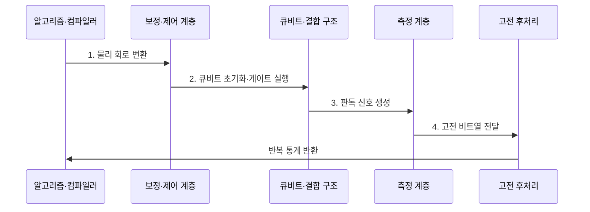

---
sidebar:
  order: 72
  label: "072. 양자 컴퓨팅 큐비트 (Quantum Computing Qubit)"
  badge:
    text: "기출 · 70%"
    variant: note
title: "양자 컴퓨팅 큐비트 (Quantum Computing Qubit)"
date: "2026-07-30T18:42:46+09:00"
tags:
  - "notes-hardware"
weight: 72
extra:
  question_no: "072"
  source_status: "기출"
  source_history: "126회, 129회, 135회"
  priority: 70
  priority_note: "큐비트 상태·게이트·측정·오류"
---

## 미리 알고가기

- **양자 비트(Quantum Bit, Qubit)**: 0·1 계산 기저의 확률 진폭과 상대 위상을 표현하는 양자 정보의 기본 단위
- **계산 기저(Computational Basis)**: 큐비트 측정 결과를 0과 1로 나타내는 기준 상태 집합
- **상태 벡터(State Vector)**: 각 기저 상태의 복소수 확률 진폭을 모아 큐비트 상태를 표현한 벡터
- **밀도 행렬(Density Matrix)**: 순수 상태와 확률적으로 섞인 상태를 함께 표현하는 행렬
- **정규화(Normalization)**: 모든 기저의 측정 확률 합이 1인 조건
- **중첩(Superposition)**: 여러 기저 상태의 진폭 결합
- **확률 진폭(Probability Amplitude)**: 절댓값 제곱이 측정 확률
- **상대 위상(Relative Phase)**: 간섭의 강화·상쇄 방향 결정
- **간섭(Interference)**: 진폭의 합으로 결과 확률 변화
- **얽힘(Entanglement)**: 개별 상태로 분리할 수 없는 상관
- **양자 게이트(Quantum Gate)**: 상태 벡터를 가역적으로 변환
- **가역 연산(Reversible Operation)**: 출력 상태에서 입력 상태를 유일하게 복원할 수 있는 변환
- **양자 레지스터(Quantum Register)**: 여러 큐비트를 묶은 연산 단위
- **측정(Measurement)**: 기저 상태 하나를 확률적으로 기록
- **결맞음 시간(Coherence Time)**: 위상 정보가 유지되는 시간
- **게이트 오류율(Gate Error Rate)**: 이상적 결과에서 벗어나는 비율
- **판독 오류율(Readout Error Rate)**: 측정 결과가 틀릴 확률
- **회로 깊이(Circuit Depth)**: 병렬 게이트 층의 최장 개수
- **제어 펄스(Control Pulse)**: 큐비트의 에너지나 위상을 바꿔 양자 게이트를 구현하는 전기·광학 신호
- **보정(Calibration)**: 실제 게이트와 판독 결과가 목표값에 맞도록 펄스·측정 변환값을 조정하는 작업
- **결맞음 손실(Decoherence)**: 환경 잡음으로 큐비트의 위상과 양자 상관이 사라지는 현상
- **샷(Shot)**: 같은 양자 회로를 한 번 실행하고 측정하는 단위
- **관측량(Observable)**: 측정하려는 물리량을 나타내는 연산자
- **기댓값(Expectation Value)**: 반복 측정 결과의 확률 가중 평균
- **해밀토니안(Hamiltonian)**: 양자계의 전체 에너지를 나타내는 연산자
- **변분 양자 고유값 풀이기(Variational Quantum Eigensolver, VQE)**: 양자 회로의 에너지를 측정하고 고전 최적화로 바닥상태 에너지를 찾는 알고리즘

## Ⅰ. 개요

- 정의/개념: **복소 진폭·상대 위상**의 양자 정보 단위
- 배경/필요성: 고전 비트로는 양자계의 **상태 모사 비용 급증**

### 쉽게 이해하기 (학습용)

- 큐비트는 0과 1의 가능성과 두 상태 사이의 위상을 한 상태에 함께 담는다.

## Ⅱ. 특징

- **진폭 절댓값 제곱**이 측정 확률 결정
- **상대 위상·양자 간섭**으로 정답 확률 증폭
- **얽힘**으로 고전적 분리 불가능한 상관 표현

### 쉽게 이해하기 (학습용)

- 큐비트 화살표를 돌려 답의 확률을 키우지만 잡음이 쌓이기 전에 측정해야 한다.

## Ⅲ. 구조 및 구성요소

| 구성요소 | 책임 |
|:---|:---|
| 큐비트 소자 | **양자 정보 부호화** |
| 결합 구조 | **2큐비트 상호작용** |
| 제어 계층 | **상태 초기화·변환** |
| 측정 계층 | **고전 비트 변환** |
| 보정 계층 | **제어·판독 오차 보정** |

### 쉽게 이해하기 (학습용)

- 펄스로 큐비트를 바꾸고 결합한 뒤 측정 결과를 보정한다.

## Ⅳ. 흐름도

단일 큐비트의 정규화된 순수 상태는 다음과 같다.

$$
|\psi\rangle = \alpha|0\rangle + \beta|1\rangle,\qquad
|\alpha|^2 + |\beta|^2 = 1
$$

- \(\alpha,\beta\): 복소수 확률 진폭
- \(|\alpha|^2,|\beta|^2\): 0·1 측정 확률
- 잡음·혼합 상태는 밀도 행렬로 표현한다.

**동작 원리**

- **1. 물리 회로 변환**: 논리 게이트를 보정된 장치 펄스로 변환
- **2. 큐비트 초기화·게이트 실행**: 기준 상태 준비 후 중첩·얽힘 생성
- **3. 판독 신호 생성**: 양자 상태를 아날로그 측정 신호로 투영
- **4. 고전 비트열 전달**: 판독 임계값에 따라 0·1 결과 생성

### 쉽게 이해하기 (학습용)

- 회로를 실제 칩의 펄스로 번역해 여러 번 실행하고, 측정된 0·1의 빈도로 원하는 값을 추정한다.

## Ⅴ. 종류 및 비교

| 정보 단위 | 큐비트 | 고전 비트 |
|:---|:---|:---|
| 적용 기준 | 오류 통제 후 **양자 이득** 확보 | 범용·**정확 계산** 수행 |
| 핵심 특징 | 진폭·위상·**얽힘 변환** | 확정된 0·1의 **논리 변환** |
| 한계 | 결맞음 손실·**게이트·판독 오류** | 양자 모사·**탐색 효율 한계** |

### 쉽게 이해하기 (학습용)

- 큐비트는 확률을 다듬고 비트는 정해진 값을 읽는다.

## Ⅵ. 실무 고려사항 및 대책

| 고려사항 | 대책 | 효과 |
|:---|:---|:---|
| 보정값 드리프트 | 주기·이상 기반 재보정 | **실행 재현성 향상** |
| 회로 깊이 초과 | 게이트·경로 최적화 | **유효 신호 보존** |
| 오류 지표 혼합 | 게이트·판독 오류 분리 | **병목 식별** |
| 샷 비용 증가 | 전체 시간과 고전 기준 비교 | **종단 이득 검증** |

### 쉽게 이해하기 (학습용)

- 분자의 움직임을 작은 양자 모형에 담아 에너지를 잰다.

## Ⅶ. 결론

- **오류율·회로 깊이**를 통제하고 고전 대비 이득이 있을 때 큐비트 적용

### 쉽게 이해하기 (학습용)

- 잡음을 통제하며 더 나은 계산을 할 때 큐비트를 쓴다.
