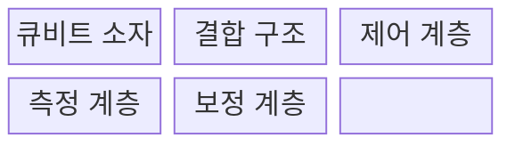
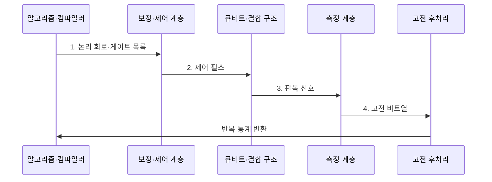

---
sidebar:
  order: 72
  label: "072. 양자 컴퓨팅 큐비트 (Quantum Computing Qubit)"
  badge:
    text: "기출 · 70%"
    variant: note
title: "양자 컴퓨팅 큐비트 (Quantum Computing Qubit)"
date: "2026-08-02T21:02:00+09:00"
tags:
  - "notes-hardware"
weight: 72
extra:
  question_no: "072"
  source_status: "기출"
  source_history: "126회, 129회, 135회"
  priority: 70
  priority_note: "큐비트 상태·게이트·측정·오류"
---

## Ⅰ. 개요

핵심 용어

- **양자 비트(Quantum Bit, Qubit)**: 0과 1 계산 기저의 복소 확률 진폭과 상대 위상을 표현하는 양자 정보의 기본 단위이다.
- **계산 기저(Computational Basis)**: 큐비트의 측정 결과를 0과 1로 나타내는 기준 상태의 집합이다.
- **상태 벡터(State Vector)**: 각 계산 기저의 복소 확률 진폭을 모아 순수 양자 상태를 표현한 벡터이다.

- 정의/개념: **복소 확률 진폭·상대 위상** 으로 상태를 표현하는 양자 정보 단위
- 배경/필요성: 고전 비트로는 양자계의 **상태 모사 비용 급증**

#### 한줄 요약

- 큐비트는 0과 1의 가능성과 두 상태 사이의 위상을 한 상태에 함께 담는다.

## Ⅱ. 특징

핵심 용어

- **확률 진폭(Probability Amplitude)**: 복소수 절댓값의 제곱이 해당 기저 상태의 측정 확률이 되는 값이다.
- **상대 위상(Relative Phase)**: 기저 상태 사이에서 간섭의 강화와 상쇄 방향을 결정하는 위상 차이이다.
- **간섭(Interference)**: 여러 상태 경로의 확률 진폭이 더해지거나 상쇄되어 측정 확률이 변하는 현상이다.
- **얽힘(Entanglement)**: 여러 큐비트의 전체 상태를 개별 큐비트 상태의 곱으로 분리할 수 없는 양자 상관이다.

- **진폭 절댓값 제곱** 이 측정 확률 결정
- **상대 위상·양자 간섭** 으로 정답 확률 증폭
- **얽힘** 으로 고전적 분리 불가능한 상관 표현

#### 한줄 요약

- 큐비트 화살표를 돌려 답의 확률을 키우지만 잡음이 쌓이기 전에 측정해야 한다.

## Ⅲ. 구조 및 구성요소

핵심 용어

- **큐비트 소자(Qubit Device)**: 물리계의 두 에너지 상태 등에 양자 정보를 부호화하는 하드웨어이다.
- **결합 구조(Coupler)**: 두 큐비트 사이의 상호작용을 조절하여 얽힘 게이트를 구현하는 구성이다.
- **제어 펄스(Control Pulse)**: 큐비트의 에너지와 위상을 바꾸어 양자 게이트를 구현하는 전기 또는 광학 신호이다.
- **보정(Calibration)**: 실제 게이트와 판독 결과가 목표값에 맞도록 펄스와 측정 변환값을 조정하는 작업이다.

| 구성요소 | 책임 |
|:---|:---|
| 큐비트 소자 | **양자 정보 부호화** |
| 결합 구조 | **2큐비트 상호작용** |
| 제어 계층 | **상태 초기화·변환** |
| 측정 계층 | **고전 비트 변환** |
| 보정 계층 | **제어·판독 오차 보정** |

#### 한줄 요약

- 펄스로 큐비트를 바꾸고 결합한 뒤 측정 결과를 보정한다.

## Ⅳ. 흐름도

핵심 용어

- **양자 게이트(Quantum Gate)**: 큐비트 상태 벡터를 가역적으로 변환하는 기본 연산이다.
- **측정(Measurement)**: 양자 상태를 선택한 기저에 투영하여 고전적인 0 또는 1 결과를 확률적으로 얻는 과정이다.
- **샷(Shot)**: 동일한 양자 회로를 한 번 초기화하고 실행한 뒤 측정하는 반복 단위이다.
- **정규화(Normalization)**: 모든 계산 기저 상태의 측정 확률 합이 1이 되도록 진폭을 제한하는 조건이다.

단일 큐비트의 정규화된 순수 상태는 다음과 같다.

$$
|\psi\rangle = \alpha|0\rangle + \beta|1\rangle,\qquad
|\alpha|^2 + |\beta|^2 = 1
$$

> 요약: **확률 진폭 제곱** 이 0·1의 **측정 확률** 결정

**동작 원리**

1. **논리 회로·게이트 목록**: 장치 제약에 맞는 물리 게이트로 변환
2. **제어 펄스**: 기준 상태 준비 후 중첩·얽힘 생성
3. **판독 신호**: 양자 상태를 아날로그 신호로 투영
4. **고전 비트열**: 판독 임계값에 따라 0·1 결과 생성

#### 한줄 요약

- 회로를 실제 칩의 펄스로 번역해 여러 번 실행하고, 측정된 0·1의 빈도로 원하는 값을 추정한다.

## Ⅴ. 종류 및 비교

핵심 용어

- **고전 비트(Classical Bit)**: 한 시점에 확정된 0 또는 1 값을 저장하고 논리 게이트로 변환하는 정보 단위이다.
- **결맞음 손실(Decoherence)**: 환경 잡음과 상호작용 때문에 큐비트의 위상과 양자 상관이 사라지는 현상이다.
- **양자 이득(Quantum Advantage)**: 특정 문제의 정확도나 시간·자원 사용에서 양자 방식이 최선의 고전 방식보다 나은 성능을 내는 상태이다.

| 정보 단위 | 큐비트 | 고전 비트 |
|:---|:---|:---|
| 적용 기준 | 오류 통제 후 **양자 이득** 확보 | 범용·**정확 계산** 수행 |
| 핵심 특징 | 진폭·위상·**얽힘 변환** | 확정된 0·1의 **논리 변환** |
| 한계 | 결맞음 손실·**게이트·판독 오류** | 양자 모사·**탐색 효율 한계** |

#### 한줄 요약

- 큐비트는 확률을 다듬고 비트는 정해진 값을 읽는다.

## Ⅵ. 실무 고려사항 및 대책

핵심 용어

- **보정 드리프트(Calibration Drift)**: 온도와 시간 변화로 큐비트 제어·판독의 최적 설정이 달라지는 현상이다.
- **결맞음 시간(Coherence Time)**: 큐비트의 위상 정보와 양자 상관이 유효하게 유지되는 시간이다.
- **회로 깊이(Circuit Depth)**: 의존성 때문에 순차로 실행해야 하는 양자 게이트 층의 최장 개수이다.
- **판독 오류율(Readout Error Rate)**: 실제 큐비트 상태와 다르게 0 또는 1로 판독할 확률이다.

| 문제 | 대책 | 효과 |
|:---|:---|:---|
| 온도·시간 변화로 보정값 드리프트 | **주기·이상 기반 재보정** | **게이트 재현성** 향상 |
| 회로 깊이가 결맞음 시간보다 길어 신호 소실 | **게이트 수·큐비트 배치 최적화** | **유효 양자 신호** 보존 |
| 게이트·판독 오류를 합쳐 병목 원인 불명 | **게이트·판독 오류 분리** | **오류 병목** 식별 |
| 샷·후처리 증가로 종단 시간이 고전 방식 초과 | **전체 실행시간·고전 기준 비교** | **종단 양자 이득** 검증 |

#### 한줄 요약

- 보정·회로 깊이·샷을 합친 종단 시간이 고전 계산보다 짧을 때만 큐비트를 쓴다.

## Ⅶ. 결론

핵심 용어

- **게이트 오류율(Gate Error Rate)**: 실제 양자 게이트 결과가 이상적인 상태 변환에서 벗어나는 비율이다.
- **종단 실행시간(End-to-end Runtime)**: 회로 준비와 장치 대기, 샷 실행 및 고전 후처리를 모두 포함한 전체 시간이다.
- **고전 기준선(Classical Baseline)**: 같은 문제와 정확도 조건에서 비교 대상으로 사용하는 최선의 고전 계산 성능이다.

- **오류율·회로 깊이** 를 통제하고 고전 대비 이득이 있을 때 큐비트 적용

#### 한줄 요약

- 잡음을 통제하며 더 나은 계산을 할 때 큐비트를 쓴다.
