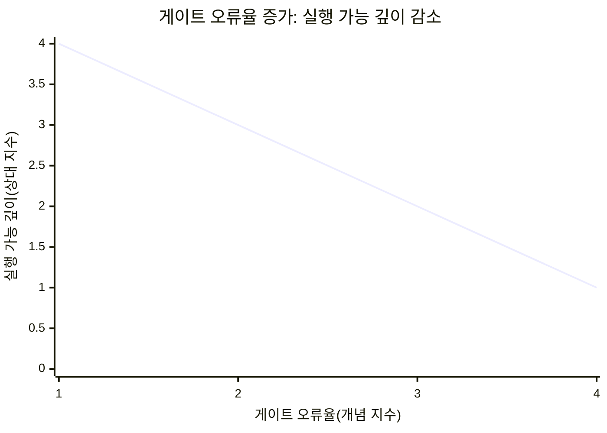
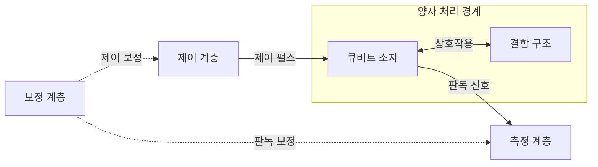
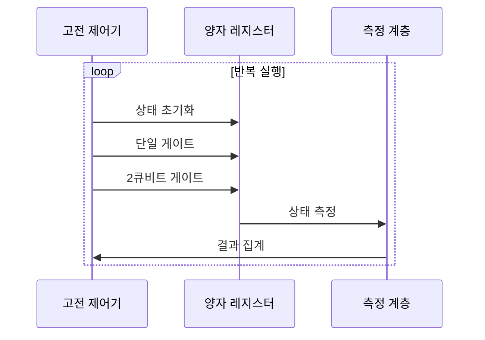

---
sidebar:
  order: 72
  label: "072. 양자 컴퓨팅 큐비트 (Quantum Computing Qubit)"
  badge:
    text: "기출 · 70%"
    variant: note
title: "양자 컴퓨팅 큐비트 (Quantum Computing Qubit)"
date: "2026-07-27T23:59:59+09:00"
tags:
  - "notes-hardware"
weight: 72
extra:
  question_no: "072"
  source_status: "기출"
  source_history: "126회, 129회, 135회"
  priority: 70
  priority_note: "큐비트 상태·게이트·측정·오류"
---

## 미리 알고가기

- **양자 비트(Quantum Bit, Qubit)**: Qubit은 ‘큐비트’로 읽고 Quantum과 Bit를 합친 이름이며, 0·1 계산 기저의 확률 진폭과 상대 위상을 담는 양자 정보 단위
- **계산 기저(Computational Basis)**: 큐비트 측정 결과를 0과 1로 나타내는 기준 상태 집합
- **상태 벡터(State Vector)**: 각 기저 상태의 복소수 확률 진폭을 모아 큐비트 상태를 표현한 벡터
- **정규화(Normalization)**: 모든 기저의 측정 확률 합이 1인 조건
- **중첩(Superposition)**: 여러 기저 상태의 진폭 결합
- **확률 진폭(Probability Amplitude)**: 절댓값 제곱이 측정 확률
- **상대 위상(Relative Phase)**: 간섭의 강화·상쇄 방향 결정
- **간섭(Interference)**: 진폭의 합으로 결과 확률 변화
- **얽힘(Entanglement)**: 개별 상태로 분리할 수 없는 상관
- **양자 게이트(Quantum Gate)**: 상태 벡터를 가역적으로 변환
- **가역 연산(Reversible Operation)**: 출력 상태에서 입력 상태를 유일하게 복원할 수 있는 변환
- **양자 레지스터(Quantum Register)**: 여러 큐비트를 묶은 연산 단위
- **측정(Measurement)**: 기저 상태 하나를 확률적으로 기록
- **결맞음 시간(Coherence Time)**: 위상 정보가 유지되는 시간
- **게이트 오류율(Gate Error Rate)**: 이상적 결과에서 벗어나는 비율
- **판독 오류율(Readout Error Rate)**: 측정 결과가 틀릴 확률
- **회로 깊이(Circuit Depth)**: 병렬 게이트 층의 최장 개수
- **제어 펄스(Control Pulse)**: 큐비트의 에너지나 위상을 바꿔 양자 게이트를 구현하는 전기·광학 신호
- **보정(Calibration)**: 실제 게이트와 판독 결과가 목표값에 맞도록 펄스·측정 변환값을 조정하는 작업
- **결맞음 손실(Decoherence)**: 환경 잡음으로 큐비트의 위상과 양자 상관이 사라지는 현상

## Ⅰ. 개요

- 정의/개념: 0·1 기저의 **복소 진폭·상대 위상**을 담는 양자 정보 단위
- 기존 한계: 고전 비트는 **중첩·얽힘·양자 간섭** 표현 불가

### 쉽게 이해하기 (학습용)

- 큐비트는 0과 1의 가능성과 두 상태 사이의 위상을 한 상태에 함께 담는다.

## Ⅱ. 특징

- **진폭 절댓값 제곱**이 측정 확률 결정
- **상대 위상·양자 간섭**으로 정답 확률 증폭
- **얽힘**으로 고전적 분리 불가능한 상관 표현

### 쉽게 이해하기 (학습용)

- 큐비트 화살표를 돌려 답의 확률을 키우지만 잡음이 쌓이기 전에 측정해야 한다.

## Ⅲ. 아키텍처 및 구성요소

| 설계 요소 | 설명 |
|:---|:---|
| 큐비트 소자 | 진폭·위상을 물리 상태에 부호화 |
| 결합 구조 | 2큐비트 상호작용 경로 제공 |
| 제어 계층 | 펄스로 단일·다중 게이트 구현 |
| 측정 계층 | 양자 상태 신호를 고전 비트로 변환 |
| 보정 계층 | 게이트·판독 오차의 보정값 제공 |

> 요약: 제어·결합·측정·보정 계층이 큐비트 상태를 운용

### 쉽게 이해하기 (학습용)

- 조종기는 큐비트를 움직이고 계기판은 결과를 읽는다.

## Ⅳ. 원리 및 절차 흐름도

| 절차 | 설명 |
|:---|:---|
| 상태 초기화 | 레지스터를 계산 기저의 0 상태로 준비 |
| 단일 게이트 | 진폭·위상을 회전해 간섭 조절 |
| 2큐비트 게이트 | 필요한 큐비트 사이 얽힘 생성 |
| 상태 측정 | 기저값을 확률적으로 고전 비트에 기록 |
| 결과 집계 | 같은 회로의 측정 빈도로 분포 추정 |

> 요약: 회로를 반복해 간섭 결과의 확률 분포를 추정

### 쉽게 이해하기 (학습용)

- 같은 묘기를 반복해 0·1이 나온 횟수를 센다.

## Ⅴ. 종류 및 비교

| 정보 단위 | 큐비트 | 고전 비트 |
|:---|:---|:---|
| 적용 기준 | 오류 통제 후 **양자 이득** 확보 | 범용·**정확 계산** 수행 |
| 핵심 특징 | 진폭·위상·**얽힘 변환** | 확정된 0·1의 **논리 변환** |
| 한계 | 결맞음 손실·**게이트·판독 오류** | 양자 모사·**탐색 효율 한계** |

> 요약: 큐비트는 진폭을 변환하고 측정으로 고전값 출력

### 쉽게 이해하기 (학습용)

- 큐비트는 확률을 다듬고 비트는 정해진 값을 읽는다.

## Ⅵ. 실무 사례

1. 분자 모사는 **큐비트 측정값**으로 에너지 추정
2. 양자 최적화는 **측정 확률 분포**로 해 후보 탐색

### 쉽게 이해하기 (학습용)

- 분자의 움직임을 작은 양자 모형에 담아 에너지를 잰다.
- 여러 답의 빈도를 비교해 좋은 후보를 좁힌다.

## Ⅶ. 결론

- **오류율 통제·고전 대비 이득**이 가능할 때 큐비트 적용

### 쉽게 이해하기 (학습용)

- 잡음을 통제하며 더 나은 계산을 할 때 큐비트를 쓴다.
