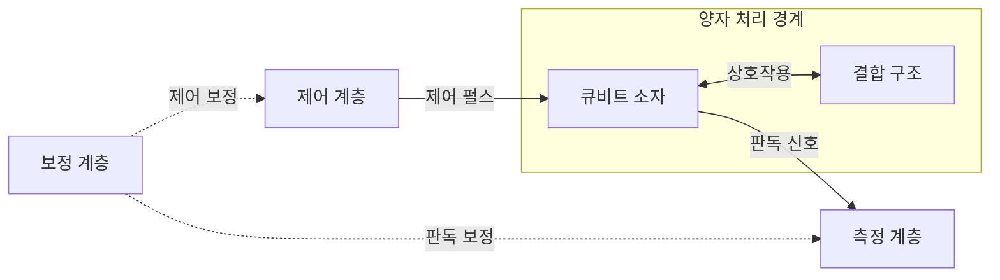
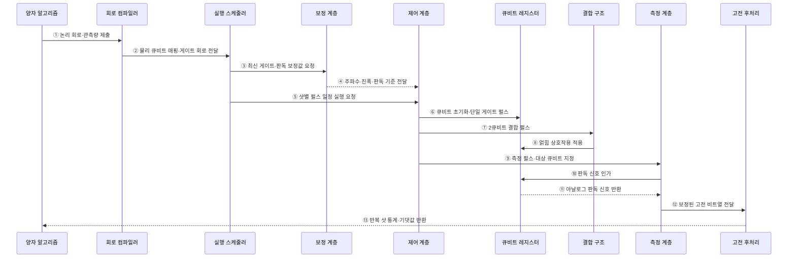

---
sidebar:
  order: 72
  label: "072. 양자 컴퓨팅 큐비트 (Quantum Computing Qubit)"
  badge:
    text: "기출 · 70%"
    variant: note
title: "양자 컴퓨팅 큐비트 (Quantum Computing Qubit)"
date: "2026-07-28T13:11:20+09:00"
tags:
  - "notes-hardware"
weight: 72
extra:
  question_no: "072"
  source_status: "기출"
  source_history: "126회, 129회, 135회"
  priority: 70
  priority_note: "큐비트 상태·게이트·측정·오류"
---

## 미리 알고가기

- **양자 비트(Quantum Bit, Qubit)**: 0·1 계산 기저의 확률 진폭과 상대 위상을 표현하는 양자 정보의 기본 단위
- **계산 기저(Computational Basis)**: 큐비트 측정 결과를 0과 1로 나타내는 기준 상태 집합
- **상태 벡터(State Vector)**: 각 기저 상태의 복소수 확률 진폭을 모아 큐비트 상태를 표현한 벡터
- **정규화(Normalization)**: 모든 기저의 측정 확률 합이 1인 조건
- **중첩(Superposition)**: 여러 기저 상태의 진폭 결합
- **확률 진폭(Probability Amplitude)**: 절댓값 제곱이 측정 확률
- **상대 위상(Relative Phase)**: 간섭의 강화·상쇄 방향 결정
- **간섭(Interference)**: 진폭의 합으로 결과 확률 변화
- **얽힘(Entanglement)**: 개별 상태로 분리할 수 없는 상관
- **양자 게이트(Quantum Gate)**: 상태 벡터를 가역적으로 변환
- **가역 연산(Reversible Operation)**: 출력 상태에서 입력 상태를 유일하게 복원할 수 있는 변환
- **양자 레지스터(Quantum Register)**: 여러 큐비트를 묶은 연산 단위
- **측정(Measurement)**: 기저 상태 하나를 확률적으로 기록
- **결맞음 시간(Coherence Time)**: 위상 정보가 유지되는 시간
- **게이트 오류율(Gate Error Rate)**: 이상적 결과에서 벗어나는 비율
- **판독 오류율(Readout Error Rate)**: 측정 결과가 틀릴 확률
- **회로 깊이(Circuit Depth)**: 병렬 게이트 층의 최장 개수
- **제어 펄스(Control Pulse)**: 큐비트의 에너지나 위상을 바꿔 양자 게이트를 구현하는 전기·광학 신호
- **보정(Calibration)**: 실제 게이트와 판독 결과가 목표값에 맞도록 펄스·측정 변환값을 조정하는 작업
- **결맞음 손실(Decoherence)**: 환경 잡음으로 큐비트의 위상과 양자 상관이 사라지는 현상

## Ⅰ. 개요

- 정의/개념: 0·1 기저의 **복소 진폭·상대 위상**을 담는 양자 정보 단위
- 기존 한계: 고전 비트는 **중첩·얽힘·양자 간섭** 표현 불가

### 쉽게 이해하기 (학습용)

- 큐비트는 0과 1의 가능성과 두 상태 사이의 위상을 한 상태에 함께 담는다.

## Ⅱ. 특징

- **진폭 절댓값 제곱**이 측정 확률 결정
- **상대 위상·양자 간섭**으로 정답 확률 증폭
- **얽힘**으로 고전적 분리 불가능한 상관 표현

### 쉽게 이해하기 (학습용)

- 큐비트 화살표를 돌려 답의 확률을 키우지만 잡음이 쌓이기 전에 측정해야 한다.

## Ⅲ. 아키텍처 및 구성요소

단일 큐비트의 순수 상태는 계산 기저에서 다음과 같이 나타낸다.

$$
|\psi\rangle = \alpha|0\rangle + \beta|1\rangle,\qquad
|\alpha|^2 + |\beta|^2 = 1
$$

- \(\alpha,\beta\)는 복소수 확률 진폭이며, 계산 기저로 이상적으로 측정할 때 0과 1의 확률은 각각 \(|\alpha|^2\), \(|\beta|^2\)이다.
- 이 식은 정규화된 순수 상태를 가정한다. 실제 잡음·혼합 상태는 밀도 행렬로 표현하며 판독 오류는 별도 보정해야 한다.

### 도표안 A. 양자 처리·제어·측정 정적 구조

| 설계 요소 | 입력·상태 | 역할 |
|:---|:---|:---|
| 큐비트 소자 | 진폭·위상·결맞음 상태 | 양자 정보 부호화 |
| 결합 구조 | 큐비트 쌍·결합 세기 | 2큐비트 상호작용 제공 |
| 제어 계층 | 게이트 명령·제어 펄스 | 상태 초기화·변환 |
| 측정 계층 | 판독 신호·기준값 | 양자 상태를 고전 비트로 변환 |
| 보정 계층 | 오차·드리프트 측정값 | 제어·판독 보정값 제공 |

> 요약: 제어·결합·측정·보정 계층이 큐비트 상태를 운용

### 쉽게 이해하기 (학습용)

- 조종기는 큐비트를 움직이고 계기판은 결과를 읽는다.

### 도표안 B. 양자 회로 제어·측정 시퀀스

#### 동작 원리

1. **문제 회로화**: 양자 알고리즘이 논리 게이트 회로와 최종적으로 측정할 관측량을 컴파일러에 제출한다.
2. **물리 회로 생성**: 컴파일러가 장치 연결성과 기본 게이트 집합에 맞춰 물리 큐비트를 배치·라우팅한다.
3. **보정값 조회**: 스케줄러가 실행 직전의 게이트 주파수·진폭과 판독 변환 기준을 요청한다.
4. **보정값 적용**: 보정 계층이 최근 측정한 제어·판독 매개변수를 제어 계층에 전달한다.
5. **펄스 일정 실행**: 스케줄러가 병렬 가능 게이트와 타이밍을 반영한 샷별 펄스 일정을 실행시킨다.
6. **초기화·단일 게이트**: 제어 계층이 큐비트를 기준 상태로 준비하고 단일 큐비트 회전을 위한 펄스를 인가한다.
7. **결합 제어**: 2큐비트 게이트가 필요하면 제어 계층이 해당 큐비트 쌍의 결합 구조를 구동한다.
8. **얽힘 형성**: 결합 구조가 두 큐비트 사이에 제어된 상호작용을 적용해 분리 불가능한 상관을 만든다.
9. **측정 지시**: 회로 끝에서 제어 계층이 측정 대상과 판독 펄스 시점을 측정 계층에 전달한다.
10. **판독 신호 인가**: 측정 계층이 큐비트 상태에 따라 달라지는 응답을 얻기 위한 신호를 인가한다.
11. **아날로그 응답 수집**: 큐비트 레지스터가 상태에 따른 아날로그 판독 신호를 반환한다.
12. **고전 비트 변환**: 측정 계층이 보정 기준으로 신호를 0·1 비트열로 분류해 고전 후처리에 전달한다.
13. **통계 결과 반환**: 같은 회로를 여러 샷 반복한 비트열로 확률·기댓값과 불확실성을 추정해 알고리즘에 반환한다.

### 쉽게 이해하기 (학습용)

- 회로를 실제 칩의 펄스로 번역해 여러 번 실행하고, 측정된 0·1의 빈도로 원하는 값을 추정한다.

## Ⅳ. 종류 및 비교

| 정보 단위 | 큐비트 | 고전 비트 |
|:---|:---|:---|
| 적용 기준 | 오류 통제 후 **양자 이득** 확보 | 범용·**정확 계산** 수행 |
| 핵심 특징 | 진폭·위상·**얽힘 변환** | 확정된 0·1의 **논리 변환** |
| 한계 | 결맞음 손실·**게이트·판독 오류** | 양자 모사·**탐색 효율 한계** |

> 요약: 큐비트는 진폭을 변환하고 측정으로 고전값 출력

### 쉽게 이해하기 (학습용)

- 큐비트는 확률을 다듬고 비트는 정해진 값을 읽는다.

## Ⅴ. 실무 고려사항 및 대응 방안

| 운영 위험 | 대응 | 기대 효과 |
|:---|:---|:---|
| 시간·온도 변화로 제어·판독 보정값 드리프트 | 주기·이상 징후 기반 재보정과 보정 이력 추적 | 실행 재현성 향상 |
| 회로 깊이가 결맞음 시간·오류 예산 초과 | 게이트 수·경로 최적화와 얕은 회로·오류 완화 적용 | 유효 신호 보존 |
| 게이트 오류와 판독 오류를 한 지표로 혼동 | 단일·2큐비트 게이트와 판독 오류를 분리 측정 | 병목별 개선 가능 |
| 충분한 샷·고전 후처리 비용이 양자 이득 상쇄 | 신뢰구간·샷 수·전체 실행시간을 고전 기준과 비교 | 종단 이득 검증 |

### 쉽게 이해하기 (학습용)

- 같은 묘기를 반복해 0·1이 나온 횟수를 센다.

### 적용 사례

- 변분 양자 고유값 풀이기는 분자 해밀토니안의 항별 관측량을 반복 측정하고 고전 최적화와 결합해 바닥상태 에너지를 추정한다.

### 쉽게 이해하기 (학습용)

- 분자의 움직임을 작은 양자 모형에 담아 에너지를 잰다.

## Ⅵ. 결론

- 고전 컴퓨팅으로 비효율적인 문제의 계산 이득을 얻기 위해 **중첩·얽힘 활용성·큐비트 오류율·회로 깊이·고전 대비 성능**을 검토하고, 오류를 통제하며 우위를 입증할 수 있는 문제에 양자 컴퓨팅을 적용한다

### 쉽게 이해하기 (학습용)

- 잡음을 통제하며 더 나은 계산을 할 때 큐비트를 쓴다.
