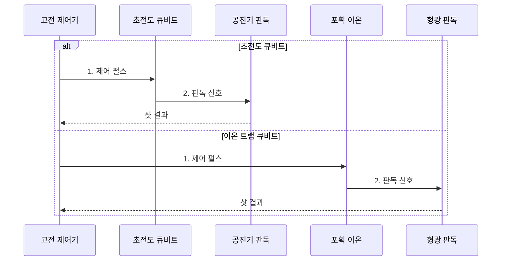

---
sidebar:
  order: 73
  label: "073. 초전도·이온 트랩 양자 프로세서"
  badge:
    text: "기출 · 50%"
    variant: note
title: "초전도·이온 트랩 양자 프로세서"
date: "2026-07-30T21:30:52+09:00"
tags:
  - "notes-hardware"
weight: 73
extra:
  question_no: "073"
  source_status: "기출"
  source_history: "135회"
  priority: 50
  priority_note: "게이트 시간·결맞음·연결성 비교"
---

## 미리 알고가기

- **물리 큐비트(Physical Qubit)**: 실제 소자로 구현한 제어 가능한 양자 상태
- **논리 큐비트(Logical Qubit)**: 하나의 안정된 양자 정보 단위를 표현하도록 물리 큐비트를 묶은 추상 단위
- **초전도 큐비트(Superconducting Qubit)**: 조지프슨 접합을 포함한 초전도 회로로 만든 인공 원자
- **조지프슨 접합(Josephson Junction)**: 비선형 에너지 준위를 만드는 초전도 회로 소자
- **이온 트랩 큐비트(Trapped-ion Qubit)**: 포획한 이온의 내부 상태를 정보 단위로 사용하는 큐비트
- **결맞음 시간(Coherence Time)**: 양자 상태가 유효하게 유지되는 시간
- **게이트 시간(Gate Time)**: 한 양자 연산을 수행하는 데 걸리는 시간
- **큐비트 연결성(Qubit Connectivity)**: 직접 2큐비트 게이트를 수행할 수 있는 관계
- **공진기 판독(Resonator Readout)**: 공진 응답 변화로 초전도 큐비트 상태를 구별하는 방식
- **상태 의존 형광(State-dependent Fluorescence)**: 방출광 차이로 이온 상태를 판독하는 방식
- **교차 간섭(Crosstalk)**: 제어 신호가 주변 큐비트에 의도하지 않은 영향을 주는 현상
- **수율(Yield)**: 제작 소자 중 요구 사양을 만족하는 비율
- **모드 혼잡(Mode Crowding)**: 이온 진동 주파수가 가까워 원하는 상호작용 선택이 어려워지는 현상
- **게이트 충실도(Gate Fidelity)**: 실제 게이트 결과가 이상적 결과와 일치하는 정도
- **이온 셔틀링(Ion Shuttling)**: 전기장으로 이온을 트랩 구역 사이에 이동시키는 기술
- **스왑 게이트(SWAP Gate)**: 두 큐비트의 양자 상태를 서로 바꾸는 게이트
- **샷(Shot)**: 같은 양자 회로를 한 번 실행하고 측정하는 단위
- **보정·재보정(Calibration·Recalibration)**: 제어 펄스와 판독 기준을 목표 게이트·측정값에 맞추고 환경 변화 뒤 다시 조정하는 작업

## Ⅰ. 개요

- 정의/개념: **조지프슨 회로·포획 이온**으로 큐비트를 구현하는 양자 프로세서 기술
- 배경/필요성: **게이트 시간·결맞음·연결성** 상충으로 적합 플랫폼 상이

### 쉽게 이해하기 (학습용)

- 빠르게 움직이는 초전도 방식과 오래 상태를 지키는 이온 방식 중 문제에 맞는 쪽을 고른다.

## Ⅱ. 특징

- 초전도 방식은 **빠른 게이트·반도체 공정 기반 집적**에 유리
- 이온 트랩 방식은 **긴 결맞음·높은 연결성**에 유리
- 두 방식 모두 **제어선·보정 인프라**와 냉각·진공 장치가 확장 한계

### 쉽게 이해하기 (학습용)

- 초전도는 빠른 전기 회로이고 이온 트랩은 정밀하게 조종하는 원자 배열이다.

## Ⅲ. 구조 및 구성요소

| 구성요소 | 책임 |
|:---|:---|
| 고전 제어기 | **펄스·측정 해석** |
| 초전도 큐비트 | **마이크로파 게이트** |
| 공진기 판독 | **공진 상태 판별** |
| 포획 이온 | **레이저 게이트** |
| 형광 판독 | **광자 상태 판별** |

### 쉽게 이해하기 (학습용)

- 초전도는 마이크로파, 이온은 레이저로 제어하고 판독한다.

## Ⅳ. 흐름도

**동작 원리**

- **1. 제어 펄스**: 마이크로파 또는 레이저로 양자 게이트 수행
- **2. 판독 신호**: 공진 응답 또는 형광 광자로 상태 판별

### 쉽게 이해하기 (학습용)

- 같은 논리 게이트라도 초전도 칩은 마이크로파와 공진 응답으로, 이온 트랩은 레이저와 형광으로 실행·판독한다.

## Ⅴ. 종류 및 비교

| 큐비트 방식 | 초전도 큐비트 | 이온 트랩 큐비트 |
|:---|:---|:---|
| 적용 기준 | **빠른 게이트·집적** | **긴 결맞음·연결성** |
| 핵심 특징 | **마이크로파·공진기** | **레이저·형광** |
| 한계 | **배선·교차 간섭**과 수율 | **모드 혼잡·이온 이동** |

### 쉽게 이해하기 (학습용)

- 빠른 계산과 정밀한 연결 중 더 중요한 조건을 먼저 본다.

## Ⅵ. 실무 고려사항 및 대책

| 고려사항 | 대책 | 효과 |
|:---|:---|:---|
| 주파수 충돌·교차 간섭으로 초전도 게이트 오류 증가 | **주파수 배치·교차 간섭 보정** | **게이트 충실도** 유지 |
| 이온 수 증가로 진동 모드 혼잡 | **이온 사슬 분할·셔틀링** | **직접 연결 가능 규모** 확대 |
| 시간·온도 변화로 보정값 드리프트 | **자동 재보정** | **실행 재현성** 향상 |
| 냉각·진공·레이저 장애로 서비스 중단 | **계측 이중화·예비 장치** 운영 | **서비스 중단시간** 단축 |

### 쉽게 이해하기 (학습용)

- 논리 회로를 실제 장비의 잘 연결되고 오류가 적은 자리에 놓는다.

## Ⅶ. 결론

- 짧은 **게이트 시간**은 초전도, 긴 결맞음·연결성은 이온 트랩 선택

### 쉽게 이해하기 (학습용)

- 짧은 회로 반복은 초전도, 긴 결맞음과 직접 연결이 중요하면 이온 트랩을 선택한다.
