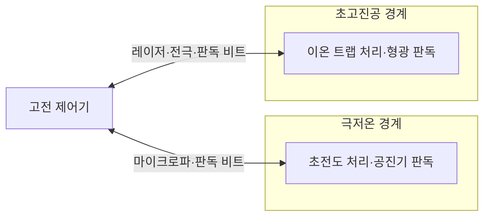
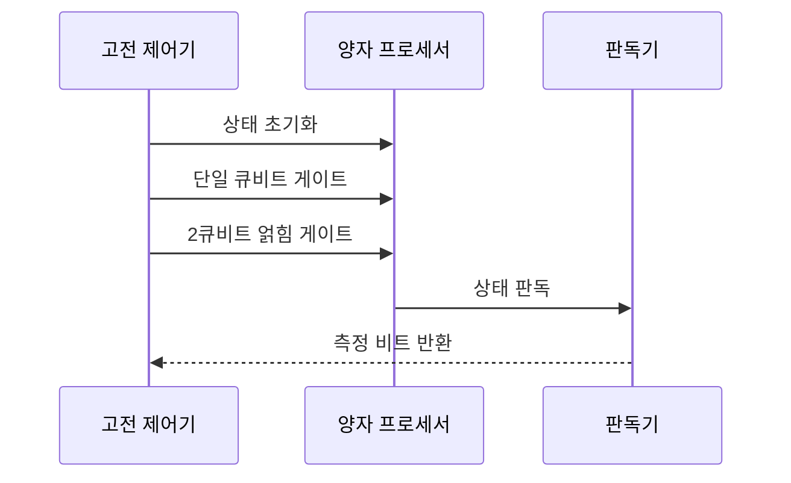

---
sidebar:
  order: 73
  label: "073. 초전도·이온 트랩 양자 프로세서"
  badge:
    text: "기출 · 50%"
    variant: note
title: "초전도·이온 트랩 양자 프로세서"
date: "2026-07-27T23:59:59+09:00"
tags:
  - "notes-hardware"
weight: 73
extra:
  question_no: "073"
  source_status: "기출"
  source_history: "135회"
  priority: 50
  priority_note: "게이트 시간·결맞음·연결성 비교"
---

## 미리 알고가기

- **양자 프로세서(Quantum Processor)**: 물리 큐비트로 게이트·측정을 수행하는 장치
- **양자 비트(Quantum Bit, Qubit)**: Qubit은 ‘큐비트’로 읽고 Quantum과 Bit를 합친 이름이며, 중첩과 위상을 저장·연산하는 양자 정보 단위
- **물리 큐비트(Physical Qubit)**: 실제 소자로 구현한 제어 가능 양자 상태
- **가상 큐비트(Virtual Qubit)**: 하드웨어와 분리된 추상 회로의 큐비트
- **초전도 큐비트(Superconducting Qubit)**: 조지프슨 회로를 극저온에서 제어
- **조지프슨 접합(Josephson Junction)**: 초전도 큐비트의 비선형 회로 소자
- **인공 원자(Artificial Atom)**: 조지프슨 회로의 이산 에너지 준위를 이용해 원자처럼 동작하게 만든 큐비트
- **공명 주파수(Resonance Frequency)**: 큐비트의 두 에너지 준위 사이 전이를 일으키는 제어 신호 주파수
- **이온 트랩 큐비트(Trapped-Ion Qubit)**: 포획 이온의 내부 상태를 빛으로 제어
- **결맞음 시간(Coherence Time)**: 양자 상태가 유효하게 유지되는 시간
- **게이트 시간(Gate Time)**: 한 양자 연산을 수행하는 시간
- **큐비트 연결성(Qubit Connectivity)**: 직접 2큐비트 연산이 가능한 관계
- **결합 회로(Coupling Circuit)**: 초전도 큐비트 사이 상호작용 조절
- **공진기 판독(Resonator Readout)**: 공진 응답으로 초전도 상태 판별
- **광학 펌핑(Optical Pumping)**: 레이저로 이온을 기준 상태에 준비
- **진동 모드(Motional Mode)**: 이온 공동 운동으로 얽힘을 매개하는 상태
- **상태 의존 형광(State-Dependent Fluorescence)**: 빛의 유무로 이온 상태 판별
- **교차 간섭(Crosstalk)**: 한 제어 신호가 주변 큐비트에 주는 오차
- **수율(Yield)**: 제작한 소자 중 요구 주파수·오류율을 만족해 사용할 수 있는 비율
- **모드 혼잡(Mode Crowding)**: 여러 이온의 진동 주파수가 가까워져 목표 얽힘 모드의 선택성이 낮아지는 현상
- **결합 그래프(Coupling Graph)**: 직접 2큐비트 게이트를 수행할 수 있는 물리 큐비트 연결 관계
- **큐비트 배치(Qubit Mapping)**: 가상 회로의 큐비트를 물리 연결성과 오류율에 맞춰 실제 소자에 대응시키는 컴파일 작업

## Ⅰ. 개요

- 정의/개념: 초전도 회로·포획 이온 기반의 **큐비트 구현 방식**
- 기존 한계: 단일 플랫폼은 **게이트 속도·결맞음·연결성** 동시 최적화에 한계

### 쉽게 이해하기 (학습용)

- 빠른 냉동 전자회로와 오래 상태를 지키는 진공 속 이온 중 문제에 맞는 선수를 선택하는 일이다.

## Ⅱ. 특징

- 초전도는 **빠른 게이트·반도체 공정 집적**에 유리
- 이온 트랩은 **긴 결맞음·전역 연결**에 유리
- **극저온 배선·레이저 제어**가 각 플랫폼 확장 제한

### 쉽게 이해하기 (학습용)

- 냉동 칩의 인공 원자는 제조마다 달라지고 같은 동위원소 이온은 본래 같은 성질을 가진다.

## Ⅲ. 아키텍처 및 구성요소

| 설계 요소 | 설명 |
|:---|:---|
| 고전 제어기 | 펄스 생성·보정·측정 결과 해석 |
| 초전도 처리·공진기 판독 | 조지프슨 회로 결합·공진 응답 판별 |
| 이온 트랩 처리·형광 판독 | 진동 모드 얽힘·상태 의존 형광 판별 |

> 요약: 제어기가 두 물리 플랫폼을 구동·판독

### 쉽게 이해하기 (학습용)

- 한 지휘 체계가 냉동 회로와 진공 이온에 서로 다른 신호를 보내 결과를 읽는다.

## Ⅳ. 원리 및 절차 흐름도

| 절차 | 설명 |
|:---|:---|
| 상태 초기화 | 초전도 리셋·이온 광학 펌핑 |
| 단일 큐비트 게이트 | 마이크로파·레이저로 상태 회전 |
| 2큐비트 얽힘 게이트 | 결합 회로·진동 모드로 얽힘 생성 |
| 상태 판독 | 공진 응답·상태 의존 형광 판별 |
| 측정 비트 반환 | 판독 결과를 고전 비트로 제어기에 전달 |

> 요약: 초전도는 회로 결합, 이온은 공동 진동으로 얽힘

### 쉽게 이해하기 (학습용)

- 냉동 회로나 이온을 0으로 준비한 뒤 하나씩 돌리고 서로 얽어 마지막에 0·1로 읽는다.

## Ⅴ. 종류 및 비교

| 큐비트 구현 방식 | 초전도 큐비트 | 이온 트랩 큐비트 |
|:---|:---|:---|
| 적용 기준 | 고속 게이트·**칩 집적 우선** | 긴 결맞음·**전역 연결 우선** |
| 핵심 특징 | 빠른 게이트·**고체 회로 집적** | 긴 결맞음·**이온 간 상호작용** |
| 한계 | 극저온 배선·**교차 간섭·수율** | 레이저 채널·**모드 혼잡·이동 지연** |

> 요약: 초전도는 속도·집적, 이온은 결맞음·연결성 우위

### 쉽게 이해하기 (학습용)

- 빠른 냉동 칩과 오래 상태를 지키며 어느 쌍도 연결하는 이온 중 회로에 맞는 쪽을 선택한다.

## Ⅵ. 실무 사례

1. 초전도 컴파일러는 **물리 결합 그래프**에 큐비트 배치

### 쉽게 이해하기 (학습용)

- 설계도 속 큐비트를 실제 칩에서 서로 연결된 자리로 옮겨 놓는다.

## Ⅶ. 결론

- **게이트 시간·결맞음·연결성**에 따라 큐비트 플랫폼 선택

### 쉽게 이해하기 (학습용)

- 빠른 연산·긴 상태 유지·임의 쌍 연결 중 회로에 중요한 조건으로 구현 방식을 선택한다.
