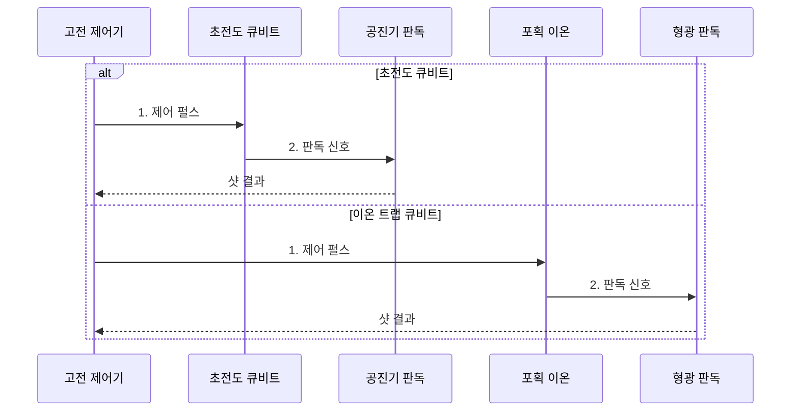

---
sidebar:
  order: 73
  label: "073. 초전도·이온 트랩 양자 프로세서"
  badge:
    text: "기출 · 50%"
    variant: note
title: "초전도·이온 트랩 양자 프로세서"
date: "2026-08-02T21:03:00+09:00"
tags:
  - "notes-hardware"
weight: 73
extra:
  question_no: "073"
  source_status: "기출"
  source_history: "135회"
  priority: 50
  priority_note: "게이트 시간·결맞음·연결성 비교"
---

## Ⅰ. 개요

핵심 용어

- **초전도 큐비트(Superconducting Qubit)**: 조지프슨 접합을 포함한 초전도 회로의 에너지 상태로 양자 정보를 표현하는 소자이다.
- **이온 트랩 큐비트(Trapped-ion Qubit)**: 전기장으로 포획한 이온의 내부 에너지 상태를 양자 정보 단위로 사용하는 소자이다.
- **물리 큐비트(Physical Qubit)**: 실제 하드웨어 소자로 구현하여 제어하고 측정할 수 있는 양자 상태이다.

- 정의/개념: **조지프슨 회로·포획 이온** 으로 큐비트를 구현하는 양자 프로세서 기술
- 배경/필요성: 플랫폼별 **게이트 속도·결맞음·연결성** 차이로 단일 방식 적용 제약

#### 한줄 요약

- 빠르게 움직이는 초전도 방식과 오래 상태를 지키는 이온 방식 중 문제에 맞는 쪽을 고른다.

## Ⅱ. 특징

핵심 용어

- **게이트 시간(Gate Time)**: 하나의 양자 게이트를 물리 큐비트에서 수행하는 데 걸리는 시간이다.
- **결맞음 시간(Coherence Time)**: 큐비트의 위상 정보와 양자 상관이 유효하게 유지되는 시간이다.
- **큐비트 연결성(Qubit Connectivity)**: 추가 상태 이동 없이 직접 2큐비트 게이트를 수행할 수 있는 큐비트 관계이다.
- **제어 인프라(Control Infrastructure)**: 큐비트 펄스와 측정 및 냉각·진공을 제공하는 고전 장치의 집합이다.

- 초전도 방식은 **빠른 게이트·반도체 공정 기반 집적** 에 유리
- 이온 트랩 방식은 **긴 결맞음·높은 연결성** 에 유리
- 두 방식 모두 **제어선·보정 인프라** 와 냉각·진공 장치 증가로 확장 제약

#### 한줄 요약

- 초전도는 빠른 전기 회로이고 이온 트랩은 정밀하게 조종하는 원자 배열이다.

## Ⅲ. 구조 및 구성요소

핵심 용어

- **조지프슨 접합(Josephson Junction)**: 초전도 큐비트의 비선형 에너지 준위를 만드는 회로 소자이다.
- **공진기 판독(Resonator Readout)**: 공진 주파수나 위상 변화를 측정하여 초전도 큐비트 상태를 구별하는 방식이다.
- **상태 의존 형광(State-dependent Fluorescence)**: 레이저 조사 때 방출되는 광자 차이로 이온 상태를 판독하는 방식이다.

| 구성요소 | 책임 |
|:---|:---|
| 고전 제어기 | **펄스·측정 해석** |
| 초전도 큐비트 | **마이크로파 게이트** |
| 공진기 판독 | **공진 상태 판별** |
| 포획 이온 | **레이저 게이트** |
| 형광 판독 | **광자 상태 판별** |

#### 한줄 요약

- 초전도는 마이크로파, 이온은 레이저로 제어하고 판독한다.

## Ⅳ. 흐름도

핵심 용어

- **마이크로파 펄스(Microwave Pulse)**: 초전도 큐비트의 상태와 결합을 제어하여 게이트를 구현하는 전기 신호이다.
- **레이저 펄스(Laser Pulse)**: 포획 이온의 내부 상태와 집단 진동을 제어하여 게이트를 구현하는 광 신호이다.
- **샷(Shot)**: 같은 양자 회로를 한 번 준비하고 실행한 뒤 측정하는 단위이다.

**동작 원리**

1. **제어 펄스**: 마이크로파 또는 레이저로 양자 게이트 수행
2. **판독 신호**: 공진 응답 또는 형광 광자로 상태 판별

#### 한줄 요약

- 같은 논리 게이트라도 초전도 칩은 마이크로파와 공진 응답으로, 이온 트랩은 레이저와 형광으로 실행·판독한다.

## Ⅴ. 종류 및 비교

핵심 용어

- **집적(Integration)**: 많은 큐비트와 제어 회로를 제한된 칩 및 시스템 공간에 배치하는 능력이다.
- **교차 간섭(Crosstalk)**: 한 큐비트의 제어 신호가 주변 큐비트에 의도하지 않은 영향을 주는 현상이다.
- **모드 혼잡(Mode Crowding)**: 이온 수가 늘어 진동 주파수들이 가까워지면서 원하는 상호작용을 선택하기 어려운 현상이다.

| 큐비트 방식 | 초전도 큐비트 | 이온 트랩 큐비트 |
|:---|:---|:---|
| 적용 기준 | **빠른 게이트·집적** | **긴 결맞음·연결성** |
| 핵심 특징 | **마이크로파·공진기** | **레이저·형광** |
| 한계 | **배선·교차 간섭** 과 수율 | **모드 혼잡·이온 이동** |

#### 한줄 요약

- 빠른 계산과 정밀한 연결 중 더 중요한 조건을 먼저 본다.

## Ⅵ. 실무 고려사항 및 대책

핵심 용어

- **주파수 배치(Frequency Allocation)**: 초전도 큐비트와 결합기의 동작 주파수를 충돌이 적도록 배정하는 설계이다.
- **이온 셔틀링(Ion Shuttling)**: 전기장으로 이온을 트랩 구역 사이에 이동시켜 상호작용 대상을 바꾸는 기술이다.
- **재보정(Recalibration)**: 환경 변화 뒤 제어 펄스와 판독 기준을 다시 측정하고 조정하는 작업이다.
- **게이트 충실도(Gate Fidelity)**: 실제 게이트 결과가 이상적인 상태 변환과 일치하는 정도이다.

| 문제 | 대책 | 효과 |
|:---|:---|:---|
| 주파수 충돌·교차 간섭으로 초전도 게이트 오류 증가 | **주파수 배치·교차 간섭 보정** | **게이트 충실도** 유지 |
| 이온 수 증가로 진동 모드 혼잡 | **이온 사슬 분할·셔틀링** | **직접 연결 가능 규모** 확대 |
| 시간·온도 변화로 보정값 드리프트 | **자동 재보정** | **실행 재현성** 향상 |
| 냉각·진공·레이저 장애로 서비스 중단 | **계측 이중화·예비 장치** 운영 | **서비스 중단시간** 단축 |

#### 한줄 요약

- 논리 회로를 실제 장비의 잘 연결되고 오류가 적은 자리에 놓는다.

## Ⅶ. 결론

핵심 용어

- **짧은 회로 반복(Short-circuit Repetition)**: 얕은 양자 회로를 빠르게 여러 샷 실행해야 하는 작업이다.
- **직접 연결(Direct Connectivity)**: 상태를 여러 SWAP 게이트로 옮기지 않고 필요한 큐비트 쌍에 게이트를 적용하는 특성이다.
- **플랫폼 선택(Platform Selection)**: 회로의 속도와 깊이 및 연결 요구에 맞춰 큐비트 구현 방식을 정하는 판단이다.

- 짧은 **게이트 시간** 은 초전도, 긴 결맞음·연결성은 이온 트랩 선택

#### 한줄 요약

- 짧은 회로 반복은 초전도, 긴 결맞음과 직접 연결이 중요하면 이온 트랩을 선택한다.
