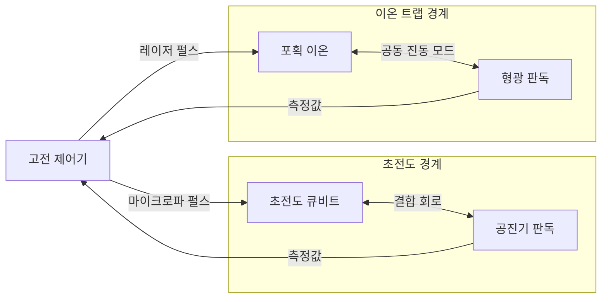

---
sidebar:
  order: 73
  label: "073. 초전도·이온 트랩 양자 프로세서"
  badge:
    text: "기출 · 50%"
    variant: note
title: "초전도·이온 트랩 양자 프로세서"
date: "2026-07-28T13:11:20+09:00"
tags:
  - "notes-hardware"
weight: 73
extra:
  question_no: "073"
  source_status: "기출"
  source_history: "135회"
  priority: 50
  priority_note: "게이트 시간·결맞음·연결성 비교"
---

## 미리 알고가기

- **물리 큐비트(Physical Qubit)**: 실제 소자로 구현한 제어 가능한 양자 상태
- **초전도 큐비트(Superconducting Qubit)**: 조지프슨 접합을 포함한 초전도 회로로 만든 인공 원자
- **조지프슨 접합(Josephson Junction)**: 비선형 에너지 준위를 만드는 초전도 회로 소자
- **이온 트랩 큐비트(Trapped-ion Qubit)**: 포획한 이온의 내부 상태를 정보 단위로 사용하는 큐비트
- **결맞음 시간(Coherence Time)**: 양자 상태가 유효하게 유지되는 시간
- **게이트 시간(Gate Time)**: 한 양자 연산을 수행하는 데 걸리는 시간
- **큐비트 연결성(Qubit Connectivity)**: 직접 2큐비트 게이트를 수행할 수 있는 관계
- **공진기 판독(Resonator Readout)**: 공진 응답 변화로 초전도 큐비트 상태를 구별하는 방식
- **상태 의존 형광(State-dependent Fluorescence)**: 방출광 차이로 이온 상태를 판독하는 방식
- **교차 간섭(Crosstalk)**: 제어 신호가 주변 큐비트에 의도하지 않은 영향을 주는 현상
- **수율(Yield)**: 제작 소자 중 요구 사양을 만족하는 비율
- **모드 혼잡(Mode Crowding)**: 이온 진동 주파수가 가까워 원하는 상호작용 선택이 어려워지는 현상

## Ⅰ. 개요

- 정의/개념: 초전도 회로 또는 포획 이온으로 **큐비트 제어·결합·판독**을 수행하는 프로세서 기술
- 기존 한계: 단일 플랫폼이 **속도·결맞음·연결성·집적도**를 동시에 극대화하기 어려움

### 쉽게 이해하기 (학습용)

- 빠르게 움직이는 초전도 방식과 오래 상태를 지키는 이온 방식 중 문제에 맞는 쪽을 고른다.

## Ⅱ. 특징

- 초전도 방식은 **빠른 게이트·반도체 공정 기반 집적**에 유리
- 이온 트랩 방식은 **긴 결맞음·높은 연결성**에 유리
- 두 방식 모두 제어선·보정·냉각 또는 진공 장치가 확장 한계

### 쉽게 이해하기 (학습용)

- 초전도는 빠른 전기 회로이고 이온 트랩은 정밀하게 조종하는 원자 배열이다.

## Ⅲ. 아키텍처 및 구성요소

| 설계 요소 | 입력·상태 | 역할 |
|:---|:---|:---|
| 고전 제어기 | 회로 명령·보정값 | 제어 펄스 생성과 측정 해석 |
| 초전도 큐비트·결합 회로 | 마이크로파·결합 세기 | 빠른 단일·2큐비트 게이트 수행 |
| 공진기 판독 | 공진 응답 | 초전도 큐비트 상태 판별 |
| 포획 이온·진동 모드 | 레이저·이온 배열 | 내부 상태 제어와 원거리 얽힘 생성 |
| 형광 판독 | 방출 광자 | 이온 상태를 고전 비트로 변환 |

> 요약: 고전 제어기가 플랫폼별 펄스와 판독 체계를 운용

### 쉽게 이해하기 (학습용)

- 같은 명령도 초전도에는 전파로, 이온에는 레이저로 전달한다.

## Ⅳ. 운영 고려사항

| 운영 위험 | 대응 | 기대 효과 |
|:---|:---|:---|
| 초전도 소자의 주파수 편차·교차 간섭 | 소자별 보정과 주파수 배치·동시 게이트 제약 관리 | 게이트 충실도 유지 |
| 이온 수 증가에 따른 모드 혼잡·게이트 지연 | 이온 사슬 분할과 셔틀링·광 연결 계층화 | 확장성 확보 |
| 보정값의 시간·온도 드리프트 | 주기·이상 징후 기반 자동 재보정 | 실행 재현성 향상 |
| 냉각기·진공·레이저 장애가 전체 가용성 저하 | 환경 계측과 예비 장치·복구 절차 운영 | 서비스 중단 축소 |

### 쉽게 이해하기 (학습용)

- 소자만이 아니라 냉각기와 레이저까지 한 시스템으로 관리해야 한다.

## Ⅴ. 종류 및 비교

| 판단 기준 | 초전도 큐비트 | 이온 트랩 큐비트 |
|:---|:---|:---|
| 핵심 강점 | 빠른 게이트·공정 집적 | 긴 결맞음·높은 연결성 |
| 제어·판독 | 마이크로파·공진기 | 레이저·형광 |
| 확장 위험 | 배선·교차 간섭·수율 | 레이저 채널·모드 혼잡·이온 이동 |

> 요약: 초전도는 속도·집적, 이온 트랩은 결맞음·연결성에 강점

### 쉽게 이해하기 (학습용)

- 빠른 계산과 정밀한 연결 중 더 중요한 조건을 먼저 본다.

## Ⅵ. 실무 사례

1. 양자 회로 컴파일러는 **물리 연결성·게이트 오류·실행시간**을 함께 반영해 큐비트를 배치한다.

### 쉽게 이해하기 (학습용)

- 논리 회로를 실제 장비의 잘 연결되고 오류가 적은 자리에 놓는다.

## Ⅶ. 결론

- 목표 회로를 안정적으로 실행하기 위해 **게이트 시간·결맞음·연결성·충실도·환경 비용**을 비교하고, 워크로드와 확장 방식에 맞는 양자 프로세서 기술을 선택한다.

### 쉽게 이해하기 (학습용)

- 빠르기만 보지 않고 오류와 장비 운영 비용까지 함께 비교한다.
