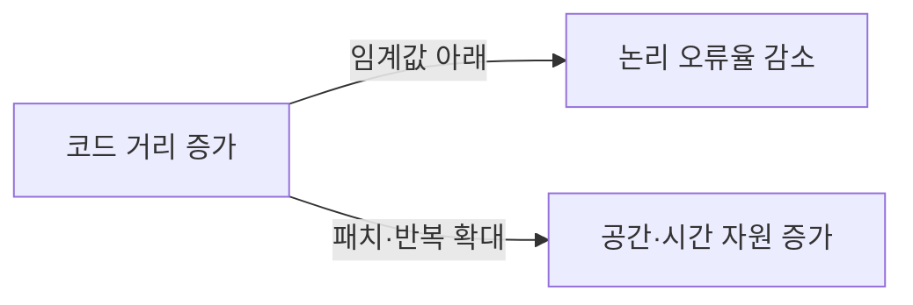
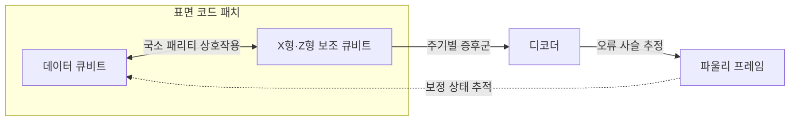
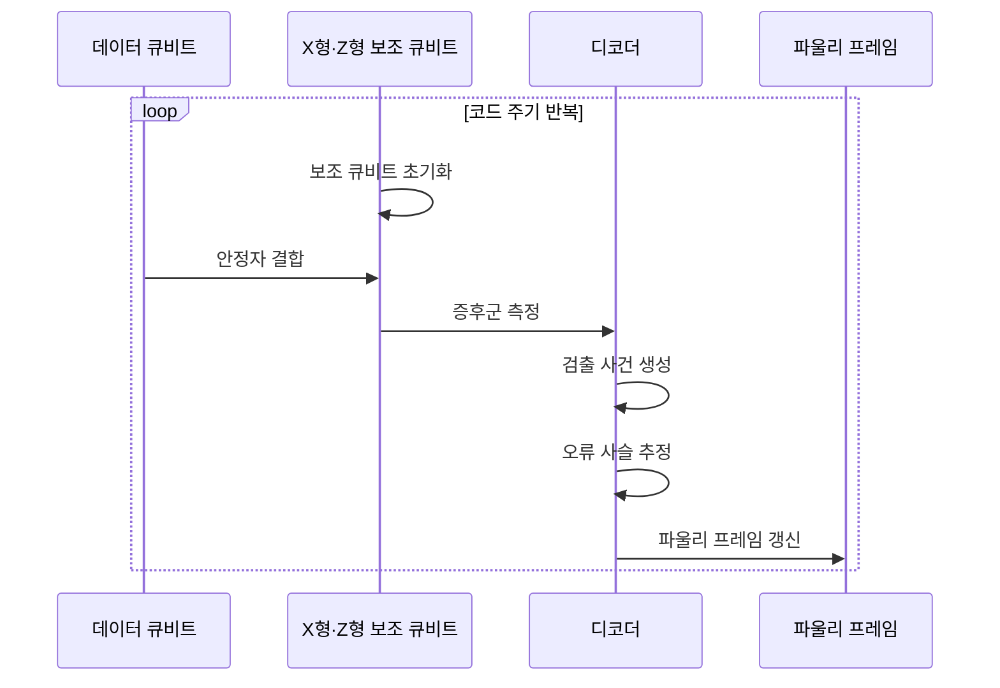

---
sidebar:
  order: 74
  label: "074. 양자 오류 정정·표면 코드"
  badge:
    text: "기출 · 50%"
    variant: note
title: "양자 오류 정정·표면 코드"
date: "2026-07-27T23:59:59+09:00"
tags:
  - "notes-hardware"
weight: 74
extra:
  question_no: "074"
  source_status: "기출"
  source_history: "138회"
  priority: 50
  priority_note: "안정자 측정·코드 거리·실시간 복호"
---

## 미리 알고가기

- **양자 오류 정정(Quantum Error Correction, QEC)**: QEC는 ‘큐이씨’로 읽고 영문 머리글자를 딴 약어이며, 물리 오류를 검출·보정해 논리 정보를 보호
- **표면 코드(Surface Code)**: 2차원 국소 안정자를 반복 측정하는 코드
- **데이터 큐비트(Data Qubit)**: 논리 정보를 여러 물리 상태에 분산 저장
- **보조 큐비트(Ancilla Qubit)**: 안정자 값을 측정해 증후군을 생성
- **X형·Z형 안정자(X- and Z-Type Stabilizers)**: X·Z는 ‘엑스·제트’로 읽고 파울리 X·Z 연산자를 나타내는 양자 분야의 표준 표기로, X형 안정자는 위상 반전 오류를, Z형 안정자는 비트 반전 오류를 검출
- **패리티(Parity)**: 여러 큐비트 상태의 짝수·홀수 관계를 측정해 개별 논리값을 노출하지 않고 오류를 찾는 값
- **오류 증후군(Error Syndrome)**: 안정자 측정값으로 얻는 오류 단서
- **코드 거리(Code Distance)**: 검출되지 않는 논리 연산의 최소 물리 오류 수
- **오류 임계값(Error Threshold)**: 거리 증가가 논리 오류를 줄이는 물리 오류 경계
- **디코더(Decoder)**: 증후군에서 가능한 오류 사슬을 추정
- **파울리 프레임(Pauli Frame)**: 물리 보정 대신 보정 상태를 추적
- **논리 오류율(Logical Error Rate)**: 오류 정정을 거친 논리 큐비트가 잘못된 상태나 연산을 낼 확률
- **표면 코드 패치(Surface-code Patch)**: 하나 이상의 논리 큐비트를 표현하도록 2차원에 배치한 데이터·보조 큐비트 영역
- **내결함 양자 계산(Fault-tolerant Quantum Computing)**: 일부 물리 오류가 연산 중 퍼져도 논리 결과를 보호하도록 오류 전파를 제한하는 계산 방식
- **누설·상관 오류(Leakage·Correlated Error)**: 누설은 큐비트가 계산 기저 밖으로 벗어나는 오류이고 상관 오류는 여러 큐비트에 함께 생기는 오류

## Ⅰ. 개요

- 정의/개념: 2차원 **국소 안정자 반복 측정** 기반 양자 오류 정정 코드
- 기존 한계: 물리 큐비트 오류 누적은 **장시간 논리 상태 유지**를 제한

### 쉽게 이해하기 (학습용)

- 그림을 직접 보지 않고 이웃 사이의 어긋남을 반복 검사해 전체 그림을 지키는 방식이다.

## Ⅱ. 특징

- **국소 안정자 측정**으로 비트·위상 오류 증후군 생성
- **오류 사슬 복호**로 물리 오류 위치·정정 경로 추정
- 임계값 아래에서 **코드 거리 증가**로 논리 오류율 감소

### 쉽게 이해하기 (학습용)

- 검사망을 넓히면 더 많은 오류를 견디지만 필요한 큐비트와 검사 시간도 늘어난다.

## Ⅲ. 아키텍처 및 구성요소

| 설계 요소 | 설명 |
|:---|:---|
| 데이터 큐비트 | 논리 정보를 여러 물리 상태에 분산 |
| X형·Z형 보조 큐비트 | 국소 패리티를 측정해 증후군 생성 |
| 디코더 | 검출 사건에서 오류 사슬 추정 |
| 파울리 프레임 | 물리 보정 대신 논리 보정 상태 추적 |

> 요약: 반복 증후군을 디코딩해 논리 보정 상태 추적

### 쉽게 이해하기 (학습용)

- 데이터는 그림을 나눠 들고 검사원은 이웃 차이를 기록하며 감독은 오류 경로를 찾는다.

## Ⅳ. 원리 및 절차 흐름도

| 절차 | 설명 |
|:---|:---|
| 보조 큐비트 초기화 | X형·Z형 보조 큐비트를 기준 상태로 준비 |
| 안정자 결합 | 국소 게이트로 패리티를 보조 큐비트에 전사 |
| 증후군 측정 | 보조 큐비트를 측정해 안정자 결과 획득 |
| 검출 사건 생성 | 이전 주기와 달라진 위치·시간 기록 |
| 오류 사슬 추정 | 검출 사건을 잇는 가능성 높은 오류 추정 |
| 파울리 프레임 갱신 | 물리 게이트 대신 보정 상태 기록 |

> 요약: 안정자 변화로 오류 사슬을 추정해 프레임 갱신

### 쉽게 이해하기 (학습용)

- 검사값이 지난 주기와 달라진 지점을 이어 오류 경로를 찾고 보정표를 갱신한다.

## Ⅴ. 종류 및 비교

| 양자 실행 방식 | 표면 코드 논리 큐비트 | 물리 큐비트 직접 실행 |
|:---|:---|:---|
| 적용 기준 | 장시간 **내결함 회로** | 단시간 **물리 회로** |
| 핵심 특징 | 안정자 반복 측정의 **논리 상태 보호** | 오류 정정 없는 **물리 게이트 실행** |
| 한계 | 복호 지연·**누설·상관 오류** | 게이트·판독 **오류 누적** |

> 요약: 표면 코드는 실시간 복호로 장시간 논리 상태 보호

### 쉽게 이해하기 (학습용)

- 긴 계산은 검사망과 감독 비용을 들여 논리 그림을 보호하고 짧은 계산은 직접 실행한다.

## Ⅵ. 실무 사례

1. 자원 추정기는 **목표 논리 오류율**로 거리·큐비트 계산
2. 실시간 디코더는 **증후군 주기 내 오류 사슬** 추정

### 쉽게 이해하기 (학습용)

- 자원 추정기는 필요한 검사망 크기와 검사원 수를 계산한다.
- 실시간 디코더는 다음 기록이 오기 전에 현재 오류 경로를 찾아낸다.

## Ⅶ. 결론

- 물리 오류율이 임계값 아래면 **코드 거리·복호 자원** 선택

### 쉽게 이해하기 (학습용)

- 검사망을 키우기 전에 오류 수준과 검사원 수와 감독 처리 속도를 함께 맞춰야 한다.
