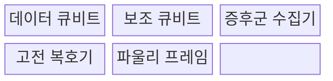
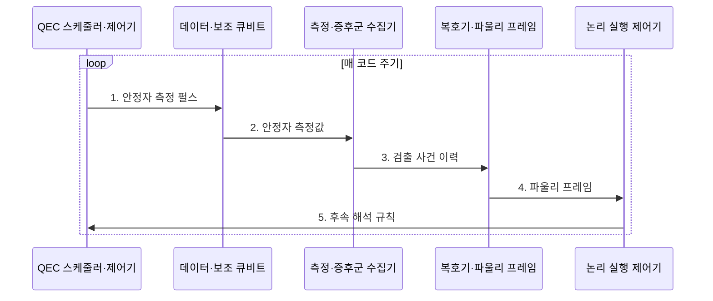

---
sidebar:
  order: 74
  label: "074. 양자 오류 정정과 표면 코드"
  badge:
    text: "기출 · 50%"
    variant: note
title: "양자 오류 정정과 표면 코드"
date: "2026-07-31T10:10:10+09:00"
tags:
  - "notes-hardware"
weight: 74
extra:
  question_no: "074"
  source_status: "기출"
  source_history: "138회"
  priority: 50
  priority_note: "안정자 측정·코드 거리·실시간 복호"
---

## 미리 알고가기

- **양자 오류 정정(Quantum Error Correction, QEC)**: 여러 물리 큐비트로 논리 정보를 부호화해 오류를 검출·보정하는 기술
- **표면 코드(Surface Code)**: 2차원 격자에서 국소 안정자를 반복 측정하는 오류 정정 코드
- **데이터 큐비트(Data Qubit)**: 논리 정보를 분산 저장하는 물리 큐비트
- **보조 큐비트(Ancilla Qubit)**: 안정자 값을 측정해 오류 증후군을 만드는 큐비트
- **안정자(Stabilizer)**: 논리 상태를 직접 읽지 않고 패리티 관계를 검사하는 연산자
- **오류 증후군(Error Syndrome)**: 안정자 측정 변화로 얻는 오류 단서
- **코드 거리(Code Distance, d)**: 검출되지 않는 최소 논리 연산의 물리 오류 개수
- **정정 가능 오류 수(t)**: 코드 거리에 따라 보장되는 최대 물리 오류 개수
- **바닥 함수(Floor Function, ⌊x⌋)**: x 이하의 가장 큰 정수를 구하는 함수
- **오류 임계값(Error Threshold)**: 코드 거리를 늘릴수록 논리 오류가 감소하는 물리 오류율 경계
- **복호기(Decoder)**: 증후군 이력에서 가능한 오류 사슬을 추정하는 처리기
- **파울리 프레임(Pauli Frame)**: 즉시 물리 보정하지 않고 논리 보정 상태를 기록하는 방식
- **파울리 X·Z 오류(Pauli X·Z Error)**: 각각 계산 기저의 값을 뒤집는 비트 오류와 상대 위상을 뒤집는 위상 오류
- **누설 오류(Leakage Error)**: 큐비트가 계산 기저 밖 상태로 벗어나는 오류
- **상관 오류(Correlated Error)**: 여러 큐비트에 함께 발생하는 오류
- **스트리밍 복호(Streaming Decoding)**: 증후군을 수신하면서 오류를 연속 추정하는 방식
- **누설 제거 회로(Leakage Reduction Unit)**: 계산 기저를 벗어난 상태를 제거하는 회로
- **코드 패치(Code Patch)**: 논리 큐비트를 구성하는 표면 코드 격자 영역
- **내결함 양자 계산(Fault-Tolerant Quantum Computing)**: 일부 구성요소 오류가 전체 논리 오류로 번지지 않도록 연산하는 방식

> **키워드:** 양자 오류 정정과 표면 코드

## Ⅰ. 개요

- 정의/개념: **안정자를 반복 측정**해 논리 큐비트를 보호하는 기법
- 배경/필요성: 물리 큐비트 잡음 누적으로 **장시간 논리 상태 유지 불가**

### 쉽게 이해하기 (학습용)

- 그림 자체를 보지 않고 이웃 조각의 관계를 반복 검사해 찢어진 곳을 찾는다.

## Ⅱ. 특징

> 공식 기반 파란 선은 코드 거리 $d$가 3→11로 증가하면 정정 가능 오류 수 $\lfloor(d-1)/2\rfloor$가 1→5로 계단식 증가함을 나타낸다.

- 비트·위상 오류에 대응하는 **안정자 증후군** 생성
- 시간축을 포함한 증후군 변화로 **오류 사슬** 추정
- 임계값 아래에서 코드 거리 증가에 따른 **논리 오류율 감소**

### 쉽게 이해하기 (학습용)

- 검사 범위를 키우면 더 많은 오류를 견디지만 큐비트와 처리 시간이 늘어난다.

## Ⅲ. 구조 및 구성요소

| 구성요소 | 책임 |
|:---|:---|
| 데이터 큐비트 | **논리 정보 분산 저장** |
| 보조 큐비트 | **안정자 패리티 측정** |
| 증후군 수집기 | **검출 사건 이력 생성** |
| 고전 복호기 | **오류 사슬 추정** |
| 파울리 프레임 | **논리 보정 상태 기록** |

### 쉽게 이해하기 (학습용)

- 보조 큐비트가 오류 단서를 모으고 복호기가 보정 장부를 갱신한다.

## Ⅳ. 흐름도

코드 거리가 \(d\)인 코드는 이상적 조건에서 다음 개수까지의 물리 오류를 정정할 수 있다.

$$
t = \left\lfloor \frac{d-1}{2} \right\rfloor
$$

> 요약: **코드 거리 d**에서 최대 **⌊(d-1)/2⌋개 오류** 정정

**동작 원리**

1. **안정자 측정 펄스**: 보조 큐비트 준비·국소 결합으로 X·Z 패리티 측정
2. **안정자 측정값**: 논리 상태를 노출하지 않고 증후군 비트 생성
3. **검출 사건 이력**: 이전 주기와의 변화로 시공간 오류 이력 구성
4. **파울리 프레임**: 복호한 오류 사슬을 논리 보정 상태로 기록
5. **후속 해석 규칙**: 프레임을 이후 측정·게이트 해석에 반영

### 쉽게 이해하기 (학습용)

- 매 주기 경보 위치의 변화를 이어 보고 오류 경로를 추정한 뒤, 보정 내용을 장부에 기록해 다음 계산에 반영한다.

## Ⅴ. 종류 및 비교

| 실행 방식 | 표면 코드 논리 실행 | 물리 큐비트 직접 실행 |
|:---|:---|:---|
| 적용 기준 | **장시간·내결함 계산** | **짧은 회로·오류 완화** 실험 |
| 핵심 특징 | **안정자 반복 측정** | **물리 게이트 즉시 실행** |
| 한계 | 큰 **큐비트·복호 자원** | **오류 누적·확장** 한계 |

### 쉽게 이해하기 (학습용)

- 긴 계산은 검사망이 필요하고 짧은 실험은 물리 큐비트를 바로 쓸 수 있다.

## Ⅵ. 실무 고려사항 및 대책

| 고려사항 | 대책 | 효과 |
|:---|:---|:---|
| 복호 지연이 코드 주기보다 길어 프레임 반영 지연 | **스트리밍·병렬 복호** | **실시간 프레임 갱신** 유지 |
| 누설·상관 오류가 독립 오류 모델을 위반 | **누설 제거 회로·상관 오류 모델** | **논리 오류율 평가** 정확도 향상 |
| 측정 오류와 데이터 오류가 같은 증후군으로 혼동 | **시공간 증후군 분석** | **오류 사슬 위치** 정확도 향상 |
| 과도한 코드 거리로 물리 큐비트·복호 자원 급증 | **목표별 코드 거리·패치 산정** | **자원 과잉 배치** 방지 |

### 쉽게 이해하기 (학습용)

- 필요한 안전 수준에 맞춰 격자의 크기와 검사 장치 수를 계산한다.

## Ⅶ. 결론

- **물리 오류율**이 임계값 아래일 때 목표 오류율·복호 지연에 맞는 **코드 거리** 선택

### 쉽게 이해하기 (학습용)

- 낮은 오류율과 빠른 복호가 함께 갖춰져야 큰 격자가 효과를 낸다.
