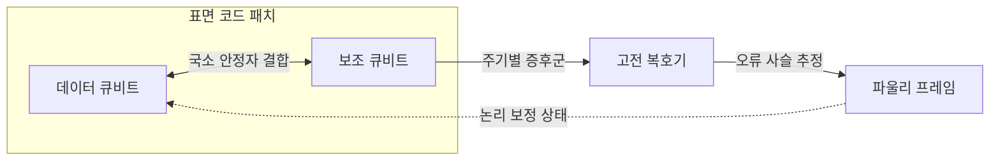
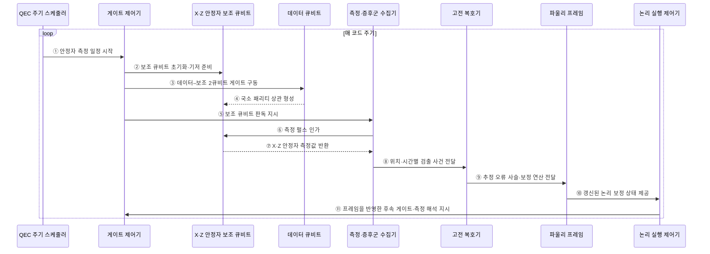

---
sidebar:
  order: 74
  label: "074. 양자 오류 정정과 표면 코드"
  badge:
    text: "기출 · 50%"
    variant: note
title: "양자 오류 정정과 표면 코드"
date: "2026-07-28T13:11:20+09:00"
tags:
  - "notes-hardware"
weight: 74
extra:
  question_no: "074"
  source_status: "기출"
  source_history: "138회"
  priority: 50
  priority_note: "안정자 측정·코드 거리·실시간 복호"
---

## 미리 알고가기

- **양자 오류 정정(Quantum Error Correction, QEC)**: 여러 물리 큐비트로 논리 정보를 부호화해 오류를 검출·보정하는 기술
- **표면 코드(Surface Code)**: 2차원 격자에서 국소 안정자를 반복 측정하는 오류 정정 코드
- **데이터 큐비트(Data Qubit)**: 논리 정보를 분산 저장하는 물리 큐비트
- **보조 큐비트(Ancilla Qubit)**: 안정자 값을 측정해 오류 증후군을 만드는 큐비트
- **안정자(Stabilizer)**: 논리 상태를 직접 읽지 않고 패리티 관계를 검사하는 연산자
- **오류 증후군(Error Syndrome)**: 안정자 측정 변화로 얻는 오류 단서
- **코드 거리(Code Distance)**: 검출되지 않는 최소 논리 연산의 물리 오류 개수
- **오류 임계값(Error Threshold)**: 코드 거리를 늘릴수록 논리 오류가 감소하는 물리 오류율 경계
- **복호기(Decoder)**: 증후군 이력에서 가능한 오류 사슬을 추정하는 처리기
- **파울리 프레임(Pauli Frame)**: 즉시 물리 보정하지 않고 논리 보정 상태를 기록하는 방식
- **누설 오류(Leakage Error)**: 큐비트가 계산 기저 밖 상태로 벗어나는 오류
- **상관 오류(Correlated Error)**: 여러 큐비트에 함께 발생하는 오류

## Ⅰ. 개요

- 정의/개념: 데이터·보조 큐비트의 **국소 안정자 반복 측정**으로 논리 상태를 보호하는 오류 정정 방식
- 기존 한계: 물리 큐비트의 잡음 누적은 장시간 양자 계산의 신뢰성을 제한

### 쉽게 이해하기 (학습용)

- 그림 자체를 보지 않고 이웃 조각의 관계를 반복 검사해 찢어진 곳을 찾는다.

## Ⅱ. 특징

- 비트·위상 오류에 대응하는 **안정자 증후군** 생성
- 시간축을 포함한 증후군 변화로 **오류 사슬** 추정
- 임계값 아래에서 코드 거리 증가 시 논리 오류율 감소

### 쉽게 이해하기 (학습용)

- 검사 범위를 키우면 더 많은 오류를 견디지만 큐비트와 처리 시간이 늘어난다.

## Ⅲ. 아키텍처 및 구성요소

코드 거리가 \(d\)인 코드는 이상적인 증후군 측정에서 다음 개수까지의 물리 오류를 원칙적으로 정정할 수 있다.

$$
t = \left\lfloor \frac{d-1}{2} \right\rfloor
$$

- \(d\): 검출되지 않는 최소 논리 연산의 물리 오류 가중치, \(t\): 보장 가능한 정정 오류 수
- 독립적인 물리 오류와 완전한 증후군 측정을 가정한 기본 관계다. 실제 표면 코드에서는 측정 오류까지 포함한 시공간 거리, 상관·누설 오류와 복호기 성능을 함께 평가해야 한다.

### 도표안 A. 표면 코드 증후군·복호 정적 구조

| 설계 요소 | 입력·상태 | 역할 |
|:---|:---|:---|
| 데이터 큐비트 | 부호화된 논리 상태 | 논리 정보를 격자에 분산 저장 |
| 보조 큐비트 | 안정자 결합 결과 | 데이터 상태를 노출하지 않고 패리티 측정 |
| 증후군 수집기 | 위치·시간별 측정값 | 검출 사건 이력 생성 |
| 고전 복호기 | 증후군 이력·오류 모델 | 가능성 높은 오류 사슬 추정 |
| 파울리 프레임 | 추정 보정 연산 | 후속 게이트·측정 해석에 보정 반영 |

> 요약: 반복 증후군을 복호해 논리 보정 상태를 지속 추적

### 쉽게 이해하기 (학습용)

- 보조 큐비트가 경보를 울리고 복호기가 경보의 이동 경로를 추정한다.

### 도표안 B. 안정자 반복 측정·파울리 프레임 갱신 시퀀스

#### 동작 원리

1. **주기 시작**: QEC 스케줄러가 코드 거리와 격자 배치에 맞춘 안정자 측정 일정을 시작한다.
2. **보조 큐비트 준비**: 게이트 제어기가 X·Z 안정자 종류에 맞게 보조 큐비트를 초기화하고 측정 기저를 준비한다.
3. **국소 결합 구동**: 제어기가 각 보조 큐비트와 이웃 데이터 큐비트 사이의 2큐비트 게이트를 정해진 순서로 구동한다.
4. **패리티 상관 형성**: 데이터 큐비트의 논리값을 직접 읽지 않은 채 국소 X·Z 패리티 정보가 보조 큐비트에 매핑된다.
5. **판독 지시**: 제어기가 안정자 회로를 마친 보조 큐비트의 측정을 지시한다.
6. **측정 펄스 인가**: 측정 계층이 보조 큐비트에 판독 신호를 인가한다.
7. **안정자 값 수집**: 보조 큐비트의 응답을 고전 비트로 변환해 X·Z 안정자 측정값을 얻는다.
8. **검출 사건 전달**: 수집기가 이전 주기와 달라진 안정자 값의 위치·시간 이력을 복호기에 스트리밍한다.
9. **오류 사슬 추정**: 복호기가 오류 모델과 증후군 이력으로 가능성 높은 시공간 오류 사슬과 보정 연산을 추정한다.
10. **프레임 갱신**: 파울리 프레임이 물리 보정 게이트를 즉시 넣는 대신 논리적 X·Z 보정 상태를 기록한다.
11. **후속 실행 반영**: 논리 실행 제어기가 프레임 상태를 이후 게이트와 최종 측정 해석에 반영한다.

### 쉽게 이해하기 (학습용)

- 매 주기 경보 위치의 변화를 이어 보고 오류 경로를 추정한 뒤, 보정 내용을 장부에 기록해 다음 계산에 반영한다.

## Ⅳ. 종류 및 비교

| 판단 기준 | 표면 코드 논리 실행 | 물리 큐비트 직접 실행 |
|:---|:---|:---|
| 핵심 특징 | 안정자 반복 측정으로 논리 상태 보호 | 물리 게이트를 즉시 실행 |
| 적용 기준 | 장시간·내결함 계산 | 짧은 회로·오류 완화 실험 |
| 한계 | 큰 큐비트·복호 자원 | 오류 누적·확장 한계 |

> 요약: 표면 코드는 자원을 투입해 장시간 논리 상태를 보호

### 쉽게 이해하기 (학습용)

- 긴 계산은 검사망이 필요하고 짧은 실험은 물리 큐비트를 바로 쓸 수 있다.

## Ⅴ. 실무 고려사항 및 대응 방안

| 운영 위험 | 대응 | 기대 효과 |
|:---|:---|:---|
| 복호 지연이 코드 주기를 초과 | 스트리밍·병렬 복호와 지연 예산 감시 | 실시간 보정 유지 |
| 누설·상관 오류가 독립 오류 모델 위반 | 누설 제거 회로와 상관 오류 기반 복호 모델 적용 | 논리 오류 과소평가 방지 |
| 측정 오류와 데이터 오류 혼동 | 여러 코드 주기의 시공간 증후군 공동 분석 | 오류 위치 추정 정확도 향상 |
| 코드 거리 증가로 큐비트·제어 자원 급증 | 목표 논리 오류율별 거리·패치 수 산정 | 자원 과잉·부족 방지 |

### 쉽게 이해하기 (학습용)

- 검사 결과를 늦게 해석하면 다음 검사가 밀리므로 복호 속도도 설계 대상이다.

### 적용 사례

- 자원 추정기는 목표 논리 오류율·회로 깊이·물리 오류율과 복호 지연을 입력으로 코드 거리, 패치 수와 물리 큐비트 수를 산정한다.

### 쉽게 이해하기 (학습용)

- 필요한 안전 수준에 맞춰 격자의 크기와 검사 장치 수를 계산한다.

## Ⅵ. 결론

- 내결함 양자 계산을 위해 **물리 오류율·코드 거리·복호 지연·논리 오류율·자원 오버헤드**를 함께 검토하고, 임계값 아래에서 실시간 오류 정정 체계를 구성한다.

### 쉽게 이해하기 (학습용)

- 낮은 오류율과 빠른 복호가 함께 갖춰져야 큰 격자가 효과를 낸다.
