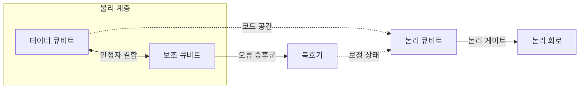
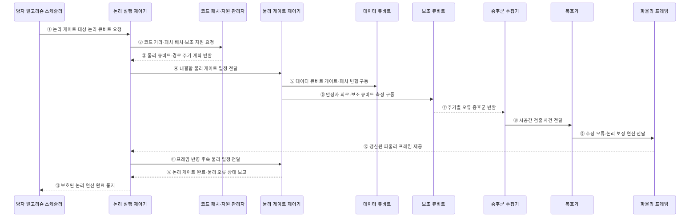

---
sidebar:
  order: 75
  label: "075. 논리 큐비트와 물리 큐비트"
  badge:
    text: "기출 · 30%"
    variant: note
title: "논리 큐비트와 물리 큐비트 (Logical vs Physical Qubit)"
date: "2026-07-28T13:11:20+09:00"
tags:
  - "notes-hardware"
weight: 75
extra:
  question_no: "075"
  source_status: "기출"
  source_history: "138회"
  priority: 30
  priority_note: "오류 정정·물리 자원 산정"
---

## 미리 알고가기

- **물리 큐비트(Physical Qubit)**: 실제 소자로 구현한 제어 가능한 양자 상태
- **논리 큐비트(Logical Qubit)**: 여러 물리 큐비트에 부호화해 오류로부터 보호한 계산 단위
- **코드 공간(Code Space)**: 오류 정정 코드의 제약을 만족하는 상태 영역
- **양자 오류 정정(Quantum Error Correction, QEC)**: 물리 오류를 검출·보정해 논리 정보를 보호하는 기술
- **안정자 측정(Stabilizer Measurement)**: 논리 정보를 직접 읽지 않고 큐비트 간 패리티를 측정하는 방식
- **오류 증후군(Error Syndrome)**: 안정자 측정 변화로 얻는 오류 단서
- **코드 거리(Code Distance)**: 검출되지 않는 최소 논리 연산의 물리 오류 개수
- **복호기(Decoder)**: 증후군에서 가능한 오류 경로를 추정하는 처리기
- **논리 오류율(Logical Error Rate)**: 오류 정정 후 논리 연산 또는 주기가 실패하는 비율
- **물리 오류율(Physical Error Rate)**: 실제 게이트·측정·유휴 상태가 실패하는 비율
- **내결함 양자 컴퓨팅(Fault-tolerant Quantum Computing, FTQC)**: 단일 물리 오류가 논리 오류로 확산하지 않도록 연산을 구성하는 방식

## Ⅰ. 개요

- 정의/개념: 여러 물리 큐비트의 코드 공간에 정보를 분산해 **보호된 논리 계산 단위** 구성
- 기존 한계: 물리 큐비트 하나의 오류율과 결맞음 시간만으로 긴 계산 보장 불가

### 쉽게 이해하기 (학습용)

- 물리 큐비트가 종이라면 논리 큐비트는 여러 장과 검사 규칙으로 보호한 문서다.

## Ⅱ. 특징

- 안정자 측정으로 논리 정보 노출 없이 물리 오류 검출
- 복호·파울리 프레임으로 물리 오류의 논리 전파 억제
- 코드 종류·거리가 물리 큐비트 수와 논리 오류율 결정

### 쉽게 이해하기 (학습용)

- 보호 수준을 높이면 더 안전하지만 더 많은 큐비트와 검사가 필요하다.

## Ⅲ. 아키텍처 및 구성요소

### 도표안 A. 물리 계층과 논리 큐비트 정적 구조

| 설계 요소 | 입력·상태 | 역할 |
|:---|:---|:---|
| 데이터 큐비트 | 부호화된 상태 | 논리 정보를 분산 저장 |
| 보조 큐비트 | 안정자 결합 결과 | 오류 증후군 추출 |
| 복호기 | 증후군 이력·오류 모델 | 오류 위치와 보정 상태 추정 |
| 논리 큐비트 | 코드 공간·파울리 프레임 | 보호된 계산 단위 제공 |
| 논리 회로 | 논리 게이트·측정 | 오류 정정 경계를 지키며 알고리즘 실행 |

> 요약: 물리 큐비트 묶음과 고전 복호가 논리 큐비트를 구성

### 쉽게 이해하기 (학습용)

- 여러 센서와 검사기가 함께 한 개의 믿을 수 있는 계산 단위를 만든다.

### 도표안 B. 논리 게이트의 물리 실행·오류 정정 시퀀스

#### 동작 원리

1. **논리 연산 요청**: 알고리즘 스케줄러가 논리 게이트 종류와 대상 논리 큐비트를 지정한다.
2. **보호 자원 요청**: 논리 제어기가 목표 오류율에 맞는 코드 거리, 패치 배치와 보조 자원을 요청한다.
3. **물리 계획 반환**: 자원 관리자가 사용 가능한 물리 큐비트, 패치 이동 경로와 오류 정정 주기 계획을 반환한다.
4. **내결함 일정 변환**: 논리 제어기가 하나의 논리 게이트를 오류 확산을 제한하는 물리 게이트·측정 일정으로 변환한다.
5. **데이터 패치 구동**: 물리 제어기가 데이터 큐비트에 게이트를 적용하거나 격자 수술을 위한 패치 경계를 바꾼다.
6. **안정자 회로 실행**: 동시에 보조 큐비트를 준비·결합·측정해 데이터 패치의 오류 증후군을 추출한다.
7. **증후군 반환**: 보조 큐비트의 주기별 측정 결과를 위치·시간 정보와 함께 수집한다.
8. **검출 사건 전달**: 수집기가 이전 주기와 달라진 안정자 값을 시공간 검출 사건으로 복호기에 전달한다.
9. **오류 추정**: 복호기가 가능성 높은 물리 오류 사슬과 필요한 논리 보정 연산을 추정한다.
10. **프레임 갱신**: 파울리 프레임이 보정 상태를 기록해 논리 실행 제어기에 제공한다.
11. **후속 일정 보정**: 논리 제어기가 프레임을 반영해 이후 게이트·측정의 물리 일정을 조정한다.
12. **논리 게이트 완료**: 요구한 안정자 주기와 논리 연산이 끝나면 물리 제어기가 오류 상태를 함께 보고한다.
13. **보호 연산 완료**: 논리 제어기가 알고리즘에 오류 정정된 추상 연산의 완료를 알린다.

### 쉽게 이해하기 (학습용)

- 논리 게이트 하나는 실제로 여러 물리 게이트·검사·복호·보정 장부 갱신을 묶은 작업이다.

## Ⅳ. 종류 및 비교

| 판단 기준 | 물리 큐비트 | 논리 큐비트 |
|:---|:---|:---|
| 의미 | 실제 제어·측정 소자 | 오류 정정된 계산 단위 |
| 오류 지표 | 게이트·측정·유휴 오류율 | 논리 주기·논리 게이트 오류율 |
| 자원 특성 | 소자 하나의 성능 | 다수 소자·복호·제어 오버헤드 |

> 요약: 물리 큐비트는 구현 자원, 논리 큐비트는 보호된 추상 단위

### 쉽게 이해하기 (학습용)

- 칩의 큐비트 수와 실제 알고리즘에 쓸 수 있는 큐비트 수는 다르다.

## Ⅴ. 실무 고려사항 및 대응 방안

| 운영 위험 | 대응 | 기대 효과 |
|:---|:---|:---|
| 물리 오류율이 임계값 이상 | 게이트·측정 보정과 소자 선별 후 코드 적용 | 거리 증가의 실효성 확보 |
| 평균 오류율만 보고 취약 큐비트 누락 | 큐비트·연결별 오류 지도와 최악 조건 관리 | 국소 병목 식별 |
| 목표 논리 오류율 대비 자원 과소 산정 | 전체 회로 깊이·게이트 종류별 실패 예산 반영 | 실행 성공 확률 확보 |
| 논리 게이트별 패치 이동·마법 상태 비용 누락 | 논리 연산별 시간·공간 오버헤드 포함 | 현실적 자원 계획 |

### 쉽게 이해하기 (학습용)

- 논리 큐비트 개수만 세지 말고 움직임과 특수 연산에 드는 자리도 계산한다.

### 적용 사례

- 암호 분석 회로의 논리 큐비트·게이트 수·깊이에 코드 패치, 라우팅과 마법 상태 증류 비용을 더해 물리 큐비트 수와 실행시간을 추정한다.

### 쉽게 이해하기 (학습용)

- 필요한 논리 작업량을 실제 소자와 실행 시간으로 바꿔 계산한다.

## Ⅵ. 결론

- 실용 양자 시스템 규모를 판단하기 위해 **목표 논리 오류율·물리 오류율·코드 거리·논리 게이트 비용·복호 자원**을 검토하고, 알고리즘 전체 성공 확률을 만족하는 물리 자원을 산정한다.

### 쉽게 이해하기 (학습용)

- 큐비트 숫자보다 오류 정정 후 실제로 쓸 수 있는 계산량을 본다.
