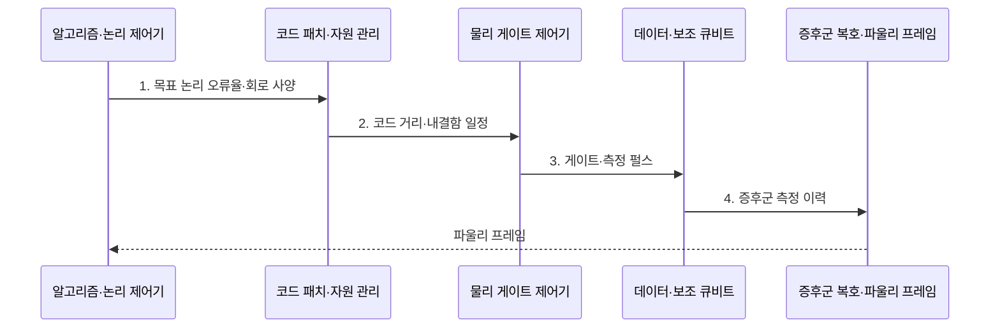

---
sidebar:
  order: 75
  label: "075. 논리 큐비트와 물리 큐비트"
  badge:
    text: "기출 · 30%"
    variant: note
title: "논리 큐비트와 물리 큐비트 (Logical vs Physical Qubit)"
date: "2026-08-02T21:05:00+09:00"
tags:
  - "notes-hardware"
weight: 75
extra:
  question_no: "075"
  source_status: "기출"
  source_history: "138회"
  priority: 30
  priority_note: "오류 정정·물리 자원 산정"
---

## Ⅰ. 개요

핵심 용어

- **물리 큐비트(Physical Qubit)**: 실제 소자로 구현하여 제어하고 측정할 수 있는 잡음이 있는 양자 상태이다.
- **논리 큐비트(Logical Qubit)**: 여러 물리 큐비트에 정보를 부호화하고 오류 정정으로 보호한 계산 단위이다.
- **양자 오류 정정(Quantum Error Correction, QEC)**: 물리 오류를 검출하고 보정하여 논리 양자 정보를 보호하는 기술이다.

- 정의/개념: 물리 큐비트는 잡음이 있는 하드웨어 단위이고, 논리 큐비트는 여러 물리 큐비트를 오류 정정으로 묶은 **보호 계산 단위**
- 배경/필요성: 물리 큐비트 직접 실행은 긴 회로의 **오류 누적 통제 불가**

### 쉽게 이해하기 (학습용)

- 물리 큐비트가 종이라면 논리 큐비트는 여러 장과 검사 규칙으로 보호한 문서다.

## Ⅱ. 특징

핵심 용어

- **안정자 측정(Stabilizer Measurement)**: 논리 정보를 직접 읽지 않고 물리 큐비트 사이의 패리티 관계를 측정하는 방식이다.
- **복호(Decoding)**: 증후군 이력에서 가능한 물리 오류 경로를 추정하여 논리 보정 상태를 결정하는 처리이다.
- **코드 거리(Code Distance)**: 검출되지 않은 채 논리 상태를 바꿀 수 있는 최소 물리 오류 경로의 길이이다.

- **안정자 측정**: 논리 정보 노출 없이 오류 검출
- **복호·파울리 프레임**: 논리 오류 전파 억제
- **코드 종류·거리**: 자원 수와 논리 오류율 결정

### 쉽게 이해하기 (학습용)

- 보호 수준을 높이면 더 안전하지만 더 많은 큐비트와 검사가 필요하다.

## Ⅲ. 구조 및 구성요소

핵심 용어

- **데이터 큐비트(Data Qubit)**: 논리 정보를 여러 소자에 분산 저장하는 물리 큐비트이다.
- **보조 큐비트(Ancilla Qubit)**: 안정자 패리티를 측정해 오류 증후군을 생성하는 물리 큐비트이다.
- **파울리 프레임(Pauli Frame)**: 즉시 물리 보정하지 않고 논리 보정 상태를 고전 정보로 기록하는 방식이다.
- **논리 회로(Logical Circuit)**: 오류 확산을 제한하는 내결함 논리 게이트들로 구성한 양자 회로이다.

| 구성요소 | 책임 |
|:---|:---|
| 데이터 큐비트 | **논리 정보 분산 저장** |
| 보조 큐비트 | **오류 증후군 추출** |
| 복호기 | **오류 위치 추정** |
| 논리 큐비트 | **보호 계산 단위 제공** |
| 논리 회로 | **내결함 게이트 실행** |

### 쉽게 이해하기 (학습용)

- 여러 물리 큐비트와 복호 절차가 하나의 논리 큐비트를 만든다.

## Ⅳ. 흐름도

핵심 용어

- **실패 예산(Failure Budget)**: 전체 계산에 허용하는 실패 확률을 논리 큐비트와 연산별로 배분한 한도이다.
- **코드 패치(Code Patch)**: 하나의 논리 큐비트를 구성하는 표면 코드 격자의 물리 영역이다.
- **내결함 일정(Fault-tolerant Schedule)**: 단일 물리 오류가 논리 오류로 확산되지 않도록 게이트와 측정 순서를 정한 계획이다.

**동작 원리**

1. **목표 논리 오류율·회로 사양**: 실패 예산에서 코드 거리·물리 큐비트 산정
2. **코드 거리·내결함 일정**: 논리 연산을 오류 확산을 제한하는 물리 게이트로 변환
3. **게이트·측정 펄스**: 패치 상태 변경과 반복 증후군 측정
4. **증후군 측정 이력**: 시간축 오류 변화로 복호 입력 생성

### 쉽게 이해하기 (학습용)

- 논리 게이트 하나는 실제로 여러 물리 게이트·검사·복호·보정 장부 갱신을 묶은 작업이다.

## Ⅴ. 종류 및 비교

핵심 용어

- **물리 오류율(Physical Error Rate)**: 실제 게이트와 측정 및 유휴 상태가 실패하는 비율이다.
- **논리 오류율(Logical Error Rate)**: 오류 정정 후에도 하나의 논리 연산이나 주기가 실패하는 비율이다.
- **결맞음 손실(Decoherence)**: 환경과의 상호작용으로 물리 큐비트의 위상과 양자 상태가 훼손되는 현상이다.

| 비교 항목 | 물리 큐비트 | 논리 큐비트 |
|:---|:---|:---|
| 적용 기준 | **소자·게이트 성능** 평가 | **내결함 알고리즘** 실행 |
| 핵심 특징 | **실제 제어·측정 소자** | **오류 정정 계산 단위** |
| 한계 | **잡음·결맞음 손실** | 다수 **소자·복호 자원** 부담 |

### 쉽게 이해하기 (학습용)

- 칩의 큐비트 수와 실제 알고리즘에 쓸 수 있는 큐비트 수는 다르다.

## Ⅵ. 실무 고려사항 및 대책

핵심 용어

- **오류 임계값(Error Threshold)**: 물리 오류율이 이 값 아래일 때 코드 거리를 늘리면 논리 오류율이 감소하는 경계이다.
- **오류 지도(Error Map)**: 큐비트와 연결별 오류율을 물리 위치에 대응하여 기록한 자료이다.
- **시공간 부담(Space-time Overhead)**: 논리 연산이 점유하는 물리 큐비트 수와 실행 시간의 결합 비용이다.
- **마법 상태 증류(Magic-state Distillation)**: 여러 잡음 특수 상태를 소비하여 정확한 비클리퍼드 게이트용 상태를 만드는 절차이다.

| 문제 | 대책 | 효과 |
|:---|:---|:---|
| 물리 오류율이 임계값 이상이면 거리 증가 효과 상실 | **큐비트 보정·소자 선별** | **임계값 이하 오류율** 확보 |
| 큐비트·연결별 편차를 평균 오류율이 은폐 | **연결별 오류 지도** 관리 | **취약 경로 병목** 식별 |
| 회로 깊이와 허용 실패율 누락으로 거리 과소 산정 | **회로 깊이·실패 예산** 반영 | **목표 성공 확률** 확보 |
| 논리 게이트의 시공간 부담 누락으로 자원 과소 산정 | **게이트 시간·패치 면적** 반영 | **현실적 자원 계획** 수립 |
| 비클리퍼드 게이트의 상태 정제 비용 누락 | **마법 상태 증류** 자원 포함 | **범용 계산 자원** 현실화 |
| 패치 간 연산의 병합·분할 시간과 공간 누락 | **격자 수술** 일정·공간 반영 | **논리 연산 비용** 산정 |

### 쉽게 이해하기 (학습용)

- 필요한 논리 작업량을 실제 소자와 실행 시간으로 바꿔 계산한다.

## Ⅶ. 결론

핵심 용어

- **목표 논리 오류율(Target Logical Error Rate)**: 알고리즘의 전체 성공 확률을 만족하도록 각 논리 연산에 요구하는 최대 실패율이다.
- **물리 자원 산정(Physical Resource Estimation)**: 코드 거리와 회로 사양을 물리 큐비트 수 및 제어·복호 자원으로 환산하는 작업이다.
- **유효 계산량(Useful Computation)**: 오류 정정 비용을 제외하고 실제 알고리즘에 제공할 수 있는 논리 연산 규모이다.

- 목표 **논리 오류율·코드 거리**에 맞춰 물리 큐비트와 복호 자원 산정

### 쉽게 이해하기 (학습용)

- 큐비트 숫자보다 오류 정정 후 실제로 쓸 수 있는 계산량을 본다.
