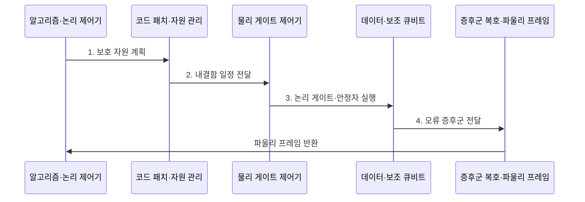

---
sidebar:
  order: 75
  label: "075. 논리 큐비트와 물리 큐비트"
  badge:
    text: "기출 · 30%"
    variant: note
title: "논리 큐비트와 물리 큐비트 (Logical vs Physical Qubit)"
date: "2026-07-30T18:42:46+09:00"
tags:
  - "notes-hardware"
weight: 75
extra:
  question_no: "075"
  source_status: "기출"
  source_history: "138회"
  priority: 30
  priority_note: "오류 정정·물리 자원 산정"
---

## 미리 알고가기

- **물리 큐비트(Physical Qubit)**: 실제 소자로 구현한 제어 가능한 양자 상태
- **논리 큐비트(Logical Qubit)**: 여러 물리 큐비트에 부호화해 오류로부터 보호한 계산 단위
- **코드 공간(Code Space)**: 오류 정정 코드의 제약을 만족하는 상태 영역
- **양자 오류 정정(Quantum Error Correction, QEC)**: 물리 오류를 검출·보정해 논리 정보를 보호하는 기술
- **안정자 측정(Stabilizer Measurement)**: 논리 정보를 직접 읽지 않고 큐비트 간 패리티를 측정하는 방식
- **오류 증후군(Error Syndrome)**: 안정자 측정 변화로 얻는 오류 단서
- **코드 거리(Code Distance)**: 검출되지 않는 최소 논리 연산의 물리 오류 개수
- **복호기(Decoder)**: 증후군에서 가능한 오류 경로를 추정하는 처리기
- **파울리 프레임(Pauli Frame)**: 즉시 물리 보정하지 않고 논리 보정 상태를 기록하는 방식
- **논리 오류율(Logical Error Rate)**: 오류 정정 후 논리 연산 또는 주기가 실패하는 비율
- **물리 오류율(Physical Error Rate)**: 실제 게이트·측정·유휴 상태가 실패하는 비율
- **내결함 양자 컴퓨팅(Fault-tolerant Quantum Computing, FTQC)**: 단일 물리 오류가 논리 오류로 확산하지 않도록 연산을 구성하는 방식
- **격자 수술(Lattice Surgery)**: 표면 코드 패치의 경계를 합치거나 나누어 논리 연산을 수행하는 방식
- **비클리퍼드 게이트(Non-Clifford Gate)**: 안정자 연산만으로 구현할 수 없으며 범용 양자 계산에 필요한 추가 게이트
- **마법 상태 증류(Magic State Distillation)**: 잡음이 있는 특수 상태 여러 개로 더 정확한 비클리퍼드 게이트용 상태를 만드는 절차

## Ⅰ. 개요

- 정의/개념: 물리 큐비트 묶음으로 만든 **보호 계산 단위**
- 배경/필요성: 물리 큐비트 직접 실행은 긴 회로의 **오류 누적 통제 불가**

### 쉽게 이해하기 (학습용)

- 물리 큐비트가 종이라면 논리 큐비트는 여러 장과 검사 규칙으로 보호한 문서다.

## Ⅱ. 특징

- **안정자 측정**: 논리 정보 노출 없이 오류 검출
- **복호·파울리 프레임**: 논리 오류 전파 억제
- **코드 종류·거리**: 자원 수와 논리 오류율 결정

### 쉽게 이해하기 (학습용)

- 보호 수준을 높이면 더 안전하지만 더 많은 큐비트와 검사가 필요하다.

## Ⅲ. 구조 및 구성요소

| 구성요소 | 책임 |
|:---|:---|
| 데이터 큐비트 | **논리 정보 분산 저장** |
| 보조 큐비트 | **오류 증후군 추출** |
| 복호기 | **오류 위치 추정** |
| 논리 큐비트 | **보호 계산 단위 제공** |
| 논리 회로 | **내결함 게이트 실행** |

### 쉽게 이해하기 (학습용)

- 여러 물리 큐비트와 복호 절차가 하나의 논리 큐비트를 만든다.

## Ⅳ. 흐름도

**동작 원리**

- **1. 보호 자원 계획**: 목표 논리 오류율에서 코드 거리·물리 큐비트 산정
- **2. 내결함 일정 전달**: 논리 연산을 오류 확산을 제한하는 물리 게이트로 변환
- **3. 논리 게이트·안정자 실행**: 패치 상태 변경과 반복 증후군 측정 수행
- **4. 오류 증후군 전달**: 측정 이력에서 복호 입력 생성

### 쉽게 이해하기 (학습용)

- 논리 게이트 하나는 실제로 여러 물리 게이트·검사·복호·보정 장부 갱신을 묶은 작업이다.

## Ⅴ. 종류 및 비교

| 구분 | 물리 큐비트 | 논리 큐비트 |
|:---|:---|:---|
| 적용 기준 | 소자·게이트 성능 | 내결함 알고리즘 실행 |
| 핵심 특징 | **실제 제어·측정 소자** | **오류 정정 계산 단위** |
| 한계 | 잡음·결맞음 손실 | 다수 소자·복호 부담 |

### 쉽게 이해하기 (학습용)

- 칩의 큐비트 수와 실제 알고리즘에 쓸 수 있는 큐비트 수는 다르다.

## Ⅵ. 실무 고려사항 및 대책

| 고려사항 | 대책 | 효과 |
|:---|:---|:---|
| 임계값 이상 오류 | 보정·소자 선별 후 적용 | **거리 증가 효과 확보** |
| 취약 큐비트 누락 | 연결별 오류 지도 관리 | **국소 병목 식별** |
| 자원 과소 산정 | 회로 깊이·실패 예산 반영 | **성공 확률 확보** |
| 논리 게이트 비용 누락 | 시간·공간 부담 포함 | **현실적 자원 계획** |
| 비클리퍼드 게이트 비용 | **마법 상태 증류** 자원 포함 | **범용 계산 자원 현실화** |
| 패치 간 논리 연산 | **격자 수술** 일정·공간 반영 | **논리 연산 비용 산정** |

### 쉽게 이해하기 (학습용)

- 필요한 논리 작업량을 실제 소자와 실행 시간으로 바꿔 계산한다.

## Ⅶ. 결론

- 목표 **논리 오류율·코드 거리**에 맞춰 물리 큐비트와 복호 자원 산정

### 쉽게 이해하기 (학습용)

- 큐비트 숫자보다 오류 정정 후 실제로 쓸 수 있는 계산량을 본다.
